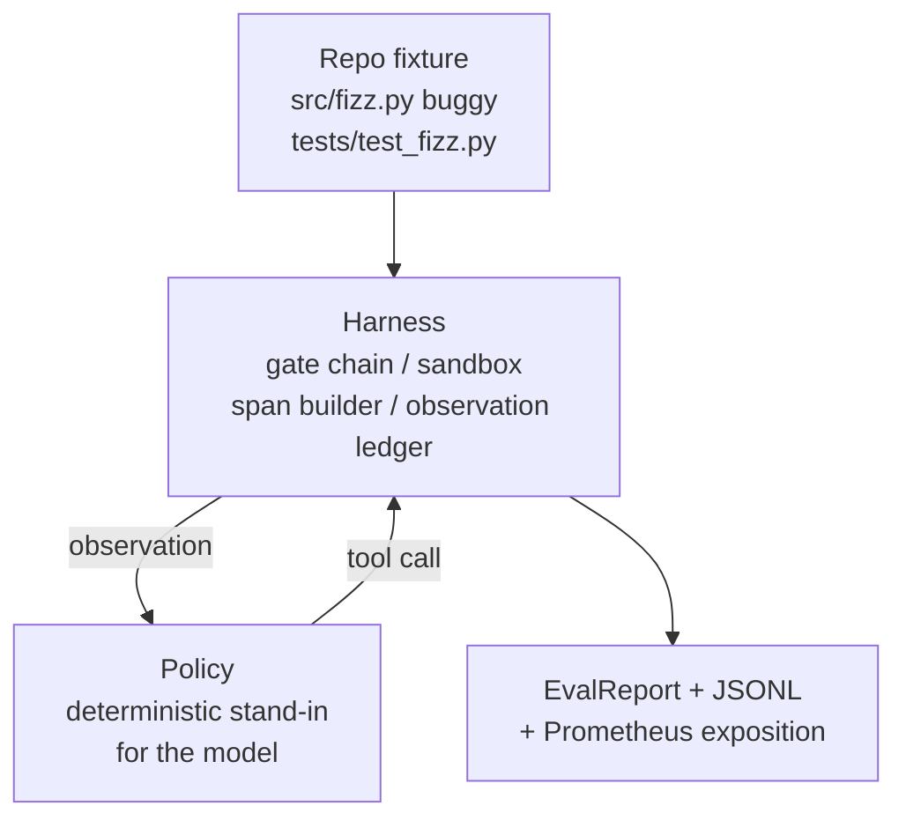
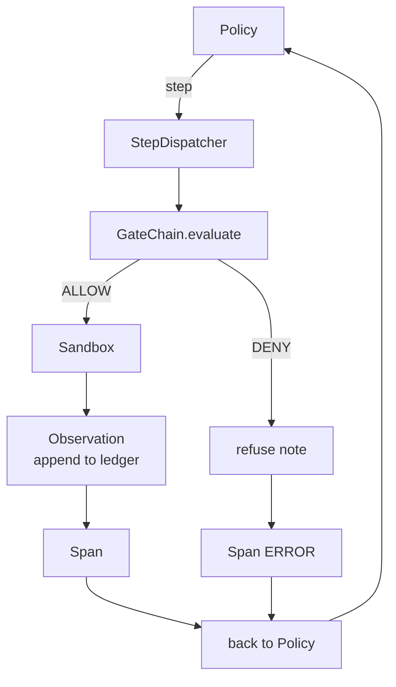

# Капстоун — урок 29: сквозной агент для написания кода на харнессе

> Итог трека A. Этот урок соединяет цепочку шлюзов, песочницу, харнесс для оценивания и OTel-спаны в один работающий агент для написания кода, который исправляет настоящий (небольшой, на уровне фикстуры) баг в многофайловом проекте на Python. Агент — это детерминированная политика, а не большая языковая модель (LLM); такая замена делает урок воспроизводимым и показывает, что всё это время интересной частью был именно харнесс. Контракт идентичен: настоящая модель подключается в том же месте — на стыке политики.

**Тип:** Build
**Языки:** Python (стандартная библиотека)
**Предварительные требования:** Фаза 19 · 25 (шлюзы проверки), фаза 19 · 26 (песочница), фаза 19 · 27 (харнесс оценивания), фаза 19 · 28 (наблюдаемость), фаза 14 · 38 (шлюзы проверки), фаза 14 · 41 (рабочая среда для настоящих репозиториев), фаза 14 · 42 (итоговый проект по рабочей среде агента)
**Время:** ~90 минут

## Цели обучения

- Объединить цепочку шлюзов, песочницу, харнесс для оценивания и построитель спанов в единый цикл агента.
- Реализовать детерминированную политику, которая использует read_file, run_tests и write_file для исправления бага в фикстуре.
- Обеспечить соблюдение глобального бюджета шагов и бюджета токенов наблюдений на протяжении сквозного прогона.
- Эмитировать полные OTel GenAI-трассировки и метрики Prometheus для всего прогона.
- Убедиться, что агент решает фикстуру менее чем за 12 шагов и без единого срабатывания шлюза на легитимных инструментах.

## Проблема

Большинство демонстраций агентов работают изолированно: отдельно песочница, отдельно харнесс для оценивания, отдельно эмиттер спанов. По отдельности они выглядят нормально. Но стоит соединить их вместе — и швы становятся видны.

Цепочка шлюзов говорит ALLOW, но песочница отказывает по причине, которую цепочка не предусмотрела. Харнесс для оценивания фиксирует успешное прохождение, но OTel-спаны показывают, что шлюз отказал в инструменте, который агент утверждает, что использовал. Счётчик Prometheus увеличивается дважды, хотя должен увеличиваться один раз. Бюджет наблюдений превышен, но агент продолжил работу, потому что бюджет отслеживался в цепочке, а песочница об этом не знала.

Этот урок — интеграционный тест для всего трека. Агент должен по порядку сделать четыре вещи: прочитать проект, запустить тесты, определить баг по сообщению о падении теста, записать исправление, снова запустить тесты и остановиться. Каждая операция проходит через цепочку шлюзов. Каждое выполнение инструмента проходит через песочницу. Каждый шаг обёрнут в спан. Харнесс для оценивания в конце оценивает всё целиком.

## Концепция



Политика агента — это конечный автомат. Пять состояний.

`SURVEY`: агент читает листинг проекта. Следующее состояние — RUN_TESTS.

`RUN_TESTS`: агент запускает команду тестов. Если тесты проходят, конечный автомат останавливается с успехом. Иначе следующее состояние — INSPECT.

`INSPECT`: агент читает файл с исходным кодом, в котором падает тест. Следующее состояние — FIX.

`FIX`: агент записывает исправленный файл. Следующее состояние — VERIFY.

`VERIFY`: агент снова запускает команду тестов. Если тесты проходят, останов с успехом. Иначе останов с неудачей.

Каждое состояние соответствует вызову инструмента. Каждый вызов инструмента проходит через цепочку шлюзов. Если вызов инструмента отклонён, агент фиксирует отказ в трассировке и останавливается.

Баг в фикстуре — это ошибка смещения на единицу (off-by-one) в `fizz.py`. Детерминированная политика обнаруживает баг по сообщению о падении теста с помощью регулярного выражения и выдаёт исправленный файл. Замена политики на LLM не меняет контракт харнесса.

```figure
cg-harness-weave
```

## Архитектура



Урок самодостаточен. Каждый примитив из предыдущих уроков реализован заново в минимальном масштабе в `main.py` (шлюз, песочница, журнал, спан), чтобы урок работал без импорта соседних модулей. Названия точно совпадают с уроками 25–28, поэтому концептуальное соответствие однозначно.

## Что вы построите

`main.py` включает:

1. Минимальные примитивы харнесса, скопированные под теми же именами, что и в уроках 25-28: `GateChain`, `Sandbox`, `ObservationLedger`, `SpanBuilder`, `MetricsRegistry`.
2. Класс `CodingAgentPolicy`: конечный автомат с пятью состояниями.
3. Вспомогательный класс `Repo`: готовит временный каталог с прилагаемой фикстурой, содержащей баг.
4. Класс `AgentRun`: управляет политикой, диспетчеризует через харнесс, возвращает `AgentRunReport`.
5. Прилагаемая фикстура (`fixture_repo/`) с src/fizz.py, tests/test_fizz.py и деревом expected/ для харнесса оценивания.
6. Демонстрация: сквозной запуск политики, вывод пошаговой трассировки, проверка успешного прохождения с помощью утверждения, вывод метрик.

Прилагаемая фикстура имеет ту же форму, что и структура задачи из урока 27: файл с багом и файл с тестами. Сообщение о падении теста содержит достаточно информации, чтобы детерминированная политика могла определить исправление. Настоящая LLM выполнила бы ту же работу медленнее и с более широким охватом, но это не изменило бы ожиданий харнесса.

## Почему политика — не LLM

Настоящей LLM нужны API-ключ, сетевой вызов и непроверяемая стохастичность. Урок посвящён именно харнессу. Подстановка детерминированной политики позволяет запускать урок на любом ноутбуке разработчика без внешних зависимостей и даёт набору тестов возможность проверять точное количество шагов.

Политика этого урока — строгое подмножество того, что делает агент на основе LLM. Политика читает репозиторий, видит падающий тест, определяет строку и выдаёт исправление. LLM проходит тот же цикл с тем же контрактом харнесса; учёт идентичен.

## Что проверяет демонстрация

Сквозная демонстрация в момент завершения проверяет утверждениями пять фактов, и набор тестов повторно проверяет их программно.

Политика решила фикстуру менее чем за 12 шагов.

Бюджет наблюдений ни разу не был превышен.

Ноль отказов шлюза на легитимных инструментах. (Агент ни разу не придумал название отклонённого инструмента.)

У каждого шага есть соответствующий спан в traces.jsonl.

Экспозиция Prometheus содержит запись `tools_called_total{tool="read_file"}` и гистограмму `tool_latency_ms`.

## Как это встраивается в остальную часть трека A

Этот урок — интеграция. Урок 25 написал цепочку шлюзов. Урок 26 написал песочницу. Урок 27 написал харнесс для оценивания. Урок 28 написал наблюдаемость. Урок 29 доказывает, что вместе они работают как единая система. Настоящий харнесс агента расширяется отсюда: замените детерминированную политику на модель, замените прилагаемую фикстуру на задачу над настоящим репозиторием, замените экспортёр JSONL на OTLP.

## Запуск

```bash
cd phases/19-capstone-projects/29-end-to-end-coding-task-demo
python3 code/main.py
python3 -m pytest code/tests/ -v
```

Демонстрация выводит пошаговую трассировку, итоговый отчёт оценивания и экспозицию Prometheus. Код выхода — ноль. Тесты покрывают переходы состояний политики, отказы шлюза на синтетических вызовах инструментов, сквозной запуск на прилагаемой фикстуре и инварианты бюджета шагов.
