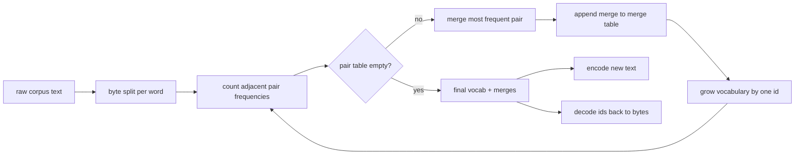
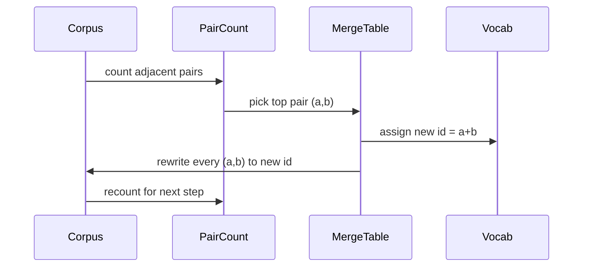

# BPE-токенизатор с нуля

> Байты на входе, id на выходе, id снова превращаются в те же байты. Постройте токенизатор, с которого до сих пор начинается каждая современная текстовая модель.

**Тип:** Build
**Языки:** Python
**Предварительные требования:** Фаза 04 уроки, Фаза 07 transformer уроки
**Время:** ~90 минут

## Цели обучения
- Обучите словарь Byte-Pair Encoding (BPE) на сыром текстовом корпусе, последовательно объединяя наиболее частую соседнюю пару символов.
- Реализуйте детерминированную таблицу слияний и примените её к новому тексту, чтобы получить поток id субслов.
- Преобразуйте произвольный UTF-8 ввод в id и обратно без потери информации.
- Зарезервируйте и защитите специальные токены (`<|endoftext|>`, `<|pad|>`), чтобы они сохранялись при обучении и декодировании.
- Обоснуйте, почему байтовый алфавит — правильная нижняя граница для токенизатора общего назначения.

```figure
cap-bpe-merge
```

## Постановка задачи

Языковая модель никогда не видит текст. Она видит целые числа. Отображение строки в список целых чисел и обратно — это и есть токенизатор. Ошибитесь на этом уровне, и каждая кривая функции потерь в процессе обучения будет измерять не то, что нужно.

Доминирующее семейство токенизаторов на уровне подслов для текстовых моделей общего назначения — это Byte-Pair Encoding. Идея простая. Начните с известного алфавита. Найдите соседнюю пару символов, которая чаще всего встречается в обучающем корпусе. Объедините её в новый символ. Повторяйте, пока словарь не достигнет целевого размера. Кодирование нового текста повторно использует тот же список слияний в том же порядке.

Мы построим байтовый вариант. Алфавит — это 256 сырых байтов, а не кодовые точки Unicode. Именно этот выбор позволяет токенизатору обрабатывать любой UTF-8 ввод, не прибегая к токену «неизвестно».

## Конвейер



Обучающая часть и инференс-часть используют общую таблицу слияний. Это совместное использование и есть контракт. Если изменить порядок слияний при инференсе, вы декодируете другой поток id.

## Байтовый алфавит

Первые 256 id зарезервированы для сырых байтов от 0x00 до 0xFF. Это гарантирует, что любую входную строку можно выразить в словаре ещё до того, как произойдёт хоть одно слияние. После байтового блока мы резервируем небольшой диапазон под специальные токены. Цикл обучения никогда не предлагает эти id в качестве кандидатов на слияние, потому что мы полностью исключаем их из предтокенизированного потока.

Претокенизатор разбивает корпус по границам пробелов и знаков препинания ещё до того, как его увидит обучение. Без этого разбиения шаг слияния BPE с готовностью выучивал бы слияния, пересекающие границы слов, и словарь заполнялся бы целыми распространёнными фразами. При наличии разбиения слияния остаются внутри слова, и результат хорошо обобщается.

## Цикл обучения

На каждом шаге обучения цикл делает три вещи. Он проходит по каждому слову в корпусе и подсчитывает, как часто встречается каждая соседняя пара текущих символов, с весом, равным частоте самого слова. Он выбирает пару с наибольшим счётчиком. Он переписывает каждое вхождение этой пары в единый новый символ, id которого — следующий свободный слот в словаре. Затем он записывает слияние.



Стоимость каждого шага линейна по размеру корпуса, выраженного как список последовательностей символов. Для миллиона слов и целевого словаря в десять тысяч id цикл завершается за секунды, потому что последовательности символов сокращаются по мере применения слияний.

## Кодирование нового текста

Инференс не вызывает счётчик слияний. Он применяет таблицу слияний в том же порядке, в котором она была выучена. Для нового слова кодировщик начинает с байтового разбиения. Он сканирует текущую последовательность в поисках слияния с наименьшим рангом (самого раннего из применимых). Он выполняет это слияние. Он сканирует снова. Цикл завершается, когда ни одно слияние из таблицы больше не применимо к текущей последовательности.

Именно упорядочивание по рангу делает кодирование детерминированным и соответствующим поведению обучения на одном и том же входе. Слияние, выученное первым, стоит в начале таблицы и применяется первым. Если в одной и той же позиции могут применяться два слияния, побеждает то, у которого ранг ниже.

## Специальные токены

Специальные токены — это id, которые байтовый поток никогда не может породить сам. Мы резервируем их вручную. Для этого урока достаточно двух.

- `<|endoftext|>` разделяет документы во время предварительного обучения. Он сообщает модели: «здесь начинается новый документ, не позволяй контексту предыдущего просочиться сюда».
- `<|pad|>` дополняет короткие последовательности, чтобы пакет мог быть прямоугольным тензором. Маска функции потерь скрывает его во время обучения.

Кодировщик принимает флаг, разрешающий специальные токены во входных данных. Когда флаг выключен, строки `<|endoftext|>` и `<|pad|>` токенизируются как байты, из которых они буквально состоят. Когда флаг включён, эти буквальные строки отображаются в зарезервированные для них id и не подвергаются никаким слияниям.

## Гарантия обратимого преобразования

Кодирование, а затем декодирование должны точно возвращать исходные байты. Декодировщик по порядку конкатенирует байтовое разложение каждого id. Поскольку каждый id — это либо сырой байт, либо конкатенация двух ранее известных id, рекурсивное разложение всегда завершается сырыми байтами. Затем декодирование возвращает ту UTF-8 строку, которую эти байты образуют.

Набор тестов в этом уроке проверяет это свойство на ранее не встречавшемся предложении, на предложении с эмодзи Unicode и на предложении, содержащем буквальный токен `<|endoftext|>`.

## Чего не делает этот урок

Этот урок не строит претокенизатор на основе регулярных выражений в стиле крупнейших промышленных токенизаторов. Претокенизатор здесь — это простое разбиение по пробелам и знакам препинания. Этого достаточно, чтобы получить разумные слияния на небольшом обучающем корпусе, а контракт с остальной цепочкой уроков остаётся тем же самым. В следующем уроке токенизатор рассматривается как чёрный ящик, поверх которого строится набор данных со скользящим окном.

Этот урок не распараллеливает счётчик пар. Цикл на Python по корпусу из нескольких тысяч слов завершается заметно меньше чем за секунду. Для более крупных корпусов очевидный шаг — считать пары по словам параллельно, а затем свести результаты.

## Как читать код

`main.py` определяет четыре объекта. `BPETokenizer` хранит словарь, таблицу слияний и таблицу специальных токенов. `train` — это цикл обучения. `encode` — путь инференса. `decode` — конкатенация байтов. Демонстрация в конце файла обучает небольшой токенизатор на встроенном корпусе, кодирует отложенное предложение, декодирует id обратно и выводит оба варианта. Тесты в `code/tests/test_bpe.py` фиксируют свойство обратимого преобразования, резервирование специальных токенов и порядок слияний.

Запустите демонстрацию. Затем измените целевой размер словаря в демонстрации с 300 на 600 и посмотрите, как падает длина закодированного отложенного предложения. Эта кривая — кривая сжатия BPE.
