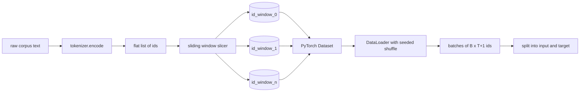
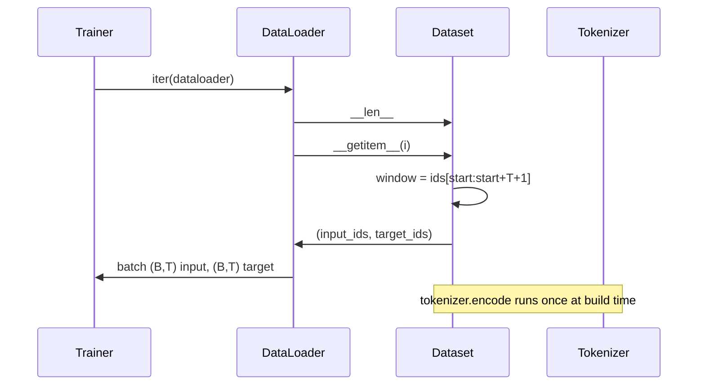

# Токенизированный набор данных со скользящим окном

> Прогон предварительного обучения — это функция, отображающая идентификаторы токенов в градиенты. Этот урок строит конвейер, который подаёт идентификаторы на вход.

**Тип:** Build
**Языки:** Python
**Предварительные требования:** Фаза 04 уроки, Фаза 07 transformer уроки, Урок 30 of this phase
**Время:** ~90 минут

## Цели обучения
- Преобразовать необработанный корпус в поток идентификаторов токенов, вызвав токенизатор один раз.
- Нарезать поток идентификаторов на окна фиксированной длины с настраиваемым шагом перекрытия (stride).
- Построить PyTorch Dataset, возвращающий входные и целевые тензоры для предсказания следующего токена.
- Обернуть dataset в DataLoader с детерминированным перемешиванием, инициализируемым seed для каждой эпохи.
- Рассуждать о компромиссе между шагом (stride), избыточностью и эффективным размером набора данных.

```figure
cap-sliding-window
```

## Общая картина

Прогон предварительного обучения читает по одному пакету идентификаторов токенов за раз и обновляет модель. Форма каждого пакета фиксируется контрактом обучения. Для каузальной языковой модели пакет содержит входные идентификаторы `(B, T)` и целевые идентификаторы `(B, T)`, где цель — это вход, сдвинутый влево на один токен. Задача конвейера данных — выдавать этот контракт по требованию, детерминированным и воспроизводимым образом, из корпуса, который может занимать несколько гигабайт необработанного текста.

Этот урок строит такой конвейер. Токенизатор из предыдущего урока превращает текст в длинный плоский список идентификаторов. Скользящее окно нарезает этот список на обучающие примеры. Пользовательский Dataset представляет примеры в виде тензоров. DataLoader собирает их в пакеты и перемешивает с известным seed.

## Контракт формы

Каузальная LM потребляет идентификаторы формы `(B, T)`, где `B` — размер пакета, а `T` — длина контекста. Цель в позиции `t` — это вход в позиции `t+1`. Это значит, что каждый обучающий пример охватывает `T+1` исходных идентификаторов. Шаг окна (stride) определяет, насколько сильно перекрываются последовательные примеры.



Нарезчик (slicer) никогда не выходит за границу корпуса. Если последнему окну не хватает идентификаторов, чтобы заполнить `T+1` позиций, нарезчик отбрасывает его. Дополнение хвоста токеном `<|pad|>` — тоже допустимый вариант, но оно усложняет маску функции потерь. В этом уроке мы используем отбрасывание.

## Зачем нужно скользящее окно

Корпус предварительного обучения — это один длинный поток идентификаторов. Если бы модель видела только неперекрывающиеся окна, каждый обучающий пример учил бы её одним и тем же границам `T`. Изменение шага (stride) сдвигает эти границы, так что модель видит более разнообразные задачи предсказания следующего токена.

Шаг `T` даёт неперекрывающиеся окна. Шаг `T // 2` даёт пятидесятипроцентное перекрытие и удваивает эффективный размер набора данных. Шаг `1` даёт максимальное перекрытие и увеличивает набор данных в `T` раз. Цена — больше вычислений на эпоху. Выгода — больше разнообразия границ. Большинство прогонов предварительного обучения используют шаг, равный длине контекста, потому что корпус уже намного больше, чем модель успевает пройти за одну эпоху, поэтому аргумент о разнообразии границ становится слабее.

## Класс Dataset

У PyTorch Dataset есть два обязательных метода. `__len__` возвращает количество примеров. `__getitem__` возвращает один пример в виде пары тензоров. Наш Dataset хранит закодированный поток идентификаторов и шаг (stride). Индексация вычисляет начало окна на лету, поэтому затраты памяти — это одна копия потока идентификаторов, независимо от того, сколько примеров порождает выбранный шаг.



Сдвиг на один токен происходит внутри `__getitem__`. Dataset возвращает `(input, target)`, где `input = window[:-1]`, а `target = window[1:]`. Оба — это тензоры PyTorch типа long. Цикл обучения рассматривает их как истинные значения (ground truth).

## Детерминированное перемешивание

DataLoader с `shuffle=True` читает данные из генератора случайных чисел PyTorch. Передавая явный `torch.Generator` с seed, заданным для каждой эпохи, мы получаем одно и то же перемешивание при каждом перезапуске прогона. Это свойство важно, когда нужно сравнить два прогона, отличающихся только одним гиперпараметром. Без seed два прогона видят данные в разном порядке, и кривые функции потерь расходятся по причинам, не связанным с самим изменением.

Контракт seed в этом уроке прост. `epoch_seed = base_seed + epoch_index`. Базовый seed передаётся при создании. Индекс эпохи увеличивается тренировочным циклом в начале каждой эпохи. Повторный запуск с тем же базовым seed всегда видит один и тот же порядок в каждой эпохе.

## Сэмплер пакетов

Сэмплер по умолчанию в PyTorch выбирает индексы равномерно случайно, без возврата (replacement отключён). Именно это нам нужно для предварительного обучения. Для дообучения на небольшом наборе данных контракт тот же самый. DataLoader собирает пакет, вызывая `__getitem__` `B` раз и складывая результаты в стек. Поскольку каждый пример по построению имеет одинаковую длину, логика дополнения (padding) не нужна.

Урок для простоты использует `num_workers=0`. В продакшен-прогоне воркеры распараллеливают вызовы `__getitem__`. В нашем конвейере это по большей части не даёт эффекта, потому что вся работа — это просто срез тензора, уже находящегося в памяти, но тот же API Dataset корректно поддерживает воркеры.

## Подсчёт примеров

Для потока идентификаторов длиной `N`, длины контекста `T` и шага `S` количество примеров равно `max(0, 1 + (N - (T + 1)) // S)`. Урок предоставляет это вычисление в виде статического метода Dataset, чтобы тренировочный цикл мог рассчитать общее количество шагов на эпоху без итерирования.

## Что этот урок не делает

Он не стримит данные с диска. Корпус полностью кодируется в памяти и хранится в виде одного тензора. Для корпуса из нескольких миллионов идентификаторов это заметно меньше ста мегабайт, и это подходящий масштаб для урока. Стриминг с диска — отдельная задача, которая подключается заменой хранилища, но сохраняет контракт Dataset.

Он не обрабатывает несколько документов. Корпус рассматривается как один непрерывный поток идентификаторов. Граница между документами кодируется вставкой идентификаторов `<|endoftext|>`, когда корпус собирается из нескольких документов. Модель учится предсказывать вокруг этой границы.

## Как читать код

`main.py` определяет два класса и один вспомогательный элемент. `SlidingWindowDataset` — это PyTorch Dataset. `make_dataloader` возвращает настроенный DataLoader с генератором, инициализированным seed. `_encode_corpus_to_ids` — это однократный вызов токенизатора. Демонстрация внизу файла строит небольшой токенизатор прямо в процессе, кодирует встроенный корпус, создаёт dataset и dataloader, выводит один пакет и проверяет контракт формы. Тесты в `code/tests/test_dataset.py` фиксируют формулу подсчёта окон, свойство сдвига на один токен, детерминированное перемешивание и компромисс, связанный с шагом (stride).

Запустите демонстрацию. Затем измените длину контекста с 16 на 32 и посмотрите, как падает число примеров на эпоху. Это число — ваш бюджет шагов на эпоху.
