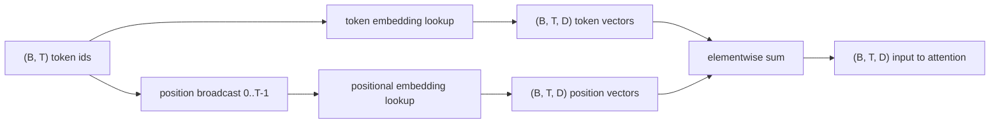
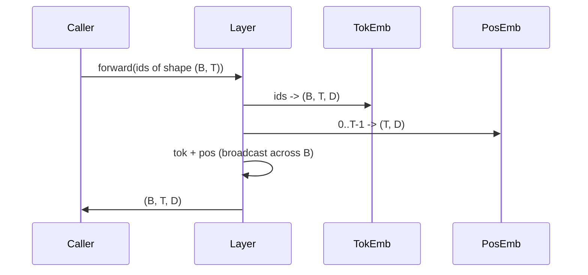

# Эмбеддинги токенов и позиций

> Идентификаторы — это целые числа. Модели нужны векторы. Между ними стоят две таблицы поиска, и выбор позиционной из них определяет, чему сможет научиться модель.

**Тип:** Build
**Языки:** Python
**Предварительные требования:** уроки этапа 04, уроки о трансформерах этапа 07, уроки 30 и 31 этого этапа
**Время:** ~90 минут

## Цели обучения
- Реализовать таблицу поиска эмбеддингов токенов, отображающую идентификаторы словаря в плотные векторы.
- Реализовать обучаемую таблицу поиска позиционных эмбеддингов, индексированную по позиции.
- Реализовать фиксированный синусоидальный позиционный эмбеддинг, индексированный по позиции и не имеющий параметров.
- Скомпоновать эмбеддинги токенов и позиций в единый вход для блока трансформера.
- Сравнить обучаемые и синусоидальные эмбеддинги по обобщению на длину последовательности и по количеству параметров.

```figure
cc-embedding-lookup
```

## Общая картина

Первый контакт модели с идентификатором токена — это поиск строки в матрице эмбеддингов токенов. В матрице по одной строке на каждый идентификатор словаря и по одному столбцу на каждое измерение модели. Поиск возвращает вектор, который остальная часть модели трактует как значение идентификатора. Обратное распространение ошибки обновляет строки, задействованные в прямом проходе. По мере обучения геометрия этих строк учится кодировать сходство в виде направлений.

Сами по себе идентификаторы токенов не имеют порядка. Модели нужен второй сигнал, который сообщает ей, что позиция один отличается от позиции семнадцать. Два доминирующих варианта такого сигнала — это обучаемый позиционный эмбеддинг (вторая таблица поиска, одна строка на позицию) и фиксированный синусоидальный позиционный эмбеддинг (математическая формула без параметров). Этот выбор имеет последствия. Обучаемая таблица — это параметр, и она ограничена максимальной длиной контекста, на которой обучалась модель. Синусоидальная таблица в теории не содержит параметров, и формула распространяется на любую позицию, но `SinusoidalPositionalEmbedding` в этом уроке заранее вычисляет фиксированную таблицу при `max_context_length`, а её `forward` выбрасывает исключение за этой границей; поэтому оба модуля здесь ограничивают максимальную длину контекста. Модель всё равно может испытывать трудности за пределами длины, на которой она обучалась, даже если таблицы достаточно велики для индексации.

Этот урок реализует оба варианта и объединяет их с эмбеддингом токенов в единый вход для блока внимания следующего урока.

## Контракт формы

Вход этапа эмбеддинга — пакет идентификаторов токенов формы `(B, T)`. Выход — тензор формы `(B, T, D)`, где `D` — размерность модели. У каждого элемента пакета одна и та же длина контекста `T`. У каждой позиции одна и та же размерность вектора `D`.



Композиция — это сумма, а не конкатенация. Суммирование сохраняет `D` неизменным на протяжении всей сети и позволяет модели решать на уровне каждого признака, что доминирует на каждом слое: значение токена или позиция.

## Матрица эмбеддингов токенов

Эмбеддинг токенов — это тензор параметров формы `(V, D)`, где `V` — размер словаря. PyTorch предоставляет его как `nn.Embedding(V, D)`. При инициализации значения берутся из небольшого гауссовского распределения, традиционно со средним ноль и стандартным отклонением около `0.02` для моделей масштаба трансформера. Точная инициализация важна меньше, чем то, что она остаётся согласованной от запуска к запуску.

Прямой проход — это одна операция индексирования. PyTorch отображает идентификаторы `(B, T)` типа int64 в числа с плавающей точкой `(B, T, D)`, собирая строки. Обратный проход накапливает градиенты только в тех строках, которые были задействованы в прямом проходе. Две строки, которые ни разу не встретились в пакете, на этом шаге получают нулевой градиент.

Тонкий момент. Для эмбеддинга токенов и выходной проекции в конце модели часто используют связывание весов (weight tying). Когда это происходит, каждый обратный проход затрагивает каждую строку эмбеддинга через выходную сторону. В этом уроке оба представлены как отдельные модули, но в полноценной модели одна и та же матрица могла бы играть обе роли.

## Обучаемый позиционный эмбеддинг

Обучаемый позиционный эмбеддинг — это второй `nn.Embedding` формы `(max_context_length, D)`. Поиск ключуется идентификатором позиции `0, 1, 2, ..., T-1`. Прямой проход транслирует (broadcast) этот вектор позиции по измерению пакета.

Недостаток обучаемой таблицы в том, что к ней нельзя обратиться по позиции `T`, если модель обучалась только до позиции `T-1`. Такой строки не существует. Промышленные модели только с декодером, использующие эту схему, закладывают максимальную длину контекста прямо в архитектуру и отказываются обрабатывать более длинные входы.

## Синусоидальный позиционный эмбеддинг

Синусоидальный позиционный эмбеддинг — это функция, отображающая позицию в вектор. Позиция `p` и признак `i` дают

```python
angle = p / (10000 ** (2 * (i // 2) / D))
emb[p, 2k]     = sin(angle)
emb[p, 2k + 1] = cos(angle)
```

Функция не имеет параметров. У каждой позиции есть уникальный вектор. Длина волны меняется геометрически по измерениям признаков, поэтому младшие измерения кодируют грубую позицию, а старшие — точную.

Из совместного выбора `sin` и `cos` следует свойство: вектор в позиции `p + k` является линейной функцией вектора в позиции `p`. Это даёт слою внимания простой путь к обучению относительных позиционных смещений. Модели не нужен отдельный параметр, чтобы выразить «посмотреть на пять токенов назад».

В этом уроке полная синусоидальная таблица вычисляется один раз при конструировании и индексируется во время прямого прохода.

## Композиция

Входной конвейер выполняет три действия по порядку. Считывает идентификаторы токенов. Находит векторы токенов. Добавляет векторы позиций. Возвращает сумму.



Трансляция (broadcasting) на шаге суммирования размножает позиционный тензор `(T, D)` вдоль измерения пакета. PyTorch делает это автоматически, поскольку после unsqueeze позиционный тензор имеет форму `(1, T, D)`.

## Сравнительный анализ

Урок запускает оба варианта на одних и тех же входных данных и выводит две диагностики.

Первая — количество параметров. Обучаемый вариант добавляет `max_context_length * D` параметров сверх эмбеддинга токенов. Синусоидальный вариант не добавляет ни одного.

Вторая — косинусное сходство между эмбеддингами соседних позиций. У синусоидального варианта плавное и предсказуемое затухание, потому что функция непрерывна. У обучаемого варианта при инициализации сходство почти случайно, поскольку строки берутся независимо друг от друга. После обучения обучаемый вариант обычно вырабатывает похожую плавную структуру, но ему приходится обнаруживать эту структуру самостоятельно, по данным.

## Чего этот урок не делает

Он не реализует роторное позиционное кодирование (RoPE) или AliBi. Это современные варианты выбора в промышленных трансформерах. Оба они следуют тому же контракту формы, что и эмбеддинги здесь (применяют позиционно-зависимое преобразование к векторам формы `(B, T, D)`), но применяются на шаге проекции внимания, а не на входе. Следующий урок строит блок внимания, и одно из необязательных расширений там — встроить роторное кодирование в проекции запросов и ключей.

Он не обучает эмбеддинг. Обучение требует функции потерь, которая требует выхода модели, а тот — внимания и выходного слоя языковой модели (LM head). Это следующий урок и урок после него.

## Как читать код

`main.py` определяет три модуля. `TokenEmbedding` оборачивает `nn.Embedding(V, D)`. `LearnedPositionalEmbedding` оборачивает `nn.Embedding(L, D)`. `SinusoidalPositionalEmbedding` заранее вычисляет таблицу и предоставляет её как буфер. `EmbeddingComposer` связывает вместе эмбеддинг токенов и позиционный эмбеддинг. Демонстрация внизу выводит формы, количество параметров и диагностику сходства соседних позиций. Тесты в `code/tests/test_embeddings.py` фиксируют форму, поведение трансляции (broadcast), количество параметров и синусоидальную формулу.

Запустите демонстрацию. Затем измените размерность модели `D` с 64 на 32 и понаблюдайте, как меняются полосы синусоидальной длины волны.
