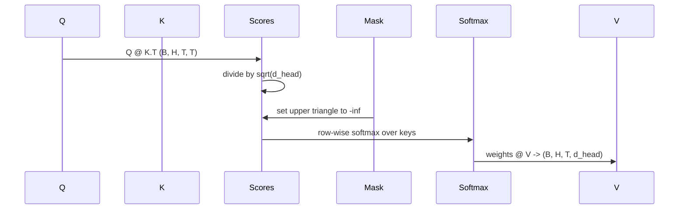

# Многоголовое самовнимание

> Одна линейная проекция, три представления, H параллельных голов, одна маска. Блок внимания в том виде, в котором его использует модель.

**Тип:** Build
**Языки:** Python
**Предварительные требования:** уроки фазы 04, уроки о трансформерах фазы 07, уроки 30–32 этой фазы
**Время:** ~90 минут

## Цели обучения
- Реализовать пакетную проекцию запросов, ключей и значений как единый линейный слой, разбитый на H голов.
- Вычислить внимание на основе масштабированного скалярного произведения (scaled dot-product attention) с правильной нормализацией и обработкой типов данных (dtype).
- Применить каузальную маску, которая не позволяет позиции обращать внимание на будущие позиции.
- Изучить веса внимания по головам для фиксированного входа и рассуждать о том, на что смотрит каждая голова.
- Обучить небольшой блок внимания на игрушечной задаче и увидеть, как падает функция потерь по мере специализации голов.

```figure
cap-multihead-attention
```

## Общая картина

Внимание (attention) — это функция, которая позволяет представлению токена извлекать информацию из других токенов той же последовательности. Самовнимание (self-attention) означает, что запросы (query), ключи (key) и значения (value) получены из одного и того же входа. Многоголовость (multi-head) означает, что проекция разбивается на H параллельных задач внимания, выходы которых конкатенируются и проецируются обратно.

Эффективная схема реализации — это один линейный слой, который проецирует из `D` в `3 * D` и нарезается на три представления, а затем преобразуется в H голов размером `D // H` каждая. Матричное умножение, softmax и взвешенная сумма выполняются как пакетные тензорные операции, поэтому головы работают параллельно на ускорителе.

Этот урок строит этот блок. Он также добавляет каузальную маску, чтобы тот же код работал как слой внимания в языковой модели только с декодером (decoder-only). Следующий урок собирает этот блок в полный трансформер, а урок после него обучает его.

## Контракт формы

Вход имеет форму `(B, T, D)`. Выход имеет форму `(B, T, D)`. Маска имеет форму `(T, T)` или форму, которую можно транслировать (broadcast) до неё. Внутри блока промежуточные тензоры имеют форму `(B, H, T, d_head)`, где `d_head = D // H`. Ограничение: `D % H == 0`.

```mermaid
flowchart LR
    A["(B, T, D) input"] --> B[Linear D -> 3D]
    B --> C["split into Q, K, V"]
    C --> D["reshape to (B, H, T, d_head)"]
    D --> E["scores = Q @ K.T / sqrt(d_head)"]
    E --> F[apply causal mask]
    F --> G[softmax over keys]
    G --> H["context = weights @ V"]
    H --> I["reshape to (B, T, D)"]
    I --> J[output Linear D -> D]
    J --> K["(B, T, D) output"]
```



Два линейных слоя (проекция QKV и выходная проекция) — единственные параметры в блоке. Маска, softmax, матричные умножения и изменения формы не имеют параметров.

## Разбиение QKV

Наивная реализация использует три отдельных линейных слоя — по одному для Q, K и V. Эффективная реализация использует один слой, который выдаёт `3 * D` признаков, а результат затем разбивается. Обе версии математически эквивалентны, потому что три отдельных матричных умножения на веса `(D, D)` — это ровно то же самое, что одно матричное умножение на вес `(3D, D)`, составленный из них.

Эффективная версия быстрее, потому что ускоритель запускает одно матричное умножение вместо трёх. Её также проще инициализировать, поскольку три подматрицы находятся в одном тензоре параметров и могут инициализироваться вместе.

## Изменение формы под головы

После разбиения каждый из Q, K, V имеет форму `(B, T, D)`. Чтобы превратить это в H параллельных задач внимания, мы меняем форму на `(B, T, H, d_head)` и транспонируем в `(B, H, T, d_head)`. Теперь измерение голов находится рядом с измерением пакета (batch), поэтому PyTorch трактует внимание по головам как пакетную операцию по `B * H` независимым экземплярам.

Измерение d_head остаётся последним, чтобы матричное умножение для оценок `Q @ K.transpose(-2, -1)` свёртывало именно его. Результат — оценки внимания по головам формы `(B, H, T, T)`.

## Масштабирование

Перед softmax оценки делятся на `sqrt(d_head)`. Без этого масштабирования скалярные произведения растут вместе с ростом `d_head` и загоняют softmax в режим, где почти вся масса вероятности сосредоточена в одной позиции, а остальные становятся исчезающе малыми. В этом режиме градиенты крошечные, и обучение останавливается. Деление на `sqrt(d_head)` удерживает дисперсию оценок примерно постоянной независимо от размера головы.

## Каузальная маска

Языковая модель только с декодером может опираться только на прошлое при предсказании следующего токена. Маска обеспечивает это. Конкретно: перед softmax каждый элемент выше диагонали матрицы оценок `(T, T)` заменяется на минус бесконечность. После softmax эти позиции получают нулевой вес.



Мы регистрируем маску как буфер (buffer) при создании блока, чтобы она находилась на том же устройстве, что и модель, и не входила в граф градиентов. Маска покрывает максимальную длину контекста, которую когда-либо увидит блок. При прямом проходе мы вырезаем верхний левый угол `(T, T)`.

## Выходная проекция

После получения контекстных векторов по головам `(B, H, T, d_head)` мы транспонируем их обратно в `(B, T, H, d_head)`, меняем форму на `(B, T, D)` и применяем финальную линейную проекцию `(D, D)`. Выходная проекция позволяет модели смешивать головы. Без неё H голов могли бы объединяться только через последующие слои, и блок был бы искусственно ограничен.

## Анализ весов внимания

Урок предоставляет флаг `return_weights=True` в прямом проходе. Если он установлен, блок возвращает веса внимания по головам формы `(B, H, T, T)` вместе с выходом. Демонстрация выводит тепловую карту (heatmap) весов одной головы на коротком входе, чтобы вы могли увидеть структуру каузального треугольника и фокус по позициям.

В обученной модели разные головы обучаются разным паттернам. Одни головы фокусируются на непосредственно предыдущем токене. Другие — на начале последовательности. Третьи распределяют внимание почти равномерно. Этот механизм инспекции — точка входа для такой работы по интерпретируемости.

## Демонстрация обучения

Демонстрация в конце `main.py` подключает блок внимания к небольшой LM-голове и обучает всё это на задаче повторения. Каждая строка входа — это один случайный идентификатор, повторённый по всему контексту. Целевое значение — вход, сдвинутый на один токен, поэтому модель должна научиться тому, что следующий токен совпадает с предыдущим. Функция потерь — перекрёстная энтропия. При H=4, D=32, T=12 и словаре из 64 токенов функция потерь падает со случайного уровня (около `log(64) ~ 4.16`) до значения существенно ниже `1.0` за три эпохи на CPU.

Цель демонстрации — не обучить полезную модель. Цель — убедиться, что градиенты проходят через каждую часть блока и что головы чему-то обучаются на задаче с очевидным ответом.

## Чего этот урок не делает

Он не добавляет блок прямого распространения (feed-forward). Слой трансформера в реальной модели — это внимание, за которым следует двухслойный MLP с остаточным соединением (residual connection) и нормализацией слоя (layer norm) вокруг каждого из них. Следующий урок добавляет их.

Он не реализует ротационное позиционное кодирование или AliBi. Оба применяются на этапе проекции QKV в том же блоке, но это отдельная учебная единица. Блок, построенный здесь, совместим с любым из них — достаточно преобразовать Q и K перед матричным умножением.

Он не реализует KV-кеш для инференса. Кеширование ключей и значений между прямыми проходами — это оптимизация, которая делает авторегрессионное декодирование быстрым. Она меняет контракт форм для тензоров K и V, но не для Q. Это относится к уроку про инференс.

## Как читать код

`main.py` определяет `MultiHeadSelfAttention`. Класс содержит два линейных слоя и зарегистрированный буфер маски. Прямой проход выполняет проекцию, изменение формы, вычисление оценок, маскирование, softmax, взвешивание, повторное изменение формы и финальную проекцию. Демонстрация в конце строит небольшую модель, которая оборачивает внимание эмбеддингами токенов и позиций и LM-головой, обучает её на задаче копирования в течение трёх эпох и выводит кривую потерь и тепловую карту внимания по головам. Тесты в `code/tests/test_attention.py` фиксируют контракт форм, свойство каузальности, свойство softmax, свойство разбиения на головы и прохождение градиентов.

Запустите демонстрацию. Затем увеличьте `n_heads` с 4 до 8 (оставив `d_model=32`, так что `d_head=4`) и понаблюдайте, как меняется тепловая карта.
