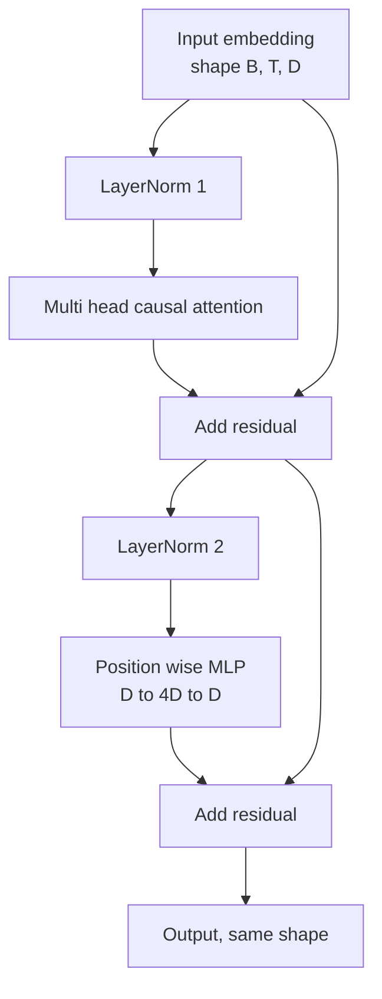
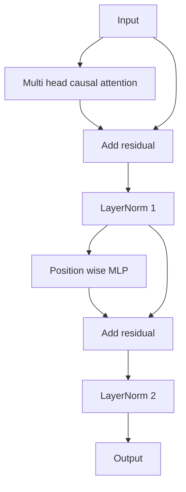

# Блок трансформера с нуля

> Один блок — это базовая единица каждой современной LLM с архитектурой декодера. LayerNorm, многоголовое внимание, остаточное соединение, MLP, остаточное соединение. Вариант pre-LN обучается стабильно без разогрева. Вариант post-LN использовался в оригинальной статье. В этом уроке мы построим оба варианта бок о бок и увидим, какой из них выдерживает стек из 12 слоёв при типичных значениях скорости обучения.

**Тип:** Build
**Языки:** Python
**Предварительные требования:** уроки 30–33 фазы 19 (токенизатор, эмбеддинги, математика внимания, загрузчик пакетных данных)
**Время:** ~90 минут

## Цели обучения

- Собрать блок трансформера в PyTorch из четырёх составных частей: LayerNorm, многоголовое каузальное внимание, остаточные соединения и позиционный MLP.
- Разместить LayerNorm в двух конфигурациях (pre-LN и post-LN) и объяснить, почему одна из них обучается стабильно без разогрева.
- Реализовать каузальное маскирование внутри многоголового внимания так, чтобы токен `i` не мог видеть токены `j > i`.
- Проследить прохождение градиента через оба варианта на стеке из 12 слоёв и интерпретировать результат без голословных рассуждений.
- Повторно использовать блок как готовый к подключению модуль, когда в следующем уроке будет собрана GPT со 124 миллионами параметров.

## Проблема

Трансформер — это один блок, повторённый много раз. Один раз ошибитесь в блоке, повторите его двенадцать раз — и вы получите модель, которая расходится в первую же эпоху либо требует ухищрений с разогревом на всём оставшемся пути. Эти два режима отказа, которые вы увидите в уроке, вовсе не экзотичны. Они проявляются, как только учащийся впервые наивно складывает блоки друг на друга. Первый — слой внимания, который обращается к будущим позициям. Второй — LayerNorm, размещённый там, где он не может сдержать остаточный сигнал на большой глубине.

Исправление механическое, как только вы его увидите. У блока ровно два остаточных пути и ровно две позиции нормализации. Выберите позиции правильно — и весь остальной стек становится просто бухгалтерией.

## Концепция

Каждый блок трансформера только с декодером — это функция, которая принимает тензор формы `(batch, sequence, embedding)` и возвращает тензор той же формы. Внутри работу выполняют два подслоя.



Это вариант pre-LN. LayerNorm располагается внутри остаточной ветви, перед подслоем. Остаточное соединение переносит ненормализованный сигнал дальше.

Вариант post-LN переносит LayerNorm на место после сложения с остаточным сигналом.



Форма идентична. Поведение при обучении — нет. При post-LN градиент, который течёт назад через остаточный путь, обязан пройти через LayerNorm. На глубине двенадцать и скорости обучения `3e-4` этот градиент уменьшается достаточно быстро, чтобы потребовать график разогрева. Pre-LN оставляет остаточный путь ненормализованным, поэтому градиенты распространяются к слою эмбеддингов без потерь. Именно поэтому pre-LN — это конфигурация, которую поставляют все модели начиная с GPT-2.

### Каузальное многоголовое внимание

Подслой внимания проецирует вход тремя способами — в тензоры запроса, ключа и значения. Каждый из них меняет форму с `(B, T, D)` на `(B, H, T, D/H)`, где `H` — количество голов. Масштабированное скалярное произведение внимания вычисляет `softmax(Q K^T / sqrt(d_k))` для каждой головы, маскирует верхний треугольник значением минус бесконечность, применяет маску через softmax, затем умножает на `V`. Головы объединяются обратно в единый тензор `(B, T, D)` и проецируются ещё раз. Маска — это единственная часть, которая делает модель каузальной. Забудьте про маску — и вы обучите модель, которая жульничает.

### MLP

Позиционный MLP применяет одну и ту же двухслойную сеть к каждому токену независимо. Ширина скрытого слоя в четыре раза больше ширины эмбеддинга, функция активации — GELU, а за вторым линейным слоем следует дропаут. Внутри MLP токены никак не взаимодействуют друг с другом. Всё смешивание токенов происходит во внимании.

### Остаточные соединения делают две вещи

Они делают путь градиента аддитивным по глубине, что удерживает норму градиента в разумном масштабе на протяжении двенадцати слоёв. Они также позволяют каждому блоку обучать аддитивное обновление к текущему представлению, а не полную замену. Оба эффекта — причина, по которой блок масштабируется.

```figure
cc-transformer-block
```

## Реализация

`code/main.py` реализует:

- `class LayerNorm` с обучаемыми масштабом и сдвигом, смещённым eps, применяемым к каждому вектору токена.
- `class MultiHeadAttention` с `num_heads`, `head_dim = d_model // num_heads`, объединённой проекцией QKV, зарегистрированной каузальной маской, дропаутом внимания и остаточным дропаутом.
- `class FeedForward` с двумя линейными слоями, активацией GELU, дропаутом.
- `class TransformerBlock` с флагом `pre_ln`, переключающим между двумя вариантами.
- Демонстрацию, которая строит стек pre-LN из 6 слоёв и стек post-LN из 6 слоёв с идентичными входами и выводит (а) форму выхода, (б) норму градиента на эмбеддинге после одного обратного прохода.

Запустите:

```bash
python3 code/main.py
```

Вывод: проверка формы для обоих стеков, нормы градиента бок о бок. Градиент эмбеддинга у стека pre-LN на порядок больше, чем у стека post-LN при той же скорости обучения, — это и есть эмпирический сигнал того, что pre-LN обучается без разогрева.

## Стек

- `torch` для тензорной математики, автоматического дифференцирования и обвязки `nn.Module`.
- Никакого `transformers`, никаких предобученных весов. Блок реализован из примитивов.

## Производственные паттерны в дикой природе

Три паттерна превращают учебный блок в нечто, что можно поставить в продакшен.

**Объединённая проекция QKV.** Три отдельных линейных слоя требуют трёх запусков ядра и трёх матричных умножений. Один линейный слой шириной `3 * d_model` выполняет ту же работу за один запуск, а затем разбивает выход вдоль последней оси. Объединённый путь быстрее на любом ускорителе и совпадает с тем, что поставляют эталонные реализации GPT-2, LLaMA и Mistral.

**Зарегистрированный буфер каузальной маски.** Маска зависит только от максимальной длины контекста. Выделите её один раз при конструировании через `register_buffer`, нарезайте активное окно на каждом прямом проходе и пропускайте выделение памяти на каждый вызов. Забыть об этом — значит превратить маску в горячую точку аллокатора при длинном контексте.

**Дропаут в двух местах, а не в трёх.** Дропаут должен стоять после softmax внимания (дропаут внимания) и после второго линейного слоя MLP (остаточный дропаут). Дропаут на самом остаточном сигнале ломает аддитивное тождество, которое позволяет градиенту течь на глубине. Некоторые ранние реализации ошиблись именно здесь и заплатили за это хрупким обучением.

## Применение

- Блок из этого урока подключается напрямую к сборке GPT в уроке 35 без изменений.
- Вариант pre-LN использует любая современная LLM с открытыми весами. Вариант post-LN использовался в оригинальной статье о внимании 2017 года. Знания обоих вариантов достаточно, чтобы читать любую архитектуру декодера, с которой вы столкнётесь.
- Замените GELU на SiLU — и получите функцию активации семейства LLaMA. Замените LayerNorm на RMSNorm — и получите нормализацию семейства LLaMA. Тот же скелет.

## Упражнения

1. Добавьте флаг `bias=False` к каждому линейному слою в блоке. Современные LLM с открытыми весами поставляются без смещений на линейных слоях. Измерьте, сколько параметров вы экономите в модели с 12 слоями и размерностью 768.
2. Замените `nn.LayerNorm` на самостоятельно написанный RMSNorm и убедитесь, что форма выхода не изменилась.
3. Добавьте флаг, который возвращает веса внимания для первой головы в виде тензора `(B, T, T)`. Постройте график верхнего треугольника, чтобы убедиться, что он равен нулю после softmax.
4. Постройте проверку, которая пропускает тензор `(2, 16, 384)` с `H=6` через оба варианта и убеждается, что выходы прямого прохода различаются (например, `not torch.allclose`), когда веса инициализированы одинаково, а дропаут установлен в ноль.

## Ключевые термины

| Термин | Что говорят люди | Что это означает на самом деле |
|------|-----------------|------------------------|
| Pre-LN | «Пре-норм» | LayerNorm внутри остаточной ветви, перед каждым подслоем; остаточное соединение несёт ненормализованный сигнал |
| Post-LN | «Пост-норм» | LayerNorm после сложения с остаточным сигналом; то, что поставила статья 2017 года и что требует разогрева |
| Каузальная маска | «Треугольная маска» | Верхний треугольник логитов внимания, установленный в минус бесконечность, так что токен i не может прочитать токен j, когда j больше i |
| Объединённая проекция QKV | «Комбинированная проекция» | Один линейный слой шириной 3D вместо трёх линейных слоёв шириной D; одно ядро, одно матричное умножение |
| Остаточный поток | «Скип-соединение» | Ненормализованный тензор, который проходит сверху вниз через каждый блок; тензор, к которому каждый блок добавляет своё обновление |

## Дополнительное чтение

- Фаза 7, урок 02 (самовнимание с нуля) — математика внимания, лежащая в основе этого блока.
- Фаза 7, урок 05 (полный трансформер) — версия того же скелета для энкодера и декодера.
- Фаза 10, урок 04 (предварительное обучение мини-GPT) — процедура обучения, в которую подключается этот блок.
- Фаза 19, урок 35 (этот трек) — собирает двенадцать таких блоков в модель GPT.
