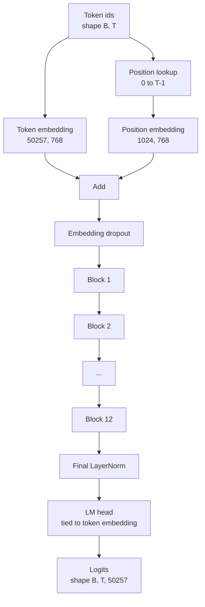
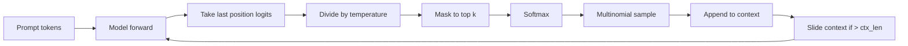

# Сборка модели GPT

> Двенадцать блоков друг за другом, эмбеддинг токенов, обучаемый эмбеддинг позиций, финальный LayerNorm и голова языковой модели со связанными весами (weight tying). Это и есть вся модель GPT с 124 миллионами параметров. Этот урок собирает эти части в рабочий класс, подсчитывает число параметров, чтобы подтвердить, что модель соответствует эталонной форме 124M, и генерирует текст с помощью мультиномиального сэмплирования, температуры и top-k.

**Тип:** Build**Языки:** Python**Предварительные требования:** Фаза 19 уроки 30 to 34**Время:** ~90 минут
## Цели обучения

- Собрать трансформерный блок из урока 34 в полную модель GPT: эмбеддинг токенов, эмбеддинг позиций, N блоков, финальный LayerNorm, голова языковой модели.
- Воспроизвести конфигурацию с 124 миллионами параметров: словарь 50257, контекст 1024, эмбеддинг 768, двенадцать голов, двенадцать слоёв.
- Связать веса головы языковой модели с эмбеддингом токенов и объяснить, почему это экономит ~38 миллионов параметров при таком масштабе.
- Сгенерировать текст из промпта с мультиномиальным сэмплированием, масштабированием температуры и усечением top-k, удерживая длину контекста с помощью скользящего окна.
- Измерить число параметров и стоимость прямого прохода относительно целевого значения 124M.

## Проблема

Трансформерный блок сам по себе ничего не делает. Нужно превратить идентификаторы токенов в векторы, подмешать позиционную информацию, пропустить их через стек и спроецировать обратно в логиты словаря. Пропустите любой из этих четырёх шагов — и модель либо не сможет выполнить прямой проход, либо потеряет позиционную информацию, либо не сможет «говорить».

Форма модели тоже имеет значение. Эталонная GPT-2 small — это 124 миллиона параметров ровно при указанной выше конфигурации. Эти числа не магия. Словарь 50257, умноженный на эмбеддинг 768, даёт таблицу токенов. Позиция 1024, умноженная на 768, даёт таблицу позиций. Двенадцать блоков примерно по 7 миллионов параметров каждый дают 84 миллиона. Финальная голова переиспользует таблицу токенов за счёт связывания весов (weight tying). Сложите части — и получите 124 миллиона. Если число параметров построенной модели не совпадает с эталоном, значит, где-то что-то подключено неверно.

## Концепция



Идентификаторы токенов превращаются в векторы токенов. Идентификаторы позиций превращаются в векторы позиций. Оба складываются и отправляются через стек. Финальный LayerNorm — единственный элемент вне блоков, который сохраняется в каждом современном варианте. Голова LM переиспользует матрицу эмбеддинга токенов — именно это и означает связывание весов (weight tying).

### Связывание весов

Эмбеддинг токенов имеет форму `(vocab, d_model)`. Голове языковой модели нужно спроецировать из `d_model` обратно в `vocab`. Это транспонирования друг друга. Связать их означает буквально использовать один и тот же тензор параметров дважды. При vocab 50257 и d_model 768 матрица составляет 38 миллионов параметров. Без связывания за неё приходится платить дважды. Со связыванием — один раз, и вдобавок получается немного более чистый сигнал градиента, потому что эмбеддинг и голова обновляются вместе.

### Эмбеддинг позиций обучаемый, а не синусоидальный

GPT-2 использует обучаемый эмбеддинг позиций. Таблица позиций — это один тензор параметров формы `(1024, 768)`. При каждом прямом проходе модель ищет позиции от 0 до T-1 и добавляет результат к эмбеддингу токенов. Это простейшая из схем позиционирования (альтернативы — RoPE, ALiBi, относительное смещение T5), и именно её использует эталон 124M.

### Генерация: температура, top-k, мультиномиальное сэмплирование

Генерация авторегрессионна. На каждом шаге модель возвращает логиты по всему словарю для каждой позиции. Берётся только последняя позиция, логиты делятся на температуру, при необходимости все логиты, кроме top k, маскируются значением минус бесконечность, применяется softmax для получения вероятностей, и из полученного распределения сэмплируется один токен.



Три регулятора, три разных поведения. Температура около нуля сводится к жадному выбору (greedy). Температура, равная единице, соответствует естественному распределению модели. Top-k, равный единице, — это жадный выбор. Top-k сорок отфильтровывает длинный хвост. Комбинации имеют значение; в следующем уроке об обучении генерация используется как сигнал качественного оценивания.

```figure
cc-gpt-assembly
```

## Реализация

`code/main.py` реализует:

- Датакласс `class GPTConfig` со значениями по умолчанию для 124M: `vocab_size=50257`, `context_length=1024`, `d_model=768`, `num_heads=12`, `num_layers=12`, `mlp_expansion=4`, `dropout=0.1`, `use_bias=True`, `weight_tying=True`.
- `class GPTModel` с эмбеддингом токенов, эмбеддингом позиций, дропаутом эмбеддинга, двенадцатью `TransformerBlock`, финальным LayerNorm и `lm_head`, который связывается с эмбеддингом токенов, когда установлен соответствующий флаг.
- Вспомогательную функцию `count_parameters`, которая возвращает число уникальных параметров (так что связывание весов учитывается при подсчёте).
- Функцию `generate`, реализующую температуру, top-k, мультиномиальное сэмплирование и скользящее окно контекста.
- Демонстрацию, которая строит модель, выводит число параметров рядом с эталонными 124M и генерирует короткую последовательность из фиксированного промпта, показывая работу конвейера от начала до конца.

Запустите:

```bash
python3 code/main.py
```

Вывод: число параметров рядом с эталоном 124M, идентификаторы сгенерированных токенов из случайного промпта и подтверждение того, что голова LM и эмбеддинг токенов используют общее хранилище, когда связывание включено.

Чтобы демонстрация выполнялась быстро, скрипт также прогоняет крошечную конфигурацию (`d_model=64`, `num_layers=2`) от начала до конца и выводит сгенерированную последовательность токенов прямо в консоль. Конфигурация 124M строится, но для неё выполняется только подсчёт параметров и один прямой проход.

## Стек

- `torch` для тензорной математики, autograd и внутренней организации модулей.
- `code/main.py` заново реализует тот же паттерн блока из урока 34 локально.

## Производственные паттерны в дикой природе

Три паттерна отличают модель, которая просто запускается, от модели, которую можно поставлять.

**Инициализируйте проекции residual-соединения маленькими.** Выходная проекция внимания и второй линейный слой MLP оба напрямую подают результат в residual-сложение. Инициализация их с тем же стандартным отклонением, что и у всех остальных линейных слоёв, приводит к тому, что residual-поток растёт с глубиной и толкает финальный LayerNorm в разогретый режим. Масштабируйте std этих двух проекций множителем `1 / sqrt(2 * num_layers)`; тогда residual-поток остаётся в разумном диапазоне на протяжении двенадцати слоёв.

**Кешируйте тензор идентификаторов позиций, а не пересчитывайте его.** `torch.arange(T)` выделяет свежую память при каждом прямом проходе. Выделите её один раз в `__init__` для максимальной длины контекста, нарезайте первые T элементов на каждом вызове и избегайте лишнего обращения к аллокатору.

**Связывайте веса на уровне параметров, а не простым копированием.** Присваивание `lm_head.weight = token_embedding.weight` делает тензор общим; копирование — нет. Оптимизатору нужно обновлять один параметр, а графу autograd — накапливать градиент в одном месте. При копировании голова со временем расходится с эмбеддингом, и связывание весов не даёт никакой пользы.

## Применение

- Класс модели из этого урока имеет ту же форму, что и модель, которую обучает следующий урок.
- Замена обучаемого эмбеддинга позиций на RoPE даёт семейство LLaMA без изменения блока или головы.
- Замена GELU на SiLU и LayerNorm на RMSNorm даёт остальные изменения семейства LLaMA.
- Функция генерации работает с любым источником логитов, не только с этой моделью. В уроке 37 логиты можно извлечь из файла предобученной GPT-2 и переиспользовать тот же цикл генерации.

## Упражнения

1. Отвяжите голову LM от эмбеддинга токенов и пересчитайте параметры. Убедитесь, что разница составляет 50257, умноженное на 768, то есть 38 миллионов.
2. Замените обучаемый эмбеддинг позиций синусоидальной таблицей, вычисляемой при создании модели. Убедитесь, что модель по-прежнему выполняет прямой проход, а число параметров уменьшается на 786 432.
3. Добавьте в генерацию флаг `greedy=True`, который пропускает сэмплирование и выбирает argmax. Убедитесь, что последовательность детерминирована при повторных запусках.
4. Добавьте регулятор `repetition_penalty`, который делит логит любого токена из промпта или уже сгенерированной истории на константу перед softmax. Покажите на фиксированном промпте, что значения больше единицы уменьшают число повторов в выводе.
5. Добавьте сэмплирование `top_p` (nucleus) наряду с `top_k`. Двухстрочная проверка того, что сумма вероятностей оставленных токенов превышает `top_p`.

## Ключевые термины

| Термин | Что говорят люди | Что это означает на самом деле |
|------|-----------------|------------------------|
| Weight tying (связывание весов) | «Связанные эмбеддинги» | Голова LM и эмбеддинг токенов используют один и тот же тензор параметров; экономит vocab, умноженный на d_model, параметров, и соответствует эталону GPT-2 |
| Position embedding (эмбеддинг позиций) | «Обучаемые позиции» | Отдельная таблица формы (context length, d_model), добавляемая к векторам токенов; обучается сквозным образом |
| Sliding window context (скользящее окно контекста) | «Ограничение контекста» | Когда промпт плюс сгенерированные токены превышают длину контекста, самые старые токены отбрасываются, чтобы активное окно помещалось |
| Top-k sampling (top-k сэмплирование) | «Усечение по K» | Оставляются K логитов с наибольшими значениями, остальные маскируются значением минус бесконечность, softmax применяется к оставшимся |
| Temperature (температура) | «Температура сэмплирования» | Логиты делятся на T перед softmax; T меньше 1 делает распределение более острым, T равное 1 сохраняет естественное распределение, T больше 1 делает его более плоским |

## Дополнительное чтение

- Фаза 19, урок 34 — блок, из которого собирается эта модель.
- Фаза 19, урок 36 — цикл обучения, который приводит эту модель в движение с помощью функции потерь на основе перекрёстной энтропии.
- Фаза 19, урок 37 — загрузка предобученных весов GPT-2 в эту же архитектуру.
- Фаза 7, урок 07 (каузальное языковое моделирование GPT) — математика предсказания следующего токена.
- Фаза 10, урок 04 (предварительное обучение mini GPT) — исходная процедура обучения на той же архитектуре.
