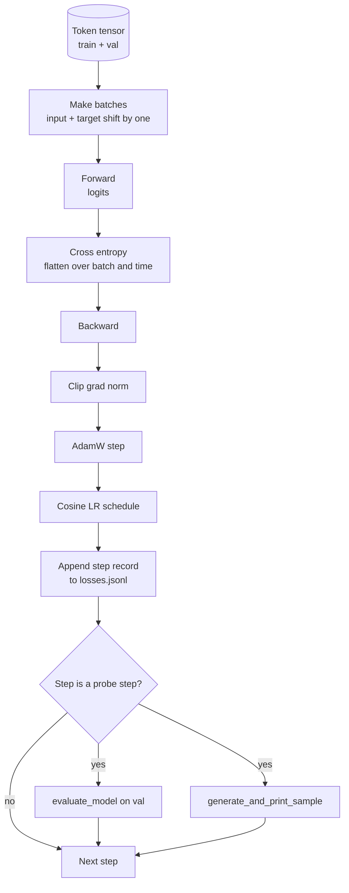

# Цикл обучения и оценивание

> Цикл, который ничего не измеряет, — это цикл, который лжёт. В этом уроке мы строим цикл обучения (training loop), который приводит в движение модель GPT: AdamW с разделением весового затухания (weight decay), расписание скорости обучения из разогрева (warmup) и косинусного затухания, вспомогательную функцию `calc_loss_batch`, проход `evaluate_model` на отложенных данных, качественную проверку `generate_and_print_sample` каждые K шагов и JSONL-журнал потерь, который можно построить в виде графика впоследствии. Этот же каркас обучает любую decoder-LLM, которую вы когда-либо будете строить.

**Тип:** Build**Языки:** Python**Предварительные требования:** Фаза 19 уроки 30 to 35**Время:** ~90 минут
## Цели обучения

- Построить цикл обучения, вычисляющий функцию потерь на основе перекрёстной энтропии с правильным согласованием входа и цели для предсказания следующего токена.
- Настроить AdamW с весовым затуханием, применяемым к весовым тензорам, но не к тензорам LayerNorm или смещений (bias).
- Реализовать расписание скорости обучения с линейным разогревом (warmup) и косинусным затуханием и научиться читать получившуюся скорость обучения во времени.
- Оценивать модель на отложенной выборке (held out split) с помощью `evaluate_model`, чтобы потери на оценивании были сопоставимы между запусками.
- Генерировать качественный образец каждые K шагов с помощью `generate_and_print_sample`, чтобы заметить расхождение (divergence) раньше, чем это покажет кривая потерь.
- Сохранять потери на каждом шаге в JSONL, чтобы можно было перезагрузить, построить график и поставить журнал обучения как артефакт.

## Проблема

Скрипт обучения, который просто печатает потери и ничего больше, ломается тремя способами. Он не может сказать вам, снижаются ли потери по правильной причине (модель может переобучиться на тренировочном наборе и так ничему полезному не научиться). Он не может сказать вам, начинается ли расхождение (loss может подскочить на один шаг и восстановиться, а может подскочить на один шаг и рухнуть). Он не может сказать вам, чему модель научилась (потери — это скаляр; сгенерированный образец — это абзац текста). Все три сбоя остаются скрытыми, если цикл ничего не измеряет.

Цикл в этом уроке измеряет тремя способами. Потери на тренировочном пакете (batch) на каждом шаге. Потери на отложенном пакете каждые K шагов. Сгенерированное продолжение от фиксированного промпта каждые K шагов. Журнал обучения сохраняется в JSONL, так что артефакт становится свидетельством работы цикла.

## Концепция



Два неочевидных момента — это согласование потерь (loss alignment) и разделение затухания в AdamW.

### Согласование потерь

Модель предсказывает следующий токен в каждой позиции. Если входной пакет — это токены `[t0, t1, t2, t3]`, то целевой пакет должен быть `[t1, t2, t3, t4]`. Перекрёстная энтропия вычисляется на плоской форме `(batch * seq, vocab)` относительно плоской цели `(batch * seq,)`. Забудьте про сдвиг — и вы обучите модель предсказывать саму себя, что сходится к нулевым потерям, ничему полезному не научившись.

### Разделение затухания в AdamW

Весовое затухание регуляризует весовые тензоры, но не масштабы нормализации и не смещения (biases). Применение затухания к масштабу LayerNorm медленно сводит масштаб к нулю и ломает нормализацию. Применение затухания к смещению математически безвредно, но является тратой циклов впустую. Стандартное разделение таково: тензоры матричной формы (веса линейных слоёв, таблицы эмбеддингов) получают затухание, всё, что похоже на масштаб или сдвиг, — нет.

### Расписание разогрева плюс косинус

Разогрев (warmup) плавно поднимает скорость обучения от нуля до целевого значения за несколько сотен шагов, чтобы состояние оптимизатора успело накопиться. Косинусное затухание снижает скорость обучения обратно к нулю на оставшихся шагах, так что на финальной фазе веса дообучаются с малым размером шага. Это сочетание — самое распространённое расписание при обучении LLM с открытыми весами, потому что оно убирает большинство хрупких моментов в первую и последнюю тысячу шагов.

### Оценивание на отложенной выборке

`evaluate_model` прогоняет фиксированное число пакетов из валидационной выборки, накапливает потери, делит на число пакетов и возвращает результат. Без градиента. Без dropout. Число воспроизводимо между запусками при одинаковом seed и одинаковой выборке. Сравнение потерь на отложенной выборке с тренировочными потерями — это способ заметить переобучение.

### Качественное сэмплирование как ранний сигнал

Модель, у которой тренировочные потери красиво снижаются, но сгенерированные образцы состоят из одного и того же токена, — сломана. Модель, у которой кривая потерь выглядит плоской, но сгенерированные образцы становятся связными словами, — учится. Качественная проверка выполняется быстрее, чем чтение полной кривой, и улавливает режимы, которые скаляр упускает.

```figure
cap-training-loop
```

## Реализация

`code/main.py` реализует:

- `make_batches(token_ids, batch_size, context_length)`, который нарезает длинный тензор токенов на пары вход/цель.
- `calc_loss_batch(model, inputs, targets)`, который выполняет прямой проход, разворачивает форму и возвращает скалярную перекрёстную энтропию.
- `evaluate_model(model, val_loader, max_batches)`, который проходит фиксированное число валидационных пакетов без градиента и возвращает среднее значение потерь.
- `generate_and_print_sample(model, prompt, max_new_tokens)`, который запускает функцию генерации из урока 35 на фиксированном промпте и печатает результат.
- `build_param_groups(model, weight_decay)`, который формирует список параметров AdamW из двух групп.
- `cosine_with_warmup(step, warmup_steps, total_steps, max_lr, min_lr)`, который возвращает скорость обучения на заданном шаге.
- `train(...)`, который выполняет цикл, сохраняет `outputs/losses.jsonl` и печатает потери на оценивании и образец каждые `eval_every` шагов.
- Демонстрацию, которая обучает крошечную модель на синтетических данных за небольшое число шагов, записывает JSONL-журнал и печатает потери на оценивании и образец в точках проверки. Демонстрация выполняется существенно быстрее минуты на CPU.

Запустите:

```bash
python3 code/main.py
```

Вывод: строка потерь на каждом шаге, потери на оценивании на каждом шаге проверки, сгенерированный образец на каждом шаге проверки и итоговый `outputs/losses.jsonl`, который можно загрузить построчно с помощью `json.loads`.

## Стек

- `torch` для автоматического дифференцирования, оптимизатора и модулей.
- `main.py` заново реализует `GPTModel` из урока 35 и вспомогательные модули локально.

## Производственные паттерны в дикой природе

Три паттерна превращают учебный цикл в нечто, что можно оставить работать на всю ночь.

**Отсечение нормы градиента (gradient norm clipping) не подлежит обсуждению.** Плохой пакет (аномальные данные, скачок скорости обучения, численный крайний случай) даёт огромный градиент, который стирает часы обучения. `torch.nn.utils.clip_grad_norm_(params, max_norm=1.0)` после `backward` и перед `step` удерживает оптимизатор в безопасном диапазоне. Значение отсечения — свободный параметр; единица — значение по умолчанию, которое подходит для большинства конфигураций.

**Возобновляемое JSONL-логирование, а не сериализованное (pickled) состояние.** Записи потерь на каждом шаге в виде строк `{"step": int, "train_loss": float, "lr": float}` в JSONL долговечны: любой сбой оставляет читаемый артефакт, вы можете сделать grep, построить график тридцатью строками Python и возобновить обучение, прочитав последний шаг. Сериализованное (pickled) состояние привязывает вас к точной структуре модулей, которая создала файл, что хрупко при рефакторинге.

**Пакеты для оценивания берутся из фиксированного среза.** Токены валидационной выборки нарезаются на пакеты при старте скрипта, а не на лету. Воспроизводимость зависит от того, что пакеты для оценивания идентичны от запуска к запуску; иначе сравнение потерь на оценивании между двумя запусками измеряет перемешивание пакетов не меньше, чем саму модель.

## Применение

- Цикл в этом уроке — тот же каркас, что обучает модель на 124M параметров на реальных данных. Замените синтетический тензор токенов на загрузчик в стиле `datasets`, и цикл будет работать без изменений.
- JSONL-журнал — это артефакт, который превращает запуск обучения в свидетельство. В следующем уроке он используется для сравнения свежеобученной контрольной точки с предобученной.
- Проверка качественным сэмплированием — это универсальное средство, которое скалярные потери заменить не могут.

## Упражнения

1. Добавьте юнит-тесты для `weight_decay_groups()`, которые подтверждают, что параметры масштаба и смещения попадают в группу без затухания, а веса линейных слоёв и эмбеддингов — в группу с затуханием.
2. Замените синтетические случайные токены байтами из небольшого текстового файла, чтобы демонстрация обучалась на чём-то осмысленном. Проверьте, что сгенерированный образец использует символы, присутствующие в файле.
3. Добавьте нижнюю границу `min_lr` в размере 10 процентов от `max_lr` в косинусное расписание и перестройте график.
4. Сохраняйте контрольную точку каждые `eval_every` шагов в дополнение к JSONL-журналу. Добавьте флаг `resume_from`, который перезагружает состояние модели и состояние оптимизатора.
5. Логируйте пропускную способность на шаг (токенов в секунду) рядом с потерями и убедитесь, что она остаётся в стабильном диапазоне.

## Ключевые термины

| Термин | Что говорят люди | Что это означает на самом деле |
|------|-----------------|------------------------|
| Loss alignment (согласование потерь) | «Сдвиг на один» | Входные токены на позициях 0..T-1, целевые токены на позициях 1..T; перекрёстная энтропия вычисляется на развёрнутых формах |
| Decay split (разделение затухания) | «Две группы» | AdamW получает тензоры матричной формы с весовым затуханием и тензоры масштаба или смещения без него |
| Warmup (разогрев) | «Плавный подъём» | Скорость обучения поднимается от нуля до целевого значения за фиксированное число шагов, чтобы состояние оптимизатора успело накопиться |
| Eval batches (пакеты для оценивания) | «Отложенные пакеты» | Фиксированный срез тензора валидационных токенов, нарезанный один раз при старте скрипта, используемый одинаково на каждой проверке |
| Qualitative probe (качественная проверка) | «Печать образца» | Короткая генерация от фиксированного промпта, печатаемая каждые K шагов, чтобы заметить режимы сбоя, скрытые от одних лишь потерь |

## Дополнительное чтение

- Фаза 19, урок 35 — модель, которую приводит в движение этот цикл.
- Фаза 19, урок 37 — загрузка предобученных весов в ту же модель.
- Фаза 10, урок 04 (предварительное обучение мини-GPT) — та же процедура на реальных данных.
- Фаза 10, урок 10 (оценивание) — более широкая область оценивания за пределами перекрёстной энтропии.
