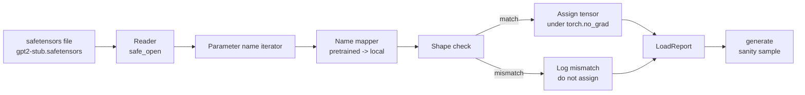

# Загрузка предобученных весов

> Обучение модели на 124 миллиона параметров с нуля — это бюджетное решение; загрузка опубликованной контрольной точки — рутинный вторник. В этом уроке предобученные веса в стиле GPT-2 загружаются из файла safetensors в ту самую архитектуру из урока 35, сопоставление имён параметров разбирается шаг за шагом, а в конце генерируется контрольное продолжение — проверка на вменяемость, — доказывающее, что загрузка сработала. Никакой сети, никаких сторонних загрузчиков, никакой непрозрачной магии.

**Тип:** Build**Языки:** Python**Предварительные требования:** Фаза 19 уроки 30 to 36**Время:** ~90 минут
## Цели обучения

- Прочитайте файл safetensors с помощью библиотеки Python `safetensors` и изучите имена и формы тензоров.
- Сопоставьте каждое имя предобученного параметра с параметром внутри модели GPT из урока 35.
- Обработайте два соглашения об именовании, различающихся между опубликованными весами GPT-2 и моделью в этом треке: `wte/wpe/h.N.attn.c_attn/c_proj` и `mlp.c_fc/c_proj` против локальных имён `tok_embed/pos_embed/blocks.N.attn.qkv/out_proj` и `mlp.fc1/fc2`.
- Обнаруживайте несовпадение формы и отказывайте с понятной ошибкой до того, как произойдёт какое-либо присвоение весов.
- Сгенерируйте короткое продолжение с загруженными весами и убедитесь, что токены берутся из загруженного распределения, а не из случайно инициализированного.

## Проблема

Опубликованные веса не упакованы под вашу архитектуру. Они несут имена, которые использовала исходная реализация. В файле с предобученными весами есть `transformer.h.0.attn.c_attn.weight` формы `(2304, 768)`; ваша модель ожидает `blocks.0.attn.qkv.weight` формы `(2304, 768)` (это та же матрица, но в другом соглашении о раскладке) — либо ваша модель использует `nn.Linear`, который хранит матрицу транспонированной. Один и тот же параметр появляется под тремя тонко различающимися личинами (имя, форма, байтовая раскладка), и загрузчику приходится примирить все три.

Загрузчик, который копирует вслепую, кладёт нужный тензор не туда, и в результате модель генерирует бессмыслицу. Загрузчик, который отказывается копировать при несовпадении формы, но ничего не логирует, оставляет вас гадать, какой тензор не попал на место. Загрузчик в этом уроке явный: каждое присвоение логируется, каждая форма проверяется, а `LoadReport` суммирует попадания, пропуски и несовпадения формы, чтобы вы могли прочитать, что произошло.

## Концепция



Сопоставитель имён (name mapper) — это просто функция из строки в строку. Проверка формы — это один if. Присвоение происходит внутри `torch.no_grad()`, чтобы autograd не отслеживал загрузку. Отчёт хранит результат по каждому имени.

### Соглашение об именовании GPT-2

Опубликованные веса GPT-2 живут под именами вида:

| Имя в предобученных весах | Форма | Значение |
|-----------------|-------|---------|
| `wte.weight` | (50257, 768) | Эмбеддинг токенов |
| `wpe.weight` | (1024, 768) | Эмбеддинг позиций |
| `h.N.ln_1.weight` | (768,) | Масштаб LayerNorm 1 в блоке N |
| `h.N.ln_1.bias` | (768,) | Сдвиг LayerNorm 1 в блоке N |
| `h.N.attn.c_attn.weight` | (768, 2304) | Вес объединённого линейного слоя QKV |
| `h.N.attn.c_attn.bias` | (2304,) | Смещение объединённого линейного слоя QKV |
| `h.N.attn.c_proj.weight` | (768, 768) | Проекция выхода внимания |
| `h.N.attn.c_proj.bias` | (768,) | Смещение проекции выхода внимания |
| `h.N.ln_2.weight` | (768,) | Масштаб LayerNorm 2 |
| `h.N.ln_2.bias` | (768,) | Сдвиг LayerNorm 2 |
| `h.N.mlp.c_fc.weight` | (768, 3072) | Вес fc1 в MLP |
| `h.N.mlp.c_fc.bias` | (3072,) | Смещение fc1 в MLP |
| `h.N.mlp.c_proj.weight` | (3072, 768) | Вес fc2 в MLP |
| `h.N.mlp.c_proj.bias` | (768,) | Смещение fc2 в MLP |
| `ln_f.weight` | (768,) | Масштаб финального LayerNorm |
| `ln_f.bias` | (768,) | Сдвиг финального LayerNorm |

Стоит заранее учесть два сюрприза. Линейные слои `c_attn`, `c_proj`, `c_fc` хранятся с матрицей, транспонированной относительно того, что ожидает `nn.Linear.weight`. Загрузчик транспонирует их при присвоении. Голова языковой модели (LM head) в файле вообще отсутствует; модель полагается на связывание весов (weight tying) с `wte`, поэтому голова устанавливается через алиасинг, как только `wte` загружен.

### Локальное соглашение об именовании

Модель в этом треке использует описательные имена:

| Локальное имя | Значение |
|------------|---------|
| `tok_embed.weight` | Эмбеддинг токенов |
| `pos_embed.weight` | Эмбеддинг позиций |
| `blocks.N.ln1.scale` | Масштаб LayerNorm 1 в блоке N |
| `blocks.N.ln1.shift` | Сдвиг LayerNorm 1 |
| `blocks.N.attn.qkv.weight` | Объединённый QKV |
| `blocks.N.attn.qkv.bias` | Смещение объединённого QKV |
| `blocks.N.attn.out_proj.weight` | Проекция выхода внимания |
| `blocks.N.attn.out_proj.bias` | Смещение проекции выхода |
| `blocks.N.ln2.scale` | Масштаб LayerNorm 2 |
| `blocks.N.ln2.shift` | Сдвиг LayerNorm 2 |
| `blocks.N.mlp.fc1.weight` | fc1 в MLP |
| `blocks.N.mlp.fc1.bias` | Смещение fc1 в MLP |
| `blocks.N.mlp.fc2.weight` | fc2 в MLP |
| `blocks.N.mlp.fc2.bias` | Смещение fc2 в MLP |
| `final_ln.scale` | Масштаб финального LayerNorm |
| `final_ln.shift` | Сдвиг финального LayerNorm |

Сопоставление — это фиксированная функция. Урок поставляет её в виде словаря (dict), по которому итерируется загрузчик.

### Заглушечная фикстура (stub fixture)

Настоящие веса GPT-2 весят 0.5 ГБ. Демонстрация их не скачивает — она при первом запуске генерирует небольшую фикстуру safetensors с точным соглашением об именовании GPT-2 и формами, подходящими для 12-блочной модели с d_model 192 вместо 768. Структура фикстуры достаточна, чтобы задействовать каждый путь кода в загрузчике. Замените фикстуру на настоящий файл — и загрузчик заработает без изменений.

```figure
cc-weight-remap
```

## Реализация

`code/main.py` реализует:

- Небольшую копию `GPTModel` из урока 35, чтобы этот урок был самодостаточным.
- `make_pretrained_to_local(num_layers)`, который разворачивает записи по слоям.
- `load_safetensors(model, path)`, который перебирает имена, сопоставляет их, проверяет форму, транспонирует веса в стиле conv1d и присваивает их внутри `torch.no_grad()`. Возвращает `LoadReport`.
- `make_stub_safetensors(path, cfg)`, который генерирует файл-фикстуру с точным соглашением об именовании предобученных весов.
- Демонстрацию, которая при первом запуске создаёт `outputs/gpt2-stub.safetensors`, строит свежую модель, фиксирует одно сгенерированное продолжение от случайной инициализации, загружает заглушку, фиксирует ещё одно продолжение, печатает оба и проверяет, что они различаются (загрузка действительно изменила модель).

Запустите:

```bash
python3 code/main.py
```

Вывод: путь к фикстуре, журнал загрузки по каждому имени, сводка `LoadReport`, продолжение до загрузки, продолжение после загрузки и несовпадение формы на единственном намеренно испорченном тензоре, внедрённом в фикстуру, чтобы задействовать путь отказа.

## Стек

- `safetensors` для формата на диске и потокового считывателя.
- `torch` для модели и математики присвоения.
- Никакого `transformers`, никакого `huggingface_hub`, никаких сетевых вызовов.

## Производственные паттерны в дикой природе

Три паттерна помогают загрузчику выжить при столкновении с весами, которые вы не создавали.

**Всегда валидируйте файл до какого-либо присвоения.** Откройте файл, перечислите все имена тензоров с их dtype и формой, прогоните полное сопоставление с проверками формы и начинайте присвоение только при успехе. Наполовину загруженные модели — это машины тихих отказов.

**Логируйте каждое присвоение вместе с исходным именем и именем назначения.** Когда что-то выглядит не так, журнал подсказывает, какой тензор куда попал; альтернатива — чтение хекс-дампов. Датакласс `LoadReport` в этом уроке отслеживает списки `loaded`, `missing`, `unexpected` и `shape_mismatch` и в конце печатает сводку.

**Голова языковой модели — это алиас связывания весов (weight tying), а не отдельная копия.** Присвоение `model.lm_head.weight = model.tok_embed.weight` после загрузки `tok_embed` — канонический паттерн. Копирование матрицы эмбеддингов в свежий параметр `lm_head.weight` разрывает связывание и незаметно удваивает число параметров.

## Применение

- Загрузчик работает с любым файлом safetensors, использующим соглашение об именовании предобученных весов. Настоящие файлы GPT-2 (small / medium / large / xl) работают без изменений кода — различается только конфигурация модели.
- Тот же паттерн распространяется на веса LLaMA, Mistral, Qwen, как только вы обновите карту имён (name map). Проверки формы и отчёт остаются идентичными.
- Контрольная генерация после загрузки — это быстрый заслон: если образцы после загрузки выглядят как образцы до загрузки, значит, загрузка не изменила модель, а это значит, что сопоставление молча пропустило все тензоры.

## Упражнения

1. Добавьте в загрузчик аргумент `dtype`, который приводит каждый тензор к целевому dtype (`bfloat16`, `float16`, `float32`) во время присвоения. Убедитесь, что модель `float32` можно понизить до `bfloat16` и она всё ещё будет генерировать.
2. Добавьте аргумент `expected_layers`, который отказывается загружать контрольную точку, если индексы `h.N` не совпадают с `num_layers` модели.
3. Подключите загрузчик к функции генерации из урока 35 и получите два образца бок о бок: один от случайной инициализации, другой от загруженной фикстуры.
4. Добавьте путь экспорта: запишите текущее состояние модели в свежий файл safetensors, используя соглашение об именовании предобученных весов. Прогоните загрузчик по кругу (round trip) и убедитесь, что в отчёте ноль несовпадений формы.
5. Расширьте `NAME_MAP`, чтобы он обрабатывал соглашение об именовании LLaMA (без смещений, RMSNorm, объединённая раскладка qkv), и заново прогоните загрузчик на сгенерированной вами заглушечной фикстуре LLaMA.

## Ключевые термины

| Термин | Что говорят люди | Что это означает на самом деле |
|------|-----------------|------------------------|
| Name map (карта имён) | «Переотображение ключей» | Функция, отображающая имена предобученных тензоров на локальные имена параметров; обычно буквальный словарь (dict) с одной записью на индекс слоя, разворачиваемой в цикле |
| Shape mismatch (несовпадение формы) | «Неправильная форма» | Предобученный тензор существует под сопоставленным именем, но его размерности не совпадают с локальным параметром; загрузчик отказывается присваивать и логирует эту пару |
| Transpose-on-load (транспонирование при загрузке) | «Раскладка conv1d» | Опубликованный GPT-2 хранит проекции внимания и MLP в транспонированном виде относительно того, что ожидает nn.Linear; загрузчик транспонирует их при присвоении |
| Weight tying alias (алиас связывания весов) | «Общая голова LM» | Присвоение model.lm_head.weight = model.tok_embed.weight, при котором голова и эмбеддинг разделяют хранилище; из-за этого голова отсутствует в файле |
| Load report (отчёт о загрузке) | «Сводка покрытия» | Небольшой датакласс, который отслеживает списки loaded, missing, unexpected и shape_mismatch; по печати этого отчёта видно, была ли загрузка успешной |

## Дополнительное чтение

- Фаза 19, урок 35 — архитектура, которая принимает веса.
- Фаза 19, урок 36 — цикл обучения, который производит контрольную точку той же формы.
- Фаза 10, урок 11 (квантование) — что делать с загруженными весами, когда памяти не хватает.
- Фаза 10, урок 13 (построение полного конвейера LLM) — полный жизненный цикл вокруг загрузки и инференса.
