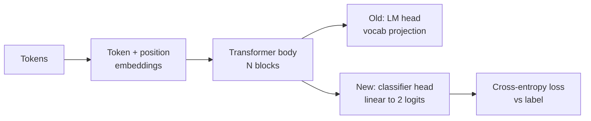
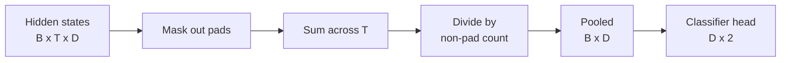
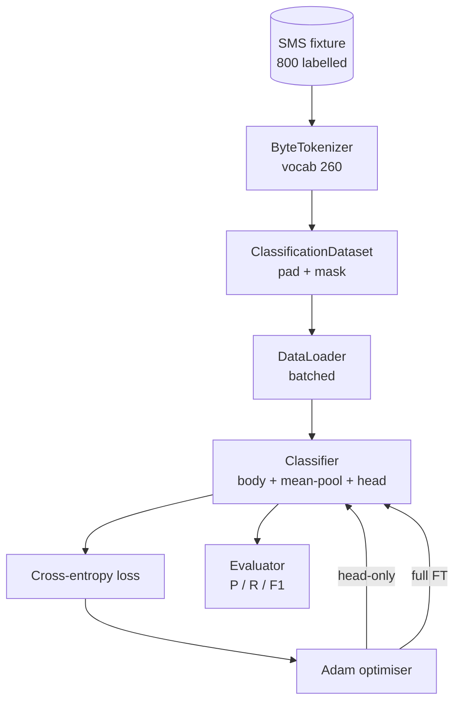

# Урок 38 капстоуна: Дообучение классификатора заменой головы

> Первый капстоун трека B. Предварительно обученная языковая модель — это стек блоков внимания (self-attention), заканчивающийся головой предсказания токена. Когда нужно отличить spam от ham, голова оказывается не той, а тело модели по большей части подходит. В этом уроке голова снимается, к агрегированному представлению (pooling) приклеивается линейный слой на два класса, и классификатор обучается двумя разными способами: только последний слой и полное дообучение. Оценка — точность, полнота и F1 на отложенной выборке. Вы узнаете, что даёт каждая стратегия и чего она стоит.

**Тип:** Build
**Языки:** Python (torch, numpy)
**Предварительные требования:** Фаза 19 уроки 30-37 (NLP LLM track: tokenizer, embedding table, attention block, transformer body, pre-training loop, checkpointing, generation, perplexity)
**Время:** ~90 минут

## Цели обучения

- Замените голову языковой модели на голову классификатора (head) без повторной инициализации тела.
- Реализуйте два режима обучения: с замороженным телом (только голова) и полное дообучение, использующие один общий цикл обучения.
- Постройте конвейер данных, учитывающий токенизатор, который дополняет последовательности (padding), маскирует дополнение и выполняет пулинг выхода внимания.
- Вычислите точность, полноту, F1 и матрицу ошибок (confusion matrix) по исходным логитам.
- Проанализируйте компромисс между числом параметров, временем обучения и запасом по качеству (head-room).

## Проблема

Вы предварительно обучили небольшой трансформер на общем корпусе. Выходная голова проецирует последнее скрытое состояние на словарь из 1000 токенов. Теперь у вас есть 800 SMS-сообщений с метками spam или ham, и вы хотите получить бинарный классификатор. Есть три варианта.

Неверный вариант — обучить новый классификатор с нуля на 800 примерах. Тело предварительно обученной модели уже кодирует полезную структуру: идентичность слов, позицию, простую совместную встречаемость. Выбросить его — значит впустую потратить вычисления, которые ушли на его построение.

Два правильных варианта — замена головы с замороженным телом и замена головы с обучаемым телом. Обучение только головы происходит быстро, почти не требует памяти и редко приводит к переобучению на таком малом объёме данных. Полное дообучение работает медленнее, может переобучаться на малых данных, но достигает более высокой точности, когда целевой домен отклоняется от корпуса предварительного обучения.

В этом уроке реализуются оба варианта, чтобы вы могли сравнить их на одной и той же фикстуре.

## Концепция



Модель — это функция `f_theta(tokens) -> hidden_states`. Голова — это функция `g_phi(hidden) -> logits`. Замена головы означает, что `theta` сохраняется, а `g_phi` заменяется. Параметры тела — это дорогая часть. Голова — это один линейный слой.

Важны два набора обучаемых параметров:

- `theta` (тело): десятки тысяч весов на каждый блок внимания.
- `phi` (голова): `hidden_dim * num_classes` весов плюс смещение (bias).

При обучении только головы градиенты вычисляются относительно `phi` и обнуляются относительно `theta`. PyTorch позволяет сделать это, установив `requires_grad=False` для параметров тела. Тогда оптимизатор видит только голову, а тело остаётся замороженным.

При полном дообучении градиенты распространяются назад через весь стек. Веса тела смещаются, подстраиваясь под задачу классификации. Риск — катастрофическое забывание (catastrophic forgetting) на малых данных: результаты предварительного обучения тела размываются шумом переобучения.

## Вопрос пулинга

Классификатору нужен один вектор на последовательность, а не один вектор на токен. Есть три распространённых варианта:

- **Усреднение (mean pool)**: усреднение скрытых состояний по последовательности с весами по маске внимания.
- **CLS-пулинг (CLS pool)**: добавление в начало специального токена и использование только его выхода. Именно так делает BERT.
- **Пулинг по последнему токену (last-token pool)**: использование последнего токена, не являющегося заполнением. Именно так делают классификаторы на основе моделей класса GPT.

В этом уроке используется усреднение с явным взвешиванием по маске внимания. Это самый простой вариант, он даёт стабильный сигнал независимо от длины последовательности и не требует предварительного обучения CLS-токена.



## Данные

Восемьсот SMS-сообщений, сбалансированных по 400 spam и 400 ham, генерируются детерминированно в `code/main.py`. Генератор использует фиксированное начальное значение (seed), выбирает шаблоны, подставляет заполнители слотов и выдаёт сообщения длиной от 5 до 25 токенов. В реальных наборах данных есть шум, которого нет в этой фикстуре. Смысл фикстуры — в воспроизводимости.

Данные делятся в соотношении 80/20: 640 на обучение, 160 на тест. Разбиение стратифицировано, поэтому тестовый набор сохраняет баланс 50/50. Отложенный набор с известным балансом позволяет читать точность и полноту как честные числа.

## Метрики

Бинарная классификация, где класс 1 — положительный класс (spam). Счётчики:

- `TP`: предсказан spam, был spam.
- `FP`: предсказан spam, был ham.
- `FN`: предсказан ham, был spam.
- `TN`: предсказан ham, был ham.

Три основные метрики:

- `precision = TP / (TP + FP)`. Из сообщений, помеченных как spam, какая доля действительно spam?
- `recall = TP / (TP + FN)`. Из реального spam, какую долю модель пометила?
- `F1 = 2 * P * R / (P + R)`. Среднее гармоническое этих двух метрик.

Матрица ошибок выводит четыре счётчика в виде сетки 2x2. Демонстрация выводит её в stdout для обоих режимов обучения.

```figure
cap-classifier-head-swap
```

## Архитектура



Тело — намеренно крошечный трансформер: словарь 260, скрытая размерность 64, 4 головы внимания, 2 блока, максимальная длина последовательности 32. Он достаточно мал, чтобы довести оба режима до сходимости менее чем за девяносто секунд на CPU. В этом уроке тело не проходит предварительное обучение; вместо этого вспомогательная функция `pretrain_quick` выполняет пять эпох обучения языковой модели на тексте той же фикстуры, чтобы дать телу нетривиальную стартовую точку. Это делает урок самодостаточным.

## Что вы построите

Реализация — это один файл `main.py` плюс один тестовый модуль (`code/tests/test_main.py`).

1. `ByteTokenizer`: отображает байты в идентификаторы, резервирует идентификатор для pad-токена.
2. `Block`: блок трансформера с многоголовым вниманием (multi-head attention) и слоем прямого распространения (feed-forward). Pre-norm.
3. `LMBody`: эмбеддинги токенов и позиций плюс стек блоков. Возвращает скрытые состояния.
4. `MeanPool`: усреднение по оси последовательности с весами по маске.
5. `Classifier`: тело, пулинг, линейная голова. Тело — один и тот же экземпляр в обоих режимах.
6. `freeze_body` и `unfreeze_body`: переключают `requires_grad` для параметров тела.
7. `train_classifier`: один общий цикл. Принимает модель и оптимизатор, настроенный на ту группу параметров, которая обучаема.
8. `evaluate`: прогоняет тестовый набор и возвращает `Metrics(precision, recall, f1, confusion)`.
9. `run_demo`: кратко проводит предварительное обучение тела, затем обучает и оценивает режим только-голова, затем полный режим, выводит оба отчёта и завершается с кодом ноль.

## Почему это сравнение важно

Режим только-голова обычно обучается быстрее и мягче недообучается. На этой фикстуре после двадцати эпох обучения только головы точность обычно составляет около 0.9, а полнота — около 0.85. Полное дообучение занимает примерно втрое больше времени и в зависимости от случайного зерна (seed) отклоняется на пару пунктов в ту или иную сторону.

Урок не выбирает победителя. Он учит вас читать цифры и цену за них. На 800 примерах и крошечном теле правильный выбор — только голова. На 80 000 примеров и более крупном теле полное дообучение начинает окупаться. Контракт, который вы уносите из этого урока, — это API: одна и та же функция `train_classifier` обслуживает оба режима, а переключение — это один вызов.

## Дополнительные задачи

- Добавьте третий режим, размораживающий только последний блок. Иногда его называют частичным дообучением (partial fine-tuning). Он обходится дешевле полного дообучения (full FT) и обучается лучше, чем режим только-голова.
- Добавьте планировщик скорости обучения. Косинусное расписание для головы плюс меньшая постоянная скорость для тела — распространённая конфигурация в продакшене.
- Замените усреднение обучаемым пулингом с механизмом внимания (learned attention pool): небольшим слоем внимания с одним обучаемым запросом (query). На длинных последовательностях это часто превосходит усреднение.

Реализация предоставляет хуки (hooks). Тесты фиксируют контракт. Дальнейшее улучшение показателей — уже ваша задача.
