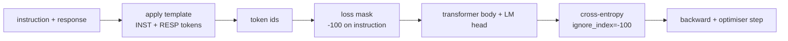
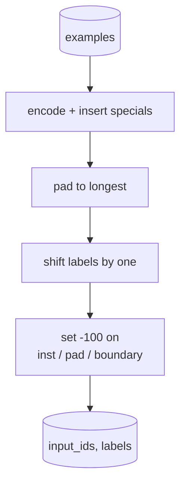
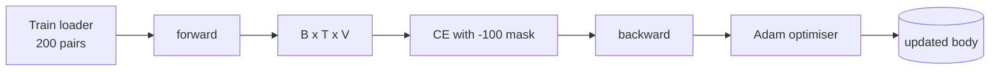

# Урок 39 капстоуна: обучение на инструкциях методом дообучения с учителем (SFT)

> Предобученная базовая модель может продолжить последовательность, но не умеет следовать инструкции. Дообучение с учителем — минимальное изменение, которое это исправляет: модели показывают парные примеры инструкции и желаемого ответа и обучают тело модели предсказывать токены ответа. Хитрость в том, что в функцию потерь должен попадать только ответ, а не инструкция. В этом уроке строится цикл SFT в стиле Alpaca с пользовательской collate-функцией, которая маскирует токены инструкции с помощью `ignore_index=-100`, обучение проводится на 200 парах инструкция-ответ, а оценка выполняется на отложенной выборке по точному совпадению (exact-match).

**Тип:** Build
**Языки:** Python (torch, numpy)
**Предварительные требования:** Фаза 19 уроки 30-37 (NLP LLM track: tokenizer, embedding table, attention block, transformer body, pre-training loop, checkpointing, generation, perplexity)
**Время:** ~90 минут

## Цели обучения

- Отформатируйте парные данные инструкция-ответ в единую каузальную последовательность с явными граничными токенами.
- Постройте collate-функцию, которая маскирует токены инструкции, чтобы cross-entropy учитывала только токены ответа.
- Обучите крошечное тело трансформера в рамках цели SFT и понаблюдайте, как меняется метрика оценивания.
- Реализуйте жадную генерацию и генерацию с температурным сэмплированием, учитывающую границу начала ответа.
- Вычислите exact-match на отложенной выборке для сгенерированных завершений.

## Проблема

Базовая модель, обученная предсказывать следующий токен, понятия не имеет, что такое инструкция. Покажите ей строку `"What is the capital of France?"`, и она продолжит вопрос или придумает новое предложение. Модель владеет языком, но не владеет контрактом формата.

Контракт SFT — это строковый шаблон. Каждый обучающий пример становится единой последовательностью из трёх областей:

```text
<INST> What is the capital of France? <RESP> The capital of France is Paris.
```

Граничные токены — это специальные токены, зарезервированные на этапе обучения. Модель учится, что всё после `<RESP>` — это ответ, и именно ответ оценивается. Цель предсказания следующего токена базовой модели по-прежнему применяется; модель просто обучается на корпусе, где каждый пример имеет такую форму.

Но есть нюанс. Если подать всю последовательность в обычную функцию потерь cross-entropy, вы обучите модель предсказывать ещё и токены инструкции. Инструкция дана заранее. На этих позициях вам нужен нулевой градиент. Решение — маска.

## Концепция



`ignore_index` — это возможность `torch.nn.functional.cross_entropy`. Любая целевая позиция, равная `ignore_index`, даёт нулевые потери и нулевой градиент. В PyTorch принято значение `-100`. Collate-функция строит два тензора на каждый пример: `input_ids` (полная последовательность) и `labels` (копия `input_ids`, в которой позиции инструкции заменены на `-100`).

Во время прямого прохода модель видит всю последовательность целиком; внимание может обращаться к инструкции. Функция потерь учитывает только токены ответа. Это именно то, что нужно: обусловливание на инструкции, предсказание ответа.

## Данные

Двести пар инструкция-ответ генерируются детерминированно в `main.py`. Они охватывают шесть типов задач:

- фактологические одноходовые (столица X)
- арифметика
- извлечение списка
- суммаризация в одно предложение
- код (print, sort)
- определение

У каждой задачи есть шаблонная инструкция и детерминированный ответ. Это намеренно просто. Exact-match — хрупкая метрика, и в уроке используется фикстура, где правильный ответ — одна конкретная строка. Реальным наборам данных для SFT нужны нечёткие метрики; принцип при этом идентичен.

Разбиение — 160 обучающих примеров, 40 тестовых. Тестовый набор охватывает все шесть типов задач, поэтому можно вывести exact-match по каждой категории.

## Токенизация и паддинг

Токенизатор — байтового уровня с тремя зарезервированными специальными токенами:

- `INST_ID = 256`: отмечает начало области инструкции.
- `RESP_ID = 257`: отмечает границу между инструкцией и ответом.
- `PAD_ID = 258`: паддинг для пакетов переменной длины.

Последовательность имеет вид `[INST] inst_bytes [RESP] resp_bytes [PAD]*`. Collate-функция:

1. Токенизирует каждый пример.
2. Дополняет паддингом каждый пример в пакете до длины самой длинной последовательности в пакете.
3. Строит `labels` = `input_ids`, сдвинутый на одну позицию (целевое значение для каузальной языковой модели), при этом:
   - область инструкции заменена на `-100`;
   - область паддинга заменена на `-100`;
   - сама позиция граничного токена `RESP_ID` заменена на `-100` (модель не обучается предсказывать граничный токен — она предсказывает то, что следует за ним).



Сдвиг — это стандартный приём каузальных моделей: позиция `i` в `input_ids` предсказывает позицию `i+1`, поэтому `labels[i] = input_ids[i+1]` (при этом последняя позиция отбрасывается из входа, а первая — из цели). Маска применяется после сдвига, чтобы попасть на нужные позиции.

## Обучение



Цикл — это стандартный цикл SFT на PyTorch. Adam, скорость обучения примерно от 3e-4 до 1e-3, от десяти до двадцати эпох на этой фикстуре, без планировщика. Модель достаточно мала (скрытый размер 96, 2 блока, максимальная длина 64), чтобы обучиться до сходимости на CPU менее чем за две минуты.

Каждую пятую эпоху цикл запускает небольшой проход оценивания на отложенном наборе и выводит exact-match. Наблюдение за тем, как exact-match растёт с 0.0 на первой эпохе примерно до 0.85 на пятнадцатой, и есть главный результат урока: видно, как модель одновременно осваивает и формат, и ответы.

## Генерация

На этапе оценивания модель получает префикс инструкции `[INST] inst_bytes [RESP]` и генерирует токены, пока не произойдёт одно из двух:

- последовательность не достигнет `max_len`, либо
- модель не выдаст специальную эвристику остановки: два подряд идущих байта конца предложения (`.`, `!`, `?`).

В уроке реализованы жадное декодирование и опциональный температурный сэмплер. Exact-match использует жадное декодирование, потому что температура сделала бы метрику стохастической. Реальные системы часто сэмплируют, а затем оценивают нечётко; такой конвейер рассматривается в уроке 41.

## Оценивание методом exact-match

Exact-match — самая строгая текстовая метрика. Строка предсказанного ответа нормализуется (приводится к нижнему регистру, обрезаются пробелы по краям, схлопываются двойные пробелы) и сравнивается с эталонным ответом, нормализованным таким же образом. Метрика для каждого примера равна либо 1, либо 0. Итоговое значение — среднее.

Реальные SFT-конвейеры дополняют exact-match токенным F1 (урок 41) и моделью-судьёй. Exact-match остаётся полезной метрикой, потому что она однозначна: если она равна 0.7, значит ровно 70 процентов тестовых инструкций дали эталонный ответ посимвольно точно.

```figure
cc-sft-loss-mask
```

## Что вы построите

Реализация — это один файл `main.py` плюс тесты.

1. `InstructionTokenizer`: байтовый кодировщик с зарезервированными специальными токенами. Кодирует либо префикс инструкции, либо полную пару.
2. `make_dataset`: генерирует 200 пар по шести типам задач с фиксированным seed.
3. `SFTDataset`: возвращает `(input_ids, labels)` для каждого примера, уже подготовленного с маской.
4. `sft_collate`: динамический паддинг, строит тензор пакета, устанавливает `-100` на позициях инструкции и паддинга.
5. `TinyGPT`: тело трансформера плюс связанная или несвязанная LM-голова.
6. `train_sft`: цикл SFT с хуками оценивания на каждой эпохе.
7. `generate`: каузальное декодирование от префикса, жадное или сэмплированное, с эвристикой остановки.
8. `exact_match`: нормализованное сравнение строк, возвращает float в диапазоне `[0, 1]`.
9. `run_demo`: строит данные, обучает в течение двадцати эпох, проводит оценивание, выводит разбивку по категориям, завершается с кодом 0 при успехе.

## Почему маска важна

Без маски функция потерь трактует токены инструкции как целевые. Модель учится предсказывать инструкцию. Это другая цель обучения, и она делает модель хуже сразу в двух аспектах. Во-первых, ёмкость модели тратится впустую на восстановление входных данных, которые пользователь всегда предоставляет сам. Во-вторых, потери на ответе оказываются меньше в сумме градиента, потому что в большинстве пакетов токенов инструкции больше, чем токенов ответа; эффективная скорость обучения оптимизатора на той части, которая вас интересует, оказывается ниже, чем задумано. Маска — это не полировка, это и есть цель обучения.

## Дополнительные задачи

- Добавьте разогрев (warmup) скорости обучения с последующим косинусным затуханием. SFT чувствительнее к скорости обучения (LR), чем предварительное обучение.
- Добавьте логирование потерь на уровне токенов и постройте график кривой потерь в процессе обучения. Заметьте, что на ранних эпохах преобладают токены шаблона (`<RESP>`, общие префиксы), а на поздних — токены самого ответа.
- Расширьте оценивание метриками BLEU-1 или chrF. Exact-match занижает оценку моделей, которые выдают перефразированный, но по смыслу верный ответ.
- Добавьте шаблон чата с многоходовым форматированием и обучите модель на фикстуре, включающей уточняющие вопросы.

Реализация даёт вам контракт формата, маску и цикл обучения. Изменение цели — переход от базовой модели к модели, следующей инструкциям, — это всего одна collate-функция.
