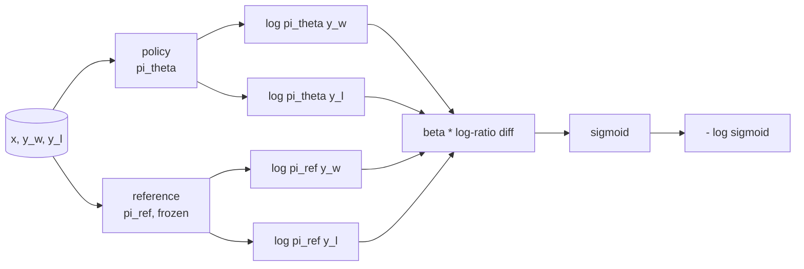
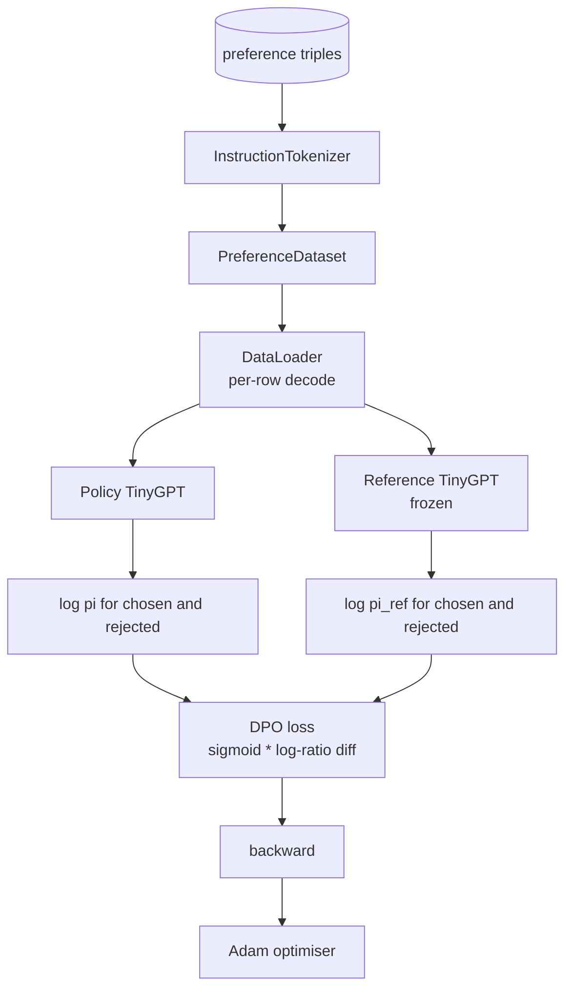

# Урок 40 капстоуна: Прямая оптимизация предпочтений (DPO) с нуля

> Модели вознаграждения и PPO — классический стек RLHF. DPO сворачивает этот стек в единую функцию потерь с учителем, которая напрямую подгоняет политику под пары предпочтений. Этот урок выводит функцию потерь DPO из тождества разности вознаграждений, реализует рабочую пару «референсная модель + модель политики», вычисляет логарифмические вероятности по токенам и обучает маленький трансформер на наборе предпочтений с предпочтёнными и отвергнутыми завершениями. Тесты фиксируют математику функции потерь и направление градиента, чтобы вы были уверены, что реализация соответствует статье.

**Тип:** Build
**Языки:** Python (torch, numpy)
**Предварительные требования:** Фаза 19 уроки 30-37 (NLP LLM track: tokenizer, embedding table, attention block, transformer body, pre-training loop, checkpointing, generation, perplexity)
**Время:** ~90 минут

## Цели обучения

- Вывести функцию потерь DPO как sigmoid от масштабированной разности логарифмических отношений и связать её с неявным вознаграждением.
- Построить пару «референсная модель + модель политики» с замороженной референсной моделью и обучаемой политикой.
- Вычислить логарифмические вероятности на уровне последовательности для обеих моделей, маскируя токены промпта.
- Обучить политику на тройках `(prompt, chosen, rejected)` и понаблюдать, как логарифмическая вероятность предпочтённого завершения растёт относительно отвергнутого.
- Зафиксировать поведение тестами на математику функции потерь, знак градиента и инвариантность референсной модели.

## Проблема

У вас есть SFT-модель. Она следует инструкциям, но её выходы неровные: одни завершения чёткие, другие — многословные или ошибочные. У вас также есть небольшой набор данных с парами предпочтений: для одного и того же промпта человек пометил одно завершение как предпочтённое, а другое — как отвергнутое.

Классический ответ RLHF — двухэтапный конвейер. Обучить модель вознаграждения на предпочтениях. Оптимизировать политику относительно вознаграждения с помощью PPO. Это работает, но дорого: две модели в памяти во время PPO, контроль KL, чтобы удерживать политику рядом с референсной моделью, reward hacking, когда модель вознаграждения хрупкая.

DPO заменяет оба этапа одной функцией потерь с учителем. Модель вознаграждения никогда не существует явно. Политика обучается напрямую на парах предпочтений, с явным штрафом KL в сторону SFT-референса. То же оптимальное решение при модели предпочтений Брэдли-Терри, но значительно меньше кода.

## Концепция

Начнём с модели Брэдли-Терри. Для промпта `x` и двух завершений `y_w` (предпочтённое) и `y_l` (отвергнутое) вероятность того, что человек предпочтёт `y_w`, равна

```text
P(y_w > y_l | x) = sigmoid( r(x, y_w) - r(x, y_l) )
```

где `r` — некоторая скрытая функция вознаграждения. RLHF сначала подгоняет `r` по предпочтениям, затем обучает политику `pi` максимизировать `r` с якорем KL:

```text
max_pi   E_{x, y~pi} [ r(x, y) ] - beta * KL(pi || pi_ref)
```

Вывод DPO опирается на наблюдение, что оптимальная политика `pi*` при этой целевой функции имеет замкнутую форму через `r`:

```text
pi*(y | x) = (1/Z(x)) * pi_ref(y | x) * exp( r(x, y) / beta )
```

Выразим `r`:

```text
r(x, y) = beta * ( log pi*(y | x) - log pi_ref(y | x) ) + beta * log Z(x)
```

Член `log Z(x)` одинаков для `y_w` и `y_l` (он зависит от `x`, а не от `y`), поэтому он сокращается при вычислении разности предпочтений:

```text
r(x, y_w) - r(x, y_l) = beta * ( log pi_theta(y_w|x) - log pi_ref(y_w|x)
                                - log pi_theta(y_l|x) + log pi_ref(y_l|x) )
```

Подставим в sigmoid модели Брэдли-Терри и возьмём отрицательное логарифмическое правдоподобие по парам предпочтений:

```text
L_DPO(theta) = - E_{(x, y_w, y_l)} [
  log sigmoid( beta * ( log pi_theta(y_w|x) - log pi_ref(y_w|x)
                       - log pi_theta(y_l|x) + log pi_ref(y_l|x) ) )
]
```

Это и есть функция потерь. Это sigmoid от одного скаляра на каждый пример, вычисленного из четырёх логарифмических вероятностей. Никакой отдельной модели вознаграждения. Никакого PPO. Никакого члена KL в функции потерь — ограничение KL встроено в вывод замкнутой формы.



## Знак градиента

Полезная проверка на здравый смысл перед любым запуском обучения. Возьмём градиент по `log pi_theta(y_w | x)`:

```text
d L_DPO / d log pi_theta(y_w | x) = - beta * (1 - sigmoid(z))
```

где `z` — аргумент sigmoid. Это выражение отрицательно при любом `z`, а значит: увеличение логарифмической вероятности предпочтённого завершения у политики уменьшает функцию потерь. Симметрично, градиент по `log pi_theta(y_l | x)` положителен: увеличение логарифмической вероятности отвергнутого завершения увеличивает функцию потерь. Обучение подталкивает предпочтённое завершение вверх, а отвергнутое — вниз. Референсная модель заморожена — она не сдвигается.

## Данные

В комплекте с уроком идут двенадцать троек предпочтений. Каждая — это `(prompt, chosen, rejected)`. Предпочтённое завершение короткое и точное. Отвергнутое — многословное, не по теме или неверное. Пары охватывают те же семейства задач, что и урок 39 (столица, арифметика, список), так что политика, стартовавшая с базы SFT, имеет разумную отправную точку.

Этот набор данных намеренно небольшой. В продакшене DPO работает на десятках тысяч пар; здесь же суть в том, что математика функции потерь и цикл обучения проходят от начала до конца на крошечном наборе данных, и разрыв логарифмических вероятностей между предпочтённым и отвергнутым завершениями заметно растёт.

## Инвариантность референсной модели

Реализация DPO должна аккуратно обращаться с референсной моделью. Референсная модель — это SFT-модель, замороженная на месте. Должны выполняться три свойства:

- Параметры референсной модели никогда не получают градиенты.
- Логарифмические вероятности референсной модели никогда не меняются между эпохами.
- Политика стартует с тех же весов, что и референсная модель. (Оптимальное `theta` — это референсная модель плюс выученное обновление; инициализация политики как копии референсной модели — корректно определённая точка старта.)

Реализация обеспечивает это следующим образом:

- Обёртывание референсной модели в `torch.no_grad()` во время прямых проходов.
- Установка `requires_grad=False` для каждого параметра референсной модели.
- Построение политики через `policy.load_state_dict(reference.state_dict())` после того, как референсная модель построена.

```figure
cap-dpo-preference
```

## Архитектура



Модель — тот же TinyGPT, что использовался в уроке 39 (только декодер, каузальный, байтовый токенизатор). Референсная модель и политика имеют общую архитектуру; веса политики отклоняются от референсной модели по мере обучения, а референсная модель остаётся неизменной.

## Что вы построите

Реализация — это один файл `main.py` плюс тесты.

1. `InstructionTokenizer`: байтовый токенизатор со специальными токенами `INST` и `RESP`. Та же структура, что и в уроке 39.
2. `TinyGPT`: трансформер только с декодером. Та же структура, что и в уроке 39, так что урок самодостаточен, даже если вы пропустили урок 39.
3. `make_preferences`: возвращает двенадцать троек `(prompt, chosen, rejected)`.
4. `sequence_log_prob`: получая модель, префикс промпта и завершение, возвращает сумму логарифмических вероятностей следующего токена по завершению (без вклада позиций промпта).
5. `dpo_loss`: принимает четыре логарифмические вероятности и `beta`, возвращает тензор потерь на каждый пример и дельту неявного вознаграждения для логирования.
6. `train_dpo`: цикл по эпохам, который вычисляет логарифмические вероятности предпочтённого и отвергнутого завершений под политикой и референсной моделью, применяет функцию потерь и делает шаг Adam.
7. `evaluate_margins`: возвращает среднюю разницу (margin) логарифмических вероятностей предпочтённого и отвергнутого завершений под политикой в любой момент.
8. `run_demo`: строит референсную модель и политику из небольшого разогревочного предобучения, копирует веса, обучает на тридцати шагах, печатает функцию потерь и margin на каждом шаге и завершается с кодом ноль при успехе.

## Почему DPO работает

DPO математически эквивалентен RLHF при модели предпочтений Брэдли-Терри, с точностью до параметризации вознаграждения. Неявное вознаграждение `r(x, y) = beta * (log pi(y|x) - log pi_ref(y|x))` идентифицируемо по предпочтениям с точностью до функции от `x`, которая сокращается в разности. Замкнутая форма политики позволяет обойтись без явной модели вознаграждения. Ограничение KL обеспечивается структурно: любое отклонение `pi` от `pi_ref` увеличивает логарифмическое отношение, и sigmoid насыщается, что гасит градиент, когда политика уходит слишком далеко. Референсная модель — ваша страховочная сетка.

## Дополнительные задачи

- Добавьте нормализацию по длине к сумме логарифмических вероятностей: делите на длину завершения. Смещение по длине — известный режим отказа DPO, при котором модель предпочтительно выбирает более короткие завершения, потому что их логарифмические вероятности больше по абсолютной величине.
- Добавьте вариант функции потерь IPO: замените sigmoid + log на `(z - 1)^2`. Сравните сходимость на наборе данных.
- Добавьте параметр сглаживания меток, который интерполирует между жёсткой меткой «предпочтённое-отвергнутое» и равномерным значением 0.5.
- Замените референсную модель более маленькой и дешёвой моделью (в духе дистилляции знаний).

Реализация даёт вам функцию потерь, инвариантность референсной модели и цикл обучения. Урок — это математика. Код делает математику конкретной.
