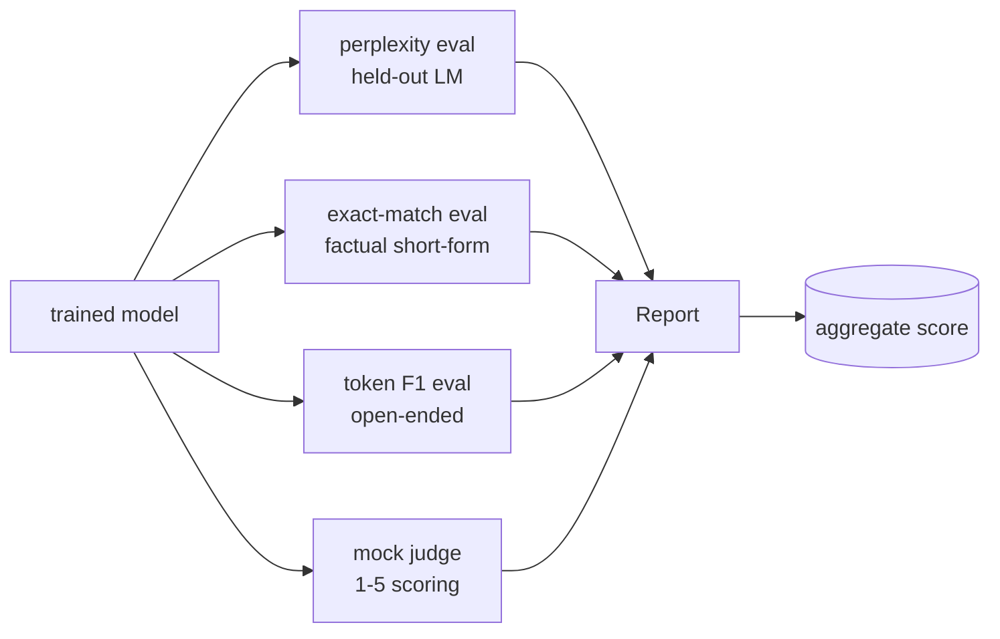
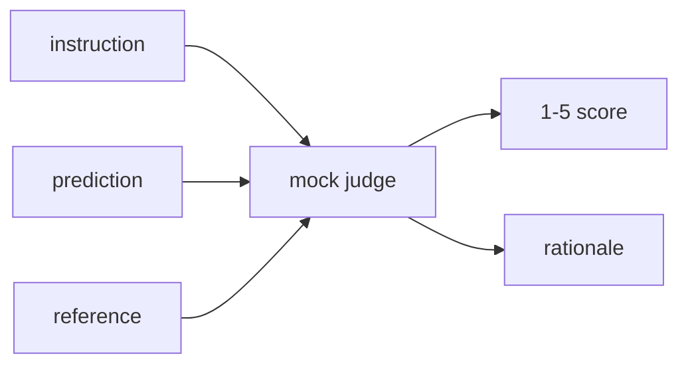
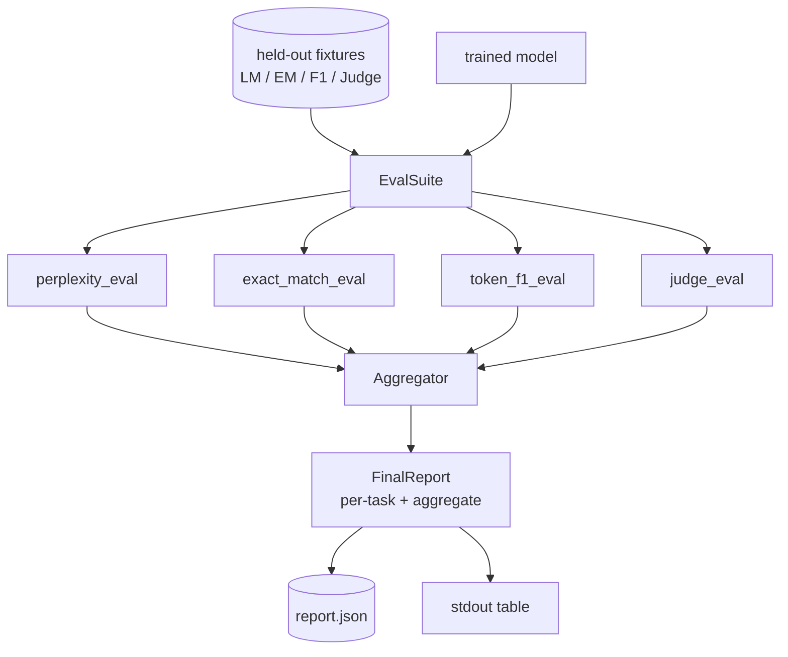

# Урок 41 капстоуна: Полный конвейер оценивания

> Обучение — это часть, за которой можно следить по кривым потерь. Оценивание — это часть, которую приходится проектировать самостоятельно. В этом уроке мы строим единый конвейер оценивания, который берёт любую обученную языковую модель, прогоняет на ней четыре разнородные оценки, агрегирует результаты в отчёт по задачам и включает локального имитационного LLM-судью (LLM-as-judge), чтобы цикл работал без сети. Четыре оценки покрывают измерения, необходимые любой модели перед выпуском: языковое моделирование (перплексия), краткая фактическая правильность (exact-match), сходство в открытой форме (token F1) и качественная оценка (судья).

**Тип:** Build
**Языки:** Python (torch, numpy)
**Предварительные требования:** Фаза 19 уроки 30-37 (NLP LLM track: tokenizer, embedding table, attention block, transformer body, pre-training loop, checkpointing, generation, perplexity)
**Время:** ~90 минут

## Цели обучения

- Вычислите перплексию на отложенных данных (held-out) с учётом маскированных токенов на маленьком трансформере.
- Запустите оценку по точному совпадению (exact-match) на кратких фактических промптах.
- Вычислите F1 на уровне токенов между предсказанной и эталонной строками с нормализацией.
- Постройте локального имитационного LLM-судью (LLM-as-judge), который оценивает выходы модели по шкале от 1 до 5.
- Агрегируйте четыре оценки в единый взвешенный отчёт с разбивкой по задачам.

## Проблема

Единственная метрика никогда не описывает языковую модель полностью. Перплексия показывает, насколько хорошо модель соответствует распределению языка, но ничего не говорит о том, отвечает ли она на вопросы. Точное совпадение (exact-match) показывает, выдаёт ли модель эталонную строку, но наказывает за корректные перефразировки. Token F1 прощает перефразировки, но обманывается лексическим пересечением с неверным содержанием. LLM-судья улавливает качественные измерения, но дорог и стохастичен.

Конвейер, который вам действительно нужен, включает все четыре. Каждая оценка покрывает измерение, которое упускают остальные. Каждая запускается на своём подмножестве отложенных данных, подобранном под конкретную метрику. Итоговый отчёт показывает числа по каждой задаче рядом друг с другом и агрегированное значение, чтобы рецензент мог одним взглядом увидеть, на какие компромиссы идёт модель.

В этом уроке мы строим этот конвейер целиком, от начала до конца, в одном файле.

## Концепция



Каждая оценка — это функция вида `(model, dataset) -> EvalResult`. Результат несёт значение метрики, детали по каждому примеру для проверки и имя для агрегации. Конвейер объединяет их с помощью конфигурации, которая указывает, какие оценки запускать и с каким весом их учитывать.

## Перплексия, посчитанная правильно

Перплексия — это `exp(mean negative log-likelihood per token)`. В реализации есть две ловушки:

- Среднее должно вычисляться по реальным позициям токенов, а не по batch * sequence. Токены дополнения (padding) нужно исключить из знаменателя, иначе перплексия будет выглядеть лучше, чем есть на самом деле.
- Модель предсказывает следующий токен, поэтому логиты в позиции `i` предсказывают токен в позиции `i+1`. Ошибки сдвига на единицу здесь незаметны: функция потерь всё равно обучается, но метрика теряет смысл.

Оценка вычисляет для каждого пакета суммы `-log p(token)` по позициям без дополнения и количество токенов в пакете, а деление выполняется в самом конце. Это численно надёжнее, чем усреднение перплексий по пакетам (что занижает вес коротких последовательностей), и соответствует определению из учебника.

## Точное совпадение (exact-match) с нормализацией

Харнесс нормализует и предсказание, и эталон перед сравнением:

- Приведение к нижнему регистру.
- Удаление пробелов по краям.
- Схлопывание последовательностей внутренних пробелов в один пробел.
- Удаление завершающей пунктуации (`.`, `!`, `?`), если стороны различаются только пунктуацией.

Нормализация делает точное совпадение полезным на практике. Модель, которая отвечает `"Paris"`, права; модель, которая отвечает `"Paris."`, тоже права; модель, которая отвечает `"  paris  "`, тоже права. При этом метрика всё равно требует, чтобы после нормализации ответ был той же строкой.

## Token F1, посчитанный правильно

Token F1 — это среднее гармоническое точности и полноты, вычисленное по мешку токенов (bag-of-tokens). Шаги:

1. Нормализовать предсказание и эталон (те же правила, что и для точного совпадения).
2. Разбить каждую строку на список токенов (токенизация по пробелам).
3. Посчитать пересечение мультимножеств.
4. Точность = `intersection_count / len(pred_tokens)`. Полнота = `intersection_count / len(ref_tokens)`. F1 = среднее гармоническое.

Если и предсказание, и эталон пусты, F1 равен 1 (тривиальное совпадение). Если пусто только что-то одно, F1 равен 0. Такая схема соответствует эталонной реализации оценки SQuAD и даёт стабильные числа на перефразировках.

## Локальный имитационный LLM-судья (LLM-as-judge)

Настоящий судья — это передовая модель за API. В этом уроке судья должен работать офлайн. Имитационный судья — это детерминированный оценщик, который принимает инструкцию, предсказание модели и эталон и возвращает оценку из `{1, 2, 3, 4, 5}` вместе с однострочным обоснованием. Правила оценивания заданы явно:

- 5, если нормализованное предсказание равно нормализованному эталону.
- 4, если token F1 между предсказанием и эталоном не меньше 0.8.
- 3, если token F1 находится в диапазоне `[0.5, 0.8)`.
- 2, если token F1 находится в диапазоне `[0.2, 0.5)`.
- 1 в остальных случаях.

Это не настоящий судья, но у него правильный интерфейс. Позже можно подставить настоящую модель, изменив всего одну функцию. Конвейеру это безразлично.



## Агрегация

Агрегированная оценка — это взвешенное среднее нормализованных оценок. Каждая оценка выдаёт своё число в диапазоне `[0, 1]`:

- Перплексия: нормализуется как `1 / (1 + log(perplexity))`. Перплексия, равная 1, соответствует 1, бесконечность соответствует 0.
- Точное совпадение: уже в диапазоне `[0, 1]`.
- Token F1: уже в диапазоне `[0, 1]`.
- Судья: делится на 5.

Веса настраиваются. Набор по умолчанию: 0.2 для перплексии, 0.3 для точного совпадения, 0.3 для token F1, 0.2 для судьи. Выбор весов — это продуктовое решение; урок выносит этот параметр наружу, чтобы вы могли поэкспериментировать.

```figure
cg-eval-quadrant
```

## Архитектура



`EvalSuite` — это тонкий оркестратор. Каждая отдельная оценка — свободная функция, которая принимает `(model, tokenizer, dataset, config)` и возвращает `EvalResult`. `Aggregator` собирает результаты и формирует итоговый отчёт. Демонстрация печатает таблицу и записывает копию в JSON, которую сможет прочитать последующий CI.

## Что вы построите

Реализация — это один файл `main.py` плюс тесты.

1. `TinyGPT`: та же decoder-only архитектура, что использовалась в уроках 38-40, включена сюда, чтобы урок был самодостаточным.
2. `InstructionTokenizer`: побайтовый токенизатор со специальными токенами INST / RESP / PAD.
3. Четыре фикстуры: корпус LM, набор EM, набор F1 и набор для судьи. По двадцать примеров в каждом, детерминированные.
4. `perplexity_eval`: возвращает `EvalResult` со значением перплексии и гистограммой потерь по токенам.
5. `exact_match_eval`: возвращает среднее значение EM и записи по каждому примеру.
6. `token_f1_eval`: возвращает среднее значение token F1 и записи по каждому примеру.
7. `mock_judge` и `judge_eval`: оценка и обоснование по каждому примеру, среднее значение оценки по набору.
8. `Aggregator.normalise`: правило нормализации для каждой оценки.
9. `Aggregator.aggregate`: взвешенное среднее и собранный отчёт.
10. `run_demo`: недолго обучает маленькую модель, запускает все четыре оценки, печатает таблицу отчёта и записывает JSON, завершается с нулевым кодом при успехе.

## Как читать отчёт

У отчёта три уровня. Наверху — агрегированная оценка. Под ней — четыре числа по отдельным оценкам. Ещё ниже — разбивка по примерам для диагностики. Провалившемуся прогону CI обычно достаточно агрегированной оценки, а рецензенту, который ищет регрессию, нужна разбивка по примерам, чтобы увидеть, на каких входных данных модель ошиблась.

Дамп в JSON использует стабильные ключи, чтобы дашборд CI мог строить линии тренда по версиям. Красиво отформатированная таблица предназначена для людей, которые смотрят в терминал после запуска обучения.

## Дополнительные задачи

- Добавьте оценку калибровки: соответствуют ли вероятности softmax модели её точности? Разбейте предсказания на корзины по уверенности и сообщите эмпирическую точность по каждой корзине.
- Добавьте оценку устойчивости: пометьте каждый пример типом возмущения (опечатка, перефразировка, отвлекающий вариант) и сообщите падение метрики по каждому типу возмущения.
- Замените имитационного судью настоящей моделью за HTTP-вызовом. Сигнатура функции не изменится.
- Добавьте обучение весов по задачам: вместо фиксированных весов подбирайте веса под целевой порядок предпочтений между моделями.

Реализация даёт вам четыре оценки, агрегатор и отчёт. В реальных конвейерах оценивания сверху добавляется гораздо больше измерений; но паттерн остаётся тем же: одна функция на каждую оценку, один агрегатор, один отчёт.
