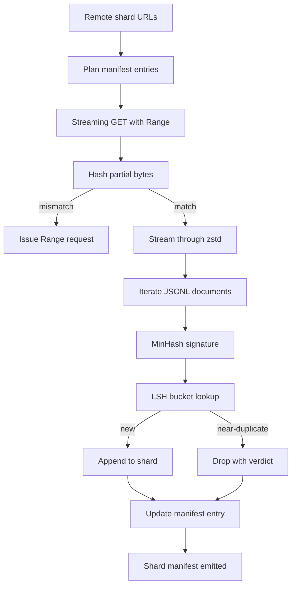

# Загрузчик больших корпусов

> Обучение языковой модели начинается задолго до первого прямого прохода. Корпус должен оказаться на диске: распакованным, дедуплицированным и адресуемым, а история возобновления должна быть продумана ещё до того, как сеть оборвётся на 4 процентах. В этом уроке строится потоковый загрузчик, который скачивает сжатые шарды, распаковывает их на лету с помощью Zstandard, находит почти-дубликаты через MinHash плюс locality-sensitive hashing и записывает манифест шардов, которому может доверять остальная часть конвейера.

**Тип:** Build
**Языки:** Python
**Предварительные требования:** Фаза 19 уроки 30-37
**Время:** ~90 минут

## Цели обучения

- Стримить удалённые шарды через `urllib` и распаковывать их с помощью `zstandard`, не буферизуя весь файл в памяти.
- Возобновлять частичные загрузки, отправляя HTTP-запросы `Range` относительно проверенного байтового смещения.
- Строить MinHash-сигнатуру для каждого документа и группировать её с помощью LSH так, чтобы почти-дубликаты сталкивались в одном бакете.
- Формировать манифест шардов с хешем содержимого, размером в байтах, количеством документов и вердиктом дедупликации.

## Проблема

В первый раз, когда вы обучаетесь на корпусе объёмом 200 ГБ, сеть обрывается на 41 проценте, и скрипт завершается с исключением `urllib`. Во второй раз обрыв случается на 78 проценте. К 99 проценту вы уже трижды переписали цикл. Два сбоя, под которые нужно проектировать систему с первой минуты, — это возобновление частичной загрузки и удаление дублирующихся документов. У обеих задач есть хорошо известные решения; обе регулярно пропускаются, потому что конвейер начинается как однострочный вызов `requests.get`, который со временем обрастает сложностью.

Возобновление — это HTTP-задача. Сервер должен поддерживать `Range`, клиент должен отслеживать проверенное смещение относительно записи на диске, а проверенное смещение должно переживать смерть процесса. Если смещение и файл разойдутся хотя бы на один байт, возобновлённая загрузка запишет мусор, и корпус окажется повреждён так, что это проявится только на этапе токенизации.

Дедупликация — это задача сигнатур. Точная дедупликация по хешу пропускает почти-дубликаты: одна и та же статья из Wikipedia встречается с тремя разными шаблонными подвалами, один и тот же файл с кодом — с другим заголовком лицензии, один и тот же пост в блоге — с трекинговым параметром в каждой ссылке. MinHash плюс LSH ловит такие случаи за сублинейное время. Цена — одна сигнатура на документ и один поиск по бакету на сигнатуру.

## Концепция



### Стриминг через `urllib`

Функция `urllib.request.urlopen` из стандартной библиотеки возвращает файлоподобный объект. Оберните его в `zstandard.ZstdDecompressor().stream_reader`, и байты потекут из сети через декомпрессор в итератор документов, ни разу не материализуясь целиком в памяти — ни в сжатом, ни в распакованном виде. Единственные затраты памяти — это буфер строки, MinHash-сигнатура текущего документа и индекс LSH.

### Возобновление через `Range`

Загрузчик пишет два файла на каждый шард: сам шард и контрольную точку `.partial.json`. Контрольная точка хранит `verified_bytes`, `expected_size`, `sha256_prefix` (вычисленный по первым `verified_bytes` байтам) и исходный URL. При запуске загрузчик читает контрольную точку, пересчитывает `sha256_prefix` по байтам на диске и возобновляет загрузку только если пересчитанный хеш совпадает. Если хеш не совпадает, частичный файл отбрасывается, и загрузка начинается заново с нулевого байта. Незаметное повреждение исключено, потому что проверенные байты именно проверяются, а не принимаются на веру.

### MinHash плюс LSH

MinHash оценивает сходство Жаккара (Jaccard similarity) двух множеств в фиксированном объёме памяти. Для документа множеством служат шинглы (перекрывающиеся n-граммы) его текста. Сигнатура — это `k` минимальных значений хеша, по одному на каждую независимую хеш-функцию. Два документа со сходством Жаккара `s` имеют вероятность `s` совпасть по любому отдельному компоненту сигнатуры.

Затем LSH группирует `k` компонентов в `b` бэндов по `r` строк в каждом, где `k = b * r`. Два документа сталкиваются хотя бы в одном бэнде с вероятностью `1 - (1 - s^r)^b`, что даёт резкий порог вокруг значения `s`, под которое вы настраиваете `(b, r)`. Порог для типичной дедупликации корпуса — `s = 0.8`, и исследовательская литература по LSH достигает его при `k = 128`, `b = 32`, `r = 4`.

### Манифест шардов как контракт

Единственный устойчивый результат работы загрузчика — манифест. Манифест хранит для каждого шарда URL, количество байт после распаковки, количество документов, количество уникальных документов после дедупликации и sha256 итогового файла шарда. Последующая токенизация читает манифест, а не листинг каталога. Если шард отсутствует или его sha256 неверен, манифест говорит следующему этапу отказаться от запуска. Манифест — это решающая грань между «данные загружены» и «данные загружены и проверяемы».

```figure
cap-corpus-downloader
```

## Реализация

`code/main.py` реализует:

- `ShardPlanner` - читает список URL шардов и формирует запланированные записи манифеста.
- `StreamingDownloader` - открывает поток `urllib` с опциональным `Range`, пишет во временный файл, обновляет контрольную точку `.partial.json` на каждом чанке и проверяет sha256-префикс при возобновлении.
- `ZstdDocIterator` - оборачивает файлоподобный поток в `zstandard.ZstdDecompressor` и выдаёт по одному документу на строку.
- `MinHasher` - формирует `k`-компонентную сигнатуру для строки, используя фиксированный набор хеш-сидов.
- `LSHIndex` - группирует сигнатуры по бэндам и сообщает о столкновениях.
- `Dedup` - объединяет хешер и индекс, чтобы пометить каждый документ как `keep` или `near_duplicate` вместе с id шарда-совпадения.
- `ManifestWriter` - собирает статистику по каждому шарду и записывает `manifest.json`.

Демонстрация в конце файла строит небольшой синтетический корпус на диске, сжимает его с помощью `zstandard`, скачивает через URL `file://`, дедуплицирует и печатает манифест.

Запустите:

```bash
python3 code/main.py
```

Скрипт завершается с нулевым кодом возврата и печатает сводку манифеста.

## Паттерны для продакшена

Четыре паттерна масштабируют этот урок до реальных корпусов.

**Контрольная точка перед записью.** `.partial.json` должен пройти `fsync` до того, как байты будут дописаны в шард. Иначе потеря питания перевернёт порядок: байты шарда уже на диске, контрольная точка без них, следующее возобновление решит, что проверенных байт меньше, чем есть на самом деле, и продублированные байты суффикса испортят файл. Сначала контрольная точка, затем запись. Это та же дисциплина, что и у журнала упреждающей записи (write-ahead log).

**Шардированный индекс LSH.** Единый индекс LSH на весь корпус не помещается в память на масштабе 200 ГБ. Разбейте индекс LSH по хешу первого бэнда, храните разделы на диске и обращайтесь только к тому разделу, куда попала бы новая сигнатура. Цена — одно дополнительное чтение с диска на документ; выгода — индекс LSH больше не является жёстким потолком по памяти.

**Надгробие, а не удаление.** Отброшенные дубликаты записываются в манифест с вердиктом `near_duplicate` и id шарда документа, с которым произошло столкновение. Удаление потеряло бы связь между дубликатом и его «держателем». Надгробная запись сохраняет аудиторский след и позволяет последующему проходу передумать насчёт порога.

**sha256 на каждый шард в манифесте плюс sha256 самого манифеста.** У самого манифеста есть хеш содержимого. Последующие этапы проверяют хеш манифеста, прежде чем доверять записям по отдельным шардам. Без этого манифест становится незаметной поверхностью атаки: злоумышленник, способный отредактировать один файл, может повредить весь конвейер.

## Применение

Продакшен-паттерны:

- **Возобновление на каждом запуске CI.** Раннеры CI эфемерны. Загрузчик должен предполагать чистый диск при каждом запуске и восстанавливаться из кеша или из источника. `--cache-dir` — флаг первого класса.
- **Дедупликация перед токенизацией.** Токенизация дорога. Прогнать её дважды на одном и том же документе — вдвое дороже при той же кривой потерь. Дедупликация стоит выше по конвейеру относительно токенизации, а не ниже.
- **Манифест как ворота слияния.** Обучающий запуск читает sha256 манифеста из закреплённого коммита. Новая версия набора данных требует нового коммита манифеста. Связь между кодом и данными держится на git, а не на устной договорённости.

## Поставка

`outputs/skill-corpus-downloader.md` на реальном проекте описывал бы, какие URL питают загрузчик, как устроен каталог контрольных точек, какая ширина шингла и какая тройка `(k, b, r)` используется в дедупликации, и где манифест хранится в системе контроля версий. Этот урок поставляет движок.

## Упражнения

1. Добавьте флаг `--shingle-width` и измерьте, как меняется вердикт дедупликации при ширинах 3, 5, 9. Обоснуйте выбранное значение по умолчанию.
2. Добавьте поддержку gzip рядом с zstd, определяя кодек по магическим байтам. Загрузчик не должен требовать от вызывающей стороны указывать кодек явно.
3. Добавьте режим `--resume-only`, который отказывается начинать новую загрузку, если контрольная точка не найдена. Полезно в CI, чтобы один запуск случайно не перекачал 200 ГБ заново.
4. Перенесите индекс LSH в shelf- или sqlite-файл и измерьте пропускную способность в сравнении с вариантом в памяти.
5. Добавьте проверку sha256 манифеста при запуске. Загрузчик должен отказывать в запуске (fail closed), если манифест на диске расходится с хешем манифеста в `manifest.lock`.

## Ключевые термины

| Термин | Что говорят люди | Что это означает на самом деле |
|------|-----------------|------------------------|
| Shard (шард) | «Файл» | Самодостаточный срез корпуса с собственным sha256, используемый как единица возобновления и дедупликации |
| MinHash-сигнатура | «Отпечаток» | `k`-компонентный слепок множества, где каждый компонент — минимум одной независимой хеш-функции по этому множеству |
| LSH-бэнд | «Бакет» | Группа из `r` компонентов сигнатуры, используемая как единый ключ бакета для обнаружения столкновений |
| Проверенные байты | «Смещение возобновления» | Байты на диске, чей sha256-префикс совпадает с контрольной точкой; единственное безопасное смещение для возобновления |
| Манифест | «Индекс» | Единственная устойчивая запись о том, что произвёл загрузчик, включая хеши содержимого |

## Дополнительное чтение

- [RFC 7233](https://datatracker.ietf.org/doc/html/rfc7233) - HTTP-запросы Range, протокол возобновления
- [Спецификация формата Zstandard](https://datatracker.ietf.org/doc/html/rfc8478) - формат фрейма, который делает потоковую распаковку безопасной
- [MinHash](https://en.wikipedia.org/wiki/MinHash) - семейство сигнатур, используемое в этом уроке
- [Locality-sensitive hashing](https://en.wikipedia.org/wiki/Locality-sensitive_hashing) - схема бэндинга, лежащая в основе порога дедупликации
- Phase 19 · 43 - токенизированный корпус в HDF5, который питается от загрузчика
- Phase 19 · 44 - косинусное расписание, обучающееся на корпусе
- Phase 19 · 45 - цикл AMP, который потребляет это расписание
