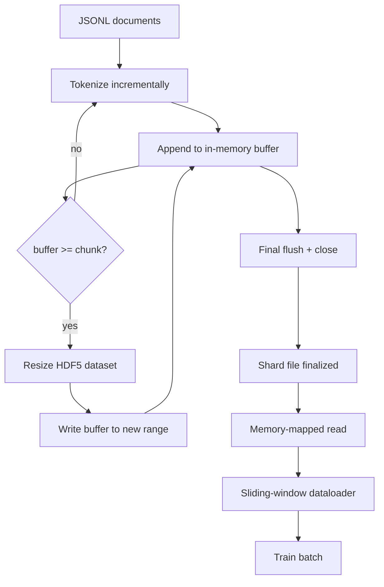

# Токенизированный корпус в HDF5

> Скачанный корпус должен лечь в раскладку, из которой тренер может стримить на полной скорости. JSONL на диске не переживает 16 воркеров даталоадера. Изменяемый по размеру, чанкованный целочисленный набор данных HDF5 — переживает. Этот урок строит потоковую токенизацию в изменяемый по размеру набор данных HDF5, шардированную запись по нескольким файлам, memory-mapped чтение во время обучения и даталоадер со скользящим окном, который выдаёт последовательности фиксированной длины с правильной упаковкой.

**Тип:** Build**Языки:** Python**Предварительные требования:** Фаза 19 уроки 30-37**Время:** ~90 минут
## Цели обучения

- Стримить документы в изменяемый по размеру целочисленный набор данных HDF5 с детерминированным чанкованием.
- Шардировать запись по нескольким файлам HDF5, чтобы отказ был ограничен по масштабу и был возможен параллелизм.
- Читать токены обратно через чанкованную раскладку HDF5 с поддержкой page cache так, чтобы даталоадер копировал данные в буферы батча только во время формирования батча.
- Реализовать даталоадер со скользящим окном, который выдаёт обучающие последовательности фиксированной длины с явными правилами упаковки.

## Проблема

Современный прогон обучения языковой модели читает токены со скоростью сотен тысяч сэмплов в секунду на десятках воркеров. JSONL на диске умирает при первом же промахе холодного кеша страниц: JSON-парсер медленный, границы документов не адресуемы, а обращение к «сэмплу 4 217 884» требует сканирования файла. Даже Parquet, который хорошо сжимается, подходит плохо, потому что тренеру не нужны колонки — ему нужен плоский поток токенов с доступом O(1) в произвольную точку.

HDF5 подходит, потому что предлагает чанкованный, изменяемый по размеру, чисто целочисленный набор данных, чьи чанки дружелюбны к page cache при чтении. Тренер запрашивает срез `tokens[3,200,000 : 3,200,8192]`, и HDF5 копирует запрошенный гиперслэб (hyperslab) из page cache в свежевыделенный массив NumPy. Цена — один открытый файловый дескриптор и footprint page cache размером с чанк на воркера, что пренебрежимо мало по сравнению со стоимостью декодирования JSONL.

Проблема сборки — сделать сторону записи честной. Изменяемые по размеру наборы данных легко использовать неправильно: пишите по одному документу за раз, и файл HDF5 фрагментируется до полной непригодности. Пишите все документы за один resize, и падение процесса теряет весь шард. Правильная дисциплина — буферизация с последующим расширением (buffer-then-extend), где размер буфера совпадает с размером чанка, и шардированная запись, которая разбивает нагрузку по файлам так, что падение теряет максимум один шард.

## Концепция



### Изменяемый по размеру HDF5, сделанный правильно

Набор данных токенов создаётся с `maxshape=(None,)` и фиксированным `chunks=(chunk_size,)`. Запись идёт через буферизацию токенов в массиве NumPy длиной `chunk_size`. Когда буфер заполняется, набор данных увеличивается ровно на `chunk_size`, и буфер записывается в новый диапазон. В конце шарда остаточный буфер записывается в финальный частичный диапазон. Каждая запись непрерывна и выровнена по чанку, кроме последней, которую читателю велено обрезать по зафиксированному значению `token_count` в атрибутах HDF5 шарда.

### Шардированная запись

Один файл HDF5 — единая точка отказа. Конвейер пишет шарды параллельно: каждый входной шард из урока 42 фазы 19 порождает один выходной шард HDF5. Индекс `shards.json` фиксирует по каждому шарду путь к файлу, количество токенов, количество документов и sha256 по токенам. Тренер читает `shards.json`, чтобы вычислить глобальные смещения и провалидировать корпус.

### Memory-mapped чтение

Во время обучения каждый воркер открывает свою долю файлов HDF5 в режиме `swmr=True` и запрашивает `tokens[start:stop]`. Чанкованная раскладка HDF5 делает это чтением, опирающимся на page cache, как только чанк прогрет. Воркер никогда не материализует файл целиком: срез копируется в буфер батча даталоадера, который даталоадер затем копирует в закреплённый (pinned) тензор обучения во время формирования батча. На горячем пути — один системный вызов на переход между чанками; всё остальное — обращение к RAM.

### Даталоадер со скользящим окном

Даталоадер — единственный этап, который знает о длине обучающей последовательности. Он выбирает случайный начальный индекс в глобальном потоке токенов, читает `window_size + 1` токенов и возвращает `(input, target) = (tokens[:-1], tokens[1:])`. Границы документов не соблюдаются: окно может захватывать сразу два документа, с явным `boundary_token_id` между ними, чтобы модель научилась использовать разделитель. Это стандартное правило упаковки; оно же — правило, которое забывает новичок, в итоге получая корпус, где 8 процентов — граничные токены, а 92 процента — естественный текст.

```figure
cc-hdf5-corpus
```

## Реализация

`code/main.py` реализует:

- `Tokenizer` — побайтовый детерминированный токенизатор, достаточно хороший для демонстрации. Интерфейс — `encode(text) -> list[int]` и `vocab_size`.
- `HDF5ShardWriter` — открывает изменяемый по размеру целочисленный набор данных, буферизует токены до размера чанка, расширяет и пишет фиксированными шагами, записывает `token_count` и `sha256` как атрибуты HDF5 при закрытии.
- `ShardedTokenizationPipeline` — итерирует входные документы, направляет их к writer'у и выдаёт индекс `shards.json`.
- `MmapTokenStore` — открывает файлы шардов для memory-mapped чтения, вычисляет глобальные смещения, предоставляет единый API `get_slice(start, stop)`.
- `SlidingWindowDataloader` — выбирает случайные окна из глобального потока и выдаёт массивы NumPy `(input_ids, target_ids)`.

Демонстрация внизу файла строит крошечный корпус в памяти, токенизирует его в два шарда, открывает их через memory map, прогоняет даталоадер на 10 батчей и печатает форму каждого батча и контрольную сумму.

Запустите:

```bash
python3 code/main.py
```

Скрипт завершается с кодом 0 и печатает контрольные суммы батчей.

## Практики продакшена

Четыре практики масштабируют этот урок до реального прогона обучения.

**Размер чанка равен типичному чтению.** Тренер читает `window_size + 1` токенов на сэмпл. Задайте чанк HDF5 кратным `window_size`, и чтения будут выровнены по page cache. Несовпадающие чанки вдвое снижают пропускную способность, потому что каждый сэмпл затрагивает два чанка.

**Количество токенов — в атрибутах, а не в наборе данных.** Хвостовой срез набора данных может быть заполнен частично, потому что размер чанка не делит границу документа нацело. Храните реальный `token_count` как атрибут HDF5 у набора данных и заставьте читателя обрезать по этому значению. Без этого читатель уходит за конец в токены с нулевым паддингом, и модель учится предсказывать ноль.

**Шардированный sha256 с параллельной верификацией.** У каждого шарда свой sha256 по байтам токенов. Тренер может провалидировать все шарды параллельно перед началом обучения. Неверный sha256 роняет прогон рано, а не на третьей эпохе после шестнадцати часов.

**`swmr=True` с обеих сторон, с `libver="latest"` у writer'а.** Режим Single-Writer-Multiple-Reader требует, чтобы writer открывался с `libver="latest"`, создавал все наборы данных заранее, а затем устанавливал `file.swmr_mode = True`. После этого writer обязан вызывать `dataset.flush()` после каждого resize, чтобы воркеры-читатели (открытые с `swmr=True`) видели согласованные данные. Пропуск `libver="latest"` или включение SWMR после структурных изменений — частая причина сбоев «file is locked».

## Применение

Практики продакшена:

- **Один HDF5 на исходный шард.** Загрузчик (урок 42) выдаёт один шард на URL; токенизация (этот урок) выдаёт один HDF5 на исходный шард. Соответствие 1:1 делает возобновление и восстановление после частичного отказа тривиальными.
- **Идентификатор граничного токена.** Граничный токен — часть словаря токенизатора и единственный токен, который вставляет даталоадер. Функция потерь при обучении маскирует граничный токен, если модель должна его игнорировать; иначе она учится использовать его как разделитель последовательностей.
- **`shards.json` как источник истины.** Добавление нового шарда означает запись HDF5, вычисление его sha256 и добавление записи. Тренер читает файл один раз при старте и никогда не трогает листинг каталога.

## Поставка

`outputs/skill-hdf5-tokenized-corpus.md` в реальном проекте описывал бы, какой токенизатор питает конвейер, какой размер чанка совпадает с окном тренера, где `shards.json` хранится в системе контроля версий и как воркеры даталоадера шардируются по файлам. Этот урок поставляет движок.

## Упражнения

1. Добавьте флаг `--compression gzip` к writer'у HDF5 и измерьте влияние на пропускную способность на демонстрационном корпусе. Обоснуйте выбранное значение по умолчанию.
2. Добавьте детерминированный seed к даталоадеру со скользящим окном и убедитесь, что два прогона с одним и тем же seed выдают идентичные батчи.
3. Добавьте режим `--validate`, который читает каждый шард, пересчитывает sha256 по его токенам и сравнивает со `shards.json`. CI должен запускать это перед началом обучения.
4. Сравните пропускную способность даталоадера при размере чанка, равном, половинном и удвоенном относительно размера окна. Опишите эффект page cache.
5. Добавьте флаг `--max-document-tokens`, который обрезает очень длинные документы во время записи. Обоснуйте компромисс против решения этого вопроса во время чтения.

## Ключевые термины

| Термин | Что говорят люди | Что это означает на самом деле |
|------|-----------------|------------------------|
| Изменяемый по размеру набор данных | «Append-only» | Набор данных HDF5 с `maxshape=(None,)`, растущий через вызовы `resize` шагами размером с чанк |
| Чанкованная раскладка | «Как HDF5 это хранит» | Страницы фиксированного размера на диске, которые ядро может memory-map, а даталоадер — читать непрерывно |
| Режим `swmr` | «Чтение во время записи» | Режим Single-Writer-Multiple-Reader, позволяющий воркерам даталоадера безопасно делить файл |
| Индекс шардов | «shards.json» | Устойчивый индекс всех шардов токенов со смещениями и хешами содержимого |
| Скользящее окно | «Обучающий сэмпл» | Срез фиксированной длины из глобального потока токенов, который тренер сопоставляет со сдвинутой на один целевой последовательностью |

## Дополнительное чтение

- [Документация HDF5 по чанкованию](https://support.hdfgroup.org/documentation/hdf5/latest/hdf5_chunking.html) - чанкованная, изменяемая по размеру раскладка набора данных, которую использует этот урок
- [Руководство пользователя h5py](https://docs.h5py.org/en/stable/) - привязки Python к HDF5
- [Memory mapping в NumPy](https://numpy.org/doc/stable/reference/generated/numpy.memmap.html) - примитив чтения, который HDF5 предоставляет через h5py
- Phase 19 · 42 - загрузчик, чей вывод токенизирует этот урок
- Phase 19 · 44 - косинусное расписание, которое потребляет этот даталоадер
- Phase 19 · 45 - цикл с AMP, который оборачивает шаг обучения
