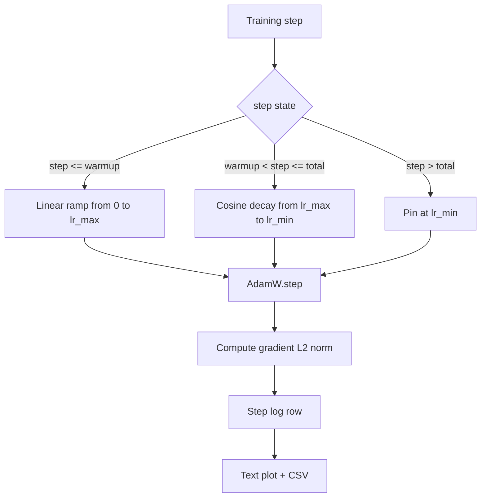

# Косинусный график с линейным разогревом

> Расписание скорости обучения — второе по важности решение после функции потерь. AdamW с косинусным затуханием и линейным разогревом — современный вариант по умолчанию для обучения языковых моделей, потому что он позволяет модели видеть маленький эффективный шаг во время хрупких первых тысяч обновлений, разгоняется до заданного пика и плавно затухает обратно к нулю. Этот урок строит такое расписание, строит график кривой по шагам обучения, логирует нормы градиента рядом с расписанием и доказывает, что расписание соблюдает границы разогрева, пика и затухания.

**Тип:** Build**Языки:** Python**Предварительные требования:** Фаза 19 уроки 30-37**Время:** ~90 минут
## Цели обучения

- Реализовать оптимизатор AdamW, подключённый к косинусному расписанию скорости обучения с линейным разогревом.
- Вычислять точное значение расписания на любом шаге без дрейфа чисел с плавающей точкой между прогонами.
- Логировать L2-норму градиента рядом со скоростью обучения, чтобы здоровье обучения было наблюдаемым.
- Отрисовать расписание в текстовый график, читаемый глазом, и в CSV, пригодный для любого инструмента.

## Проблема

Первая тысяча обновлений обучения — самая громкая. Веса модели всё ещё близки к инициализации. Скользящая оценка второго момента оптимизатора ещё не стабилизировалась. Норма градиента велика и зашумлена. Если скорость обучения в этот момент находится на пике, модель либо расходится полностью, либо застревает на плато потерь, из которого никогда не выбирается. Два известных решения — это отсечение градиента, которому посвящён урок 45 фазы 19, и расписание скорости обучения, которое начинается с малого значения и разгоняется.

Косинусное расписание с разогревом имеет три области. От шага ноль до шага `warmup_steps` скорость обучения масштабируется линейно от нуля до заданного пика `lr_max`. От шага `warmup_steps` до шага `total_steps` скорость обучения следует верхней половине косинусной кривой, затухая от `lr_max` до `lr_min`. После `total_steps` скорость обучения зафиксирована на `lr_min`, чтобы неправильно настроенный тренер, который выходит за пределы расписания, не покидал его молча.

Проблема сборки в том, что в расписаниях легко ошибиться на единицу. Ошибка на единицу проявляется через шесть часов прогона обучения как скорость обучения, которая на 1 процент выше или ниже нужной в момент, когда модель начинает переобучаться, — а это невидимо, если расписание не протестировано исчерпывающе на границах.

## Концепция



### Формула разогрева

Для `step` в `[0, warmup_steps]` при `warmup_steps > 0` скорость обучения равна `lr_max * step / warmup_steps`. Вырожденный случай `warmup_steps = 0` трактуется как «без разогрева»: расписание стартует сразу с `lr_max` на шаге ноль и немедленно входит в косинусное затухание. Некоторые тестовые харнессы передают `warmup_steps = 0`, чтобы проверить, что расписание всё равно выдаёт пригодную кривую.

### Косинусная формула

Для `step` в `(warmup_steps, total_steps]` скорость обучения равна `lr_min + 0.5 * (lr_max - lr_min) * (1 + cos(pi * progress))`, где `progress = (step - warmup_steps) / max(1, total_steps - warmup_steps)`. На `step = warmup_steps` косинус вычисляется как `cos(0) = 1`, что даёт `lr_max`, в точности совпадая с концом разогрева. На `step = total_steps` косинус вычисляется как `cos(pi) = -1`, что даёт `lr_min`, в точности совпадая с концом затухания.

Непрерывность на обеих границах — не случайность. Именно поэтому расписание реализовано как одна функция от `step`, а не как три разные функции, склеенные вместе. Склеенное расписание теряет одну из границ при первом же изменении `lr_max`.

### Нижняя граница после total steps

Для `step > total_steps` скорость обучения остаётся на `lr_min`. Контракт явный: расписание не выбрасывает ошибку и не экстраполирует — оно фиксируется на нижней границе и позволяет тренеру залогировать предупреждение. Тренерам, которым нужно продлить обучение, следует менять `total_steps` расписания, а не сам цикл.

### Логирование нормы градиента рядом со скоростью

Расписание — это половина здоровья обучения. Норма градиента — вторая половина. Цикл обучения логирует обе величины на каждом шаге. Расходящийся прогон обучения показывает всплеск нормы градиента раньше, чем всплеск потерь; хорошо настроенный разогрев держит норму, растущую линейно вместе со скоростью; слишком агрессивный пик проявляется как норма, остающаяся высокой после разогрева. Набор данных на диске — это `step, lr, grad_l2_norm, loss`. CSV — единственная устойчивая запись.

```figure
cap-cosine-warmup
```

## Реализация

`code/main.py` реализует:

- `CosineWithWarmup` — чистая функция без состояния `lr(step) -> float` над настроенным расписанием.
- `TrainState` — оборачивает модель, оптимизатор `AdamW` и расписание в единую функцию шага.
- `TrainState.step` — выполняет один forward-проход, один backward-проход, логирует L2-норму градиента и применяет `lr(step)` к оптимизатору.
- `plot_schedule_ascii` — отрисовывает расписание в виде текстового графика, читаемого глазом.
- `write_schedule_csv` — выдаёт по одной строке на шаг со скоростью обучения.

Демонстрация внизу файла строит крошечную модель `nn.Linear`, обучает её на 20 шагов на фиксированном входном батче и печатает на каждом шаге скорость обучения, норму градиента и потери. Расписание также отрисовывается как текстовый график для визуальной проверки.

Запустите:

```bash
python3 code/main.py
```

Скрипт завершается с кодом 0 и печатает пошаговый лог обучения плюс график расписания.

## Практики продакшена

Четыре практики поднимают расписание до артефакта продакшена.

**Расписание живёт в конфиге, а не в коде.** Тренер читает `warmup_steps`, `total_steps`, `lr_max`, `lr_min` из конфига YAML или JSON, закоммиченного в git. Расписание воспроизводимо, потому что конфиг адресуется по содержимому; расписание аудируемо, потому что конфиг — часть диффа PR.

**Счётчик шагов монотонен и отделён от эпох.** Некоторые фреймворки путают шаг и эпоху, когда набор данных шардирован или даталоадер перезапускается. Расписание читает `global_step` из контрольной точки тренера, а не из локального счётчика. Возобновлённый прогон продолжается с правильной позиции расписания, потому что счётчик шагов — устойчивая ось.

**График расписания в каталоге прогона.** Каждый прогон обучения пишет `outputs/lr_schedule.png` (или в этом уроке — текстовый график) в свой каталог прогона. Рецензент, бегло просматривающий каталог, может проверить расписание на здравый смысл без повторного запуска чего-либо. Это ловит класс багов «неправильно настроенное расписание» ещё на этапе PR.

**Схема строки лога зафиксирована.** `step, lr, grad_l2_norm, loss` именно в этом порядке. Ноутбук или дашборд ниже по потоку читает эту схему; переименование колонки без повышения версии ломает каждый существующий дашборд.

## Применение

Практики продакшена:

- **Сначала подбирайте пик, потом всё остальное.** `lr_max` — самая чувствительная ручка. Подбирайте его сначала на маленькой модели; оптимальный `lr_max` слабо масштабируется с размером модели, поэтому подбор на маленькой модели — сильный приор.
- **Разогрев — это доля от общего числа шагов, а не абсолютное количество.** Прогон на 200 миллионов шагов с 2000 шагами разогрева начинается с пика почти сразу; прогон на 20 000 шагов с тем же числом разогревается 10 процентов времени. Настраивайте разогрев как долю (типично: 1-3 процента), чтобы расписание масштабировалось вместе с длительностью обучения.
- **`lr_min` намеренно ненулевой.** Нижняя граница на уровне 10 процентов от `lr_max` держит оптимизатор обучающимся на длинном хвосте. Расписание с `lr_min = 0` даёт кривую обучения, которая отлично выглядит на графике, и модель, которая на самом деле ещё не закончила обучение.

## Поставка

`outputs/skill-cosine-warmup.md` в реальном проекте описывал бы, какой конфиг несёт расписание, из какого шага тренера читается глобальный счётчик и какой подбор `lr_max` дал развёрнутое значение. Этот урок поставляет движок.

## Упражнения

1. Добавьте вариант расписания с обратным квадратным корнем и сравните его на игрушечном прогоне обучения из 200 шагов. Какая кривая даёт более низкие финальные потери?
2. Добавьте флаг `--restart`, который добавляет второй разогрев на `total_steps / 2`. Обоснуйте, улучшают или ухудшают warm restarts результат на игрушечном прогоне.
3. Добавьте юнит-тест на непрерывность расписания: для каждого шага в `[0, total_steps]` разница `|lr(step+1) - lr(step)|` ограничена значением `lr_max / warmup_steps`.
4. Подключите расписание к `torch.optim.lr_scheduler.LambdaLR`, чтобы оно составлялось с кодом фреймворка. Урок использует простую функцию шага; что меняет обёртка?
5. Добавьте флаг `--plot-png`, который пишет настоящий график через `matplotlib`. Обоснуйте, что лучше по умолчанию для прогонов CI — текстовый график урока или PNG.

## Ключевые термины

| Термин | Что говорят люди | Что это означает на самом деле |
|------|-----------------|------------------------|
| Разогрев | «Медленный старт» | Линейный разгон от нуля до `lr_max` за первые `warmup_steps` обновлений |
| Косинусное затухание | «Плавное падение» | Кривая верхней половины косинуса от `lr_max` до `lr_min` на оставшихся шагах |
| Нижняя граница | «После обучения» | Фиксированное значение `lr_min`, на котором расписание закрепляется после `total_steps` |
| Норма градиента | «L2 от градиентов» | Евклидова норма конкатенированного вектора градиента, логируемая на каждом шаге |
| Глобальный шаг | «Ось расписания» | Монотонный счётчик шагов, переживающий рестарты и управляющий расписанием |

## Дополнительное чтение

- [Loshchilov и Hutter, SGDR: Stochastic Gradient Descent with Warm Restarts (arXiv 1608.03983)](https://arxiv.org/abs/1608.03983) - опорная статья по косинусному расписанию
- [Loshchilov и Hutter, Decoupled Weight Decay Regularization (arXiv 1711.05101)](https://arxiv.org/abs/1711.05101) - опорная статья по AdamW
- [PyTorch torch.optim.lr_scheduler](https://docs.pytorch.org/docs/stable/optim.html#how-to-adjust-learning-rate) - как функции шага составляются с планировщиками фреймворка
- Phase 19 · 42 - загрузчик, чей корпус потребляет это расписание
- Phase 19 · 43 - даталоадер, вместе с которым эволюционирует расписание
- Phase 19 · 45 - отсечение градиента и AMP, следующий слой цикла
