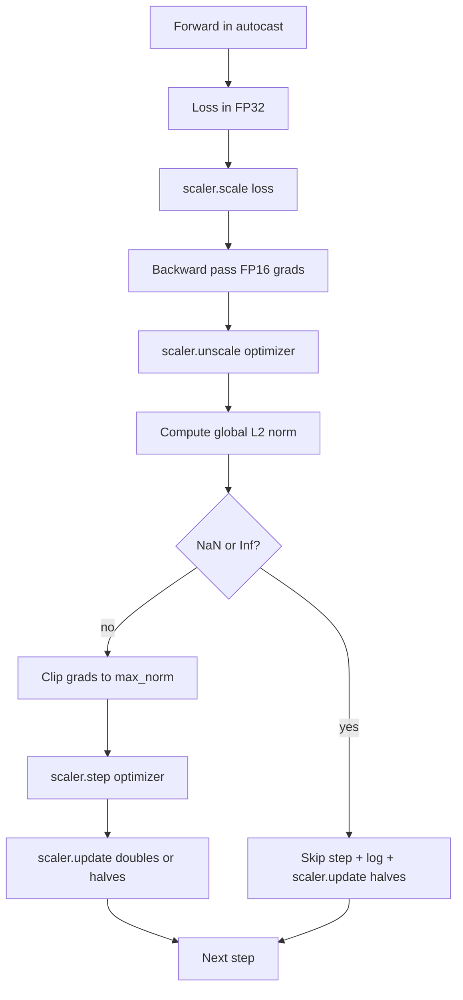

# Отсечение градиента и смешанная точность

> Оптимизатор и расписание из предыдущего урока предполагают, что градиенты вменяемы. Обычно это не так. Один плохой батч может подбросить норму градиента на три порядка. Обучение со смешанной точностью усиливает это, добавляя переполнение FP16 на стороне потерь. Этот урок строит два предохранителя, без которых продакшен-обучение не обходится: отсечение градиента до заданной глобальной L2-нормы и цикл со смешанной точностью с autocast и GradScaler, который обнаруживает NaN и Inf, аккуратно пропускает шаг и логирует коэффициент масштабирования для последующего разбора.

**Тип:** Build**Языки:** Python**Предварительные требования:** Фаза 19 уроки 30-37**Время:** ~90 минут
## Цели обучения

- Вычислять глобальную L2-норму по всем градиентам параметров и отсекать её на месте, когда она превышает заданный порог.
- Оборачивать шаг обучения в autocast плюс GradScaler, чтобы forward- и backward-проходы в FP16 переживали переполнение.
- Обнаруживать NaN и Inf в потерях или градиенте, пропускать шаг оптимизатора и логировать пропуск.
- Отчитываться о коэффициенте масштабирования GradScaler на каждом шаге, чтобы длинная серия пропусков была видна сразу.

## Проблема

Прогон обучения, который вчера отработал чисто, выдаёт кривую потерь, уходящую вертикально на шаге 8217. Виновник — единственный батч, чья норма градиента равна 4200, в двадцать раз выше предыдущего пика. Без отсечения оптимизатор применяет шаг, который сбрасывает всё, чему модель научилась за предыдущий час. С глобальным L2-отсечением по норме 1.0 тот же батч вносит обновление единичной нормы; потери остаются на своей траектории; прогон выживает.

Обучение со смешанной точностью повышает пропускную способность в 2-3 раза за счёт вычисления forward-прохода и большей части backward-прохода в FP16. Цена в том, что у FP16 узкий диапазон экспонент. Типичный градиент, переполняющий FP16, вычисляется как Inf, который распространяется через последующие слои как NaN, что на следующем шаге оптимизатора устанавливает каждый вес в NaN. GradScaler в PyTorch решает это, умножая потери на большой коэффициент масштабирования перед backward-проходом и деля градиенты на тот же коэффициент перед шагом оптимизатора. Если на момент unscale какой-либо градиент равен Inf или NaN, scaler пропускает шаг и уменьшает коэффициент масштабирования вдвое; если предыдущие N шагов были чистыми, scaler удваивает коэффициент. По ходу обучения коэффициент находит наибольшее значение, допустимое диапазоном FP16.

Проблема сборки — правильно соединить эти два механизма. Отсеките до unscale — и порог применяется к масштабированным градиентам; отсеките после unscale — и порядок операций с GradScaler имеет значение. Правильный порядок: `scaler.scale(loss).backward()`, затем `scaler.unscale_(optimizer)`, затем `clip_grad_norm_`, затем `scaler.step(optimizer)`, затем `scaler.update()`. Любой другой порядок даёт молча сломанный цикл.

## Концепция



### Глобальная L2-норма

Глобальная L2-норма — это евклидова норма конкатенированного вектора градиента, а не норма по каждому параметру отдельно. PyTorch реализует это как `torch.nn.utils.clip_grad_norm_(parameters, max_norm)`. Функция возвращает норму до отсечения, так что урок может логировать и естественное, и отсечённое значение, что необходимо для диагностики «мы отсекаем на каждом шаге».

### autocast и GradScaler

`torch.amp.autocast(device_type)` — это контекстный менеджер, который выборочно выполняет подходящие операции (в основном операции класса matmul) в FP16. `torch.amp.GradScaler(device_type)` — это помощник, который масштабирует потери перед backward-проходом и обратно масштабирует градиенты перед шагом оптимизатора. Эти два механизма спроектированы совместно; использование одного без другого — ошибка конфигурации, которую должен ловить тест.

Урок использует autocast на CPU, потому что именно это работает в CI; тот же паттерн переносится дословно на CUDA заменой `device_type="cpu"` на `device_type="cuda"`. GradScaler на CPU — заглушка (autocast на CPU уже по умолчанию работает в BF16 и не нуждается в масштабировании потерь), но урок включает точки вызова, чтобы монтаж был идентичен циклу на GPU.

### Обнаружение NaN и Inf

Обнаружение происходит в двух местах. Во-первых, сами потери проверяются через `torch.isfinite` перед backward-проходом; Inf или NaN в потерях не дают полезных градиентов и пропускаются без входа в оптимизатор. Во-вторых, после `scaler.unscale_(optimizer)` урок сканирует немасштабированные градиенты через `has_non_finite_grad(...)` и трактует любой Inf или NaN как пропуск. Обе проверки вместе покрывают и режим отказа forward-прохода, и режим отказа backward-прохода.

### Диагностика коэффициента масштабирования

Коэффициент масштабирования — это внутреннее состояние GradScaler. На каждом шаге урок читает `scaler.get_scale()` и логирует его рядом со скоростью обучения и нормой градиента. Здоровый прогон показывает коэффициент масштабирования, растущий степенями двойки, пока не насыщается около `2^17` или `2^18`. Неблагополучный прогон показывает коэффициент, колеблющийся между высокими и низкими значениями, — это сигнал, что градиенты модели иногда в диапазоне, а иногда нет. Без логирования эта диагностика невидима.

```figure
grad-clip-monitor
```

## Реализация

`code/main.py` реализует:

- `clip_global_l2_norm` — обёртку вокруг `torch.nn.utils.clip_grad_norm_`, которая возвращает и норму до отсечения, и норму после.
- `has_non_finite_grad` — помощника, сканирующего градиенты на NaN и Inf.
- `AmpTrainState` — оборачивает модель, оптимизатор `AdamW`, GradScaler и устройство autocast. Предоставляет `step(inputs, targets)`, выполняющий полный конвейер отсечения, масштабирования и пропуска при NaN.
- `StepLog` и `SkipLog` — структурированные записи на каждый шаг.
- Демонстрацию, которая обучает маленькую модель `nn.Linear` на 20 шагов, вставляет Inf в градиент на шаге 5, чтобы задействовать путь пропуска, и печатает результирующий лог.

Запустите:

```bash
python3 code/main.py
```

Скрипт завершается с кодом 0 и печатает пошаговый лог, где каждая строка помечена `STEP` или `SKIP`; хотя бы одна строка — `SKIP`.

## Практики продакшена

Четыре практики поднимают цикл до продакшен-уровня шага обучения.

**Счётчик пропусков — это алерт, а не строка лога.** Горстка пропущенных шагов за прогон обучения — это норма. Сотни пропусков за эпоху — жёсткий алерт: модель в режиме, который FP16 не может удержать, и цикл молча отказывает. Урок отслеживает скользящую по 1000 шагам долю пропусков и в продакшене отправлял бы page при доле выше 5 процентов.

**Порог отсечения живёт в конфиге.** `max_norm = 1.0` — современное значение по умолчанию для обучения языковых моделей. Подбирайте его сначала на маленькой модели; большие пороги позволяют модели восстанавливаться после действительно сложных батчей; меньшие пороги ограничивают худший случай ценой более шумной кривой потерь. Порог принадлежит тому же конфигу YAML или JSON, что и расписание из урока 44.

**Лог нормы идёт в CSV вместе с расписанием.** Колонки CSV — `step, lr, grad_l2_pre_clip, grad_l2_post_clip, loss, skipped, skip_reason, scaler_scale`. Рецензент, открывший файл, видит расписание, историю градиента, коэффициент масштабирования и исход пропуска (с его причиной) в одной строке. Разнесение колонок по файлам — рецепт для рассогласованных анализов.

**`scaler.update()` выполняется на каждом шаге, даже при пропуске.** На чистом шаге scaler читает свой счётчик отсутствия Inf, инкрементирует его и, возможно, удваивает коэффициент. На пропущенном шаге scaler уменьшает коэффициент вдвое и сбрасывает счётчик. Забыть `update()` на пути пропуска — баг, из-за которого «коэффициент масштабирования никогда не менялся».

## Применение

Практики продакшена:

- **Устройство autocast совпадает с устройством оптимизатора.** `torch.amp.autocast(device_type="cuda")` для обучения на GPU; `torch.amp.autocast(device_type="cpu")` для CPU. Смешение устройств даёт молчаливую ошибку типов, которая проявляется как кривая потерь, которая выглядит нормально, но модель, которая не обучается.
- **Проверка потерь перед backward-проходом.** `torch.isfinite(loss).all()` — это одна редукция тензора; цена пренебрежима, а выигрыш при NaN-потерях — целый шаг обучения. Запускайте это всегда.
- **`set_to_none=True` в `zero_grad`.** Устанавливает градиенты в `None` вместо нуля, что позволяет оптимизатору пропускать вычисления для незатронутых групп параметров. Эта настройка — бесплатное улучшение пропускной способности и небольшое снижение поверхности для багов.

## Поставка

`outputs/skill-clip-amp.md` в реальном проекте описывал бы, какой порог отсечения и какое устройство autocast использует шаг обучения, где в системе контроля версий хранится пошаговый CSV и каков продакшен-порог алерта по доле пропусков. Этот урок поставляет движок.

## Упражнения

1. Замените синтетическую вставку Inf настоящим всплеском потерь (умножьте цель одного батча на 1e8) и убедитесь, что путь пропуска срабатывает.
2. Добавьте режим `--bf16`, переключающий autocast на BF16 вместо FP16. У BF16 диапазон экспонент шире, чем у FP16, и он редко нуждается в масштабировании потерь; убедитесь, что доля пропусков падает до нуля на той же демонстрации.
3. Добавьте юнит-тест на то, что обёртка отсечения градиента правильно возвращает норму до и после отсечения, когда отсечения не происходит.
4. Добавьте вычисление доли пропусков в скользящем окне и флаг CLI, роняющий прогон, если доля превышает заданный порог 100 шагов подряд.
5. Подключите цикл к записи канонического CSV (`step, lr, grad_l2_pre_clip, grad_l2_post_clip, loss, skipped, skip_reason, scaler_scale`) и подтвердите, что файл переживает Ctrl-C благодаря сбросу на диск после каждой строки.

## Ключевые термины

| Термин | Что говорят люди | Что это означает на самом деле |
|------|-----------------|------------------------|
| Глобальная L2-норма | «Цель отсечения» | Евклидова норма конкатенированного вектора градиента по всем обучаемым параметрам |
| autocast | «Смешанная точность» | Выборочное выполнение в FP16 (или BF16) подходящих операций внутри блока `with` |
| GradScaler | «Масштабировщик потерь» | Помощник, который умножает потери перед backward-проходом и обратно масштабирует градиенты перед шагом оптимизатора |
| Skip | «Плохой шаг» | Шаг оптимизатора, от которого отказались, потому что градиент или потери были не конечны; scaler уменьшает коэффициент вдвое |
| Коэффициент масштабирования | «Состояние scaler'а» | Текущий множитель GradScaler; удваивается после чистых серий и уменьшается вдвое на каждом пропуске |

## Дополнительное чтение

- [Micikevicius и др., Mixed Precision Training (arXiv 1710.03740)](https://arxiv.org/abs/1710.03740) - исходное предложение масштабирования потерь
- [Pascanu, Mikolov, Bengio, On the difficulty of training recurrent neural networks (arXiv 1211.5063)](https://arxiv.org/abs/1211.5063) - опорная статья по отсечению градиента
- [PyTorch torch.amp.GradScaler](https://docs.pytorch.org/docs/stable/amp.html) - API scaler'а, который оборачивает этот урок
- [PyTorch torch.nn.utils.clip_grad_norm_](https://docs.pytorch.org/docs/stable/generated/torch.nn.utils.clip_grad_norm_.html) - примитив отсечения, который использует этот урок
- Phase 19 · 42 - загрузчик, чей корпус питает цикл
- Phase 19 · 43 - даталоадер, который потребляет цикл
- Phase 19 · 44 - расписание, с которым составляется этот цикл
