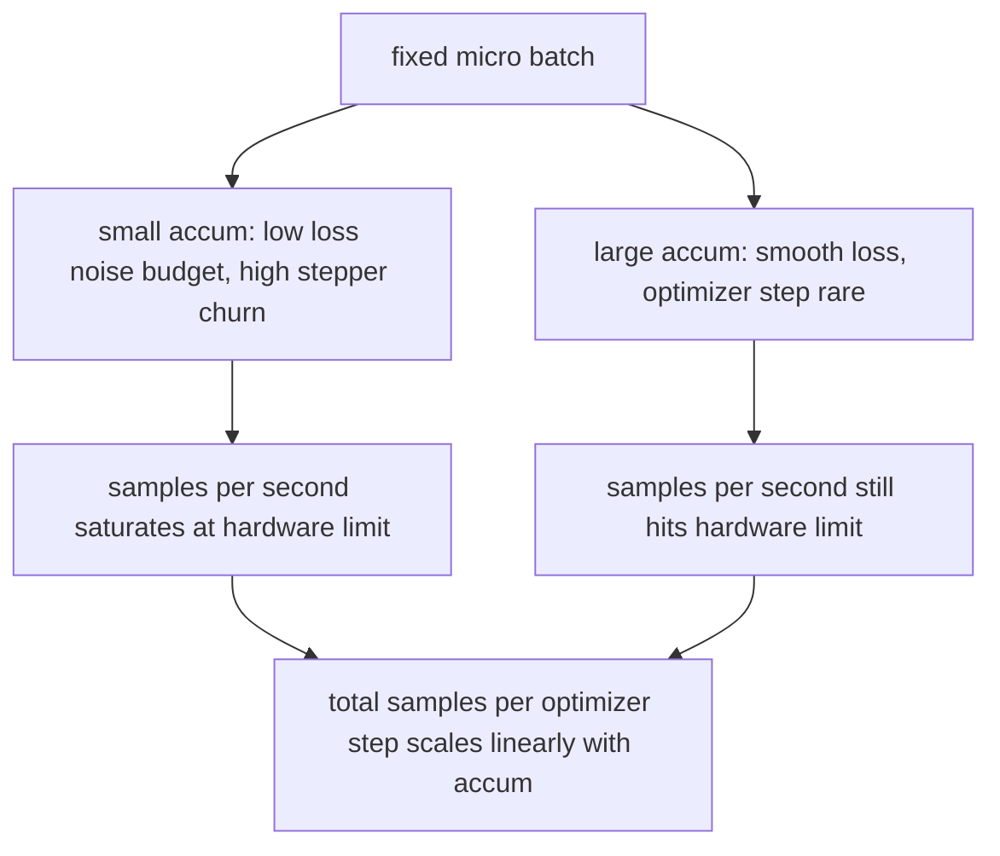

# Накопление градиента

> Обучайтесь при эффективном батче, который вы не можете себе позволить, — по одному микробатчу за раз. Масштабируйте потери, придержите шаг оптимизатора и дайте градиентам накопиться.

**Тип:** Build**Языки:** Python**Предварительные требования:** Фаза 19 уроки 42 to 45**Время:** ~90 минут
## Цели обучения

- Вывести тождество эффективного батча: `effective_batch = micro_batch * accum_steps`.
- Реализовать масштабирование потерь на микробатч так, чтобы накопленный градиент совпадал с одним полным backward-проходом по полному батчу.
- Пропускать синхронизацию оптимизатора до последнего микробатча (синхронизация на последнем шаге).
- Читать кривую пропускной способности в зависимости от эффективного батча и объяснить убывающую отдачу.

## Проблема

Вы хотите обучаться при эффективном батче 512, потому что кривая потерь при этом более гладкая, и шаг оптимизатора имеет больше смысла в этом масштабе. Ускоритель на столе вмещает 32 примера, прежде чем закончится память. Удвоить батч — не вариант. Уменьшить модель вдвое — не вариант. Приём, за который индустрия ухватилась в 2017 году и не переставала использовать, — это выполнить 16 backward-проходов, дать градиентам накопиться внутри буферов параметров и делать шаг оптимизатора только тогда, когда счётчик достигает цели.

Риск в том, что потери больше не то же самое число, что при большем батче. Кросс-энтропия 16 мини-батчей, просуммированная наивно, в 16 раз больше потерь одного полного батча. Без масштабирования направление градиента верное, но величина неправильная, и шаг оптимизатора в 16 раз больше нужного. Исправление — одно деление. Исправление также легко забыть.

## Концепция


Контракт короткий:

- Потери для каждого микробатча делятся на `accum_steps` перед `backward()`. PyTorch по умолчанию суммирует градиенты в `param.grad`; деление возвращает накопленную сумму в правильный масштаб.
- Шаг оптимизатора выполняется один раз на эффективный батч, после backward-прохода последнего микробатча. Шаг посреди накопления искажает каждый параметр, от которого зависит остаток прогона.
- Состояние оптимизатора (буферы момента, моменты Adam) продвигается один раз на эффективный шаг, а не один раз на микробатч. Иначе экспоненциальные скользящие средние увидели бы неправильную частоту и сожгли бы расписание.
- На одном устройстве это просто учёт. На многоранговом кластере тот же паттерн оборачивает нефинальные микробатчи в контекст `no_sync`, который пропускает all-reduce градиентов; последний микробатч редуцирует весь накопленный градиент за один проход вместо того, чтобы платить за сеть N раз.

### Доказательство эквивалентности в коде

```python
loss = criterion(model(x_full), y_full)
loss.backward()
opt.step()
```

эквивалентно

```python
for x, y in chunks(x_full, y_full, n):
    scaled = criterion(model(x), y) / n
    scaled.backward()
opt.step()
```

с точностью до порядка суммирования чисел с плавающей точкой. Буфер накопленного градиента в конце цикла — тот же тензор, что произвёл бы один backward-проход по полному батчу. Код урока проверяет это утверждением о максимальной абсолютной разнице менее 1e-4 в `equivalence_check`.

### Куда уходит цена

Каждый микробатч стоит один forward- и один backward-проход. С накоплением вы меняете память на время. Кривая пропускной способности в `outputs/accum-curve.json` показывает, что происходит по мере роста эффективного батча при фиксированном микробатче:



Бесплатного обеда не бывает. Удвоение `accum_steps` удваивает время на шаг оптимизатора. Что меняется — это дисперсия оценки градиента: при том же бюджете по времени вы сделали меньше шагов оптимизатора, но каждый усреднён по большему числу сэмплов. Литература трактует большой и маленький батч как разные задачи оптимизации; урок здесь механический, а не статистический.

```figure
cc-grad-accumulation
```

## Реализация

`code/main.py` — исполняемый артефакт. Он делает три вещи.

### Шаг 1: проверка эквивалентности

`equivalence_check()` строит две копии одной и той же сети с одним и тем же seed. Одна видит батч из 16 сэмплов за один forward-проход. Другая видит четыре чанка по 4 сэмпла с потерями, делёнными на четыре. Функция сравнивает буферы градиентов перед шагом оптимизатора и параметры после. Утверждение — `max_abs_diff < 1e-4`.

### Шаг 2: паттерн синхронизации на последнем шаге

`train_one_optimizer_step` проходит по микробатчам. Для каждого микробатча, кроме последнего, она входит в `no_sync_context(model)`. В одном процессе контекст — no-op; на DDP это место, где пропускается all-reduce градиентов. Учёт одинаковый независимо от этого. `sync_counter` фиксирует, сколько раз мы покинули область no_sync; для N микробатчей это число — один раз на эффективный шаг, а не N.

### Шаг 3: кривая пропускной способности

`sweep_effective_batches` прогоняет одну и ту же модель с фиксированным микробатчем и списком шагов накопления. Для каждой настройки логируются:

- `samples_per_sec`: общее число увиденных сэмплов, делённое на время
- `median_step_ms`: 50-й перцентиль на эффективный шаг
- `sync_calls`: задействованные точки коллективной синхронизации
- `avg_loss`: среднее по шагам оптимизатора в этом прогоне

Результат попадает в `outputs/accum-curve.json` и пригоден для повторного использования из ноутбука.

Запустите:

```bash
python3 code/main.py
```

Скрипт печатает разницу эквивалентности, затем таблицу перебора, затем путь к JSON. Код выхода — 0.

## Применение

В продакшен-обучении накопление градиента живёт за одной ручкой. Паттерн PyTorch — `accumulation_steps = effective_batch // (micro_batch * world_size)`. Фреймворки, которые вам здесь использовать не разрешено, оборачивают тот же цикл, но шаги те же: масштабировать потери, пропускать синхронизацию на нефинальных микробатчах, накапливать, шагнуть один раз.

Три паттерна из практики:

- Размер микробатча выбирается так, чтобы насытить память устройства. Меньший размер тратит впустую циклы ускорителя. Больший — приводит к падению.
- Эффективный батч выбирается из расписания скорости обучения. Большие эффективные батчи требуют масштабированных скоростей обучения и разогрева; это правило линейного масштабирования, о котором говорят с 2017 года.
- Счётчик накопления — мост между этими двумя, и единственная ручка, которую вы вольны крутить во время выполнения без переписывания даталоадера.

## Поставка

`outputs/skill-gradient-accumulation.md` фиксирует рецепт так, чтобы коллега мог перенести его в новый репозиторий: масштабировать потери на `accum_steps`, пропускать синхронизацию оптимизатора на нефинальных микробатчах, шагать оптимизатором один раз на эффективный батч, логировать пропускную способность в зависимости от эффективного батча как JSON, чтобы компромисс был виден.

## Упражнения

1. Перезапустите перебор с `--num-steps 100` и постройте график сэмплов в секунду в зависимости от эффективного батча. Где кривая выполаживается?
2. Добавьте вариант с неправильным масштабированием (без деления) и покажите разницу параметров на шаге 1 относительно эталона.
3. Замените SGD на AdamW и убедитесь, что состояние оптимизатора продвигается один раз на эффективный шаг, а не один раз на микробатч.
4. Введите настоящую обёртку `DistributedDataParallel` и направьте `no_sync_context` в её метод. Убедитесь, что sync_calls уменьшается на N-1 на эффективный батч.
5. Измените проверку эквивалентности, чтобы сравнить два разных разбиения на микробатчи (2 по 8 против 4 по 4), и объясните, какой допуск вам придётся ослабить.

## Ключевые термины

| Термин | Что говорят люди | Что это означает на самом деле |
|------|-----------------|------------------------|
| Микробатч | Батч, который вы прогоняете вперёд | Срез, который помещается в память за один forward-проход |
| Шаги накопления | Backward-проходы на шаг | Число backward-проходов, суммируемых перед одним шагом оптимизатора |
| Эффективный батч | Батч | Микробатч, умноженный на шаги накопления и на размер data-parallel мира |
| Масштабирование потерь | Деление на N | Деление на микробатч так, чтобы суммарные градиенты совпадали с полным батчем |
| Синхронизация на последнем | Пропустить остальное | Запускать коллективную операцию градиента только на последнем backward-проходе в окне |

## Дополнительное чтение

- Документация PyTorch по `DistributedDataParallel.no_sync` для продакшен-версии приёма синхронизации на последнем шаге.
- Goyal и др., 2017, о линейном масштабировании для обучения с большим батчем — каноническая причина заботиться об эффективном батче.
- Трекер issue PyTorch о взаимодействии накопления градиента с unscaling при смешанной точности.
- Уроки 42-45 фазы 19 покрывают модель, даталоадер, оптимизатор и обвязку тренера, которые предполагает этот урок.
- Урок 47 фазы 19 покрывает контрольные точки и возобновление, чтобы долгий прогон с накоплением пережил ограничение по времени.
