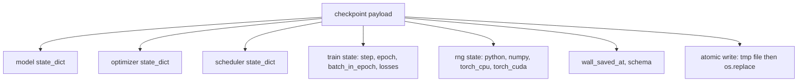
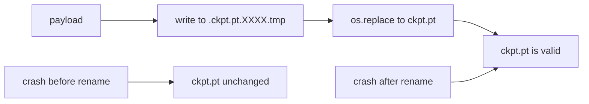
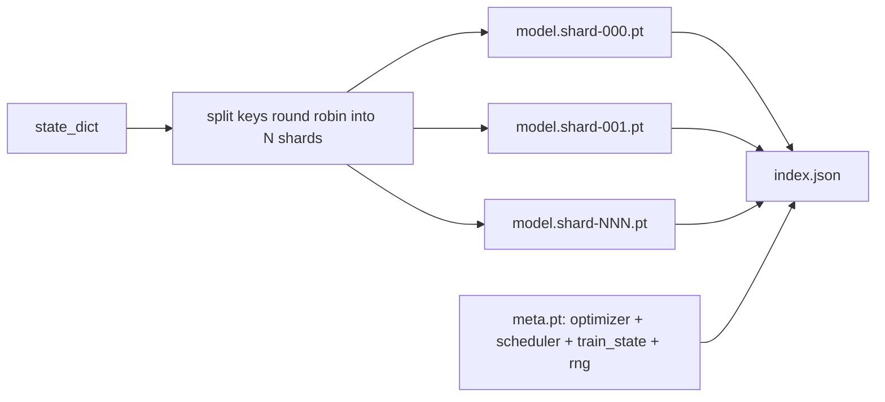

# Сохранение и возобновление контрольных точек

> Прерывания обучения убивают прогоны; контрольные точки дают им продолжиться. Сохраняйте модель, оптимизатор, планировщик, историю потерь, счётчик шагов и состояние RNG атомарно, так чтобы kill в любой момент оставлял на диске валидный файл.

**Тип:** Build**Языки:** Python**Предварительные требования:** Фаза 19 уроки 42 to 45**Время:** ~90 минут
## Цели обучения

- Захватить полное состояние обучения в единый payload, который можно загрузить обратно в свежий процесс.
- Реализовать атомарное сохранение через запись во временный файл с последующим переименованием, так чтобы падение никогда не оставляло наполовину записанный файл.
- Восстановить состояние RNG для Python, NumPy и PyTorch, чтобы потери после возобновления совпадали с непрерывным базовым прогоном.
- Построить шардированную раскладку контрольных точек для моделей, которые больше не помещаются в один файл, с шардами, верифицируемыми по хешу, и JSON-индексом.

## Проблема

Вы запускаете задачу обучения на 18 часов. Потолок по времени — 4 часа. Кластер перезагружается на 11-м часу, потому что кто-то рангом выше одобрил обновление ядра. Без контрольных точек вы начинаете заново. Без возобновления вы также теряете состояние оптимизатора, на выработку которого ушли первые 11 часов, так что даже если веса модели выжили, моменты AdamW потеряны, и следующий шаг рвётся в направлении, которое траектория обучения уже прошла.

Правильный артефакт — единый файл, который хранит всё необходимое для продолжения: параметры модели, состояние оптимизатора, состояние планировщика, историю потерь для графиков, текущие счётчики шага, эпохи и батча внутри эпохи, а также состояние RNG для каждого источника случайности. Без состояния RNG возобновлённая кривая потерь — это другая кривая. Та же модель, те же данные, другое перемешивание, другая маска dropout, другое число на дашборде.

Атомарное сохранение — другая половина контракта. Запись напрямую в итоговое имя файла означает, что падение посреди записи оставляет повреждённый файл; возобновление читает мусор. Запись во временный файл в той же директории с последующим переименованием означает, что падение посреди записи оставляет предыдущий хороший файл нетронутым. Переименование атомарно в POSIX-файловых системах.

## Концепция



### Пять корзин состояния

| Корзина | Почему это важно |
|--------|----------------|
| Модель | Веса и буферы; то, чем является модель. |
| Оптимизатор | Момент и адаптивные моменты; без них следующий шаг — другая задача оптимизации. |
| Планировщик | Где скорость обучения находится на своей кривой; косинусные расписания особенно к этому чувствительны. |
| Счётчики обучения | Шаг, эпоха, батч внутри эпохи, плюс история потерь, которая рисует дашборд. |
| Состояние RNG | Детерминизм для dropout, перемешивания данных и любого сэмплирования внутри модели. |

### Атомарное сохранение



Два правила. Первое: временный файл живёт в той же директории, что и цель, так что переименование остаётся внутри одной файловой системы; переименования между устройствами не атомарны. Второе: временное имя уникально для каждой попытки, так что два писателя не затирают друг друга.

### Шардированные контрольные точки

Когда модель становится большой, однофайловый payload становится слишком большим, чтобы загружаться быстро, слишком большим, чтобы его инспектировать, и слишком болезненным, когда сетевая шара икает посреди чтения. Решение — разбить состояние параметров на шарды и написать небольшой индекс, который их связывает.



Индекс фиксирует количество шардов, sha256 каждого шарда и sha256 meta-файла. Загрузчик громко падает, когда любой хеш не совпадает. Шарды могут лежать на разных физических дисках; meta маленький и читается первым.

### Возобновление продолжается посреди эпохи

Возобновление, которое перескакивает к началу следующей эпохи, тратит впустую от минут до целого дня. Решение — `(epoch, batch_in_epoch)` плюс состояние RNG. После загрузки цикл обучения перематывает генератор случайных чисел вперёд мимо уже потреблённых в текущей эпохе батчей и продолжает с `batch_in_epoch`. Код урока делает именно это; утверждение состоит в том, что траектория потерь после возобновления совпадает с непрерывным базовым прогоном с точностью до 1e-4.

```figure
cc-atomic-checkpoint
```

## Реализация

`code/main.py` предоставляет четыре примитива и демонстрационный драйвер.

### Шаг 1: захват и восстановление состояния RNG

`capture_rng_state` возвращает словарь с `random.getstate` из Python, `np.random.get_state` из NumPy и байтами RNG PyTorch для CPU и CUDA. `restore_rng_state` делает обратное. Тензор CPU — это байтовый буфер uint8, который умеет потреблять RNG PyTorch.

### Шаг 2: атомарное сохранение

`atomic_save` пишет payload во временный файл в целевой директории, затем `os.replace` подменяет его на итоговое имя. `atomic_write_json` делает то же самое для шардированного индекса.

### Шаг 3: полный цикл контрольной точки

`save_checkpoint` упаковывает модель, оптимизатор, планировщик, состояние обучения и RNG в единый словарь. `load_checkpoint` делает обратное и возвращает `TrainState`. Поле schema — это точка входа для апгрейда: будущие изменения формата поднимают строку версии, и загрузчик диспетчеризует по ней.

### Шаг 4: шардированный вариант

`save_sharded_checkpoint` распределяет ключи параметров по N шардам по круговому алгоритму, пишет каждый шард со своим атомарным сохранением, пишет meta-файл с оптимизатором, планировщиком и состоянием обучения и пишет JSON-индекс с sha256 шардов. `load_sharded_checkpoint` верифицирует каждый шард перед слиянием.

### Шаг 5: демонстрация возобновления

`run_resume_demo` обучает маленькую модель на `total_steps`, сохраняет контрольную точку на `interrupt_at`, затем продолжает. Второй процесс восстанавливает контрольную точку и прогоняет оставшиеся шаги. Функция возвращает максимальную абсолютную разницу между двумя траекториями потерь после точки прерывания. При восстановленном RNG разница равна нулю или шуму плавающей точки.

Запустите:

```bash
python3 code/main.py
```

Обе демонстрации, однофайловая и шардированная, утверждают, что max-diff меньше 1e-4. Сводка попадает в `outputs/resume-demo.json`.

## Применение

Продакшен-стеки обучения поставляют чекпоинтинг как часть тренера. Форма та же: модель + оптимизатор + планировщик + счётчики + RNG, записанные атомарно, названные по шагу, чтобы последний было легко найти. Шардированные раскладки обеспечивают загрузку больших моделей с параллельным чтением; index.json — то, что делает это возможным.

Три практики, которые нужно соблюдать:

- **Schema — это строка в payload.** Миграции ветвятся по ней. Без неё вы не можете эволюционировать формат, не сломав старые прогоны.
- **Sha256 для каждого шарда.** Молча обрезанная загрузка — худший вид бага; загрузчик должен падать быстро, а не поздно.
- **Держите каденс контрольных точек честным.** Сохраняйте каждые N шагов и каждую минуту по настенным часам, смотря что короче. Иначе долгий шаг, который падает, тратит впустую целое окно работы.

## Поставка

`outputs/skill-checkpoint-save-resume.md` — рецепт для любого нового скрипта обучения: форма payload, атомарная запись, захват RNG, шардированный индекс. Внедрите этот навык в репозиторий, подключите `save_checkpoint` в точке периодического сохранения, подключите `load_checkpoint` при старте — и прогон переживёт kill.

## Упражнения

1. Замените круговое шардирование шардированием по группе параметров (слои, заканчивающиеся на `.weight`, против `.bias`). Когда какая раскладка предпочтительнее?
2. Расширьте цикл сохранения так, чтобы хранить последние K контрольных точек и удалять более старые. Какое K правильно, когда диск маленький?
3. Добавьте флаг `--ckpt-every-seconds`, запускающий сохранение по интервалу настенного времени, а не только по счётчику шагов.
4. Добавьте путь верификации контрольных сумм, который запускается при старте, сканирует каждую контрольную точку в директории и сообщает, какие из них повреждены.
5. Реализуйте функцию `migrate_v1_to_v2`, которая добавляет новое поле в payload и поднимает строку schema. Сделайте так, чтобы загрузка допускала обе версии.

## Ключевые термины

| Термин | Что говорят люди | Что это означает на самом деле |
|------|-----------------|------------------------|
| Атомарное сохранение | «Пиши и молись» | Запись во временный файл в той же директории, затем os.replace в целевое имя |
| State dict | «Веса» | Параметры и буферы модели, ключами которых служат имена параметров |
| Шардированная контрольная точка | «Файл большой модели» | Несколько файлов, по одному на шард, плюс meta-файл и JSON-индекс с sha256 |
| Состояние RNG | «Случайный seed» | Захваченное состояние для python random, numpy, torch CPU, torch CUDA — не просто seed |
| Возобновление посреди эпохи | «Рестарт» | Перемотать RNG вперёд и продолжить со следующего батча в той же эпохе |

## Дополнительное чтение

- Семантика `rename` в POSIX для обоснования атомарности, на которую опирается `os.replace`.
- Документация PyTorch по `torch.save` и `torch.load`, включая `map_location` для восстановления между устройствами.
- Урок 46 фазы 19 покрывает накопление градиента, через которое переживает payload контрольной точки этого урока.
- Урок 48 фазы 19 покрывает распределённые обёртки, чей формат state dict вмещает эта схема.
- Документация ядра Linux по `fsync` для гарантии долговечности за атомарным переименованием.
