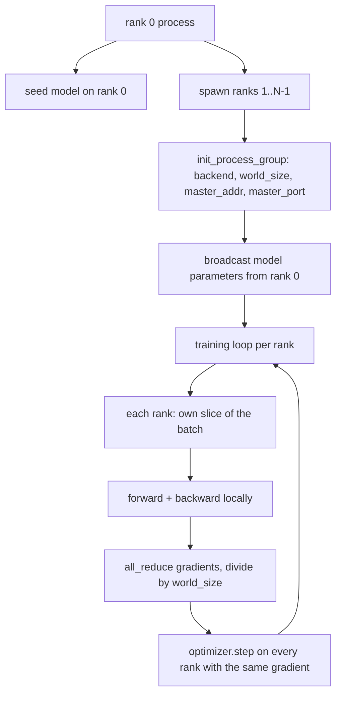
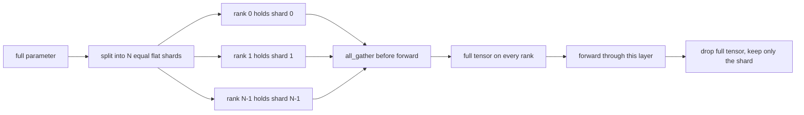

# Распределённый параллелизм по данным и FSDP с нуля

> Обучение с несколькими рангами (rank) — это две коллективные операции (collective) и одно правило. Выполните широковещательную рассылку (broadcast) параметров при запуске, усредните градиенты после обратного прохода, никогда не позволяйте рангам расходиться в том, на каком шаге они находятся.

**Тип:** Build
**Языки:** Python
**Предварительные требования:** уроки 42–45 этапа 19
**Время:** ~90 минут

## Цели обучения

- Поднимите группу процессов (process group) на N рангах с бэкендом `gloo`, без специального оборудования.
- Реализуйте минимальную обёртку DDP, которая выполняет широковещательную рассылку параметров при создании и коллективную редукцию (all-reduce) градиентов после обратного прохода.
- Докажите, что коллективная редукция градиентов по рангам даёт тот же результат, что и вычисление градиента одним процессом на объединённом входе.
- Наметьте шардирование параметров в FSDP: каждый ранг хранит срез, полный тензор восстанавливается посредством коллективного сбора для прямого прохода и отбрасывается после.

## Проблема

Модель помещается на одно устройство. Набор данных — нет. Бюджет оптимизации требует, чтобы вы обрабатывали в N раз больше примеров в секунду реального времени. Первый рычаг — параллелизм по данным (data parallel): каждый ранг запускает одну и ту же модель на своём срезе пакета, затем усредняет градиенты перед шагом оптимизатора. Второй рычаг — FSDP: модель тоже не помещается на одно устройство, поэтому каждый ранг хранит долю каждого параметра и восстанавливает полные тензоры послойно во время прямого прохода.

Боль — это учёт состояния (bookkeeping). Если параметры расходятся между рангами, прогон незаметно портится. Если вы усредняете градиенты, но не потери, дашборд лжёт. Если бэкенд коллективных операций не может договориться о топологии, прогон зависает навсегда. Решение — написать коллективные операции вручную один раз и никогда не доверять обёртке, которую вы не можете воспроизвести.

Этот урок выполняется на CPU. CUDA не предполагается. Бэкенд `gloo` входит в состав каждой сборки PyTorch и работает с процессами `torch.multiprocessing`; тот же код переключается на `nccl` на узле с несколькими GPU без изменения структуры.

## Концепция



### Две коллективные операции, которые имеют значение

| Коллективная операция | Что делает | Когда |
|------------|--------------|------|
| `broadcast` | Копирует тензор с одного ранга на все остальные | Инициализация параметров, состояние планировщика, любая синхронизация «один-ко-всем» |
| `all_reduce` | Суммирует (или усредняет, или берёт максимум) тензор по всем рангам, каждый ранг получает результат | Усреднение градиентов после обратного прохода |
| `all_gather` | Каждый ранг предоставляет тензор, каждый ранг получает конкатенацию | Сбор логитов, восстановление полных параметров в FSDP |

Контракт DDP — это `broadcast` при создании и `all_reduce` после обратного прохода. Набросок FSDP добавляет `all_gather` перед прямым проходом каждого слоя.

### Усреднение градиентов совпадает с градиентом одного процесса

Модель, обучаемая на пакете из B примеров на N рангах, должна давать тот же градиент, что и один процесс, обучающийся на пакете размером N*B. Хитрость в том, что суммирование градиентов по рангам и деление на N даёт средний градиент потерь — именно то, что дала бы кросс-энтропия с усредняющей редукцией (mean reduction) на полном пакете. Код урока проверяет это утверждением `max-abs-diff < 1e-3` между градиентом после ручной коллективной редукции и эталонным градиентом одного процесса.

### Набросок FSDP



Выигрыш по памяти точен: память на параметры на ранг падает до 1/N. Цена — операция сборки, которая выполняется при каждом прямом проходе. Промышленный FSDP перекрывает сборку с вычислениями предыдущего слоя, поэтому затраты фактического времени намного меньше, чем предсказывает наивный подсчёт. Урок выполняет полный цикл разбиения и сборки для каждого параметра и проверяет, что восстановление побитово совпадает с оригиналом.

### CPU и бэкенд gloo

CUDA — это целевая среда для продакшена, но те же пути кода существуют и на CPU. `gloo` — это CPU-бэкенд для коллективных операций. Он на порядки медленнее `nccl` на GPU, но поверхность API идентична. Группа процессов в этом уроке инициализируется с `backend="gloo"`, а ранги порождаются через `torch.multiprocessing`, а не через `torchrun`; оба варианта в итоге приводят к одним и тем же вызовам `torch.distributed`. На узле с несколькими GPU меняются только `backend="nccl"`, тензоры на устройстве и запуск через `torchrun`.

```figure
cg-allreduce-ring
```

## Реализация

`code/main.py` — исполняемый артефакт.

### Шаг 1: поднимите группу процессов

```python
os.environ["MASTER_ADDR"] = "127.0.0.1"
os.environ["MASTER_PORT"] = str(port)
dist.init_process_group(backend="gloo", rank=rank, world_size=world_size)
```

`MASTER_ADDR` и `MASTER_PORT` — это точка встречи (rendezvous): каждый ранг обращается к одному и тому же порту на одном и том же хосте. Урок выбирает свободный порт с помощью приёма «привязать и закрыть», чтобы избежать коллизий, когда несколько прогонов используют одну машину.

### Шаг 2: широковещательная рассылка при создании

`MinimalDDP.__init__` проходит по каждому параметру и буферу и вызывает `dist.broadcast(tensor, src=0)`. Значения ранга 0 становятся канонической инициализацией. Без этого каждый ранг инициализируется со своим начальным значением генератора, и ранги расходятся с первого же шага.

### Шаг 3: коллективная редукция градиентов после обратного прохода

```python
def all_reduce_grads_(module, world_size):
    for p in module.parameters():
        if p.grad is None:
            p.grad = torch.zeros_like(p.data)
        dist.all_reduce(p.grad.data, op=dist.ReduceOp.SUM)
        p.grad.data.div_(world_size)
```

Каждый ранг в итоге получает один и тот же усреднённый градиент. Шаг оптимизатора теперь является функцией одного и того же входа на каждом ранге, поэтому параметры остаются синхронизированными на протяжении всего прогона.

### Шаг 4: докажите эквивалентность

`manual_all_reduce_matches_single_process` строит ту же модель на ранге 0 и сравнивает градиент после коллективной редукции с градиентом, который вычислил бы один процесс на объединённом входе. Максимальная абсолютная разница составляет около 1e-8.

### Шаг 5: полный цикл разбиения и сборки FSDP

`fsdp_round_trip_sketch` сплющивает каждый параметр, дополняет его до кратного `world_size`, нарезает на срезы, собирает их и снимает дополнение. Реконструкция на каждом ранге совпадает с оригиналом. Это шаг восстановления полного параметра; обратная операция (повторное шардирование после прямого прохода) — это один срез собранного тензора.

Запустите:

```bash
python3 code/main.py
```

Размер группы (world size) по умолчанию — 2. Порождаются два процесса CPU, которые общаются друг с другом через `gloo` и завершаются с нулевым кодом. Вывод `outputs/ddp-demo.json` фиксирует суммы параметров по каждому рангу, норму градиента после коллективной редукции, результат полного цикла разбиения и сборки FSDP и разницу между ручным и эталонным градиентом.

## Применение

Промышленные стеки обучения вызывают те же примитивы. `DistributedDataParallel` от PyTorch добавляет хуки градиента после обратного прохода, которые перекрывают коллективную редукцию с остальной частью обратного прохода, пакетированную коллективную редукцию, объединяющую несколько маленьких градиентов в одну коллективную операцию, и контекст `no_sync`, использованный в уроке 46.

FSDP от PyTorch добавляет плоское представление параметров для каждого слоя, чтобы каждый ранг хранил один непрерывный буфер, перекрытие восстановления полного параметра следующего слоя с вычислениями текущего слоя и необязательную выгрузку шардов на CPU.

Схема остаётся той же: широковещательная рассылка при запуске, редукция после обратного прохода и шардирование параметров, когда они перестают помещаться.

## Поставка

`outputs/skill-distributed-fsdp-ddp.md` содержит рецепт для нового обучающего скрипта: поднимите группу процессов с `gloo` для CPU и `nccl` для GPU, оберните модель в DDP-обёртку, которая выполняет широковещательную рассылку при создании и коллективную редукцию после обратного прохода, а при необходимости шардируйте параметры по схеме коллективного сбора из наброска FSDP.

## Упражнения

1. Запустите с `--world-size 4` и убедитесь, что разброс параметров остаётся ниже 1e-3 на всём протяжении прогона.
2. Замените ручное усреднение на `dist.all_reduce(op=dist.ReduceOp.AVG)` и замерьте разницу по времени.
3. Добавьте к обёртке DDP хук после обратного прохода, чтобы коллективная редукция перекрывалась с остальной частью обратного прохода; измерьте сокращение фактического времени выполнения.
4. Реализуйте шаг повторного шардирования для FSDP: после прямого прохода снова замените полный тензор локальным срезом. Убедитесь, что память на ранг уменьшается.
5. Переключите бэкенд на `nccl` на машине с CUDA. Отметьте, какие переменные окружения меняются, а какие остаются прежними.

## Ключевые термины

| Термин | Как обычно говорят | Что это означает на самом деле |
|------|-----------------|------------------------|
| Бэкенд (Backend) | «gloo или nccl» | Библиотека, реализующая коллективные операции; gloo — для CPU, nccl — для GPU |
| Размер группы (World size) | «Общее число рангов» | Число процессов в группе; группа — это единица, над которой оперируют коллективные операции |
| Ранг (Rank) | «Идентификатор воркера» | Идентификатор процесса внутри группы, нумерация с нуля |
| Коллективная редукция (All-reduce) | «Просуммировать градиенты» | Суммирует тензор по всем рангам, каждый ранг получает один и тот же результат |
| Восстановление полного параметра (Unshard) | «Собрать параметры» | Восстанавливает полный тензор из срезов по рангам посредством коллективного сбора |

## Дополнительное чтение

- Документация PyTorch по `torch.distributed` для семантики коллективных операций, на которую опирается этот урок.
- Список коллективных операций библиотеки `gloo`, идентичный по форме примитивам `nccl` для CUDA.
- В уроке 46 этапа 19 рассматривается схема накопления градиента, которая оборачивает коллективную редукцию DDP в `no_sync`.
- В уроке 47 этапа 19 рассматривается формат контрольной точки, который сохраняется при прогонах DDP и FSDP.
- Документация PyTorch FSDP для промышленной реализации шардирования параметров, набросок которого дан здесь.
