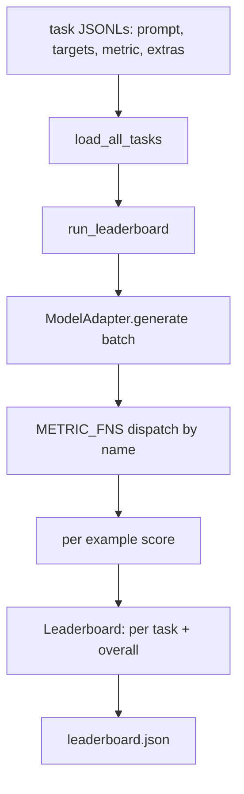
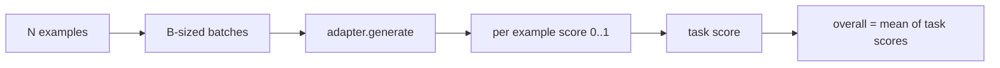

# Харнесс для оценивания языковых моделей

> Модель, которая хорошо справляется с задачей, которую вы не можете определить, — это модель, которая справляется хорошо случайно. Харнесс — это определение задачи, метрика, раннер и таблица лидеров в одной короткой, заменяемой форме.

**Тип:** Build
**Языки:** Python
**Предварительные требования:** уроки 42–45 фазы 19
**Время:** ~90 минут

## Цели обучения

- Определите задачу как файл JSONL с полями `prompt`, `targets`, `metric` и опциональным `extras` для каждого примера.
- Реализуйте пять метрик: точное совпадение, F1 rouge-l, исполняемую проверку, выбор варианта и проверку на вхождение подстроки.
- Реализуйте раннер, который группирует примеры в пакеты по задачам и передаёт их в заменяемый адаптер модели.
- Формируйте JSON-файл таблицы лидеров с оценками по каждой задаче, задержкой и воспроизводимым общим средним значением.

## Проблема

Каждую неделю выходит новая языковая модель. Маркетинговое заявление гласит, что она хорошо справляется. Честный вопрос: хорошо справляется с чем? Честный ответ — это таблица лидеров, которую вы написали сами, потому что таблица лидеров вендора — это та, под которую он сам себя настроил.

Без харнесса в вашем репозитории вы сравниваете две модели «на глаз». С харнессом вы сравниваете их по оценке на фиксированном наборе задач с фиксированной метрикой, по JSON-выводу, который можно сравнить построчно. Харнесс — это контракт между вчерашним запуском и сегодняшним. Без него регрессии уходят в продакшен.

Ловушка — переобучить харнесс под одну конкретную модель. Решение — та же ловушка в обратную сторону: харнесс достаточно мал, чтобы прочитать его за пятнадцать минут, задачи достаточно малы, чтобы поставлять их прямо в репозитории, метрики написаны с нуля, чтобы коллега мог их проверить, а адаптер — единственное место, где живёт специфичный для модели код. Замените адаптер — таблица лидеров изменится; замените задачи — таблица лидеров изменится. Больше ничего меняться не должно.

## Концепция



### Спецификация задачи

Каждый пример — это одна строка JSONL:

```json
{"id": "arith-00", "prompt": "compute: 2 + 2", "targets": ["4"], "metric": "exact_match"}
```

Для метрик, которым нужны вспомогательные данные для оценки, `extras` несёт дополнительную полезную нагрузку:

```json
{
  "id": "code-00",
  "prompt": "python: write a function f that doubles its input",
  "targets": ["ok"],
  "metric": "code_exec",
  "extras": {"io_pairs": [[1, 2], [3, 6]]}
}
```

Задача — это файл `.jsonl` в каталоге `outputs/tasks/`. Имя файла — это имя задачи. Все примеры в файле используют одну метрику.

### Пять тестовых задач

| Задача | Метрика | Что она проверяет |
|------|--------|---------------|
| arithmetic | exact_match | Корректность на уровне токенов для детерминированного ответа |
| summary | rouge_l | F1 по наибольшей общей подпоследовательности относительно однострочного эталонного резюме |
| code-exec | code_exec | Исполняемый тест: предсказанная функция должна удовлетворять списку пар вход-выход |
| multiple-choice | multiple_choice | Первая буква предсказания должна совпадать с одной из допустимых букв |
| generation | substring_contains | Свободный текст должен содержать хотя бы одну целевую подстроку |

### Контракт метрики

Каждая метрика — это функция вида `(prediction, targets, extras) -> float in [0.0, 1.0]`. Харнесс усредняет оценки по каждому примеру, чтобы получить оценку задачи, затем усредняет оценки задач, чтобы получить общую оценку. Функции метрик крошечные:

- `exact_match`: приведение к нижнему регистру, схлопывание пробелов, проверка на равенство.
- `substring_contains`: та же нормализация, проверка на вхождение подстроки.
- `multiple_choice`: первый символ приводится к верхнему регистру.
- `rouge_l`: длина LCS делится на длины предсказания и эталона, F1 от точности и полноты.
- `code_exec`: выполнение предсказания в ограниченном пространстве имён, вызов `f(x)` для каждой пары вход-выход, подсчёт совпадений.

Метрика code_exec выполняет предсказание в пространстве имён с урезанным набором встроенных объектов. Тест урока проверяет, что `import os` завершается с ошибкой, потому что `os` отсутствует в пространстве имён; из предсказанного кода нельзя добраться до файловой системы.

### Адаптер модели

```python
class ModelAdapter(Protocol):
    def generate(self, prompts: Sequence[str]) -> List[str]: ...
    @property
    def name(self) -> str: ...
```

Адаптер — это точка сопряжения. В уроке поставляется `ToyAdapter` — детерминированный сопоставитель по шаблону, который возвращает правильный ответ для каждого промпта в пяти тестовых задачах. Настоящий адаптер вызывает модель и возвращает её вывод. Харнессу всё равно, какой из них используется.

### Раннер

`run_task` группирует по `batch_size` промптов за раз и передаёт их в функцию метрики. `run_leaderboard` проходит по всем задачам и усредняет результаты. `write_leaderboard` формирует JSON со строкой схемы, чтобы будущие изменения формата не ломали дашборды незаметно.



```figure
eval-harness-matrix
```

## Реализация

`code/main.py` — это исполняемый артефакт.

### Шаг 1: посев задач-фикстур

`seed_fixture_tasks(target_dir)` записывает пять файлов `.jsonl`. Первый запуск `main.py` наполняет их, когда каталог пуст.

### Шаг 2: загрузка задач

`load_all_tasks(task_dir)` читает каждый `.jsonl` и возвращает словарь, отображающий имя задачи в список записей `Example`. Строки-комментарии, начинающиеся с `#`, и пустые строки пропускаются, чтобы контрибьюторы могли аннотировать файлы.

### Шаг 3: реализация метрик

Каждая метрика — это небольшая функция с модульным тестом. Тестовый набор урока включает 13 сценариев, покрывающих нормализацию, частичное пересечение, выполнение кода и отклонение небезопасного кода.

### Шаг 4: написание раннера

`run_task` проходит по пакетам и формирует `TaskResult` с оценкой, числом правильных ответов, общим числом примеров и задержкой. `run_leaderboard` проходит по всем задачам и формирует `Leaderboard` с общим средним значением.

### Шаг 5: формирование JSON

`write_leaderboard` сериализует таблицу лидеров. Флаг `--include-per-example` выгружает записи по каждому примеру, чтобы вы могли сопоставить предсказания с предыдущим запуском, когда оценки меняются.

Запустите:

```bash
python3 code/main.py
```

Скрипт наполняет фикстуры при первом запуске, оценивает их с помощью игрушечного адаптера (который отвечает правильно на все фикстуры) и записывает `outputs/leaderboard.json`. Общая оценка с игрушечным адаптером равна 1.0; тест адаптера-заглушки в `test_main.py` показывает, что тот же самый харнесс выдаёт 0.0, когда адаптер не может ответить.

## Применение

Чтобы подключить настоящую модель, напишите адаптер. Его форма:

```python
class HttpAdapter:
    name = "vendor.v1"

    def __init__(self, endpoint, api_key):
        self.endpoint = endpoint
        self.api_key = api_key

    def generate(self, prompts):
        out = []
        for prompt in prompts:
            response = http_post(self.endpoint, prompt, self.api_key)
            out.append(response["text"])
        return out
```

Замените `ToyAdapter` на `HttpAdapter` в начале `main()`. Харнесс, задачи, метрики и таблица лидеров остаются теми же.

Три паттерна, которые нужно соблюдать при поставке харнесса в реальном проекте:

- **Зафиксируйте файлы задач.** leaderboard.json несёт содержимое задач, закреплённое по хешу, либо несёт сами JSONL рядом; иначе оценка меняется вместе с файлом задачи, и вы не сможете понять, что именно изменилось.
- **Сравнивайте предсказания, а не только оценки.** Флаг `--include-per-example` позволяет увидеть, что сказала модель в тот день, когда оценка упала.
- **Ограничьте размер пакета.** У настоящих адаптеров есть ограничения частоты запросов. Небольшой размер пакета делает харнесс совместимым с разными вендорами.

## Поставка

`outputs/skill-lm-eval-harness.md` содержит рецепт: спецификация задачи в формате JSONL, пять метрик, заменяемый адаптер, пакетный раннер, JSON таблицы лидеров со строкой схемы. Файлы задач в `outputs/tasks/` — это фикстуры; скопируйте их в реальный проект в качестве отправной точки.

## Упражнения

1. Добавьте шестую задачу с собственной метрикой, написанной с нуля (пересечение в духе BLEU, эталонная оценка в духе BLEURT — что угодно с чётким контрактом).
2. Расширьте `code_exec`, чтобы захватывать stdout и принимать список ожидаемых значений stdout в качестве целей.
3. Добавьте команду сравнения таблиц лидеров: получив два файла `leaderboard.json`, выведите, какие задачи изменились и насколько.
4. Ограничьте задержку на пример. Оберните вызов адаптера в таймаут; выведите отдельный столбец `timeouts` в таблице лидеров.
5. Зафиксируйте содержимое задач с помощью sha256 в таблице лидеров, чтобы будущий читатель мог убедиться, что оценивал те же самые задачи.

## Ключевые термины

| Термин | Как обычно говорят | Что это означает на самом деле |
|------|-----------------|------------------------|
| Спецификация задачи | «Формат оценивания» | Файл JSONL с prompt, targets, metric и опциональным extras для каждого примера |
| Метрика | «Как ты оцениваешь» | Функция из (prediction, targets, extras) в число с плавающей точкой в диапазоне [0, 1] |
| Адаптер | «Клиент модели» | Объект с методом generate(prompts) -> list[str]; единственный специфичный для модели код |
| Таблица лидеров | «Табло с результатами» | JSON с оценками по каждой задаче, общими счётчиками, задержкой и общим средним значением |
| Метрика выполнения кода | «Запусти и проверь» | Выполнение предсказания в ограниченном пространстве имён, сравнение с парами вход-выход |

## Дополнительное чтение

- Оригинальный lm-evaluation-harness — эталон для продакшена, гораздо крупнее, но той же формы.
- lighteval от HuggingFace — альтернативная реализация того же контракта.
- Урок 46 фазы 19 рассматривает паттерны накопления градиента, используемые в обучающем стеке, результат которого оценивает харнесс.
- Урок 47 фазы 19 рассматривает формат контрольной точки, относительно которой вы оцениваете; зафиксируйте хеш контрольной точки в таблице лидеров.
- Урок 48 фазы 19 рассматривает стек распределённого обучения, который произвёл тестируемую модель.
