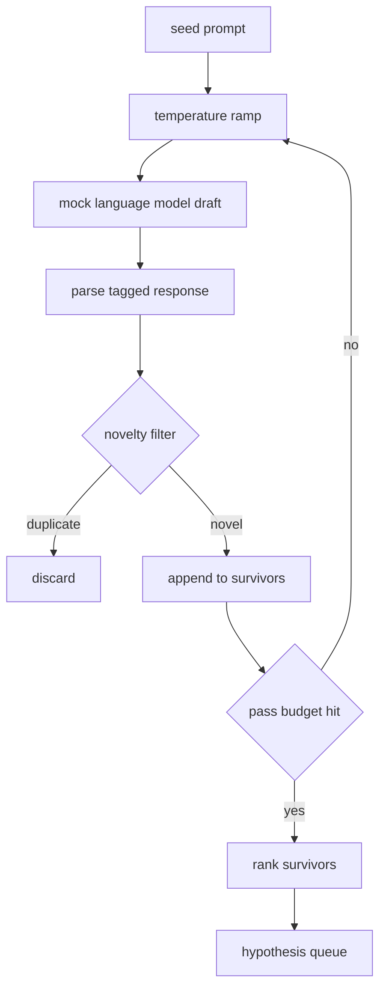

# Генератор гипотез

> Исследовательский агент, который дважды задаёт один и тот же вопрос, впустую тратит токены. Хитрость в том, чтобы заставить каждый черновик приземляться в новом месте.

**Тип:** Build**Языки:** Python**Предварительные требования:** Фаза 19, Track A, уроки 20-29**Время:** ~90 минут
## Цели обучения
- Управляйте сэмплером, отталкиваясь от исходного промпта, и превращайте его выходные данные в типизированные записи гипотез.
- Повышайте температуру сэмплера на каждом проходе, чтобы следующий черновик уходил дальше от предыдущего.
- Отфильтровывайте почти дублирующиеся варианты с помощью небольшой модели эмбеддингов и порогового значения косинусного расстояния.
- Ранжируйте уцелевших кандидатов (survivors) с помощью функции оценки, которая объединяет новизну, специфичность и проверяемость.
- Делайте каждый шаг детерминированным, чтобы один и тот же seed всегда порождал одну и ту же очередь.

## Зачем сначала генерировать, а потом фильтровать

Планировщик, который один раз обращается к одной модели, получает одну гипотезу. Для разобранного примера этого достаточно. Для исследовательского цикла такая форма не годится. Циклу нужна ранжированная очередь с запасом глубины, чтобы когда первая гипотеза проваливается, у раннера (runner) была наготове следующая — без необходимости платить за ещё один полный проход сэмплирования.

Для получения этой очереди сочетаются две идеи. Первая — повышение температуры (temperature ramping): на каждом проходе через сэмплер температура поднимается на одну ступень, так что более поздние черновики поощряются «блуждать». Вторая — фильтрация по новизне (novelty filtering): после каждого черновика генератор измеряет расстояние эмбеддинга до каждого из ранее принятых кандидатов и отбраковывает всё, что попадает внутрь кластера.

В этом уроке используется макет языковой модели (mock language model), которая возвращает заранее заскриптованные последовательности токенов для фиксированных промптов. Этого макета достаточно, чтобы прогнать весь путь целиком: на входе — исходный промпт, затем применяется повышение температуры, кандидаты разбираются парсером, выполняется фильтрация по новизне, на выходе — ранжированная очередь.

## Структура Hypothesis

```text
Hypothesis
  id             : int           (monotonic within a run)
  text           : str           (the claim)
  variables      : list[str]     (what changes between conditions)
  metric         : str           (what the runner will measure)
  baseline_ref   : str | None    (which paper or run the comparison cites)
  draft_pass     : int           (which sampler pass produced this)
  temperature    : float         (the sampler setting at draft time)
  novelty_score  : float         (distance from prior survivors, 0..1)
  rank_score     : float         (weighted sum used for ordering)
```

`variables` и `metric` — не произвольный текст. Парсер извлекает их из размеченного (tagged) ответа. Раннер в уроке пятьдесят два читает эти поля напрямую при построении конфигурации эксперимента.

`baseline_ref` необязателен, но рекомендуется. Оценщику (evaluator) в уроке пятьдесят три нужен базовый вариант для сравнения. Если гипотеза его не указывает, оценщик обращается к резервному варианту — предыдущему запуску по той же метрике.

```figure
cg-novelty-ramp
```

## Архитектура



Сам цикл — простой. Интересная часть в том, что у каждого блока есть жёсткий контракт.

## Повышение температуры

Начните с `t_min`, закончите на `t_max`, шаг — `(t_max - t_min) / (n_passes - 1)`. На каждом проходе сэмплер вызывается при текущей температуре, что даёт `n_passes` равномерно распределённых значений из `GeneratorConfig.schedule()`. Макет модели учитывает температуру, переключаясь между небольшим набором заскриптованных ответов, привязанных к ключу `(prompt, temp_bucket)`. Бакеты (buckets) — открытые интервалы, поэтому небольшое изменение температуры выбирает другой бакет и даёт другой черновик. В продакшене вместо сэмплера была бы настоящая модель, которой передаётся `temperature=t`.

Расписание по умолчанию — шесть проходов от `0.2` до `1.2`. Шести достаточно, чтобы заполнить очередь, не тратя ресурсы на сэмплы, которые фильтр новизны всё равно отбракует. Ниже `0.2` модель просто дословно повторяет исходный промпт. Выше `1.2` ответы, как правило, уходят от темы и не проходят парсер.

## Фильтр новизны

После того как черновик разобран, генератор вычисляет эмбеддинг текста и сравнивает его с каждой ранее принятой гипотезой. Эмбеддинг — это небольшой хешированный мешок словных токенов (hashed bag of word tokens), нормализованный до единичной длины. Косинусное расстояние между двумя единичными векторами равно `1 - dot(a, b)`. Черновик проходит, если его минимальное расстояние до любого уцелевшего кандидата выше `novelty_threshold`. Значение по умолчанию — `0.25`.

Хешированный эмбеддинг не претендует на изящность. Он детерминирован, не имеет внешних зависимостей, и его достаточно, чтобы поймать очевидный случай: два черновика, у которых совпадает бо́льшая часть существительных. В продакшен-развёртывании вместо него подставили бы небольшую модель эмбеддингов уровня предложения (sentence model). Интерфейс остаётся тем же.

## Ранговая оценка

```text
rank_score = w_novelty * novelty_score
           + w_specificity * specificity_score
           + w_testability * testability_score
```

Три частные оценки. `novelty_score` — минимальное расстояние эмбеддинга до уцелевших кандидатов. `specificity_score` — количество конкретных переменных в гипотезе, делённое на целевое количество. `testability_score` равен единице, если в гипотезе указаны и метрика, и базовый вариант, половине, если указана только метрика, и нулю в остальных случаях.

Веса по умолчанию — `0.4`, `0.3`, `0.3`. Веса хранятся в конфигурации генератора, поэтому урок ниже по цепочке может изменить их, не форкая код.

## Макет языковой модели

```python
class MockLLM:
    def sample(self, prompt: str, temperature: float, seed: int) -> str:
        ...
```

Сэмплер детерминирован при фиксированной тройке `(prompt, temperature, seed)`. Макет хранит таблицу заскриптованных ответов с ключом `(prompt_signature, temperature_bucket)`. Если для ключа нет записи в таблице, сэмплер возвращает резервный вариант, который не проходит парсер. Путь резервного варианта проверяется одним из тестов.

Seed подмешивается в ответ, поэтому одна и та же пара `(prompt, temperature)` при разных seed даёт разные черновики. В тестах мы фиксируем seed, чтобы результаты оставались воспроизводимыми. В реальном развёртывании seed брался бы из системных часов или счётчика.

## Выходная очередь

На выходе — список записей `Hypothesis`, отсортированный по `rank_score` по убыванию. Раннер в уроке пятьдесят два извлекает первый элемент очереди, запускает эксперимент, а оценщик в уроке пятьдесят три записывает вердикт обратно. Если вердикт говорит, что гипотеза была неверной, раннер извлекает следующий элемент.

Очередь конечна. Когда она пуста, оркестратор может либо расширить исходный промпт и снова запустить генератор, либо остановиться и сообщить об исчерпании бюджета.

## Как читать код

`code/main.py` определяет `Hypothesis`, `MockLLM`, `HypothesisGenerator` и детерминированную демонстрацию. Генератор предоставляет единственный метод `run(seed_prompt)`, который возвращает отсортированную очередь; количество проходов считывается из `GeneratorConfig.n_passes`, а не передаётся аргументом. Эмбеддинг — это хешированный мешок токенов. Фильтр новизны — это отдельная функция. Ранговая оценка — это отдельная функция. Ничто не зависит от `numpy`; математика эмбеддингов реализована только на stdlib, поэтому урок остаётся переносимым.

`code/tests/test_generator.py` покрывает линейный путь, путь отклонения дубликатов, путь сбоя парсера, границы повышения температуры и порядок ранжирования.

## Место в общей картине

Урок пятьдесят производит очередь. Урок пятьдесят один берёт первый элемент очереди и проводит поиск по литературе, чтобы подтвердить или опровергнуть гипотезу. Урок пятьдесят два берёт тот же элемент и запускает настоящий эксперимент. Урок пятьдесят три считывает оба результата и записывает вердикт. Эти четыре урока складываются в исследовательский цикл без участия человека; человек может вмешаться на любой границе.
