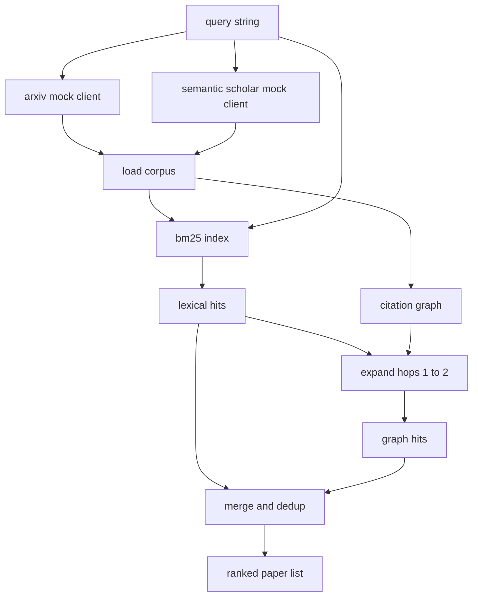

# Поиск литературы

> Гипотеза стоит дёшево. Дорого стоит понять, не доказал ли её уже кто-то другой. Постройте слой поиска, который отвечает на этот вопрос до того, как раннер поднимет песочницу.

**Тип:** Build**Языки:** Python**Предварительные требования:** Фаза 19, трек A, уроки 20-29**Время:** ~90 минут
## Цели обучения
- Смоделировать небольшую запись Paper с полями, которые цикл прочитает на дальнейших этапах.
- Построить индекс BM25 по аннотациям, используя только структуры данных стандартной библиотеки.
- Обойти граф цитирования, чтобы найти статьи, которые пропустил лексический поиск.
- Устранить дубликаты совпадений из лексического прохода и прохода по графу по стабильному идентификатору статьи (paper id).
- Обернуть два внешних mock API одним клиентом, чтобы код на стороне вызова не менялся, когда появятся настоящие конечные точки.

## Почему нужны два прохода поиска

Поиск по ключевым словам среди аннотаций возвращает статьи, лексика которых пересекается с запросом. Это покрывает большую часть случаев. Он упускает два случая. Первый — когда основополагающая статья использует другой словарь; например, запрос «разреженное внимание» пропускает статью под названием «выбор блоков в маршрутизации трансформера». Второй — когда релевантная статья является продолжением, которое цитирует известную опорную статью; эффективнее найти опорную статью и пройти вперёд по графу, чем перебирать весь пул аннотаций полным перебором.

Урок строит оба прохода. BM25 по аннотациям ловит лексические совпадения. Обход графа цитирования расширяет начальное множество на один-два перехода (hops) вперёд и назад. Объединение дедуплицируется по идентификатору статьи и ранжируется по небольшой комбинированной оценке.

## Структура Paper

```text
Paper
  id          : str           (stable identifier, "p001" for the mock corpus)
  title       : str
  abstract    : str
  year        : int
  authors     : list[str]
  references  : list[str]     (paper ids this paper cites)
  citations   : list[str]     (paper ids that cite this paper)
  source      : str           (which mock api supplied it, "arxiv" or "s2")
```

Поля references и citations формируют направленный граф цитирования. Два mock API возвращают пересекающиеся, но не идентичные поля, поэтому загрузчик корпуса объединяет их по `id`.

```figure
cg-citation-hops
```

## Архитектура



Клиент поиска отвечает и за оба прохода, и за объединение. Вызывающий код передаёт ему запрос и получает в ответ ранжированный список, где для каждой статьи указаны поля оценки (`bm25_score`, `graph_distance`, `recency_score`, `final_score`), объясняющие ранжирование.

## BM25 с нуля

Реализация — это стандартный Okapi BM25 с параметрами по умолчанию `k1=1.5`, `b=0.75`. Индекс — это два словаря: `term -> doc_frequency` и `term -> list of (doc_id, term_count)`. Длина документа — это количество токенов в аннотации. Средняя длина документа вычисляется один раз при построении индекса. Оценка запроса — это сумма по терминам запроса значения `idf * tf_norm`, где `tf_norm` — это стандартная нормализованная по длине частота термина BM25.

Токенизатор — это `lower`, а затем разбиение по неалфавитно-цифровым символам. Стемминг не применяется. В продакшен-системе на этом месте использовался бы небольшой стеммер. Интерфейс остаётся тем же.

```text
idf(t)      = log((N - df + 0.5) / (df + 0.5) + 1.0)
tf_norm(t)  = (f * (k1 + 1)) / (f + k1 * (1 - b + b * dl / avgdl))
score(d, q) = sum over t in q of idf(t) * tf_norm(t)
```

## Обход графа цитирования

Граф строится один раз из корпуса. Прямые рёбра идут от статьи к её references. Обратные рёбра идут от статьи к её citations. Обход — это поиск в ширину (breadth first search), инициализированный лучшими совпадениями BM25 и ограниченный двумя переходами (hops).

Два перехода — осознанно выбранный предел. Один переход — это слишком мелко: агенту часто нужен непосредственный предок или потомок. Три перехода резко увеличивают размер результата на связном графе и склонны уводить в сторону от темы. Урок делает предел переходов настраиваемым параметром конфигурации, чтобы более поздний цикл мог его сузить.

## Дедупликация и ранжирование

Два прохода возвращают пересекающиеся множества. Объединение выполняется по идентификатору статьи. Для каждой статьи итоговая оценка — это взвешенная комбинация.

```text
final_score = w_bm25 * bm25_score_norm
            + w_graph * graph_score
            + w_recency * recency_score
```

`bm25_score_norm` — это оценка BM25, делённая на максимальную оценку BM25 в объединённом множестве (поэтому значение поля лежит в диапазоне от нуля до единицы). `graph_score` равен единице для прямых лексических совпадений, `0.6` — для одного перехода, `0.3` — для двух переходов, и нулю в остальных случаях. `recency_score` — это линейное нарастание от нуля в год минимального значения в корпусе до единицы в год максимального.

Веса по умолчанию — `0.5`, `0.3`, `0.2`. Веса задаются конфигурацией: для темы, которая давно не развивается, вес свежести можно понизить, а для быстро развивающейся — повысить.

## Mock-корпус

Корпус — это сто статей, сгенерированных функцией `build_corpus()`. У каждой статьи есть написанные вручную заголовок и аннотация на одну из пяти тем: разрежённость внимания (attention sparsity), дополнение поиском (retrieval augmentation), низкоранговые адаптеры (low rank adapters), дистилляция наборов данных (dataset distillation) и харнессы для оценивания (evaluation harnesses). References и citations выстроены так, что каждая тема образует связный подграф с несколькими межтематическими связями.

Два mock-клиента API (`ArxivMockClient`, `SemanticScholarMockClient`) читают из одного и того же корпуса, но предоставляют разные поля. Arxiv возвращает title, abstract, year, authors. Semantic Scholar добавляет references и citations. Клиент поиска объединяет их по id; обработка расхождений полей между клиентами отложена до одного из следующих уроков.

## Что читают уроки 52 и 53

Раннер в уроке пятьдесят два читает `paper.id`, `paper.title` и первые три предложения аннотации как контекст для эксперимента. Оценщик в уроке пятьдесят три читает `paper.year` и `paper.references`, чтобы привязать базовый результат к конкретной статье.

Клиент поиска возвращает `RetrievalResult` с ранжированным списком и метриками по запросу: количество совпадений, средняя оценка, максимальная оценка, общее время выполнения (wall time). Раннер записывает их в лог, чтобы последующий проход наблюдаемости мог строить график качества во времени.

## Как читать код

`code/main.py` определяет `Paper`, `ArxivMockClient`, `SemanticScholarMockClient`, `BM25Index`, `CitationGraph`, `RetrievalClient` и детерминированную демонстрацию. Mock-клиенты и корпус находятся в одном файле, чтобы урок оставался переносимым. Реализация BM25 — это один класс на шестьдесят строк. Обход графа — это один метод.

`code/tests/test_retrieval.py` покрывает лексический путь, путь по графу, объединение, дедупликацию и пустой запрос.

## Место в общем процессе

Урок пятьдесят создаёт гипотезу. Урок пятьдесят один ищет её в литературе, чтобы понять, не закрыт ли этот вопрос уже. Урок пятьдесят два запускает эксперимент, если нет. Урок пятьдесят три читает и результат поиска, и метрики эксперимента, чтобы сформулировать вердикт. Клиент поиска — самый дешёвый из четырёх этапов и запускается в оркестраторе первым.
