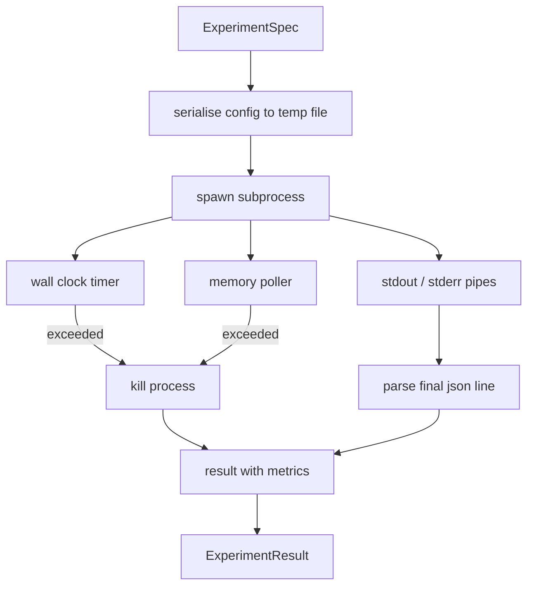

# Раннер эксперимента

> Цикл честен ровно настолько, насколько честны его измерения. Постройте раннер, который принимает спецификацию, выполняет её в изолированном (sandboxed) подпроцессе и выдаёт JSON-блок метрик, которому оценщик может доверять.

**Тип:** Build**Языки:** Python**Предварительные требования:** Фаза 19 Track A уроки 20-29**Время:** ~90 минут
## Цели обучения
- Закодируйте эксперимент в виде типизированной спецификации, которую раннер (runner) может сериализовать для подпроцесса.
- Запустите подпроцесс с жёстким тайм-аутом по времени выполнения (wall clock) и мягким ограничением по памяти, представив оба как терминальные условия.
- Захватите stdout, stderr и структурированный блок метрик в единой записи результата.
- Постройте таблицу абляций (ablation table), которая перебирает один параметр конфигурации (knob) за раз для фиксированной базовой спецификации.
- Обеспечьте детерминированность каждого результата при фиксированном сиде (seed), чтобы оценщик видел одинаковые числа в разных запусках.

## Зачем нужен подпроцесс

Цикл исследования выполняет ненадёжный (untrusted) код. Гипотеза получена от сэмплера, скрипт эксперимента пришёл тем же путём; считать любой из них безопасным для выполнения внутри процесса (in-process) — значит напрашиваться на сбой, который обрушит оркестратор. Подпроцессы — простейшая изоляция, которую предоставляет язык: отдельный процесс, независимое адресное пространство, дескриптор сигнала на стороне родителя.

Раннер, описанный здесь, не реализует полную изоляцию в песочнице (sandboxing). В нём нет ни cgroup, ни seccomp-фильтра, ни переназначения namespace. Что у него есть — это тайм-аут по времени выполнения (wall clock), цикл опроса роста памяти и путь принудительного завершения (kill path), который останавливает процесс при превышении любого из лимитов. Это тот контракт времени выполнения, который расширяет любая более сложная песочница. Урок сознательно держит контракт достаточно маленьким, чтобы прочитать его за один присест.

## Структура ExperimentSpec

```text
ExperimentSpec
  spec_id        : str            (stable id, "exp_001")
  hypothesis_id  : int            (link back to the queue from lesson 50)
  script_path    : str            (path to the python script to run)
  config         : dict           (passed to the script as one json arg)
  seed           : int            (deterministic seed for the experiment)
  wall_timeout_s : float          (hard timeout, killed on exceed)
  memory_cap_mb  : int            (soft cap, polled; killed on exceed)
  metric_keys    : list[str]      (which fields the evaluator will read)
```

Скрипт хранится на диске; раннер записывает конфигурацию во временный файл, который скрипт читает. Ожидается, что скрипт выведет в stdout одну JSON-строку, ключи которой являются надмножеством `metric_keys`. Всё остальное, что попадает в stdout, захватывается, но игнорируется парсером метрик.

```figure
cg-runner-limits
```

## Архитектура



Раннер — это один класс с одним основным методом. Поллер (poller) — небольшой поток, который просыпается через каждый интервал опроса и считывает эквивалент `psutil` для подпроцесса из файловой системы proc, когда она доступна, откатываясь к отсутствию действия (no-op), если платформа её не предоставляет.

## Зачем нужно мягкое ограничение по памяти

Жёсткие ограничения по памяти требуют `resource.setrlimit` и работают только на POSIX. Урок поставляет переносимый (portable) подход: опрашивать у платформы резидентный размер (RSS) и завершать подпроцесс, если он превышает ограничение. Ограничение мягкое, потому что у поллера ненулевой интервал опроса; процесс может кратковременно превысить ограничение между опросами, а затем вернуться обратно. Раннер записывает максимально наблюдавшийся RSS, чтобы оценщик мог увидеть, насколько близко запуск подошёл к пределу.

В системах без поддержки инспекции процессов поллер один раз выводит предупреждение и отключает себя. Тайм-аут по времени выполнения при этом продолжает действовать. Тесты урока покрывают оба пути.

## Захват stdout и stderr

Раннер читает оба канала (pipes), полностью вычитывая их по завершении. Stdout сканируется построчно; последняя строка, которая парсится как JSON со всеми обязательными `metric_keys`, берётся в качестве блока метрик. Более ранние JSON-строки сохраняются в результате как `intermediate_metrics`; оценщик может использовать их для кривых обучения.

Stderr захватывается в результат дословно (verbatim). Раннер никогда не поднимает исключение при ненулевом коде выхода; вместо этого он записывает код в результат. Любой ненулевой выход помечается как `"crash"`, даже если скрипт вывел метрики, поэтому оценщик по умолчанию считает частичные запуски неудачными.

## Таблица абляций

```python
def ablate(base: ExperimentSpec, knob: str, values: list[Any]) -> list[ExperimentSpec]:
    ...
```

При заданных базовой спецификации и имени параметра вспомогательная функция возвращает по одной спецификации на каждое значение с переопределённым `config[knob]`. Каждая спецификация получает производный `spec_id` (`f"{base.spec_id}_{knob}_{value}"`). Раннер поставляет `AblationRunner`, который запускает их по порядку и возвращает `AblationTable`, индексированную по значению параметра.

Почему по одному параметру за раз. Полный факторный перебор растёт экспоненциально и даёт результаты, которые оценщик не может интерпретировать. Перебор по одному параметру за раз даёт чистую ось, которую оценщик может построить на графике. Урок поддерживает перебор нескольких параметров только как повторяющиеся абляции по одному параметру, компонуемые вызывающим кодом.

## Детерминированность

Каждая спецификация несёт сид. Раннер передаёт сид скрипту через словарь конфигурации (`config["__seed"] = spec.seed`). Заглушки экспериментальных скриптов (mock) в `code/experiments/` учитывают сид и выдают идентичные метрики в разных запусках. Оценщик из урока пятьдесят три полагается на это; без детерминированности «регрессия» может оказаться всего лишь другой случайной инициализацией.

## Скрипт-заглушка эксперимента

Урок поставляет один экспериментальный скрипт: `code/experiments/sparsity_experiment.py`. Это настоящий скрипт, который читает свой файл конфигурации, симулирует небольшой прогон обучения со случайным проходом numpy и выводит блок метрик в формате JSON. Скрипт учитывает параметр `sleep_s` для тестирования тайм-аутов и параметр `allocate_mb` для тестирования поллера памяти.

Симуляция не обучает ничего реального. Это численное вычисление, которое имитирует форму цикла обучения: кривую потерь, итоговую перплексию, время выполнения. Суть урока — раннер, а не симуляция. Настоящий экспериментальный скрипт импортировал бы модель.

## Структура результата

```text
ExperimentResult
  spec_id              : str
  hypothesis_id        : int
  exit_code            : int
  terminal             : "ok" | "timeout" | "oom" | "crash"
  wall_time_s          : float
  peak_rss_mb          : float | None
  metrics              : dict
  intermediate_metrics : list[dict]
  stdout_tail          : str
  stderr_tail          : str
```

Оценщик сначала читает `metrics` и `terminal`. Если terminal отличается от `"ok"`, эксперимент считается неудачным запуском, и вердикт оценщика выносится автоматически. В противном случае метрики передаются через тест на статистическую значимость.

## Как читать код

`code/main.py` определяет `ExperimentSpec`, `ExperimentResult`, `ExperimentRunner`, `AblationRunner` и детерминированную демонстрацию. Управление подпроцессом реализовано одним классом. Поллер памяти — это небольшой поток. Вспомогательная функция для абляций — это одна функция.

`code/experiments/sparsity_experiment.py` — это заглушка эксперимента, используемая в тестах. Он читает путь к своему файлу конфигурации из argv и по завершении записывает одну JSON-строку метрик.

`code/tests/test_runner.py` покрывает успешный путь, путь тайм-аута, путь сбоя, таблицу абляций и проверку детерминированности между двумя запусками.

## Куда это вписывается

Урок пятьдесят генерирует гипотезу. Урок пятьдесят один отфильтровывает всё, что уже решено литературой. Урок пятьдесят два запускает эксперимент для того, что осталось. Урок пятьдесят три читает результат, запускает тест на значимость и записывает вердикт, который оркестратор сохраняет против идентификатора гипотезы.
