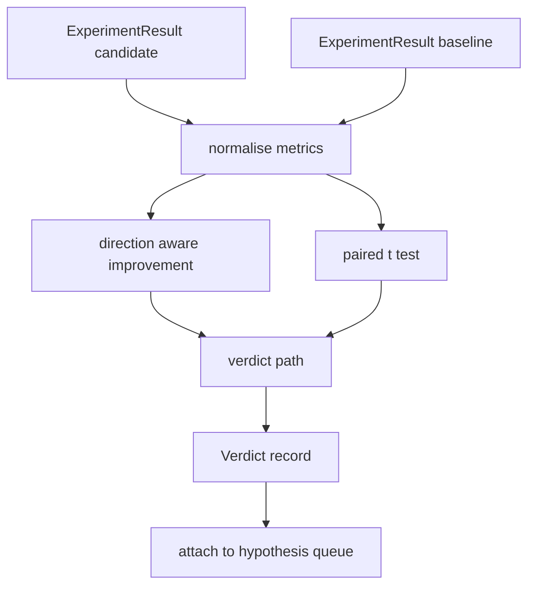

# Оценщик результатов

> Раннер выдал числа. Оценщик решает, представляют ли эти числа улучшение, регрессию или шум. Постройте путь вердикта, который превращает метрики в однострочный вывод.

**Тип:** Build**Языки:** Python**Предварительные требования:** Фаза 19 Track A уроки 20-29**Время:** ~90 минут
## Цели обучения
- Сравнивайте запуск кандидата с базовой линией, используя улучшение с учётом направления и фиксированный порог.
- Реализуйте парный t-тест с нуля на метриках по сидам и интерпретируйте итоговое p-значение.
- Нормализуйте метрики в логарифмическом масштабе, чтобы последующий отчёт мог смешивать их с линейными метриками.
- Формируйте вердикт для каждой гипотезы, который оркестратор сможет прикрепить к очереди из урока 50.
- Делайте каждый шаг чистым (pure), чтобы одни и те же входные данные всегда давали один и тот же вердикт.

## Зачем нужен парный тест

Одно число от раннера не говорит, реально ли изменение. Та же конфигурация с другим сидом даёт другую перплексию. Изменение может оказаться шумом. Правильное сравнение — парное: одни и те же сиды с одними и теми же данными, запущенные один раз с кандидатом и один раз с базовой линией. Каждый сид даёт свою разницу. Среднее этих разниц — это эффект. Стандартная ошибка этих разниц — уровень шума.

В уроке тест реализован с нуля. Никакого `scipy.stats`. Математика достаточно компактна, чтобы уместиться на одном экране.

```text
diffs    = [a_i - b_i for i in seeds]
mean     = sum(diffs) / n
variance = sum((d - mean) ** 2 for d in diffs) / (n - 1)
t_stat   = mean / sqrt(variance / n)
df       = n - 1
p_value  = two_sided_p(t_stat, df)
```

Двустороннее p-значение использует регуляризованную неполную бета-функцию. В уроке есть небольшая реализация, использующая непрерывную дробь Лентца (Lentz continued fraction). Всё вместе — шестьдесят строк математики на stdlib.

## Улучшение с учётом направления

Одни метрики улучшаются при росте (точность, пропускная способность). Другие улучшаются при снижении (функция потерь, перплексия, время выполнения). Оценщик хранит поле `direction` для каждой метрики.

```text
if direction == "higher_is_better":
    improvement = (candidate - baseline) / abs(baseline)
elif direction == "lower_is_better":
    improvement = (baseline - candidate) / abs(baseline)
```

Улучшение имеет знак. Отрицательное улучшение для метрики «чем выше, тем лучше» означает, что кандидат хуже. Путь вердикта учитывает знак и величину вместе.

Фиксированный порог (`improvement_threshold=0.02`, два процента) определяет, достаточно ли велико изменение, чтобы его засчитать. Ниже этого порога вердикт — «noise» независимо от p-значения; цикл не интересуют изменения, которые пользователь не смог бы измерить.

```figure
cg-paired-verdict
```

## Архитектура



Оценщик выполняет три независимых вычисления и объединяет их в пути вердикта. Каждое вычисление — чистая функция без общего состояния.

## Логарифмическая нормализация

Перплексия экспоненциально зависит от функции потерь. Снижение потерь на 0.1 даёт гораздо более сильное снижение перплексии. Сравнивать перплексию напрямую между двумя конфигурациями — нормально, но для смешивания её с линейными метриками в одном отчёте требуется нормализация.

В уроке любая метрика, у которой поле `scale` равно `"log"`, нормализуется взятием натурального логарифма перед вычислением улучшения. Затем порог применяется уже в логарифмическом пространстве. Снижение перплексии с 32 до 28 — это `log(28) - log(32) = -0.133` для метрики «чем ниже, тем лучше», что значительно превышает порог в два процента.

```text
if scale == "log":
    a = log(candidate)
    b = log(baseline)
else:
    a = candidate
    b = baseline
```

Метрики со `scale="linear"` (значение по умолчанию) пропускают это преобразование. Один и тот же код обрабатывает оба случая.

## Парный тест по сидам

Раннер из урока 52 выдаёт один финальный блок метрик на каждый запуск. Для парного теста оценщику нужен один блок на сид для кандидата и один на сид для базовой линии. Оркестратор запускает один и тот же эксперимент в обеих конфигурациях по списку сидов и передаёт оценщику два списка записей `ExperimentResult`.

Оценщик сопоставляет их по сиду (сид хранится в `result.metrics["seed"]`) и проходит по запрошенной метрике. Если сиды в двух списках не совпадают, оценщик выбрасывает `PairingError`. Оркестратору следует перезапустить.

## Структура Verdict

```text
Verdict
  hypothesis_id          : int
  metric                 : str
  direction              : "higher_is_better" | "lower_is_better"
  scale                  : "linear" | "log"
  candidate_mean         : float
  baseline_mean          : float
  improvement            : float       (signed, fraction; see direction rules)
  p_value                : float | None  (None if n < 2)
  significance_threshold : float
  improvement_threshold  : float
  verdict                : "improved" | "regressed" | "noise" | "failed"
  rationale              : str
```

Путь вердикта — это небольшая таблица решений:

```text
1. If any candidate result has terminal != "ok": verdict = "failed"
2. else if |improvement| < improvement_threshold:  verdict = "noise"
3. else if p_value is None or p_value > significance: verdict = "noise"
4. else if improvement > 0:                          verdict = "improved"
5. else:                                             verdict = "regressed"
```

Rationale — это однострочное понятное человеку предложение, которое оркестратор может залогировать вместе с идентификатором гипотезы.

## Как читать код

`code/main.py` определяет `MetricSpec`, `Verdict`, `Evaluator`, вспомогательные функции для t-статистики и неполной бета-функции, а также детерминированную демонстрацию. t-тест реализован исключительно на математике из stdlib; numpy используется только для чтения списка метрик и вычисления средних и дисперсий.

`code/tests/test_evaluator.py` покрывает путь «improved», путь «regressed», путь «noise» (малое улучшение), путь «noise» (малое n), путь «failed» из-за терминального состояния, путь с логарифмической нормализацией, t-тест против известного эталонного значения и ошибку сопоставления (pairing error).

## Где это встраивается

Урок 50 сформировал очередь гипотез. Урок 51 отфильтровал всё, что уже было решено литературой. Урок 52 запустил эксперимент в конфигурациях кандидата и базовой линии по сидам. Урок 53 читает эти запуски и записывает вердикт. Оркестратор сшивает эти четыре урока вместе:

```text
for hypothesis in queue:
    literature = retrieval.search(hypothesis.text)
    if literature_settles(hypothesis, literature):
        attach(hypothesis, verdict="settled")
        continue
    candidates = runner.run_all(specs_for(hypothesis))
    baselines  = runner.run_all(baseline_specs_for(hypothesis))
    metric_spec = MetricSpec("perplexity", direction=LOWER, scale=LOG)
    verdict = evaluator.evaluate(hypothesis.id, metric_spec, candidates, baselines)
    attach(hypothesis, verdict)
```

Этот оркестратор не входит в данный урок; четыре урока компонуются в него без какого-либо связующего кода, кроме dataclass-ов, которые определяет каждый из них.
