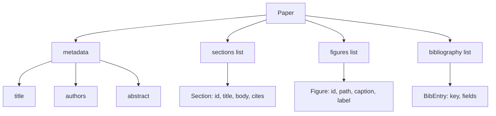
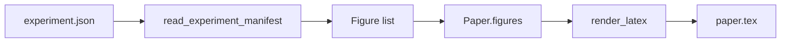
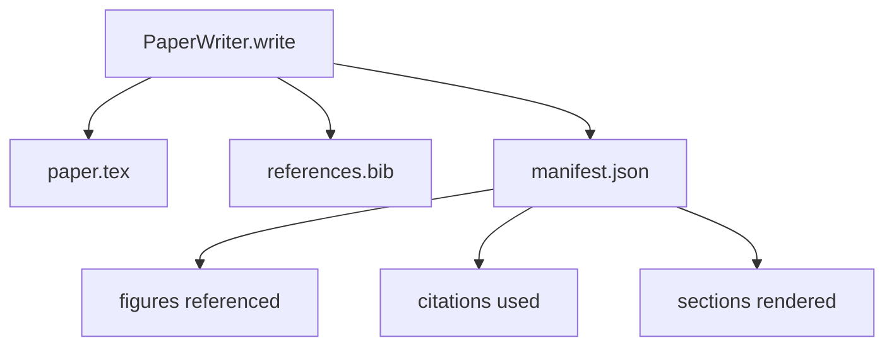

# Составитель статьи

> Скелет LaTeX — это контракт между исследователем и системой вёрстки. Если контракт нарушен, документ не компилируется, и ошибка становится явной. Сначала постройте скелет, затем заполните его.

**Тип:** Build**Языки:** Python**Предварительные требования:** Фаза 19 уроки 50-53**Время:** ~90 минут
## Цели обучения

- Рассматривайте научную статью как структурированный артефакт с заранее известным графом разделов, а не как документ произвольной формы.
- Генерируйте скелет LaTeX, который объявляет аннотацию, разделы, слоты для рисунков и ключи библиографии до того, как написана хоть строка текста.
- Внедряйте рисунки из результатов экспериментов (пути и подписи) в скелет через детерминированный механизм слотов.
- Подключите имитационный генератор текста, который заполняет каждый раздел на основе структурированного плана, чтобы харнесс можно было тестировать без модели.
- Формируйте один файл `paper.tex`, файл `references.bib` и манифест, перечисляющий все использованные рисунки и все использованные цитаты.

```figure
ch-paper-skeleton
```

## Почему сначала скелет

Черновик, который начинается с прозы, накапливает структурный долг. Введение обрастает тремя абзацами, которые на самом деле должны быть в разделе о смежных работах. На рисунок ссылаются раньше, чем он определён. В библиографии оказывается три ключа для одной и той же статьи. К тому моменту, когда автор это замечает, стоимость переписывания превышает стоимость написания.

Скелет переворачивает этот процесс. Структура объявляется заранее как данные. Разделы — это слоты с именами и порядком. Рисунки — это слоты с идентификаторами и подписями. Ключи библиографии объявляются в начале вместе с записями, на которые они указывают. Текст генерируется в эти слоты по одному. Харнесс может проверить, ещё до того как написан текст, что у каждого рисунка есть слот, у каждой цитаты есть запись, а каждый раздел присутствует в оглавлении.

Это та же дисциплина, которую предыдущие уроки применяли к планам, вызовам инструментов и трассировкам. Структура — это контракт.

## Форма Paper



Каждое поле — обычные данные Python. Рендерер — это чистая функция, которая превращает `Paper` в строку LaTeX. Харнесс может интроспектировать статью перед рендерингом: посчитать разделы, перечислить отсутствующие файлы рисунков, проверить, что каждому `\cite{key}` соответствует запись `BibEntry`.

## Контракт рендеринга

Рендерер гарантирует три свойства. Во-первых, каждый слот рисунка в скелете порождает блок `\begin{figure}` со стабильной меткой вида `fig:<id>`. Во-вторых, каждый раздел порождает `\section{}` со стабильной меткой вида `sec:<id>`, чтобы работали перекрёстные ссылки. В-третьих, библиография порождает блок `\bibliography`, чей файл `references.bib` содержит ровно те записи, что объявлены в статье, — не больше и не меньше.

Нарушение любого из этих свойств — это ошибка рендеринга, а не предупреждение. Скелет — это контракт; рендеринг, который молча теряет рисунок, — нарушение контракта.

## Внедрение рисунков из экспериментов

Предыдущие уроки этого трека формировали результаты экспериментов в виде JSON-манифестов. Каждый манифест содержит список артефактов с путями и короткими подписями. Составитель статьи читает этот манифест и создаёт записи `Figure`.



Внедрение детерминированно. Идентификаторы рисунков образуются из имени эксперимента и монотонного счётчика. Подписи берутся из манифеста. Пути нормализуются относительно выходного каталога статьи, чтобы LaTeX компилировался, даже если результаты экспериментов лежат в другом месте на диске.

## Имитационный генератор текста

Урок не обращается к модели. `MockProseGenerator` читает форму плана и детерминированно порождает текст. Форма плана — это одна короткая строка на раздел. Генератор разворачивает эту строку в два коротких абзаца, вплетая в них заголовок раздела. Сгенерированный текст называет по имени рисунки и цитаты именно тогда, когда план их объявляет.

Этого достаточно, чтобы протестировать всё поведение составителя. В реальной реализации генератор заменяется вызовом модели. Харнесс вокруг него не меняется. В этом ценность объявления генератора текста как вызываемого объекта (callable): тест подставляет детерминированный вариант, продакшен — вариант с моделью, а остальной конвейер остаётся неизменным.

## Выходной манифест

Составитель записывает три файла в выходной каталог.



Манифест — это то, что читает последующий оценщик или цикл критика. Он не разбирает LaTeX — он читает манифест. Следующий урок, цикл критика, принимает этот манифест на входе и формирует список отзывов. Именно поэтому манифест — часть контракта, а LaTeX — нет.

## Шлюзы валидации

Перед записью любого файла составитель прогоняет статью через четыре шлюза.

1. Идентификатор каждого рисунка уникален в пределах статьи.
2. Поле `cites` каждого раздела ссылается на ключ библиографии, объявленный в статье.
3. Аннотация не пуста.
4. Заголовок не пуст.

Непройденный шлюз вызывает исключение `PaperValidationError` с точной причиной. Харнесс отображает эту причину как режим отказа. Частичной записи не бывает: либо формируются все три файла, либо ни одного.

## Как читать код

Файл `code/main.py` определяет `Paper`, `Section`, `Figure`, `BibEntry`, `PaperValidationError`, `MockProseGenerator`, `PaperWriter` и функцию `render_latex`. Метод `write` принимает выходной каталог и формирует `paper.tex`, `references.bib` и `manifest.json`. Вспомогательная функция `read_experiment_manifest` преобразует список манифестов экспериментов в записи `Figure`.

Файл `code/tests/test_paper_writer.py` покрывает: рендеринг скелета без разделов, полный рендеринг с двумя разделами и двумя рисунками, шлюз отсутствующей цитаты, шлюз дублирующегося идентификатора рисунка, содержимое манифеста и контракт строки LaTeX (каждый раздел порождает `\section{}`, каждый рисунок порождает `\begin{figure}`).

## Что дальше

Реальной реализации пригодятся два расширения. Первое — рендеринг в несколько форматов: одна и та же форма `Paper` компилируется в Markdown для постов в блоге и в HTML для предпросмотра. Рендерер становится стратегией над `Paper`. Второе — обогащение цитат: составитель получает записи BibTeX по ключу цитаты, используя локальный кеш DOI. Оба расширения добавляют ценность, и оба можно добавить, не трогая контракт скелета.

Скелет — это ставка. Разделы, рисунки и цитаты объявлены как данные, текст сгенерирован в слоты, манифест сформирован вместе с LaTeX. Любое другое улучшение надстраивается поверх этого.
