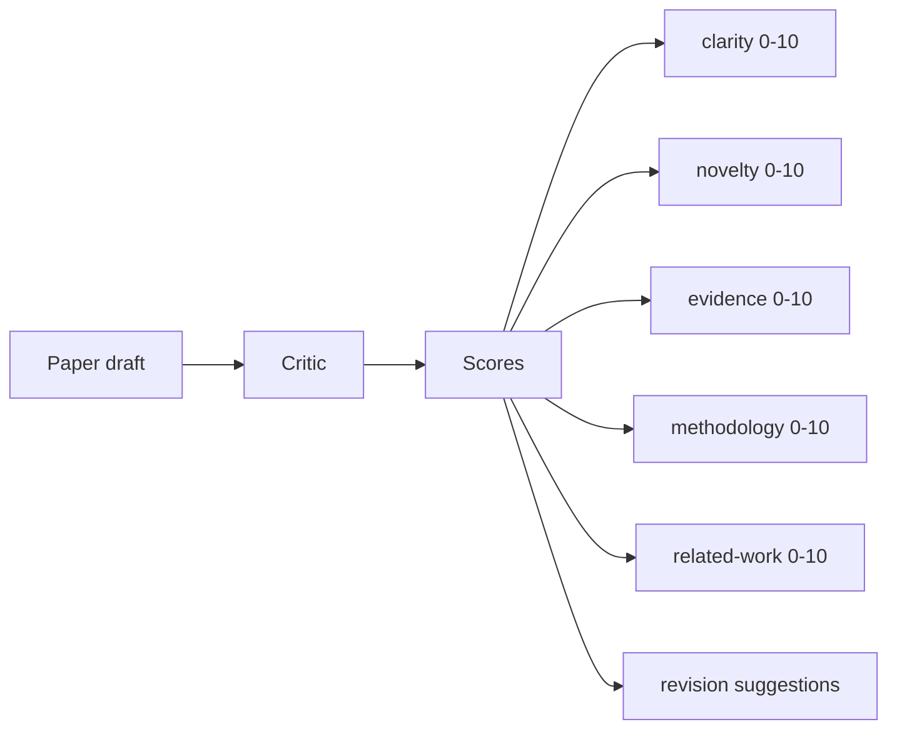
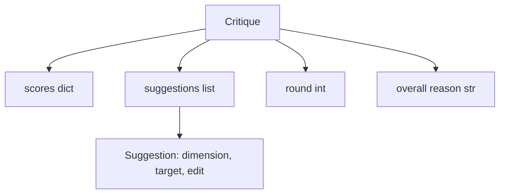
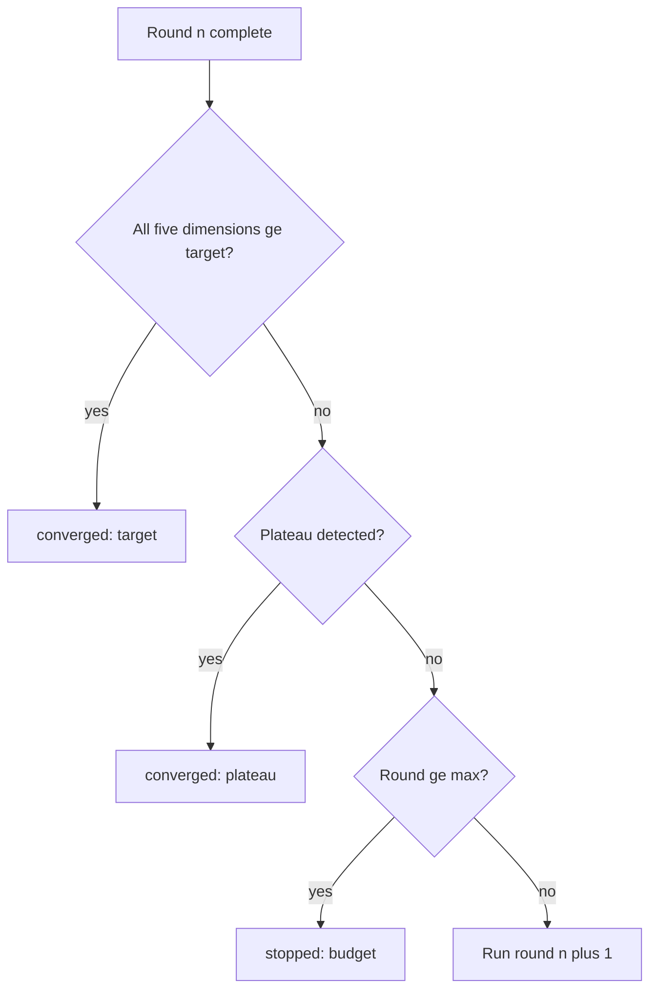
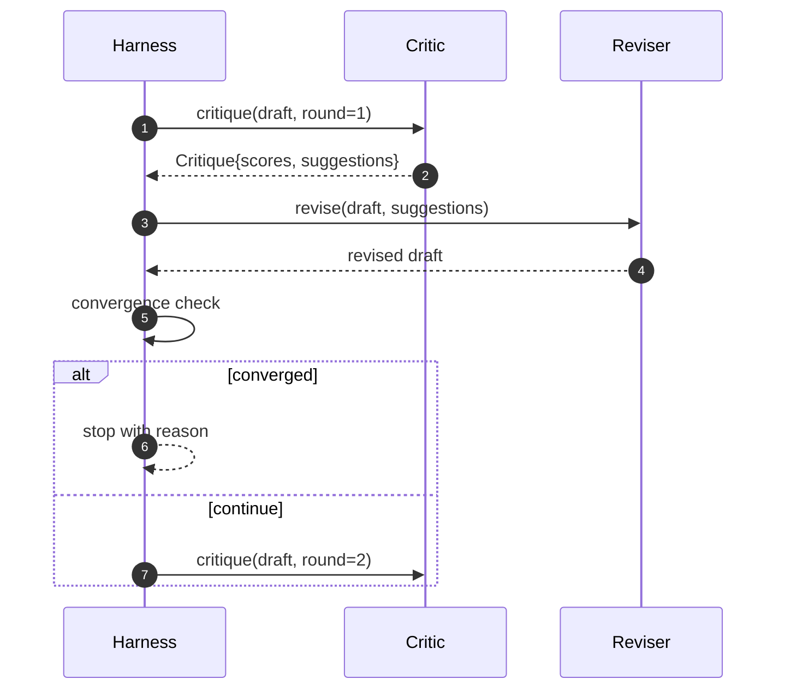

# Цикл критика

> Критик, который с первого раза отвечает «выглядит хорошо», сломан. Критик, который всегда отвечает «нужно доработать», тоже сломан. Интересен критик, который сходится, — а такую сходимость приходится проектировать.

**Тип:** Build**Языки:** Python**Предварительные требования:** Фаза 19 уроки 50-53**Время:** ~90 минут
## Цели обучения

- Оцените черновик статьи по пяти фиксированным измерениям: ясность, новизна, доказательность, методология, обзор связанных работ.
- Применяйте критику каждого раунда как структурированный diff правок, а не как свободную переписку.
- Определяйте сходимость, сравнивая оценки между раундами; останавливайтесь при выходе на плато, достижении целевого значения или исчерпании бюджета.
- Ограничивайте число раундов бюджетом максимальных итераций, чтобы несходящийся критик не работал бесконечно.
- Формируйте трассировку по каждому раунду, чтобы дашборд или следующий этап могли отобразить траекторию оценок.

```figure
ch-critic-converge
```

## Почему пять фиксированных измерений

Критик со свободной формой ответа — это модель, которая возвращает абзац предложений. Правка следующего раунда воспринимает этот абзац как окружающий контекст. Проверить, устраняет ли переписанный текст замечания критики, невозможно, потому что сама критика никогда не имела структуры.

Пять измерений задают харнессу контракт.



Оценка — это вектор. Харнесс отслеживает каждое измерение по раундам. Правка, которая повышает ясность, но обрушивает доказательность, — это регресс по доказательности, и проверка сходимости его видит. Критик, полагающийся только на модель, такой гарантии дать не может.

## Структура Critique



Каждое предложение (suggestion) содержит измерение, которое оно улучшает, раздел, на который оно нацелено, и инструкцию `edit`, которую может применить редактор (reviser). Редактор — тоже вызываемый объект (callable). В уроке используется детерминированный редактор, который интерпретирует инструкцию edit как операцию добавления текста в конец раздела. Редактор на основе модели интерпретировал бы то же поле как промпт. Контракт при этом не меняется.

## Правила сходимости по порядку

Цикл критика завершается, когда срабатывает любое из трёх условий.



Целевое условие (target) — самый строгий случай: каждое из пяти измерений (clarity, novelty, evidence, methodology, related_work) должно достичь `>= target_score` (по умолчанию `8.0`), прежде чем цикл вернёт успех. Высокого среднего значения при одном слабом измерении недостаточно. Обнаружение плато сравнивает среднее значение текущего раунда со средним значением предыдущего раунда. Если улучшение оказывается меньше `plateau_epsilon` (по умолчанию `0.1`) в течение двух раундов подряд, цикл завершается с результатом `plateau`. Бюджет — это жёсткое ограничение числа раундов (по умолчанию `5`), и при его исчерпании цикл завершается с результатом `budget`.

Порядок имеет значение. Целевое условие имеет приоритет над плато, а плато — над бюджетом. Если третий раунд достигает целевого значения в той же итерации, которая также вызвала бы срабатывание плато, результатом будет `target`, а не `plateau`.

## Почему обнаружение плато выполняется на протяжении двух раундов

Плато длиной в один раунд — это шум. Реальный критик на каждой итерации возвращает немного отличающуюся оценку даже для неизменного черновика, потому что детерминированное оценивание всё равно зависит от того, какие предложения были применены и в каком порядке. Требование двух подряд идущих раундов плато отфильтровывает этот шум. Если харнесс сообщает о плато, значит черновик действительно перестал улучшаться.

## Детерминированный критик в этом уроке

Урок не обращается к модели. Поставляемый критик — это вызываемый объект, который оценивает черновик на основе трёх сигналов: средняя длина текста раздела (ясность), количество рисунков и количество цитирований (доказательность) и поле `originality_tag` в метаданных статьи (новизна). Редактор знает, как поднять каждую из оценок.

```text
clarity      grows when the average section body length increases
novelty      grows when originality_tag is set to "high"
evidence     grows when a section's figure_refs is non-empty
methodology  grows when a section titled "Method" exists with body
related-work grows when a section titled "Related Work" exists with body
```

Редактор интерпретирует каждое предложение как целевое добавление текста. Уже после первого раунда харнесс может наблюдать рост оценки. Тесты используют это свойство, чтобы проверить, что цикл сокращает разрыв.

## Полный контракт цикла



Харнесс владеет счётчиком раундов, трассировкой и проверкой сходимости. Критик владеет оценкой. Редактор владеет диффом правок. Ни один из трёх компонентов не трогает состояние остальных.

## Вывод трассировки

Каждый раунд порождает одно событие трассировки с номером раунда, вектором оценок, количеством предложений и вердиктом о сходимости. Полная трассировка возвращается вместе с итоговым черновиком. Дашборд ниже по потоку может отрисовать график оценок по раундам. Следующий урок, планировщик итераций, читает трассировку, чтобы решить, стоит ли сохранять эту ветку.

## Бюджеты, которые защищают от плохих критиков

Критик, чьи предложения никогда не улучшают оценку, заблокирует цикл на потолке максимального числа итераций. Трассировка делает это видимым: пять раундов, оценки не меняются, вердикт `budget`. Пользователь прочитает это как ошибку критика, а не ошибку черновика. Альтернатива — показывать только итоговый черновик — скрывает диагностику. Подход «сначала трассировка» её проявляет.

## Как читать код

`code/main.py` определяет `Critique`, `Suggestion`, протокол `Critic`, протокол `Reviser`, `CriticLoop`, а также фабрику `make_deterministic_critic_pair`, которая возвращает детерминированного критика и соответствующий редактор. Также включена минимальная структура `Paper`, чтобы урок был самодостаточным.

`code/tests/test_critic_loop.py` покрывает: монотонное улучшение после первого раунда, сходимость к цели на настроенном черновике, обнаружение плато после двух раундов без изменений, исчерпание бюджета, когда ни одно предложение не улучшает оценку, применение предложений редактором и структуру трассировки.

## Что дальше

Два расширения, которые понадобятся в реальной реализации. Первое — веса измерений: для статьи на воркшоп новизна весит больше, чем методология; для журнала — наоборот. Проверка сходимости превращается во взвешенное среднее. Второе — парные критики: один критик выставляет оценки, второй критик рассматривает предложения прежде, чем их увидит редактор. Оба расширения добавляют ценность, оба компонуются на той же структуре `Critique`.

Ставка делается на вектор оценок. Как только критика структурирована, любое другое улучшение — правило сходимости, дашборд, парный критик — встраивается без изменения самого цикла.
