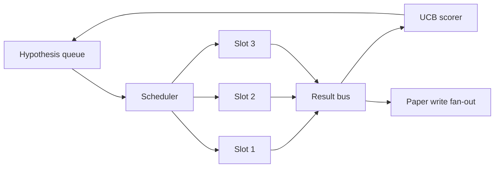
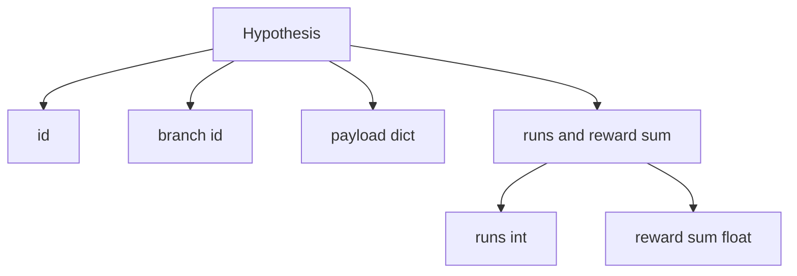
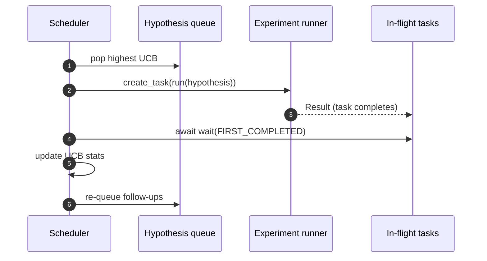

# Планировщик итераций

> Исследовательский цикл без планировщика — это очередь с иллюзиями. Планировщик — то место, где цикл решает, что перестать исследовать, и в этом решении вся суть игры.

**Тип:** Build**Языки:** Python**Предварительные требования:** Фаза 19 уроки 50-53**Время:** ~90 минут
## Цели обучения

- Смоделируйте рабочий процесс исследования как очередь гипотез, которая наполняет параллельные слоты экспериментов, а их результаты стекаются обратно.
- Запускайте несколько экспериментов параллельно с помощью asyncio, чтобы планировщик мог держать все слоты занятыми.
- Оценивайте каждую ветку гипотез с помощью UCB, чтобы планировщик мог отсекать малоперспективные ветки, не отказываясь от исследования.
- Направляйте завершённые результаты веерно на этап записи статьи и на этап повторной постановки в очередь, чтобы высокоотдачная ветка порождала гипотезы-продолжения.
- Показывайте трассировку по каждой итерации с оценками веток, занятостью слотов и решениями об отсечении.

```figure
ch-ucb-scheduler
```

## Почему нужен планировщик, а не просто список задач

Плоский список задач выполняет задания в порядке поступления. Это нормально, когда каждое задание независимо. Исследование не является независимым: находка из эксперимента три меняет приоритет экспериментов четыре и пять. Планировщик, который считывает поступающие результаты (fan-in) и переупорядочивает очередь, выполняет больше полезной работы на единицу вычислений.

Интересный момент в проектировании — правило оценки. Жадный оценщик всегда выбирает текущего лидера и никогда не исследует новые варианты. Равномерный оценщик никогда не эксплуатирует найденное. Верхняя доверительная граница (UCB) — это средний путь: эксплуатировать лидера, одновременно резервируя ресурсы для веток, которые пробовались меньше.

## Структура системы



Очередь хранит гипотезы. Планировщик выбирает гипотезу с наивысшим UCB, когда освобождается слот. Каждый слот выполняет эксперимент асинхронно. Завершённые эксперименты направляют свой результат на шину. Шина обновляет статистику UCB для исходной ветки и веерно передаёт результат на этап записи статьи, когда отдача ветки превышает порог.

## Структура Hypothesis



`branch` — это ключ для статистики UCB. Несколько гипотез могут иметь общую ветку (ветка — это направление исследования; гипотеза — это одна попытка внутри него). `runs` — количество завершённых экспериментов для этой ветки, `reward_sum` — суммарная награда. UCB использует оба значения.

## Оценка UCB

Формула UCB, используемая в этом уроке, — это классическая UCB1.

```text
ucb(branch) = mean_reward(branch) + c * sqrt( ln(total_runs) / runs(branch) )
```

`total_runs` — это количество всех экспериментов, завершённых по всем веткам. `c` — вес исследования; по умолчанию в уроке используется `sqrt(2)`. Ветка с нулевым количеством запусков получает `+inf`, поэтому неопробованные ветки всегда планируются первыми. Ветка с высокой средней наградой сохраняет высокий балл, пока остальные ветки её не догонят; ветка, которая запускалась много раз без существенной награды, отступает перед менее используемыми альтернативами.

Механизм отсечения отделён от механизма выбора. Отсечение удаляет ветку из дальнейшего планирования, если её средняя награда опускается ниже абсолютного порога (по умолчанию `0.2`) после как минимум `prune_after_runs` попыток (по умолчанию `3`). Это удерживает очередь в разумных границах.

## Параллельные слоты с asyncio

Планировщик запускает эксперименты через `asyncio.create_task`. Каждая задача выполняет исполнитель эксперимента (вызываемый объект `async def`), который возвращает `Result`. Основной цикл ожидает набор выполняющихся задач с помощью `asyncio.wait(..., return_when=asyncio.FIRST_COMPLETED)` и запускает обновление оценки при каждом завершении.



Три слота работают параллельно. Основной цикл никогда не блокируется на одном эксперименте. Планировщик продолжает запускать новые задачи, как только освобождается слот, пока очередь не опустеет и не останется выполняющихся задач.

## Веерное распределение: триггеры статьи

Когда средняя награда ветки превышает `paper_threshold` (по умолчанию `0.7`) и эта ветка ещё не выпустила статью, планировщик направляет событие `paper.trigger` в выходной список. Далее по цепочке его подхватил бы составитель статьи из урока пятьдесят четыре. В этом уроке триггер просто фиксируется в списке, чтобы тесты могли его проверить.

## Веерное распределение: гипотезы-продолжения

Когда поступает результат с высокой отдачей, планировщик может вызвать предоставленный пользователем `expander`, чтобы породить одну или несколько гипотез-продолжений в той же ветке. Expander — это чистая функция из `Result` в `list[Hypothesis]`. В уроке поставляется детерминированный expander, который создаёт две гипотезы-продолжения для любого результата с наградой выше порогового значения для статьи.

## Бюджеты

Два бюджета защищают планировщик от неконтролируемых циклов.

```text
max_experiments    : total count of experiments run across all branches
max_seconds        : wall-clock cap (asyncio time)
```

Когда срабатывает любой из них, планировщик прекращает планирование новых задач, дожидается завершения выполняющихся и возвращает итоговую трассировку. Трассировка включает `stop_reason`.

## Трассировка и итоговый отчёт

Каждое решение планировщика (выбор, отправка, результат, отсечение, веерное распределение) порождает одно событие. Итоговый отчёт суммирует статистику по каждой ветке, общее количество запусков, общее время выполнения и сработавшие триггеры статей. Следующий урок, сквозная демонстрация, читает этот отчёт, чтобы управлять составителем статьи.

## Как читать код

`code/main.py` определяет `Hypothesis`, `Result`, `BranchStats`, `IterationScheduler` и фабрику `make_deterministic_runner`, которая возвращает исполнитель эксперимента asyncio с предсказуемыми наградами. Исполнитель «засыпает» на фиксированное время `delay_ms` (по умолчанию `5ms`), чтобы параллелизм можно было наблюдать.

`code/tests/test_scheduler.py` покрывает: выбор UCB неопробованных веток в первую очередь, занятость параллельных слотов, срабатывание триггеров статьи при пересечении порога, отсечение веток после попыток с низкой отдачей, веерное распределение гипотез-продолжений и выход по бюджету (как по количеству экспериментов, так и по времени).

## Что дальше

Три расширения, которые понадобятся реальной реализации. Во-первых, сохранение статистики UCB между сеансами: текущая статистика хранится только в памяти; реальный планировщик сохранял бы её в контрольных точках, чтобы перезапуск не терял уже потраченный бюджет исследования. Во-вторых, многокритериальная оценка: вместо скалярной награды каждый результат выдаёт вектор, и UCB превращается в отбор в духе Парето. В-третьих, контекстные бандиты: механизм выбора учитывает признаки гипотезы (длину, сложность), так что похожие гипотезы делят между собой бюджет исследования.

Планировщик — это место, где исследование становится больше, чем просто список задач. Как только UCB подключён и слоты работают параллельно, все остальные улучшения выстраиваются поверх этой основы.
