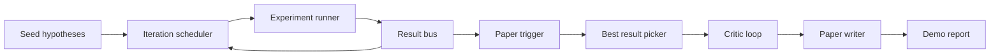
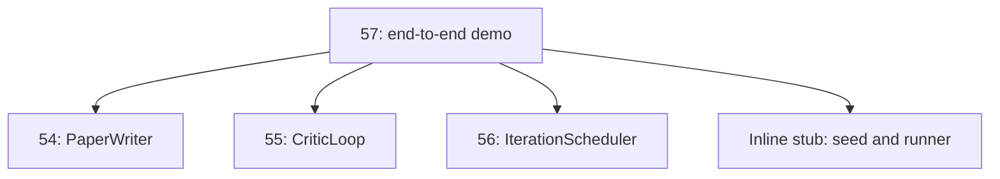
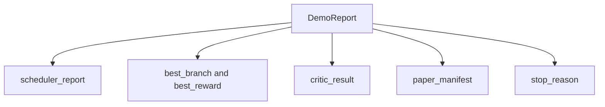

# Сквозная демонстрация исследования

> Демонстрация — это место, где должен компоноваться (compose) каждый написанный вами ранее контракт. Если хоть один из них даёт течь, демонстрация — тот самый урок, который это выявляет.

**Тип:** Build**Языки:** Python**Предварительные требования:** Фаза 19 уроки 50-53**Время:** ~90 минут
## Цели обучения

- Соберите цикл автоматического исследования (auto-research loop) сквозным образом: seed гипотез, исполнитель экспериментов, планировщик, цикл критика, составитель статьи.
- Скомпонуйте примитивы из четырёх предыдущих уроков трека D через обычные Python-импорты, а не через фреймворк.
- Прогоните цикл до самостоятельного завершения и получите единый демонстрационный отчёт, перечисляющий вывод каждого этапа.
- Сохраните детерминированность демонстрации, чтобы набор тестов мог проверить итоговую форму.
- Обеспечьте чёткий режим отказа при нарушении контракта любого этапа, чтобы следующий этап не запускался с повреждённым входом.

```figure
ch-research-pipeline
```

## Что здесь компонуется



Пять этапов. Seed — это список из трёх гипотез. Планировщик прогоняет по ним шесть экспериментов с тремя параллельными слотами. Шина результатов (result bus) сообщает об одном или нескольких триггерах статьи (paper trigger). Отборщик (picker) выбирает единственный лучший результат. Цикл критика итеративно дорабатывает черновик, построенный на основе этого результата. Составитель статьи формирует итоговые LaTeX, BibTeX и манифест.

## Почему импорт, а не копирование

Каждый из предыдущих уроков поставляет `main.py` с публичными dataclass и функциями. Демонстрация импортирует их, добавляя в `sys.path` родительский каталог каждого урока. Это не связывание (wiring) через фреймворк — это тот же самый импорт, который уже используют тестовые файлы в предыдущих уроках.



Встроенная заглушка (inline stub) подменяет собой уроки с пятидесятого по пятьдесят третий: небольшой генератор начальных гипотез и синхронную функцию вознаграждения. Пользователь может заменить встроенную заглушку на настоящие примитивы из этих уроков, изменив два импорта.

## Гарантии детерминированности

Демонстрация детерминирована по построению. Исполнитель экспериментов использует numpy с фиксированным сидом. Редактор (reviser) цикла критика проходит по фиксированным измерениям в фиксированном порядке. Генератор прозы составителя статьи — это мок-версия (mocked) из пятьдесят четвёртого урока. UCB-отборщик планировщика разрешает ничьи (ties) по порядку итераций, а не случайным выбором.

При одинаковом сиде демонстрация выдаёт одинаковый отчёт. Тест проверяет это свойство, запуская демонстрацию дважды и сравнивая манифест.

## Структура демонстрационного отчёта



Каждое поле поступает буквально (verbatim) из вышестоящего этапа. Демонстрация не преобразует ни один из выводов — она их компонует. В этом и заключается проверка, которой является сама демонстрация.

## Обработка режимов отказа

Каждый этап либо завершается успешно, либо выбрасывает типизированную ошибку.

```text
Scheduler ........ returns SchedulerReport with stop_reason
                   in {queue_empty, max_experiments, deadline}
Best-result pick . raises NoTriggerError if no paper trigger fired
Critic loop ...... returns LoopResult with status converged or stopped
Paper writer ..... raises PaperValidationError on contract break
```

Отказ на любом этапе прерывает демонстрацию (short-circuits) типизированным исключением. Тесты фиксируют этот контракт: `test_no_triggers_raises_typed_error` и `test_best_picker_raises_when_no_triggers` проверяют, что отборщик выбрасывает `NoTriggerError` / `BestResultError`, когда ни одна ветка не инициировала триггер, и составитель статьи ни разу не вызывается.

## Отборщик лучшего результата

Планировщик генерирует триггеры статьи для каждой ветки. Отборщик выбирает ветку с наибольшим средним вознаграждением среди всех триггеров. Ничьи разрешаются по алфавитному порядку id ветки, поэтому демонстрация остаётся детерминированной. Отборщик — это небольшая чистая функция; тест фиксирует её поведение на заданном отчёте планировщика.

## Связывание цикла критика

Цикл критика из пятьдесят пятого урока работает с `MiniPaper`. Демонстрация строит `MiniPaper` из выбранной ветки: заполняет аннотацию (abstract) идентификатором ветки, создаёт две начальные секции (Introduction и Results) и задаёт `originality_tag` на основе среднего вознаграждения ветки (high, если `>= 0.8`, medium, если `>= 0.6`, иначе low).

Затем редактор итеративно дорабатывает черновик до сходимости (convergence). Результат передаётся составителю статьи.

## Связывание составителя статьи

Составитель статьи из пятьдесят четвёртого урока работает с полной формой `Paper`, включающей рисунки (figures) и библиографию. Демонстрация преобразует сошедшийся `MiniPaper` в полную статью через `mini_to_full_paper`, которая прикрепляет один рисунок для выбранной ветки и небольшую синтетическую библиографию, собранную из объединения ключей цитирования (cite keys), предложенных критиком. Каждая цитата, которую добавляет демонстрация, также добавляется в список библиографии, поэтому проверка (validation) проходит успешно.

## Как читать код

`code/main.py` определяет `BestResultError`, `NoTriggerError`, `DemoReport`, `pick_best_branch`, `build_mini_paper`, `mini_to_full_paper` и `run_demo`. Импорты в начале файла один раз настраивают `sys.path` и подтягивают `PaperWriter`, `CriticLoop` и `IterationScheduler` из соответствующих уроков.

`code/tests/test_e2e.py` покрывает: демонстрация выполняется сквозным образом и выдаёт отчёт со всеми пятью заполненными полями, детерминированность при двух прогонах, NoTriggerError, когда ни одна ветка не пересекает порог, PaperValidationError, когда нарушается контракт автора статьи, наличие рисунка выбранной ветки в манифесте статьи, а также что причина остановки планировщика — одно из ожидаемых значений.

## Что дальше

Есть три расширения, которые стоит подключить (wire), когда демонстрация «зелёная» (green). Во-первых, устойчивое состояние (persistent state): результат каждого этапа записывается в небольшое JSON-хранилище, чтобы перезапуск мог возобновить работу без повторного выполнения дешёвых этапов. Во-вторых, дашборд: события трассировки (trace events) от планировщика и цикла критика отображаются в виде единой временной шкалы. В-третьих, настоящие вызовы модели: замените мок-версию генератора прозы и детерминированного критика на управляемые моделью версии — связывание при этом не меняется.

Задача демонстрации — доказать, что компоновка и есть архитектура. Пять уроков, четыре импорта, один отчёт. В следующий раз, когда вы добавите этап, связывание вырастет ровно на одну строку.
