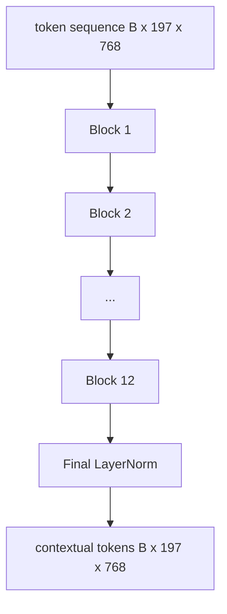
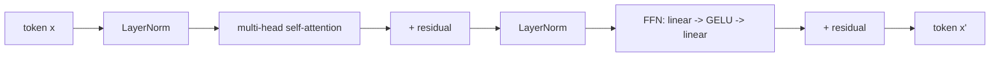

# Энкодер Vision Transformer

> Патчи сами по себе не видят. 12-слойный pre-LN трансформер с 12 головами внимания превращает последовательность патч-токенов в последовательность контекстных токенов, а токен CLS выполняет пулинг признаков всего изображения в своём финальном скрытом состоянии. Этот урок — машинное отделение любой современной vision-language модели.

**Тип:** Build**Языки:** Python**Предварительные требования:** Фаза 19 уроки 30-37 (основы Track B)**Время:** ~90 минут
## Цели обучения

- Реализуйте pre-LN блок трансформера с многоголовым self-attention и feed-forward подслоем.
- Соберите 12 блоков с 12 головами, чтобы сформировать энкодер ViT-Base.
- Подключите патч-фронтенд из урока 58 к энкодеру и выполните прямой проход.
- Проверьте, что токен CLS агрегирует информацию от каждого патча.

## Проблема

Патч-эмбеддинг производит последовательность из 197 токенов, каждый — вектор, ничего не знающий о других патчах. Изображению кота нужно, чтобы каждый патч знал, какие патчи содержат усы, какие — фон, а какие — глаз. Трансформер — это механизм, который строит эту осведомлённость, по одному слою внимания за раз. Без него патч-фронтенд — это хитрый токенизатор без какого-либо понимания.

Стандартный рецепт — двенадцать блоков в глубину, двенадцать голов в ширину, с расположением pre-LayerNorm, активацией GELU и расширением feed-forward в 4 раза. Этот рецепт — основа CLIP ViT-L, SigLIP, DINOv2, семейства Qwen-VL, InternVL и любого другого open-weight визуального энкодера 2025-2026 годов. Рецепт достаточно устойчив, чтобы вы могли прочитать любую из этих статей и предполагать именно такую форму блока, если явно не сказано иначе.

## Концепция





### Pre-LN против post-LN

Оригинальный Transformer размещал LayerNorm после residual. Pre-LN (LayerNorm перед каждым подслоем) — версия, которую использует каждая современная vision-language модель, потому что она стабильно обучается без трюков с разогревом скорости обучения (learning-rate warm-up). Разница — это одна строка в прямом проходе, а поток градиента на глубине 12+ слоёв отличается кардинально.

### Многоголовое self-attention

Каждая голова проецирует вектор токена в свою собственную тройку `(query, key, value)` с размерностью `head_dim = hidden / num_heads`. При `hidden = 768` и `heads = 12` у каждой головы `dim = 64`. 12 голов выполняют внимание параллельно, затем их выходы конкатенируются обратно в размерность 768 и проходят через выходную проекцию. Смысл multi-head в том, что одна голова может научиться «обращать внимание на глаз кота», а другая — «обращать внимание на градиент фона», без взаимных помех.

### Почему расширение feed-forward в 4 раза

FFN идёт по пути `hidden -> 4 * hidden -> hidden` с GELU посередине. Коэффициент 4 эмпирический и остаётся неизменным для языковых и визуальных трансформеров с 2017 года. Меньший коэффициент (2x) даёт недообучение; больший (8x) даёт переобучение при фиксированном бюджете данных. MLP — это место, где модель хранит большую часть выученных фактов, и более широкая середина — то место, где они располагаются.

| Компонент | Параметры в масштабе ViT-Base |
|-----------|------------------------------|
| проекция qkv на блок | `3 * 768 * 768 = 1.77M` |
| выходная проекция на блок | `768 * 768 = 590K` |
| FFN на блок (расширение 4x) | `2 * 768 * 4 * 768 = 4.72M` |
| LayerNorm на блок | `4 * 768 = 3K` |
| Итого на блок | около 7.1M |
| 12 блоков | около 85M |
| Плюс фронтенд | около 86M всего |

ViT-Base — это энкодер с 86M параметров. Это немного по меркам 2026 года (SigLIP-So400M — 400M, Qwen-VL ViT — 675M), но архитектура идентична с точностью до ширины и глубины.

### Каузальная маска или нет?

Vision Transformer — только энкодер и двунаправленный: токен `i` может обращать внимание на токен `j` для любой пары. Без маски. Cross-attention на стороне декодера в уроке 61 будет использовать каузальную маску, но внутри визуального энкодера внимание полносвязное.

### Чему обучается токен CLS

Токен CLS начинается как обучаемый параметр, не имеет собственного содержимого патчей и накапливает информацию через внимание во всех блоках. К финальному слою строка CLS — это векторная сводка всего изображения; последующие головы проецируют этот единственный вектор в логиты классов, контрастивные эмбеддинги или ключи cross-attention для текстового декодера.

```figure
ch-cls-funnel
```

## Постройте это

`code/main.py` реализует:

- `MultiHeadSelfAttention` с проекциями `qkv` и выходной проекцией, математикой scaled-dot-product attention и проверками форм.
- `FeedForward` — GELU MLP с расширением 4x.
- `Block` — pre-LN блок, объединяющий подслои внимания и feed-forward с residual-соединениями.
- `ViT` — стек из 12 блоков с финальным LayerNorm.
- `VisionEncoder`, который подключает `VisionFrontEnd` из урока 58 к стеку `ViT` и предоставляет `forward()`, возвращающий контекстную последовательность и агрегированный вектор CLS.
- Демо, которое пропускает синтезированное фиктивное изображение 224x224 через полный энкодер и печатает форму входа, форму выхода, количество параметров и норму CLS на каждом втором слое.

Запустите:

```bash
python3 code/main.py
```

Вывод: фиктивное изображение кодируется в тензор `(1, 197, 768)`. Норма CLS дрейфует вверх по мере прохождения слоёв, затем стабилизируется на финальном LayerNorm. Общее число параметров — около 86M.

## Применение

Энкодер, определённый здесь, с точностью до ширины и глубины — тот же стек блоков, что используется внутри любой open-weight VLM в 2025-2026 годах. Различия заключаются в следующем:

- **Ширина и глубина.** ViT-Large — это `hidden=1024, depth=24, heads=16`; SigLIP So400M — `hidden=1152, depth=27, heads=16`. Тот же блок.
- **Голова пулинга.** CLS-пулинг (этот урок) против усредняющего пулинга (SigLIP) против пулинга с вниманием (более поздние VLM).
- **Обработка позиции.** Фиксированная синусоидальная (урок 58) против обучаемой 1D против ALiBi против 2D RoPE. Математика блока не меняется.
- **Register-токены.** DINOv2 добавляет в начало 4 дополнительных обучаемых токена. Одна строка кода.

Этот стек блоков — субстрат. Следующие уроки (60-63) строятся поверх него.

## Тесты

`code/test_main.py` покрывает:

- один блок сохраняет форму и инвариантен к размеру батча на входе
- оценки внимания суммируются в единицу по оси ключей (проверка адекватности softmax)
- residual-пути подключены (нулевой вход всё равно даёт ненулевой выход через токен CLS)
- прямой проход через стек из 4 слоёв даёт правильную форму
- градиенты доходят до проекции патчей от выхода CLS

Запустите их:

```bash
python3 -m unittest code/test_main.py
```

## Упражнения

1. Добавьте register-токены (4 обучаемых вектора, добавленных после CLS) и запустите заново. Сравните гладкость карты внимания через энтропию распределения softmax на последнем слое.

2. Замените pre-LN на post-LN и обучите одну эпоху на синтетическом классификаторе форм. Понаблюдайте, какой вариант стабильно обучается без LR warm-up.

3. Реализуйте каузальное маскирование как аргумент `attn_mask`, чтобы тот же блок можно было переиспользовать в качестве блока декодера. Форма маски — `(seq, seq)`, нижнетреугольная.

4. Профилируйте прямой проход при размерах батча 1, 8, 64 с помощью `torch.profiler`. Слой MLP доминирует по времени выполнения, а не внимание.

5. Замените проекции q-k-v одной головы внимания на низкоранговый LoRA-адаптер, заморозьте остальное и убедитесь, что градиент проходит только там, где ожидается.

## Ключевые термины

| Термин | Что это значит |
|------|---------------|
| Pre-LN | LayerNorm применяется перед каждым подслоем, а не после |
| Self-attention | Каждый токен обращает внимание на каждый другой токен в той же последовательности |
| Multi-head | Скрытая размерность разделена на `H` независимых голов внимания |
| FFN expansion | Feed-forward слой расширяется до `4 * hidden`, прежде чем сжаться |
| CLS pooling | Использование финального скрытого состояния первого токена как сводки изображения |

## Дополнительное чтение

- An Image is Worth 16x16 Words (ViT, 2021) — рецепт энкодера.
- DINOv2 (2023) — register-токены и цель самообучаемого предобучения.
- SigLIP (2023) — вариант с усредняющим пулингом и сигмоидная контрастивная функция потерь, используемая в уроке 62.
