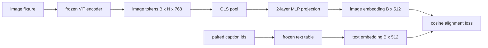

# Слой проекции для согласования модальностей

> Энкодер изображений производит токены изображения. Текстовый декодер потребляет текстовые токены. Эти два пространства — разные векторные пространства. Небольшой двухслойный MLP проецирует токены изображения в пространство эмбеддингов текста, а функция потерь косинусного согласования относительно парной подписи стягивает эти два пространства в соответствие. Эта проекция — самая маленькая часть визуально-языковой модели и именно та её часть, что важнее всего для переноса (transfer).

**Тип:** Build**Языки:** Python**Предварительные требования:** Фаза 19 уроки 30-37 (Track B foundations)**Время:** ~90 минут
## Цели обучения

- Постройте двухслойную MLP-проекцию, которая отображает признаки изображения в пространство эмбеддингов текста.
- Постройте фиктивную таблицу текстовых эмбеддингов (без предобученного токенизатора, без реального корпуса).
- Вычислите функцию потерь косинусного согласования между спроецированными токенами изображения и эмбеддингом парной подписи.
- Обучите только проекцию при замороженном энкодере изображений и замороженной текстовой таблице.

## Проблема

У вас есть энкодер изображений (уроки 58–59), производящий токены размерности `vision_hidden = 768`. У вас есть текстовый декодер, который вы хотите пристроить сверху, с размерностью эмбеддингов `text_hidden = 512` (любое другое число столь же правдоподобно). Декодер ожидает токены текстовой формы. Токены изображения не имеют текстовой формы: они живут в базисе, который энкодер выучил во время предобучения только на изображениях, и этот базис никак не связан со словными векторами декодера.

Двухслойная MLP-проекция (линейный слой, GELU, линейный слой) устраняет этот разрыв. Она достаточно мала (около `768 * 1024 + 1024 * 512 = 1.3M` параметров), чтобы обучаться за считанные минуты на одном GPU, и это единственная часть, которой нужно учиться на этапе согласования. Энкодер изображений остаётся замороженным. Таблица текстовых эмбеддингов остаётся замороженной. Меняется только проекция. Это тот же рецепт, который LLaVA представила в 2023 году, который BLIP-2 переосмыслила как Q-Former, и который с тех пор в том или ином виде переняла каждая VLM с открытыми весами.

## Концепция



### Пулинг перед проекцией

Энкодер изображений выдаёт 197 токенов. На текстовой стороне — единственный эмбеддинг уровня подписи. Чтобы согласовать их, вам нужен один вектор уровня изображения на каждый пример. CLS-пулинг — самый простой вариант: взять первый токен от энкодера и спроецировать его. Средний пулинг (mean pooling) по всем 197 токенам — другой вариант, и именно его использует SigLIP. Оба способа сжимают 197 векторов в один.

### Почему два слоя, а не один

Один линейный слой проекции может поворачивать и масштабировать, но не может исправить базис, если у двух пространств не совпадает кривизна. GELU между двумя линейными слоями даёт проекции один нелинейный изгиб, и эмпирически этого достаточно, чтобы согласовать признаки в стиле CLIP с эмбеддингами языковой модели. Более глубокие проекции (LLaVA-NeXT использовала GLU; Qwen-VL использовала стек слоёв внимания) — это расширения; двухслойный MLP — канонический базовый вариант, и именно он лежит в основе проекционной головы Q-Former в BLIP-2.

| Слой | Форма | Параметры |
|-------|-------|------------|
| fc1 | `(vision_hidden, projection_hidden)` | `768 * 1024 + 1024` |
| активация | GELU | 0 |
| fc2 | `(projection_hidden, text_hidden)` | `1024 * 512 + 512` |

Около 1.3M параметров для головы `768 -> 1024 -> 512`.

### Функция потерь косинусного согласования

Согласовать не значит `image_emb == text_emb`. Согласовать значит, что `image_emb` указывает в том же направлении, что и `text_emb`, в общем пространстве. Косинусные потери — это `1 - cos_sim(image, text)`, они лежат в диапазоне от 0 (идеальное согласование) до 2 (противоположное направление). Обучение стремится свести это значение к нулю для каждой пары. Урок 62 обобщает это до контрастивного пакета (InfoNCE), где каждое изображение должно быть ближе к своей собственной подписи, чем к любой другой подписи в пакете; этот урок использует версию для отдельных пар, чтобы динамика была наглядной.

### Фокус — в замороженном энкодере

Энкодер изображений содержит 86M параметров. Текстовая таблица — ещё несколько миллионов. Обучать всё это на фиктивном корпусе — заведомо провальная затея. Заморозка обоих означает, что меняются только 1.3M параметров проекции, и нескольких сотен шагов на синтетических парах достаточно, чтобы снизить потери. Именно так устроена работа любой VLM на основе адаптера: тяжёлые части остаются замороженными, обучается лёгкий мост.

```figure
ch-projection-bridge
```

## Реализация

`code/main.py` реализует:

- `MLPProjector(in_dim, hidden_dim, out_dim)` — двухслойный линейный MLP с активацией GELU.
- `MockTextEmbedding(vocab_size, dim)` — замороженная таблица эмбеддингов с детерминированной инициализацией по seed.
- `make_pair(seed, vocab_size)` — синтезирует один парный пример (изображение, подпись). Подписи представляют собой короткие последовательности id; эмбеддинг подписи получается средним пулингом по эмбеддингам токенов.
- `cosine_alignment_loss(image_emb, text_emb)` — целевая функция `1 - cos_sim` для отдельной пары.
- Цикл обучения, который прогоняет проекцию 200 шагов по 32 синтетическим парам (циклически), при замороженных энкодере изображений и текстовой таблице, и выводит потери на печать каждые 25 шагов.

Запустите его:

```bash
python3 code/main.py
```

Результат: в выводе потери снижаются с начального значения около 1.07 до примерно 0.80 за 200 шагов, что демонстрирует, что одна лишь проекция способна притянуть токены изображения к текстовому пространству. Также для каждой пары выводится итоговое косинусное сходство.

## Применение

Тот же паттерн встречается в каждой VLM с открытыми весами:

- **LLaVA 1.5.** Двухслойная GELU MLP-проекция из скрытого пространства CLIP-ViT-L в размерность эмбеддингов LLaMA. Замороженный энкодер изображений, замороженная LLM, обучается только проекция (затем на втором этапе LLM размораживается).
- **BLIP-2.** Q-Former пропускает 32 обучаемых токена-запроса через cross-attention относительно токенов изображения, а затем проецирует их в размерность эмбеддингов LLM. Проекционная голова в самом конце Q-Former — аналог MLP из этого урока.
- **MiniGPT-4.** Один линейный слой проекции из выхода BLIP-2 Q-Former в размерность эмбеддингов Vicuna.
- **Qwen-VL.** Адаптер на основе cross-attention с несколькими слоями, но финальная часть — снова проекция в размерность эмбеддингов LM.

Форма отличается, но роль идентична: выполнить пулинг токенов изображения, спроецировать их в размерность эмбеддингов текста, обучать только эту часть.

## Тесты

`code/test_main.py` покрывает:

- форма выхода проектора соответствует настроенному `out_dim`
- у замороженной таблицы текстовых эмбеддингов ноль параметров с `requires_grad`
- косинусные потери равны нулю на идентичных векторах и равны 2 на противоположно направленных векторах
- градиент проходит через проектор после одного обратного прохода
- цикл обучения снижает потери между шагом 0 и шагом 200

Запустите их:

```bash
python3 -m unittest code/test_main.py
```

## Упражнения

1. Замените CLS-пулинг на средний пулинг по 196 токенам патчей и сравните итоговые потери после 200 шагов. Средний пулинг обычно обучается быстрее на синтетических данных; CLS эффективнее по количеству примеров на естественных изображениях.

2. Добавьте обучаемый скалярный параметр температуры к косинусным потерям (`cos / tau`) и понаблюдайте, что происходит, когда `tau` слишком мала (шум в градиенте) или слишком велика (потери выходят на плато на высоком уровне).

3. Замените двухслойный MLP одним линейным слоем и оцените разрыв в потерях. Нелинейность важнее для признаков естественных изображений и менее важна для синтетических.

4. Добавьте небольшой штраф L2 на веса проектора и понаблюдайте, как он взаимодействует с косинусным согласованием (косинус инвариантен к масштабу, поэтому штраф в основном сжимает неиспользуемые направления).

5. Сохраните веса проектора, затем загрузите их заново и выполните инференс без обратного прохода через энкодер изображений, чтобы убедиться, что при развёртывании нужен только проектор.

## Ключевые термины

| Термин | Что это значит |
|------|---------------|
| Согласование модальностей | Процесс, который делает эмбеддинги изображений и текста сопоставимыми в одном общем пространстве |
| Проекционная голова | Небольшой модуль, отображающий одно пространство в другое, обычно двухслойный MLP |
| Косинусное сходство | Скалярное произведение, делённое на произведение L2-норм |
| Замороженный энкодер | У энкодера изображений (или текста) все параметры имеют `requires_grad=False` |
| Корпус-заглушка | Синтетические пары, используемые для того, чтобы обучение не зависело от скачивания набора данных |

## Дополнительное чтение

- Статья LLaVA — о двухэтапном обучении (сначала проекция, затем разморозка LM).
- Статья BLIP-2 — о Q-Former как обучаемой альтернативе проекции.
- Технический отчёт Qwen-VL — об адаптерах на основе cross-attention как более глубоких проекционных головах.
