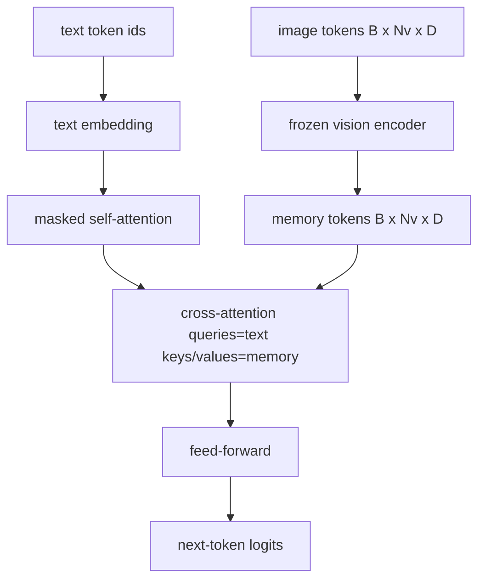
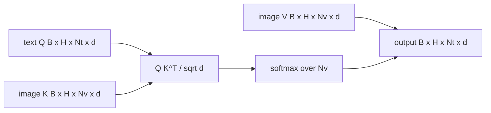

# Слияние через cross-attention

> Слой проекции выравнивает один вектор изображения с одним вектором подписи. Настоящему декодеру vision-language нужно, чтобы каждый текстовый токен обращал внимание на каждый токен патча, — тогда модель сможет привязать каждое слово к конкретной области изображения. Cross-attention — это механизм, через который происходит такая привязка. Текст выступает в роли запроса (query); ключи и значения изображения отвечают. В этом уроке строится блок cross-attention, каузальное self-attention текста и формы масок, которые делают оба типа внимания корректными.

**Тип:** Build**Языки:** Python**Предварительные требования:** Фаза 19 уроки 30-37 (Track B foundations)**Время:** ~90 минут
## Цели обучения

- Реализовать многоголовый cross-attention, в котором поток запросов (query) — текст, а поток ключей и значений (key/value) — изображение.
- Скомпоновать блок декодера: каузальное self-attention + cross-attention + feed-forward.
- Разобраться с формами масок: каузальная маска для self-attention, отсутствие маски для cross-attention.
- Выполнить прямой проход с пакетом текстовых токенов и фиксированным пулом токенов изображения.

## Проблема

Конкатенация токенов изображения и текстовых токенов в одну последовательность — один из вариантов слияния (раннее слияние, early fusion; путь, по которому идут Chameleon и Emu3). Cross-attention — другой вариант (позднее слияние, late fusion; путь, который предложила Flamingo и который с тех пор копирует каждый декодер, устроенный по образцу Flamingo). При позднем слиянии текстовый декодер работает только на текстовых токенах и на каждом слое обращается к потоку изображения через cross-attention.

У позднего слияния два преимущества. Во-первых, текстовый поток остаётся чистым, и модель сохраняет возможности, доступные только для текста. Во-вторых, поток изображения вычисляется один раз на изображение и переиспользуется на каждом шаге декодирования, поэтому генерация остаётся дешёвой даже для длинных подписей. Цена — один дополнительный вложенный слой внимания на блок.

## Концепция





### Формы масок

Два механизма внимания внутри блока декодера нуждаются в разных масках:

| Внимание | Длина запроса | Длина ключа | Маска | Почему |
|-----------|--------------|------------|------|-----|
| Self-attention | `Nt` (текст) | `Nt` (текст) | Каузальная: нижнетреугольная `(Nt, Nt)` | Текстовые токены не могут заглядывать вперёд во время авторегрессии |
| Cross-attention | `Nt` (текст) | `Nv` (изображение) | Без маски | Всё изображение видно с любой текстовой позиции |

Урок включает одну функцию проверки форм, чтобы ошибка их перепутывания проявлялась как `ValueError`, а не как молча сломанная кривая функции потерь.

### Почему cross-attention обходится без маски

Изображение полностью доступно ещё до того, как сгенерирован хоть один токен текста. Токен `t` подписи может обращать внимание на любой патч изображения; у патчей изображения нет временного порядка. Некоторые варианты Flamingo добавляют паттерн маскирования для каждого примера (per-sample) при чередовании нескольких изображений и текстовых сегментов, но для одного изображения с одной подписью cross-attention видит всё.

### Кеширование ключей и значений

Ключи и значения изображения вычисляются один раз в начале декодирования и хранятся в кеше. Каждый новый текстовый токен использует кеш без повторного вычисления. Именно это делает генерацию подписей быстрой при инференсе: тяжёлый ViT запускается один раз, а cross-attention переиспользует его ключи и значения на каждом шаге. Урок предоставляет доступ к кешу и тестирует путь попадания в кеш (cache-hit).

### Композиция блока

Блок декодера выполняется так: pre-LN -> self-attention -> residual -> pre-LN -> cross-attention -> residual -> pre-LN -> feed-forward -> residual. Три вложенных слоя, у каждого — собственный LayerNorm. В статье Flamingo к cross-attention добавили обучаемый gate, чтобы модель могла отказаться от пути изображения ценой стабильности на этапе обучения; канонический базовый вариант (используемый здесь) обходится без gate.

```python
class DecoderBlock:
  def forward(self, text_tokens, image_tokens, text_mask, cross_mask):
      text_tokens = text_tokens + self.self_attn(self.ln1(text_tokens),
                                                 mask=text_mask)
      text_tokens = text_tokens + self.cross_attn(self.ln2(text_tokens),
                                                  image_tokens,
                                                  mask=cross_mask)
      text_tokens = text_tokens + self.ffn(self.ln3(text_tokens))
      return text_tokens
```

```figure
ch-crossattn-fan
```

## Реализация

`code/main.py` реализует:

- `CrossAttention(hidden, heads)` — многоголовый cross-attention с отдельными проекциями `q` и `kv`.
- `CausalSelfAttention(hidden, heads)` — маскированное self-attention из стандартного декодера.
- `DecoderBlock` — компонует три вложенных слоя с pre-LN residual-связями.
- `VisionLanguageDecoder` — четырёхслойный декодер, получающий на вход выход энкодера-заглушки изображений (mock vision encoder) и небольшую таблицу текстовых эмбеддингов.
- `causal_mask(length)` — возвращает булев тензор `(length, length)` нижнетреугольной формы.
- демонстрация, которая подаёт пакет из двух текстовых последовательностей длиной 10 вместе с памятью изображения длиной 197 и печатает форму выхода, форму маски self-attention и норму выхода cross-attention для каждой позиции.

Запустите это:

```bash
python3 code/main.py
```

Вывод: декодер выдаёт тензор логитов `(2, 10, text_vocab)`. Форма маски — `(10, 10)`. Проверка переиспользования KV-кеша подтверждает идентичность логитов между путём с кешем и без него.

## Применение

Cross-attention встречается в двух продакшен-семействах:

- **Flamingo и IDEFICS.** Вставляют вложенный слой cross-attention через каждые K блоков языковой модели, при замороженной LM. Адаптер vision-language — это блок cross-attention вместе с его gate.
- **BLIP-2.** Q-Former использует cross-attention от фиксированного набора из 32 токенов-запросов к признакам изображения, а затем проецирует запросы в пространство эмбеддингов LM.

Форма блока из этого урока напрямую отображается на оба варианта. Дисциплина масок (каузальная для self, отсутствие для cross) та же самая.

## Тесты

`code/test_main.py` покрывает:

- каузальная маска нижнетреугольная и соответствует ожидаемой булевой форме
- форма выхода cross-attention — `(B, Nt, hidden)` независимо от длины ключа
- путь с KV-кешем совпадает с путём без кеша в пределах допуска чисел с плавающей точкой
- несовпадение форм между текстовым потоком и потоком изображения вызывает понятный `ValueError`
- полный прямой проход декодера даёт правильную форму пакета и последовательности

Запустите их:

```bash
python3 -m unittest code/test_main.py
```

## Упражнения

1. Добавьте обучаемый tanh-gate к residual-связи cross-attention (приём Flamingo) и убедитесь, что обучение сходится при почти нулевом начальном значении gate. Gate стартует с 0; модель сначала восстанавливает поведение, свойственное только тексту, а затем начинает подмешивать поток изображения.

2. Реализуйте чередующееся внимание (interleaved attention), при котором один и тот же декодер обрабатывает несколько изображений и несколько текстовых сегментов. Постройте маску cross-attention для каждого примера (per-sample), которая не позволяет текстовому сегменту 2 обращать внимание на изображение 1.

3. Профилируйте слой cross-attention в сравнении со слоем self-attention при `Nt=64, Nv=576` (сетка 24x24 при более высоком разрешении). Стоимость cross-attention равна `Nt * Nv` и доминирует при высоком разрешении изображения.

4. Добавьте дропаут со стороны запроса (query-side) на карту cross-attention и измерьте разнообразие подписей на демонстрации (дисперсия сэмплированных подписей растёт с дропаутом в карте cross).

5. Замените слой cross-attention на блок внимания в стиле Q-Former, где фиксированный пул из 32 токенов-запросов обращает внимание на признаки изображения один раз на слой.

## Ключевые термины

| Термин | Что это значит |
|------|---------------|
| Late fusion | Текст и изображение остаются в раздельных потоках; cross-attention соединяет их на каждом блоке |
| Cross-attention | Q берётся из одного потока, K и V — из другого |
| Causal mask | Нижнетреугольная булева маска, которая не даёт заглядывать вперёд во время авторегрессии |
| KV cache | Ключи и значения изображения, сохранённые один раз и переиспользуемые на каждом шаге декодирования |
| Memory tokens | Замороженные токены изображения, к которым обращается декодер |

## Дополнительное чтение

- Flamingo (2022) — канонический дизайн позднего слияния с управляемым gate cross-attention.
- BLIP-2 (2023) — про Q-Former, который представляет собой блок cross-attention, замаскированный под обучаемый пул запросов.
- IDEFICS (2023) — воспроизведение рецепта Flamingo с открытыми весами.
