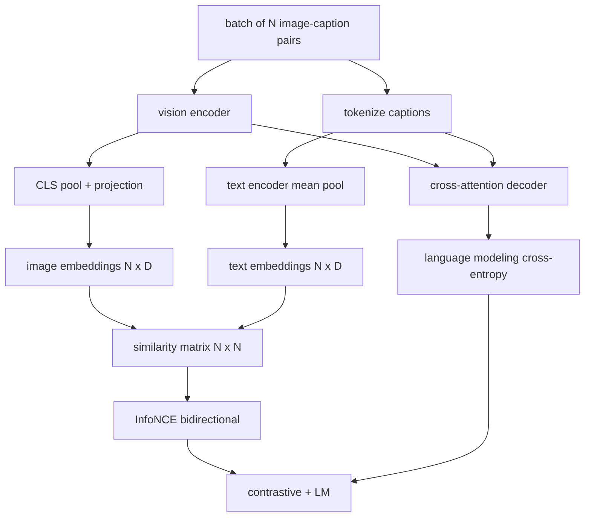

# Предварительное обучение визуально-языковых моделей

> Энкодер, проекция и декодер уже соединены между собой. Теперь обучите их вместе. Обучение движут две целевые функции: контрастивная функция потерь между изображением и текстом (InfoNCE), которая сближает совпадающие пары в общем пространстве эмбеддингов, и функция потерь языкового моделирования, которая заставляет декодер подписывать каждое изображение. Вместе они учат сеть находить подходящее изображение для подписи и писать подпись к изображению.

**Тип:** Build**Языки:** Python**Предварительные требования:** Фаза 19 уроки 30-37 (Track B foundations)**Время:** ~90 минут
## Цели обучения

- Реализовать контрастивную функцию потерь InfoNCE для батча пар изображение-подпись.
- Скомбинировать контрастивную функцию потерь с авторегрессионной функцией потерь языкового моделирования.
- Синтезировать корпус-заглушку из 200 пар изображение-подпись без скачивания реального набора данных.
- Запустить демонстрационный цикл обучения на 50 шагов и понаблюдать за снижением обеих функций потерь.

## Проблема

Визуально-языковой модели нужны два навыка. Она должна уметь ранжировать: по подписи найти нужное изображение среди множества других. Она должна уметь генерировать: по изображению написать подпись. Предобучение модели только на одном из навыков даёт лишь половину системы. CLIP безупречно справляется с ранжированием, но не умеет подписывать. GPT-4V умеет подписывать, но использует отдельную голову поиска для ранжирования. Многозадачное предобучение даёт оба навыка за один проход.

InfoNCE отвечает за половину задачи, связанную с ранжированием. Для батча из N пар модель рассматривает N совпадающих пар как положительные примеры, а `N^2 - N` несовпадающих пар — как отрицательные, а затем применяет функцию потерь кросс-энтропии к получившейся матрице сходства `(N, N)`. LM-функция потерь отвечает за половину задачи, связанную с генерацией: стандартное предсказание следующего токена, обусловленное изображением. Обе функции потерь дифференцируемы и могут использовать общие веса энкодера, проектора и декодера.

## Концепция



### InfoNCE в одном абзаце

Соберите N эмбеддингов изображений в виде строк и N текстовых эмбеддингов тоже в виде строк. L2-нормализуйте оба набора. Вычислите матрицу `N x N` `S = I T^T / tau`, где `tau` — обучаемая температура. Диагональные элементы — это совпадающие пары; внедиагональные элементы — отрицательные примеры. Примените кросс-энтропию с целевым `argmax`, идущим вдоль диагонали: строка `i` должна иметь наибольшее значение в столбце `i`. Проделайте то же самое симметрично вдоль столбцов. Итоговое значение — среднее двух величин. Это и есть функция потерь CLIP в восемь строк кода.

### Значение температуры

Температура `tau` определяет, насколько «пикообразным» получается softmax. Если она слишком мала (например, `tau = 0.01`), градиент приходит только от самого сложного отрицательного примера, и обучение становится шумным. Если она слишком велика, softmax сглаживается и градиент затухает. CLIP обучает `tau` как параметр; демонстрация здесь делает то же самое.

### Функция потерь языкового моделирования

Декодер получает токены памяти изображения через cross-attention и предсказывает следующий текстовый токен в каждой позиции. Функция потерь — стандартная кросс-энтропия с целью в следующей позиции. Позиции с паддингом исключаются из функции потерь маскированием.

### Объединение функций потерь

`total = contrastive + lm_weight * lm`, где `lm_weight` — скаляр (часто 1.0). Обе функции потерь передают градиенты в энкодер и проекцию; только декодер получает градиент от LM-функции потерь. Это тот самый рецепт многозадачного обучения, который используют CoCa, BLIP и модели в стиле SigLIP, с разными весовыми коэффициентами.

| Компонент | Поверхность потерь | Затрагивает |
|-----------|--------------|---------|
| InfoNCE | Ранжирование пар в общем пространстве | Энкодер + проекция + текстовая голова |
| LM | Предсказание токена, обусловленное изображением | Энкодер + проекция + декодер |
| Комбинированная | Многозадачное обучение | Весь стек |

### Почему 50 шагов достаточно для демонстрации

Корпус-заглушка — это синтетический набор из 200 пар со случайными изображениями и случайными id подписей. После 50 шагов SGD с размером батча 16 обе функции потерь заметно снижаются, даже если их абсолютные значения остаются выше того, чего достигла бы модель на реальных данных. Смысл демонстрации — подтвердить, что градиентная «сантехника» работает от начала до конца и что добавление LM-функции потерь не дестабилизирует контрастивную целевую функцию.

```figure
ch-infonce-diagonal
```

## Реализация

`code/main.py` реализует:

- `MultimodalModel`, объединяющую небольшой энкодер ViT, MLP-проектор, крошечный текстовый энкодер (усреднение эмбеддингов id по позициям) и декодер с cross-attention из урока 61.
- `info_nce_loss(image_emb, text_emb, temperature)` — двунаправленную контрастивную функцию потерь в стиле CLIP.
- `lm_loss(logits, target_ids, padding_id)` — маскированную кросс-энтропию предсказания следующего токена.
- `make_mock_corpus(seed, n_pairs)`, возвращающую 200 детерминированных пар (image, caption_ids).
- Цикл обучения на 50 шагов с размером батча 16, оптимизатором Adam и обучаемым параметром логарифма температуры. Обе функции потерь выводятся на печать каждые 5 шагов.

Запустите его:

```bash
python3 code/main.py
```

Результат: контрастивная функция потерь снижается примерно с `ln(16) = 2.77` до около 2.4; LM-функция потерь снижается со случайного равномерного базового уровня `ln(512) ≈ 6.24` до примерно 4.7. Оба снижения доказывают, что градиент подключён корректно. Реальные модели обучаются миллионы шагов; динамика та же самая.

## Применение

Это тот же рецепт функций потерь, что используется в:

- **CLIP (2021).** Только контрастивное сопоставление изображение-текст, с отдельным зондом подписи на замороженном энкодере.
- **CoCa (2022).** Контрастивное сопоставление изображение-текст плюс LM-функция потерь для подписи изображений в одной модели. Именно этот паттерн строит данный урок.
- **BLIP (2022) и BLIP-2.** Контрастивная функция потерь плюс LM плюс голова сопоставления изображение-текст. Три функции потерь вместе.
- **SigLIP (2023).** Заменяет InfoNCE на попарную сигмоидную функцию потерь; та же контрастивная роль, но другая функциональная форма.
- **Семейство LLaVA.** Двухэтапное обучение, где первый этап — выравнивание (косинусное сходство на замороженной LLM), а второй этап добавляет LM-функцию потерь с размороженной LLM. Урок 60 соответствует первому этапу; этот урок соответствует второму этапу.

## Тесты

`code/test_main.py` покрывает:

- InfoNCE-функция потерь симметрична между строками изображений и текста
- InfoNCE-функция потерь возвращает 0, когда матрица сходства представляет собой идеальную диагональ из больших положительных чисел
- LM-функция потерь корректно маскирует позиции с паддингом
- прямой проход модели производит обе функции потерь без ошибок
- 5-шаговый цикл обучения снижает совокупную функцию потерь

Запустите их:

```bash
python3 -m unittest code/test_main.py
```

## Упражнения

1. Замените InfoNCE на попарную сигмоидную функцию потерь в стиле SigLIP и сравните сходимость на корпусе-заглушке.

2. Добавьте шаг майнинга сложных отрицательных примеров: через каждый второй батч выбирайте самую сложную внедиагональную пару из предыдущего батча и добавляйте её. Обучите модель и проверьте, быстрее ли снижается контрастивная функция потерь.

3. Добавьте бинарную голову сопоставления изображение-текст поверх общего пространства эмбеддингов (истина/ложь: совпадают ли они?) для третьей функции потерь, воспроизведя трёхголовую схему BLIP.

4. Замените корпус-заглушку последовательностями id подписей, взятыми из марковской цепи, матрица переходов которой обусловлена хешем изображения. Функция потерь для подписи должна снизиться сильнее, потому что появляется реальный обучаемый сигнал.

5. Обучите одну и ту же модель с `lm_weight = 0` и снова с `lm_weight = 1`. Сравните контрастивную функцию потерь; LM-функция потерь не должна ухудшать целевую функцию ранжирования.

## Ключевые термины

| Термин | Что это значит |
|------|---------------|
| InfoNCE | Оценивание методом контрастирования с шумом: кросс-энтропия на матрице сходства |
| Temperature | Скаляр, определяющий, насколько «пикообразным» получается контрастивный softmax |
| Hard negative | Внедиагональная пара, которую модель путает; полезна для сэмплирования |
| LM loss | Стандартная кросс-энтропия предсказания следующего токена на стороне подписи |
| Joint embedding space | Общее пространство, в котором после проекции находятся векторы изображения и текста |

## Дополнительное чтение

- Статья CLIP — об исходном контрастивном рецепте.
- Статья CoCa — о контрастивном сопоставлении плюс подписи в одной модели.
- Статья SigLIP — о варианте с сигмоидной попарной функцией потерь и о том, почему он лучше масштабируется.
