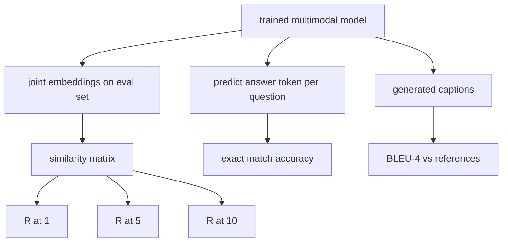

# Мультимодальное оценивание

> Обучение — это лишь половина цикла. Вторая половина — измерение. В этом уроке мы реализуем три поверхности оценивания из базовых примитивов: поиск изображений по подписи (image-caption retrieval), который отчитывается как R@1, R@5, R@10; визуальные ответы на вопросы (visual question answering, VQA), которые отчитываются как точность по точному совпадению (exact match); и генерацию подписей к изображениям (image captioning), которая отчитывается как BLEU-4. Каждая метрика — это функция от выходов модели и синтетического оценочного набора, который выполняется за секунды.

**Тип:** Build**Языки:** Python**Предварительные требования:** Фаза 19 уроки 58-62 (Track E foundations: encoder, transformer, projection, cross-attention fusion, pretraining)**Время:** ~90 минут
## Цели обучения

- Вычислите Recall@K по матрице сходства между эмбеддингами изображений и подписей.
- Вычислите точность VQA по точному совпадению для модели, которая отображает пары (image, question) в фиксированный словарь ответов.
- Вычислите BLEU-4 по сгенерированным и эталонным последовательностям токенов без использования внешних библиотек.
- Запустите все три оценки на синтетическом наборе, построенном поверх обученной модели из урока 62.

## Проблема

Велик соблазн объявить мультимодальную модель готовой, когда функция потерь на обучении выходит на плато. Потери на обучении измеряют соответствие обучающему распределению; они не показывают, способна ли модель ранжировать пары в отложенном (held-out) пакете, отвечать на вопрос или писать подпись, которую примет человек. Стандартными считаются три поверхности оценивания:

- **Поиск (R@1, R@5, R@10).** Постройте общий эмбеддинг для подписи-запроса; ранжируйте все изображения в оценочном пуле по косинусному сходству; определите, попадает ли соответствующее изображение в топ-1, топ-5, топ-10. Симметричная форма (от изображения к тексту) работает так же.
- **Визуальные ответы на вопросы (exact match).** При входных (image, question) модель выдаёт токен ответа. Точное совпадение — это один бит на пример: совпадает ли предсказанный ответ с эталонным? Усредните по оценочному набору.
- **Генерация подписей (BLEU-4).** Сгенерируйте подпись. Вычислите среднее геометрическое точности от 1-грамм до 4-грамм относительно эталонных подписей, со штрафом за краткость. Multi-reference (несколько эталонов на изображение) — стандартная форма (одно изображение, несколько эталонных подписей).

Каждая метрика — тонкая функция. В этом уроке все они реализованы в коде, чтобы математика была конкретной, а вся поверхность оставалась под вашим контролем. Реальные бенчмарк-наборы (MS-COCO, VQA v2, GQA, OK-VQA) подключаются к тем же сигнатурам функций.

## Концепция



### Recall@K по матрице сходства

Постройте матрицу косинусного сходства `(N, N)` между эмбеддингами изображений и подписей. Для каждой строки отсортируйте столбцы по убыванию сходства. Recall@K — это доля строк, где индекс столбца на диагонали попадает в топ-K позиций. Симметричный Recall@K (от подписи к изображению) вычисляется на транспонированной матрице. Отчитываются оба числа. Для оценки с N=100 R@1 = 0.6 означает, что 60 из 100 подписей нашли своё правильное изображение как лучшее совпадение.

### Exact match для VQA

Для каждого (image, question, answer) закодируйте изображение, получите эмбеддинг вопроса, объедините их через декодер и получите на выходе следующий токен. Предсказанный id токена сравнивается с эталонным id; правильно, если они совпадают. Усредните по оценочному набору. Реальные наборы данных VQA поставляются с несколькими размеченными людьми ответами на каждый вопрос и используют формулу мягкой точности (soft-accuracy) (1.0, если согласны хотя бы 3 из 10 разметчиков, со шкалированием ниже); в этом уроке для ясности используется точное совпадение с одним ответом.

### BLEU-4

```text
BLEU-4 = BP * exp(mean(log p1, log p2, log p3, log p4))
```

Здесь `p_n` — это модифицированная точность (precision) по n-граммам (число сгенерированных n-грамм, встречающихся хотя бы в одном эталоне, с отсечением (clipped), делённое на общее число сгенерированных n-грамм), а `BP` — штраф за краткость (brevity penalty):

```text
BP = 1                if generated length > reference length
   = exp(1 - r/g)     otherwise, where r is reference length and g is generated
```

Сглаживание нужно для небольших выборок, в которых какое-либо `p_n` равно нулю. Реализация использует «method 1» из статьи Chen и Cherry (добавление 1 к числителю и знаменателю при любом нулевом счётчике) — это самый безопасный вариант по умолчанию для режимов с малым числом наблюдений.

### Синтетический оценочный набор

Оценочный набор из 50 примеров строится в памяти по тому же шаблону mock-корпуса, что и в уроке 62, с отложенным начальным значением (seed). Набор состоит из трёх списков:

- `pairs`: 50 пар (image, caption_ids) для поиска.
- `vqa`: 50 триплетов (image, question_ids, answer_id).
- `caps`: 50 записей (image, [reference_caption_ids, ...]), содержащих до 3 эталонных подписей на изображение.

Набор детерминирован относительно seed и отложен от обучающего корпуса, поэтому метрики вычисляются на данных, которые модель никогда не видела. Сохранение набора в JSON оставлено в качестве упражнения (см. ниже).

| Метрика | Диапазон | Случайная базовая линия (N=50) |
|--------|-------|------------------------|
| R@1 | от 0 до 1 | 0.02 (1 / N) |
| R@5 | от 0 до 1 | 0.10 |
| R@10 | от 0 до 1 | 0.20 |
| VQA EM | от 0 до 1 | 1 / vocab |
| BLEU-4 | от 0 до 1 | малое, но ненулевое |

Для тренировочного прогона на 50 шагов на синтетических данных метрики не ожидаются высокими; ожидается, что они окажутся выше случайной базовой линии — именно это проверяет демонстрация.

```figure
ch-recall-window
```

## Реализация

`code/main.py` реализует:

- `recall_at_k(sim_matrix, k)` — возвращает float в диапазоне `[0, 1]` для обоих направлений.
- `vqa_exact_match(predictions, references)` — возвращает среднее по равенству `int`.
- `bleu4(generated, references, smoothing=True)` — с поддержкой нескольких эталонов (multi-reference).
- `build_eval_suite(seed, n_samples, vocab_size, max_len)` — возвращает три детерминированных оценочных списка.
- `evaluate(model, suite)` — запускает все три метрики и возвращает `dict` с числами.
- Демонстрацию, которая загружает свежеинициализированную мультимодальную модель из урока 62, оценивает её, затем обучает 50 шагов и оценивает снова, выводя метрики «до/после».

Запустите:

```bash
python3 code/main.py
```

Вывод: таблица метрик «до/после» показывает, что поиск улучшается от почти случайного уровня к сигналу, выученному моделью, VQA улучшается выше случайного уровня, а BLEU-4 растёт (синтетической структуры достаточно для прироста точности по 4-граммам).

## Применение

Каждая метрика напрямую соответствует продакшен-бенчмарку:

- **Поиск.** MS-COCO 5K val, Flickr30K, ImageNet zero-shot — все они являются задачами R@K на одной и той же матрице сходства. Замените синтетическую оценку реальными файлами — сигнатура функции не изменится.
- **VQA.** VQA v2, GQA, OK-VQA используют ту же форму точного совпадения (с soft-acc вместо EM с одним ответом для VQA v2).
- **BLEU-4.** MS-COCO captioning, NoCaps, Flickr30K captioning используют BLEU-4 вместе с CIDEr и METEOR. Добавление CIDEr — это ещё одна функция.

Для реальных бенчмарков замените `build_eval_suite` на настоящий загрузчик, сохранив тела функций. Математика не зависит от конкретного бенчмарка.

## Тесты

`code/test_main.py` покрывает:

- recall@k возвращает 1.0 на идеальной единичной матрице сходства и 0.0 на перевёрнутой при k < N
- recall@k соблюдает верхнюю границу `k <= N`
- bleu4 возвращает 1.0, когда сгенерированный текст точно совпадает с одним из эталонов
- bleu4 возвращает 0.0 при непересекающемся словаре
- точное совпадение VQA равно доле совпадающих пар
- build_eval_suite возвращает ожидаемое число пар, элементов vqa и записей подписей

Запустите их:

```bash
python3 -m unittest code/test_main.py
```

## Упражнения

1. Добавьте CIDEr к метрикам генерации подписей. CIDEr использует TF-IDF-взвешивание n-грамм, что поощряет информативные токены.

2. Реализуйте soft-accuracy для VQA: несколько ответов от людей на вопрос, точность равна `min(human_count / 3, 1)`, если есть хотя бы одно совпадение. Воспроизводит VQA v2.

3. Добавьте NaN-safe вариант `bleu4`, который обрабатывает пустые сгенерированные последовательности без падения.

4. Вычислите mean reciprocal rank (MRR) наряду с R@K. MRR чувствителен к тому, где именно оказывается правильный элемент за пределами топ-K; R@K чувствителен только к тому, попадает ли он в топ-K.

5. Запустите оценку модели на пяти контрольных точках во время обучения (шаг 0, 10, 20, 30, 40, 50) и постройте кривую обучения. Убедитесь, что траектории метрик следуют за траекторией функции потерь.

## Ключевые термины

| Термин | Что это означает |
|------|---------------|
| R@K | Доля запросов, для которых правильное совпадение попадает в топ-K результатов |
| Exact match (точное совпадение) | Простейший способ подсчёта очков в VQA: предсказанный ответ совпадает с эталонным |
| BLEU-4 | Среднее геометрическое точности от 1-грамм до 4-грамм со штрафом за краткость |
| Multi-reference (несколько эталонов) | Метрика генерации подписей учитывает несколько эталонных подписей на изображение |
| Held-out (отложенный) | Оценочный набор сэмплируется из seed, не пересекающегося с обучающим корпусом |

## Дополнительное чтение

- Статья VQA v2 — формула soft-accuracy и статистика набора данных.
- Статья CIDEr — генерация подписей с TF-IDF-взвешиванием n-грамм.
- Оригинальная статья BLEU (Papineni et al., 2002) — варианты сглаживания.
- Скрипты оценивания MS-COCO captioning — каноническая эталонная реализация.
