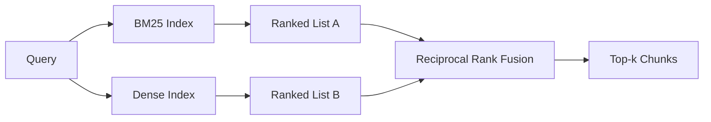

# Гибридный поиск с BM25 и плотными эмбеддингами

> Лексический и семантический поиск дают сбой на противоположных распределениях запросов. Гибридный поиск со слиянием по обратным рангам не интерполирует, а голосует — и голосование побеждает на каждом классе запросов.

**Тип:** Build
**Языки:** Python
**Предварительные требования:** уроки 04 (эмбеддинги) и 06 (RAG) этапа 11; основы направления B этапа 19 (уроки 20–29); урок 64 этапа 19 (стратегии разбиения на фрагменты)
**Время:** ~90 минут

## Цели обучения
- Реализуйте BM25 с нуля по формулировке Robertson и Sparck Jones, с взвешиванием по полям, нормализацией по длине документа и настраиваемыми k1 и b.
- Постройте плотный поисковик поверх детерминированного имитационного эмбеддинга, чтобы цикл работал офлайн.
- Реализуйте слияние по обратным рангам (reciprocal rank fusion) в точности так, как его опубликовали Cormack, Clarke и Buettcher в 2009 году, и объясните, почему оно превосходит интерполяцию со взвешенными оценками.
- Настройте константу RRF k и веса для каждой модальности, чтобы увидеть компромиссы на небольшом тестовом корпусе.

## Проблема

Лексический поиск побеждает, когда запрос содержит буквальный идентификатор, который присутствует в корпусе дословно. Запрос `AbortMultipartOnFail` за микросекунды возвращает нужную функцию на Go через BM25. Тот же запрос, превращённый в эмбеддинг, оказывается на границе трёх кластеров схожести, и плотный поисковик ставит на первое место не тот файл.

Плотный поиск побеждает, когда запрос перефразирован так, что уходит от буквальных токенов корпуса. Пользователь, спрашивающий «как мы обрабатываем отменённые загрузки», никогда не печатал слова abort или multipart. BM25 возвращает фрагмент документации про «загрузку больших файлов», потому что на этой странице встречается слово uploads. Плотный поиск находит функцию abort, в описании которой упоминается отмена.

Выбор между этими двумя подходами не статичен. Переменная — это распределение запросов. Продакшн-система RAG обрабатывает оба класса запросов через одну конечную точку, поэтому поиск должен справляться с обоими одновременно. Это и есть гибридный поиск. Ключевой момент — этап слияния, который должен быть реализован правильно.

## Концепция



### BM25 в одном абзаце

BM25 оценивает пару запрос-документ, суммируя по терминам запроса произведение фактора обратной частоты документа на насыщающийся фактор частоты термина, включающий поправку на нормализацию по длине. Две ручки настройки. `k1` управляет насыщением частоты термина; значение по умолчанию 1.5 — это опубликованная рекомендация, и менять его без бенчмарка не стоит. `b` управляет тем, насколько важна длина документа; значение по умолчанию 0.75 означает, что более длинные документы штрафуются, но не линейно.

Формула IDF использует сглаженное определение Robertson и Sparck Jones: `log((N - df + 0.5) / (df + 0.5) + 1)`. Плюс единица внутри логарифма удерживает IDF положительным, когда термин встречается более чем в половине корпуса. Это важно для небольших корпусов, где стоп-слова технически являются редкими.

Взвешивание по полям позволяет сообщить BM25, что совпадение по имени символа значит больше, чем совпадение в теле документа. Реализация — это множитель на счётчики термина во время индексирования, а не во время оценивания. Это сохраняет математику неизменной и избавляет от отдельного скора для каждого поля.

### Плотный поиск в одном абзаце

Каждый фрагмент превращается в вектор фиксированной размерности с помощью модели эмбеддингов. Во время запроса запрос превращается в эмбеддинг, все фрагменты ранжируются по косинусному сходству, и возвращается top-k. Модель — это переменная, определяющая качество. Сам алгоритм поиска — это две строки: скалярное произведение и сортировка.

В этом уроке используется детерминированный хеш-эмбеддинг, чтобы можно было читать математику слияния без сетевых вызовов. Хеш суммирует смещения, ключами для которых служат токены, в 96-мерный вектор и нормализует его. Косинусные ранги детерминированы от запуска к запуску, что и требуется набору тестов.

### Слияние по обратным рангам — опубликованная формула

Два ранжированных списка. Для каждого кандидата, который встречается в любом из списков, суммируются его вклады по обратному рангу. В статье 2009 года использовалась формула `1 / (k + rank)` со значением k, равным 60 по умолчанию. Сортировка по суммарному скору. Это весь алгоритм.

Опубликованная константа k = 60 выбрана не произвольно. При k = 60 вклад ранга 1 равен 1 / 61, а вклад ранга 10 равен 1 / 70. Вклад затухает медленно, поэтому глубокие кандидаты всё ещё «голосуют». Меньшее k заставляет доминировать топовые результаты. Большее k делает кривую вклада более плоской.

В нашей реализации две настраиваемые ручки. Константа `k`. Пара весов по модальностям, позволяющая усилить BM25 или плотный поиск, если у вас есть предварительные данные о том, что один из них лучше подходит для вашего корпуса. Умножение вклада ранга на вес — самая простая принципиальная реализация; она сохраняет форму затухания по рангу и остаётся независимой от масштаба.

### Почему слияние превосходит интерполяцию со взвешенными оценками

Скоры BM25 неограничены и зависят от корпуса. Косинусные сходства ограничены диапазоном от -1 до 1. Линейная комбинация `alpha * bm25 + (1 - alpha) * cosine` требует настройки alpha для каждого корпуса и ломается при каждом переиндексировании. Слияние на основе рангов от этого не страдает. Два ранга сопоставимы между модальностями. Опубликованный базовый вариант RRF превосходит интерполяцию по скорам на каждом публичном треке TREC начиная с 2010 года.

Это тот же аргумент, который звучит в дискуссиях о RankFusion против RRF в документации Vespa и Weaviate. Они пришли к тому же выводу: оставайтесь на ранговой основе, если у вас нет очень веских оснований интерполировать скоры.

```figure
rrf-fusion
```

## Реализация

`code/main.py` реализует:

- `tokenize(text)` — быстрый регулярный токенизатор.
- `BM25Index` — взвешенный по полям, с `add` и `search` и настраиваемыми k1, b.
- `mock_embed`, `DenseIndex` — тот же детерминированный эмбеддинг, что и в уроке 64, чтобы фрагменты были сопоставимы.
- `rrf(rankings, k, weights)` — опубликованное слияние с весами по нескольким модальностям.
- `HybridRetriever` — объединяет BM25 и плотный поиск.
- Демонстрационный `main()`, который загружает небольшой тестовый корпус, выполняет три запроса, нацеленных на сильные и слабые стороны каждого поисковика, и печатает ранжирования, полученные каждой модальностью, а также объединённый список.

Запустите это:

```bash
python3 code/main.py
```

Посмотрите на вывод демонстрации построчно. Запрос с буквальным идентификатором занимает 1-е место по BM25, 4-е место по плотному поиску и 1-е место по RRF. Перефразированный запрос занимает 6-е место по BM25, 1-е место по плотному поиску и 1-е место по RRF. Неоднозначный запрос занимает 3-е место по BM25, 3-е место по плотному поиску и 1-е место по RRF. Слияние — это не разрешение ничьей; это система, которая побеждает на каждом классе запросов.

## Настройка ручек

| Ручка | По умолчанию | Увеличивайте, когда | Уменьшайте, когда |
|------|---------|----------------|------------------|
| BM25 k1 | 1.5 | Термины повторяются в документах, и вы хотите, чтобы частота имела больший вес | Документы короткие, и повторение термина — это шум |
| BM25 b | 0.75 | Длинные документы действительно несут меньше информации на слово | Длина документа не коррелирует с темой |
| RRF k | 60 | Глубокие кандидаты должны продолжать «голосовать» | Топ-1 должен доминировать |
| Вес BM25 | 1.0 | Ваш корпус содержит буквальные идентификаторы, и запросы совпадают с ними | Ваши запросы перефразированы пользователями |
| Вес плотного поиска | 1.0 | Запросы перефразированы | Запросы буквальны |

Настраивайте параметры, повторно запуская средство оценивания из урока 68 на отложенном наборе запросов, а не полагаясь на интуицию.

## Режимы отказа, которые скрывает демонстрация

**Токены вне словаря.** IDF в BM25 вычисляется по корпусу, поэтому термины, встречающиеся только в запросе, дают нулевой вклад. Плотные эмбеддинги «галлюцинируют» вектор для того же термина. На идентификаторах вне корпуса плотная модальность возвращает правдоподобно выглядящих, но неверных соседей. Слияние это компенсирует, потому что BM25 ничего не возвращает и вклад ранга обнуляется, но только если дедупликация выполняется по документу, а не по фрагменту.

**Доминирование стоп-токенов.** BM25 по слову «the» даёт равномерное ранжирование по всему корпусу. Фильтруйте стоп-токены в индексаторе или смиритесь с тем, что термины с высоким IDF доминируют естественным образом.

**Идентичное содержимое между модальностями.** Если ваш корпус достаточно мал, чтобы топ-1 BM25 совпадал с топ-1 плотного поиска, RRF даст тот же топ-1 с теми же соседями. Это корректное поведение, а не сбой, но из-за этого слияние выглядит незаметным. Добавьте в вашу оценку пару состязательных запросов, чтобы убедиться, что слияние действительно работает.

## Применение

Продакшн-паттерны:

- Размещайте индекс BM25 внутри процесса приложения; узкое место — словарь частот терминов, а не векторы.
- Индексируйте плотные векторы в отдельном хранилище (в этом уроке мы используем плоский список; в продакшене вы бы использовали HNSW).
- Запускайте оба запроса параллельно; слияние — это слияние за константное время над объединением.
- Сохраняйте, какая модальность дала каждый найденный результат, чтобы последующий реранкер мог видеть, какая модальность за него «проголосовала».

## Поставка

Урок 66 берёт объединённый top-k из этого урока и повторно ранжирует его с помощью кросс-энкодера. Урок 68 оценивает весь конвейер по точности, полноте, MRR и nDCG. Гибридный поисковик из этого урока — первый этап сквозной системы из урока 69.

## Упражнения

1. Замените `mock_embed` на настоящую модель от вашего провайдера. Повторно запустите демонстрацию и опишите, как меняется ранжирование только по плотному поиску на перефразированном запросе.
2. Добавьте третью модальность: сводки фрагментов, индексируемые отдельно и объединяемые как третий ранжированный список. Измерьте выигрыш.
3. Переберите значения RRF k: 10, 30, 60, 100, 200. Постройте кривую recall@k из урока 68. Укажите значение k, при котором кривая достигает пика на вашем корпусе.
4. Реализуйте BM25F по-настоящему (нормализация по длине для каждого поля, а не трюк с множителем) и сравните на корпусе, где совпадения по символам важнее всего.

## Ключевые термины

| Термин | Что говорят люди | Что это на самом деле означает |
|------|-----------------|------------------------|
| BM25 | «Лексический поиск» | Вероятностное ранжирование: idf x насыщающаяся tf x нормализация по длине |
| RRF | «Слияние рангов» | Сумма 1 / (k + rank) по ранжированным спискам; k = 60 по умолчанию |
| k1 | «Насыщение TF» | Управляет тем, как быстро повторяющийся термин перестаёт добавлять скор |
| b | «Штраф за длину» | 0 означает игнорировать длину документа, 1 означает полную нормализацию |
| Взвешивание по полям | «Усиление символа» | Повторение токенов при индексировании для усиления совпадений в этом поле |
| Слияние на основе рангов против слияния на основе скоров | «Почему RRF превосходит линейное слияние» | Ранги сопоставимы между модальностями; скоры — нет |

## Дополнительное чтение

- Cormack, Clarke, Buettcher, «Слияние по обратным рангам превосходит метод Кондорсе и отдельные методы обучения ранжированию», SIGIR 2009
- Robertson, Walker, Beaulieu, Gatford, Payne, "Okapi at TREC-3" (оригинальная статья о BM25)
- [Vespa: гибридный поиск с BM25 и эмбеддингами](https://docs.vespa.ai/en/tutorials/hybrid-search.html)
- [Weaviate: гибридный поиск](https://weaviate.io/developers/weaviate/search/hybrid)
- Этап 11, урок 06 — основы RAG
- Этап 19, урок 64 — разбиение на фрагменты, результат которого здесь индексируется
- Этап 19, урок 66 — реранкер на основе кросс-энкодера, который использует объединённый top-k
