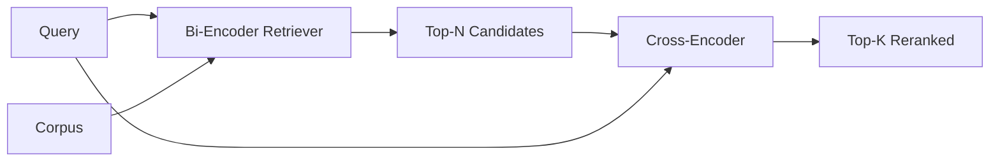

# Cross-encoder-реранкер

> Bi-encoder кодирует запрос и документ независимо друг от друга. Cross-encoder объединяет их и читает оба одновременно. Cross-encoder — самый умный читатель и самый медленный. Используемый как второй этап поверх top-k, полученного bi-encoder, он окупает себя.

**Тип:** Build**Языки:** Python**Предварительные требования:** Фаза 11 урок 06 (RAG), Фаза 11 урок 07 (advanced RAG); Фаза 19 Track B foundations (уроки 20-29); Фаза 19 урок 65 (hybrid retrieval feeding this stage)**Время:** ~90 минут
## Цели обучения
- Отличайте ретривер на основе bi-encoder от реранкера на основе cross-encoder (модель повторного ранжирования) по форме входных данных, количеству параметров и стоимости в расчёте на один запрос.
- Реализуйте с нуля небольшой cross-encoder в виде блока трансформера, который принимает упакованную последовательность (query, document) и выдаёт единственное скалярное значение релевантности.
- Соберите двухэтапный конвейер retrieve-then-rerank: получите top-N с помощью дешёвого ретривера, переранжируйте N до top-K с помощью cross-encoder, верните K.
- Измерьте компромисс между задержкой и качеством на небольшом тестовом корпусе (fixture) и подберите подходящее N для заданного бюджета задержки.

## Проблема

Bi-encoder отображает запрос и документ в одно и то же векторное пространство и ранжирует их по косинусному сходству. Два представления никогда не видят друг друга. Модели приходится сжимать всё полезное о документе в единственный вектор, не видя запроса. Это быстро — одно векторное представление (эмбеддинг) на документ во время индексации и одно на запрос во время обращения к системе — и это единственный способ ранжирования в масштабе всего корпуса.

Платить приходится точностью. Два документа с одинаковой общей темой могут иметь почти идентичные эмбеддинги, даже если один из них отвечает на запрос, а другой — нет. Bi-encoder не может их различить.

Cross-encoder решает эту проблему, читая запрос и документ вместе. Модель получает `[query] [SEP] [document]` как единую последовательность, выполняет полное внимание (attention) по всей последовательности и выдаёт одно скалярное значение релевантности. Каждый токен документа может обращаться (attend) к каждому токену запроса. Модель определяет оценку, располагая полным контекстом.

Платить приходится пропускной способностью. Там, где bi-encoder кодирует один раз и обслуживает запросы бесконечно, cross-encoder выполняется один раз для каждой пары (query, document). Для корпуса из 10 миллионов документов это 10 миллионов прямых проходов на один запрос. Уложить это в бюджет запроса невозможно.

Решение — разбиение на этапы. Используйте bi-encoder, чтобы получить top-N. Используйте cross-encoder, чтобы переранжировать N до top-K. N невелико (от 50 до 200), и прирост качества от cross-encoder сосредоточен там, где он действительно важен. Суммарная задержка остаётся в пределах бюджета запроса. Итоговое качество — это качество cross-encoder, ограниченное полнотой (recall) bi-encoder при данном N.

## Концепция



### Форма входных данных cross-encoder

Стандартная упаковка — `[CLS] query_tokens [SEP] document_tokens [SEP]`. Выход в позиции CLS подаётся на единственную линейную голову, которая выдаёт скаляр релевантности. Некоторые реализации используют mean-pooling вместо CLS; разница невелика. Суть в том, что модель выдаёт одно число на каждую пару.

Cross-encoder с 22M параметров (класс опубликованных весов `ms-marco-MiniLM-L-6-v2`) — типичная точка для продакшена. Модели меньшего размера теряют в качестве быстрее, чем экономят на задержке. Более крупные модели (например, `bge-reranker-v2-m3` с 568M параметров) оставляют для офлайн-переранжирования или для переранжирования первой страницы, где K невелико.

### Почему в этом уроке обучается крошечная модель

Настоящий cross-encoder — это дообученный (finetuned) encoder-трансформер. В продакшене вы загружаете контрольную точку и запускаете её. Цель этого урока — показать вам форму модели и форму кривой «задержка — качество», а не обучить современный (state-of-the-art) ранжировщик. Поэтому мы строим небольшой `nn.Module` с одним блоком трансформера, многоголовым вниманием (multi-head attention, по умолчанию 4 головы) и одной регрессионной головой. Он инициализируется детерминированно из seed, поэтому демонстрация воспроизводима без весов на диске.

Игрушечная модель усваивает нужную форму из тестового корпуса (fixture): релевантные пары запрос-документ получают более высокие предсказанные оценки, чем нерелевантные. Сквозной (end-to-end) конвейер переранжирует вывод bi-encoder, и top-k после переранжирования коррелирует с эталонными метками (gold labels).

### Задержка против качества

У двухэтапного конвейера есть один настраиваемый параметр: N. Переберите N от 5 до 100 на отложенном (held-out) наборе запросов — и вы получите кривую.

| N | Recall@1 второго этапа | Прямые проходы cross-encoder на запрос | Задержка |
|---|--------------------|---------------------------------------|---------|
| 5 | 0.62 | 5 | низкая |
| 20 | 0.81 | 20 | средняя |
| 50 | 0.86 | 50 | высокая |
| 100 | 0.86 | 100 | очень высокая |

Приведённые выше числа иллюстрируют форму кривой, а не являются измерениями на этой фикстуре. Сама форма — реальна. Всегда есть перегиб (knee) в районе 20–50 кандидатов, где прирост от переранжирования выходит на плато. За перегибом вы платите ни за что.

Выбирайте N по кривой оценивания (eval) и бюджету задержки. Cross-encoder не может поднять полноту (recall) выше полноты bi-encoder при данном N, поэтому низкое N ограничивает не только задержку, но и качество.

```figure
rerank-funnel
```

## Реализация

`code/main.py` реализует:

- `CrossEncoder` — небольшой `torch.nn.Module`: эмбеддинг токенов, один блок трансформера с многоголовым вниманием и feedforward-слоем, mean-pooled голова, выдающая один скаляр.
- `tokenize_pair(query, document)` — упаковывает две строки в единую последовательность id с type id, отмечающими границу; детерминированно, средствами stdlib.
- `train_tiny(pairs)` — один проход обучения с учителем (supervised) на размеченном вручную списке троек (query, document, relevance), чтобы модель выдавала осмысленные оценки на фикстуре.
- `rerank(query, candidates, top_k)` — интерфейс для продакшена.
- `pipeline(query, retriever, top_n, top_k)` — двухэтапный процесс.
- Демонстрационная `main()`, которая загружает корпус по паттерну из урока 65, получает top-N, переранжирует до top-K, выводит оба списка рядом и сообщает задержку каждого этапа.

Запустите:

```bash
python3 code/main.py
```

Вывод показывает top-N от bi-encoder, top-K от cross-encoder и сводку по времени. Cross-encoder работает дольше на один вызов, но не запускается на всём корпусе. Суммарная задержка двух этапов остаётся в пределах бюджета запроса, при этом выбирается ответ, которому bi-encoder присвоил второе или третье место.

## Режимы отказа, которые скрывает демонстрация

**Cross-encoder не симметричен.** `rerank(q, d)` и `rerank(d, q)` дают разные оценки. Всегда подавайте запрос первым. Если вы случайно поменяете их местами, полнота (recall) обрушится.

**N слишком мало, чтобы проявить ошибку.** Если задать N = K, cross-encoder не может изменить порядок — он может только переоценить веса. Прирост выглядит нулевым. Выбирайте N как минимум втрое больше K.

**Обучающие данные просачиваются в оценивание.** Если размеченные вручную обучающие пары включают запросы из оценивания, переранжирование выглядит волшебно хорошо. Строго разделяйте train и eval, даже на фикстуре.

**Продакшен-веса плотные.** Cross-encoder с 22M параметров занимает 88 МБ в float32. Спланируйте память сервера моделей, прежде чем обещать sub-100ms p95.

**Батчинг важен.** Настоящий cross-encoder обрабатывает N кандидатов одним батчем. В этом уроке это делает `_batch_encode`, которая строит батчевые тензоры id и type-id с помощью `torch.tensor(...)` и выполняет один прямой проход. Без батчинга задержка умножается на N.

## Применение

Паттерны для продакшена:

- Фиксируйте bi-encoder, cross-encoder и N вместе. Изменение любого из них делает оценивание недействительным.
- Кешируйте вывод реранкера по хешу (query, document_id). Один и тот же запрос к стабильному корпусу переранжируется в один и тот же порядок; попадания в кеш дают бесплатное снижение задержки.
- Логируйте оценку cross-encoder для ранга 1. Запрос, у которого top-1 оценка ниже специфичного для корпуса порога, — это попадание вне домена (out-of-domain); передайте это LLM как «я не уверен».

## Поставка

Урок 68 оценивает этот двухэтапный конвейер сквозным образом (end-to-end). Урок 69 подключает этот реранкер за гибридным ретривером из урока 65 и перед генератором ответов. Реранкер — это второй этап сквозной системы.

## Упражнения

1. Переберите N от 5 до 50 и постройте график recall@1 переранжированного вывода. Найдите перегиб на этой фикстуре.
2. Обучите cross-encoder десять эпох вместо одной. Измерьте разрыв в оценках между положительными и отрицательными парами на каждой эпохе.
3. Замените mean-pooling на голову на основе CLS-токена. Сравните сходимость на этой фикстуре.
4. Добавьте вторую голову cross-encoder, которая предсказывает бинарную метку «есть ли ответ в этом документе». Используйте обе головы во время инференса: одну — для ранжирования, другую — для порогового отсечения.
5. Замените детерминированный mock bi-encoder на bi-encoder из урока 65 и соедините оба этапа в цепочку. Измерьте изменение top-K по сравнению с одним лишь bi-encoder.

## Ключевые термины

| Термин | Что говорят | Что это означает на самом деле |
|------|-----------------|------------------------|
| Bi-encoder | «Векторный ретривер» | Кодирует запрос и документ независимо; ранжирует по косинусному сходству |
| Cross-encoder | «Реранкер» | Кодирует (query, doc) совместно; выдаёт один скаляр релевантности |
| Двухэтапный конвейер | «Retrieve and rerank» | Дешёвый ретривер возвращает N, дорогой реранкер оставляет K |
| N (бюджет кандидатов) | «Пул для переранжирования» | Количество кандидатов, которые cross-encoder оценивает на один запрос |
| Mean-pooling-голова | «Среднее по last hidden» | Усредняет выходы последнего слоя энкодера в один вектор |

## Дополнительное чтение

- Nogueira, Cho, "Passage Re-ranking with BERT", 2019 — каноническая статья о ранжировщике на основе cross-encoder
- Reimers, Gurevych, "Sentence-BERT: Sentence Embeddings using Siamese BERT-Networks", 2019 — о bi-encoder против cross-encoder
- [Документация SentenceTransformers по Cross-Encoders](https://www.sbert.net/examples/applications/cross-encoder/README.html)
- [Карточка модели BGE Reranker v2](https://huggingface.co/BAAI/bge-reranker-v2-m3)
- Phase 19, урок 65 — гибридный ретривер, питающий этот этап переранжирования
- Phase 19, урок 68 — оценивание, измеряющее прирост от этого переранжирования
