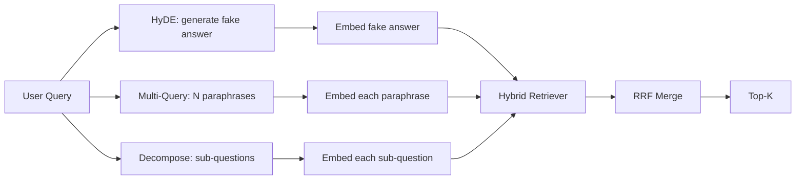

# Переформулирование запроса: HyDE, multi-query и декомпозиция

> Запрос, который вводит пользователь, — не тот запрос, который нужен вашему ретриверу. Переформулирование преодолевает этот разрыв перед поиском, чтобы индекс видел нечто более близкое к тому, как выглядит ответ.

**Тип:** Build**Языки:** Python**Предварительные требования:** Фаза 11 уроки 04 (embeddings), 06 (RAG); Фаза 19 Track B foundations (уроки 20-29); Фаза 19 уроки 64 and 65**Время:** ~90 минут
## Цели обучения
- Реализуйте Hypothetical Document Embeddings (HyDE, эмбеддинги гипотетического документа): сгенерируйте фиктивный ответ, заэмбеддите его и выполняйте поиск по этому вектору вместо вектора запроса.
- Реализуйте расширение запроса методом multi-query: перепишите один запрос в N перефразировок, выполните поиск по каждой, объедините результат слиянием обратных рангов (reciprocal rank fusion, RRF).
- Реализуйте декомпозицию запроса: разбейте сложный вопрос на подвопросы, выполните поиск по каждому подвопросу, объедините результаты.
- Сравните три переформулировщика напрямую на фикстуре и объясните, когда выигрывает каждая стратегия.
- Подключите mock-LLM, которая выдаёт детерминированные результаты, привязанные к фикстуре, чтобы цикл переформулирования работал офлайн.

## Проблема

Пользователь вводит: «что делает наша команда, если загрузки не проходят, а бюджет исчерпан?». В корпусе есть документ, где сказано: «AbortMultipartOnFail прерывает выполняющуюся многосоставную (multipart) загрузку в S3 и уменьшает бюджет повторных попыток для конкретного bucket при сбое загрузки». Запрос и документ не имеют общей именной группы. BM25 промахивается. Bi-encoder ставит документ на третье или четвёртое место, потому что вектор запроса попадает в область пространства эмбеддингов, которая тяготеет к документу про отменённые задачи, а не к документу про прерванные загрузки. Двухэтапный реранкинг из урока 66 может спасти ответ, если тот попадёт в top-N, но если он даже не дотягивает до top-N, реранкер его вообще не увидит.

Решение — переформулировать запрос до того, как он попадёт к ретриверу. В статье 2023 года «Precise Zero-Shot Dense Retrieval without Relevance Labels» (Gao et al.) был представлен HyDE (Hypothetical Document Embeddings, эмбеддинги гипотетического документа): попросите LLM написать документ, который отвечал бы на запрос, заэмбеддите этот гипотетический документ и используйте его эмбеддинг как вектор поиска. Гипотетический документ попадает в нужную область пространства эмбеддингов, потому что написан «голосом» корпуса. Вектор запроса — нет.

С HyDE соседствуют две родственные техники. Расширение запроса методом multi-query (термин, который использовал GraphRAG от Microsoft) генерирует N перефразировок запроса и выполняет поиск по каждой, а затем объединяет результаты. Декомпозиция (получившая известность как «subquery decomposition» в работе Stanford DSPy 2024 года) разбивает «что делает наша команда, если загрузки не проходят, а бюджет исчерпан» на два вопроса: «что происходит при сбое загрузки» и «что происходит, когда бюджет повторных попыток исчерпан». Два поиска, один объединённый результат, обе части ответа достижимы.

В этом уроке реализованы все три техники, и они прогоняются на одном и том же фикстурном корпусе.

## Концепция



### Подробнее о HyDE

HyDE заменяет вектор запроса пользователя вектором гипотетического документа, написанного LLM. Промпт короткий:

```
You are a domain expert. Write a one-paragraph passage that answers the question
below. Use the same vocabulary and phrasing the documentation in this domain would
use. Do not refuse. Do not say you do not know.

Question: {user_query}

Passage:
```

Ответ LLM неверен как фактический ответ, потому что LLM не знает ваш корпус. Это нормально. Ретриверу не важна фактическая корректность — только распределение токенов. Гипотетический пассаж содержит слова «abort», «multipart», «bucket», «budget», потому что именно так написал бы пассаж документации на эту тему. Заэмбеддите этот пассаж. Вектор попадёт рядом с реальным пассажем.

В продакшене гипотетический документ ограничивают двумя-тремя предложениями. Более длинные гипотетические документы собирают больше шума. Более короткие теряют лексический сигнал, который нужен HyDE.

### Подробнее о расширении запроса методом multi-query

Сгенерируйте N перефразировок запроса пользователя. Простейший промпт:

```
Rewrite the following question in {N} different ways. Each rewrite must preserve
the original intent. Number them 1 to {N}. Do not add explanations.
```

Выполните поиск top-k для каждой перефразировки. Объедините N ранжированных списков с помощью RRF (тот же алгоритм, что и в уроке 65). Дёшево, параллельно, детерминированно.

Multi-query выигрывает, когда формулировка пользователя — лишь один из многих равнозначных способов задать вопрос, и любая из перефразировок задала бы его лучше. Проигрывает, когда все перефразировки одинаково плохи, потому что исходный запрос был плох тем же самым образом.

### Подробнее о декомпозиции

Один поиск не может удовлетворить многогранный вопрос. Декомпозиция просит LLM разбить вопрос на подвопросы, а система выполняет поиск по каждому подвопросу. Промпт:

```
The following question may require information from multiple distinct topics.
Decompose it into a list of sub-questions. Each sub-question must be answerable
independently. If the question is already atomic, return it unchanged.

Question: {user_query}
```

Выполните поиск по каждому подвопросу. Объедините результаты. Декомпозиция — правильный инструмент для вопросов, содержащих союзы, многосоставные сравнения или две несвязанные темы. Неправильный инструмент для атомарных вопросов; в этом случае задача декомпозера — вернуть единственный вопрос, а не выдумывать фиктивные подвопросы.

### Почему существуют все три

Все три техники дополняют друг друга. HyDE преодолевает разрыв в токенах между запросом и корпусом. Multi-query покрывает вариативность перефразировок. Декомпозиция покрывает многотемные запросы. Продакшн-система запускает все три и выбирает стратегию для каждого запроса (селектор показан в сквозной системе урока 69).

## Mock LLM

Урок работает офлайн. Mock-LLM — это небольшая таблица поиска (lookup table), индексированная по запросу пользователя, плюс резервный вариант (fallback) для запросов, которых она ещё не видела. Таблица поиска содержит:

- Для каждого запроса из фикстуры: заранее написанный гипотетический пассаж, три перефразировки и декомпозицию.
- Для неизвестного запроса: детерминированное преобразование — взять значимые слова запроса, расширить их через карту синонимов и вернуть результат.

Важна форма mock-объекта, а не сами данные. В продакшене вы заменяете mock на настоящий вызов модели. Ретривер при этом не меняется.

```figure
cd-hyde-vector
```

## Реализация

`code/main.py` реализует:

- `MockLLM` - детерминированный заменитель, описанный выше.
- `HyDERewriter` - вызывает LLM для написания гипотетического документа, возвращает результат переформулировщика в виде `RewriteResult` с текстом гипотетического документа и запросом, который должен использовать ретривер.
- `MultiQueryRewriter` - вызывает LLM для получения N перефразировок, возвращает список запросов.
- `DecomposeRewriter` - вызывает LLM для декомпозиции, возвращает подвопросы.
- `retrieve_with_rewriter` - принимает переформулировщик и ретривер, выполняет переформулирование и объединяет результаты.
- Демонстрация, которая прогоняет три переформулировщика на фикстуре и печатает, какая стратегия первой вернула эталонный документ с ответом (gold answer document).

Форма ретривера переиспользуется из урока 65 (гибридный BM25 + плотный поиск). Слияние — тот же RRF. Единственная новая форма — интерфейс переформулировщика, и он небольшой.

Запустите это:

```bash
python3 code/main.py
```

На выходе — ранжирование по каждой стратегии и итоговая сводка. HyDE выигрывает на запросе с несовпадающей формулировкой. Multi-query выигрывает на запросе с вариативностью перефразировок. Декомпозиция выигрывает на многотемном запросе. Резервный вариант (без переформулирования) проигрывает как минимум в одном из трёх случаев.

## Режимы отказа, которые скрывает демонстрация

**HyDE галлюцинирует специфичные для корпуса идентификаторы неверно.** Модель выдумывает имя функции. BM25-скор гипотетического документа на правильном документе рушится, потому что выдуманное имя теперь становится высоковесным токеном, которого нет в индексе. Ограничьте длину гипотетического документа и снизьте вес BM25 в слиянии.

**Все перефразировки multi-query сходятся к одному.** Слабая модель выдаёт три почти одинаковые перефразировки. N поисков возвращают один и тот же top-k. Слияние RRF не лучше одного поиска. Добавьте в промпт переформулирования явную инструкцию о разнообразии и обнаруживайте дубликаты по коэффициенту Жаккара.

**Декомпозиция чрезмерно дробит запрос.** Декомпозер превращает атомарный вопрос в список. Все поиски возвращают один и тот же документ, но с более низким рангом. Объединённый результат хуже исходного. Обнаруживайте это с помощью прохода «достаточно ли различны эти подвопросы» перед разветвлением (fan-out).

**Задержка умножается.** HyDE стоит один вызов LLM. Multi-query стоит один вызов LLM для генерации N перефразировок, затем N поисков. Декомпозиция стоит один вызов LLM для разбиения, затем M поисков. Поиски выполняются параллельно; вызов LLM — это нижняя граница задержки.

## Применение

Продакшн-паттерны:

- Выбор стратегии для каждого запроса по его длине: атомарные короткие запросы получают multi-query, сложные многосоставные запросы получают декомпозицию, насыщенные жаргоном запросы получают HyDE.
- Кешируйте результат переформулирования по хешу запроса. Многие запросы повторяются.
- Запускайте все три параллельно и объединяйте три набора результатов в один с помощью RRF. Цена — три вызова LLM и одно слияние; качество — объединённое покрытие всех трёх стратегий.

## Поставка

Урок 69 подключает этот этап переформулирования перед ретривером из урока 65 и реранкером из урока 66. Урок 68 оценивает прирост (lift), который переформулирование добавляет к полноте (recall) поиска.

## Упражнения

1. Реализуйте RAG-Fusion (вариант multi-query 2024 года), в котором перефразировки намеренно разнообразны, а затем этап реранкинга (урок 66) выбирает финальный список.
2. Добавьте четвёртую стратегию: step-back-промптинг (попросите LLM сформулировать более общий вопрос, выполните по нему поиск, затем сузьте). Сравните на фикстуре.
3. Обучите декомпозер распознавать атомарные запросы, добавив голову «является ли вопрос атомарным». Измерьте долю чрезмерного дробления до и после.
4. Замените mock-LLM настоящим вызовом модели. Измерьте задержку по каждой стратегии на вашем стеке.
5. Добавьте оценку уверенности для каждой переформулировки. Отбрасывайте переформулировки ниже порога. Измерьте влияние на полноту (recall).

## Ключевые термины

| Термин | Что говорят люди | Что это на самом деле означает |
|------|-----------------|------------------------|
| HyDE | «Поиск через фиктивный документ» | LLM пишет ответ; заэмбеддите его и ищите по нему вместо запроса |
| Multi-query | «Расширение перефразировками» | N перефразировок запроса; поиск N раз, слияние через RRF |
| Декомпозиция | «Разбиение на подзапросы» | Многотемные запросы разбиваются на подвопросы, которые ищутся раздельно |
| Атомарный запрос | «Однотемный» | Не может быть декомпозирован без выдумывания фиктивных подвопросов |
| Step-back | «Обобщить запрос» | Задать более общий вопрос, выполнить поиск, затем сузить |

## Дополнительное чтение

- Gao, Ma, Lin, Callan, "Precise Zero-Shot Dense Retrieval without Relevance Labels" (HyDE), 2023
- Microsoft Research, "Multi-Query Expansion for Retrieval"
- Stanford DSPy, "Subquery Decomposition for Multi-Hop QA"
- [Документация LlamaIndex о трансформациях запросов](https://docs.llamaindex.ai/en/stable/optimizing/advanced_retrieval/query_transformations/)
- Phase 11, урок 07 — продвинутые паттерны RAG
- Phase 19, урок 65 — ретривер, который получает данные от этого переформулирования
- Phase 19, урок 68 — оценивание (eval), которое измеряет прирост от переформулирования
