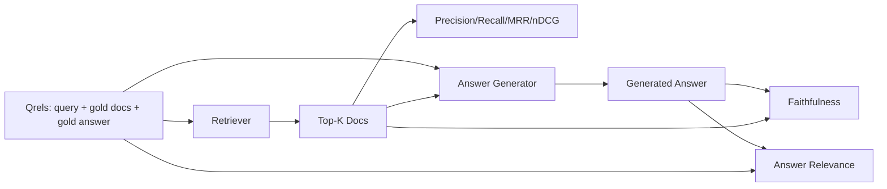

# Оценивание RAG: точность, полнота, MRR, nDCG, обоснованность и соответствие ответа вопросу

> Если вы не можете одновременно оценить свой поиск и свой ответ, вы не можете поставить систему в продакшен. Это не одна и та же метрика, и один и тот же промпт проваливается по разным осям.

**Тип:** Build
**Языки:** Python
**Предварительные требования:** уроки 06 (RAG) и 10 (оценивание) фазы 11; основы трека B фазы 19 (уроки 20–29); уроки 64, 65, 66 и 67 фазы 19
**Время:** ~90 минут

## Цели обучения
- Вычисляйте четыре метрики поиска по эталонным qrels: precision@k, recall@k, MRR (средний обратный ранг) и nDCG@k.
- Вычисляйте две метрики качества ответа: обоснованность (каждое утверждение подтверждается найденным контекстом) и соответствие ответа вопросу.
- Постройте фикстурный файл qrels (запросы, идентификаторы эталонных документов, эталонный текст ответа), который процедура оценивания читает целиком.
- Читайте значения метрик, чтобы диагностировать, где отказывает конвейер: поиск, ранжирование, генерация или обоснование ответа.

## Проблема

У RAG-системы есть как минимум четыре подвижных компонента: разбиватель, ретривер, реранкер, генератор. Любой из них может быть причиной неверного ответа. Без метрик на каждом этапе вы летите вслепую.

Пользователь сообщает о неверном ответе. Дело в том, что разбиватель разрезал участок с ответом? Или в том, что ретривер не включил нужный фрагмент в top-k? Или в том, что реранкер сместил нужный фрагмент с первой позиции? Или в том, что генератор проигнорировал фрагмент и что-то выдумал? По одному ответу этого не понять. Вам нужны:

- Метрики поиска — чтобы оценить, что вернул ретривер.
- Метрики ранжирования — чтобы оценить, на каком месте в порядке находился нужный фрагмент.
- Обоснованность ответа — чтобы оценить, оставался ли генератор в пределах найденного контекста.
- Соответствие ответа вопросу — чтобы оценить, отвечает ли ответ на вопрос вообще.

В этом уроке все шесть метрик строятся поверх фикстурного файла qrels. Оценивание выполняется без подключения к сети и детерминировано; в продакшене имитатор большой языковой модели (LLM), выступающей оценщиком, заменяют настоящей моделью.

## Концепция



### Точность (precision@k)

Какая доля из top-k документов, возвращённых ретривером, входит в эталонный набор? Если в эталоне три документа, а top-3 возвращает два из них и один неверный, precision@3 равен 2 / 3. Используйте точность, когда цена нерелевантного найденного фрагмента высока (генератор тратит на него токены, или фрагмент отравляет ответ).

### Полнота (recall@k)

Какая доля эталонных документов входит в top-k? Если в эталоне три документа, а top-5 содержит все три, recall@5 равен 1.0. Используйте полноту, когда цена пропущенного ответа высока (лучше увидеть один лишний неверный фрагмент, чем полностью пропустить фрагмент с ответом).

В продакшен-RAG обычно приводят метрику полноты recall@k. Генерация легко может отбросить нерелевантные фрагменты; но она не может придумать ответ из фрагмента, которого никогда не видела.

### MRR (средний обратный ранг)

Для каждого запроса найдите позицию первого релевантного документа в ранжированном списке. Обратный ранг равен 1 / позиция. Усредните его по набору запросов. MRR — это единое число, показывающее, насколько хорошо ретривер выводит лучший ответ на первое место.

MRR сильно взвешивает позицию 1. Запрос, в котором эталонный документ находится на месте 1, даёт вклад 1.0. Место 2 даёт 0.5. Место 10 даёт 0.1. В метрике доминирует верх списка.

### nDCG@k

Нормализованный дисконтированный кумулятивный выигрыш. Полная формула присваивает каждому найденному документу выигрыш (часто 1 для релевантного, 0 для нерелевантного), дисконтирует его логарифмом позиции, суммирует и делит на идеальный DCG (DCG, который был бы при идеальном ранжировании). Диапазон от 0 до 1.

nDCG учитывает градуированную релевантность: эталон может утверждать «документ A — 3, документ B — 2, документ C — 1». MRR и recall@k сводят всё к бинарной оценке. Используйте nDCG, когда в корпусе на каждый запрос приходится несколько частично релевантных документов.

### Обоснованность ответа

Для каждого утверждения в сгенерированном ответе проверьте, подтверждается ли оно найденным контекстом. Стандартная реализация использует промпт для LLM-оценщика, который принимает (утверждение, контекст) и возвращает «да» или «нет». Метрика — это доля утверждений, прошедших проверку.

Обоснованность выявляет режим отказа генератора, при котором модель выдумывает контент. Даже если ретривер вернул нужные фрагменты, генератор, который галлюцинирует, сломан. Эту метрику также называют подтверждённостью и атрибуцией.

В этом уроке обоснованность реализуется через детерминированный имитатор оценщика, который проверяет, превышает ли пересечение токенов каждого утверждения с найденным контекстом заданный порог. В продакшене его заменяют настоящим вызовом модели. Форма метрики остаётся той же.

### Соответствие ответа вопросу

Действительно ли ответ отвечает на вопрос? Обоснованность задаёт вопрос «подтверждается ли ответ контекстом?». Соответствие ответа вопросу задаёт вопрос «согласуется ли ответ с вопросом?». Обоснованный, но не относящийся к теме ответ получает высокий балл за обоснованность и низкий за соответствие вопросу. Короткий ответ по теме, игнорирующий контекст, получает высокий балл за соответствие вопросу и низкий за обоснованность.

Стандартная реализация также использует LLM в роли оценщика: берёт (вопрос, ответ) и проверяет, отвечает ли ответ на вопрос. В этом уроке реализован заменитель на основе пересечения токенов и автоматического оценщика.

## Фикстура qrels

```python
{
  "qid": "q1",
  "query": "what is the abort threshold for multipart uploads",
  "gold_doc_ids": ["d1", "d3"],
  "gold_answer_substring": "three failed parts",
  "graded_relevance": {"d1": 3, "d3": 2},
}
```

Каждый запрос содержит:
- строку запроса,
- набор идентификаторов эталонных документов (для precision / recall / MRR),
- словарь градуированной релевантности (для nDCG),
- эталонную подстроку ответа (хранится как справочные метаданные для каждого qrel; обоснованность в этом уроке вычисляется путём оценки извлечённых утверждений относительно найденного контекста, а не относительно этой подстроки).

В продакшене эти данные размечаются вручную. В этом уроке поставляется фикстура, собранная вручную, чтобы оценивание работало из коробки.

```figure
ci-rag-metric-ladder
```

## Реализация

`code/main.py` реализует:

- `precision_at_k(retrieved, gold, k)` — буквальное определение.
- `recall_at_k(retrieved, gold, k)` — буквальное определение.
- `mean_reciprocal_rank(retrieved_list_of_lists, gold_list)` — среднее по запросам.
- `ndcg_at_k(retrieved, graded_relevance, k)` — DCG / IDCG с бинарными или градуированными выигрышами.
- `extract_claims(answer)` — разбивает ответ на утверждения в форме предложений.
- `faithfulness(claims, context_texts, judge)` — доля утверждений, признанных подтверждёнными.
- `answer_relevance(question, answer, judge)` — оценщик, определяющий, отвечает ли ответ на вопрос.
- `MockJudge` — детерминированный оценщик на основе пересечения токенов, позволяющий выполнять оценивание без подключения к сети.
- `evaluate_pipeline(pipeline_fn, qrels, ks)` — оркестратор, который запускает все метрики.
- Демонстрация, которая запускает три варианта конвейера (базовый разбиватель, гибридный поиск, гибридный поиск + реранжирование) на qrels и выводит таблицу метрик.

Запустите это:

```bash
python3 code/main.py
```

Вывод показывает precision@k, recall@k, MRR, nDCG@k, обоснованность и соответствие ответа вопросу для каждого варианта в единой таблице метрик. Строка гибридного поиска превосходит базовый разбиватель по полноте; строка с реранжированием превосходит гибридный вариант по MRR.

## Чтение метрик для диагностики отказов

| Симптом | Вероятная причина | Что исправить |
|---------|-------------|-------------|
| Низкий recall@k, низкий precision@k | Разбиватель разрезал ответ, либо ретривер не может его найти | Границы разбиения (урок 64) или модальность ретривера (урок 65) |
| Приемлемый recall@k, низкий MRR | Нужный фрагмент есть в top-k, но не на позиции 1 | Реранкер (урок 66) |
| Высокий MRR, низкая обоснованность | Генератор выдумывает контент, несмотря на правильный контекст | Промпт генерации; требование привести источник или отказаться от ответа |
| Высокая обоснованность, низкое соответствие вопросу | Ответ обоснован, но не по теме | Переформулировщик (урок 67) или промпт генерации |
| Все четыре показателя высокие, пользователи всё равно жалуются | Набор для оценивания непредставителен | Расширьте qrels реальными пользовательскими запросами |

## Режимы отказа, которые скрывает демонстрация

**Смещение LLM-оценщика.** Модель оценивает собственные результаты как более обоснованные, чем они есть на самом деле. Используйте в качестве оценщика модель другого семейства, отличную от генератора, либо оцените выборку вручную.

**Устаревание qrels.** Эталонные ответы дрейфуют по мере изменения корпуса. Документ, который был эталонным для q1 в январе 2024 года, к октябрю 2024 года уже не является верным ответом, потому что команда переименовала функцию. Планируйте ежеквартальный пересмотр qrels.

**Микропроверки обоснованности упускают макроутверждения.** Обоснованность на уровне предложений может проходить проверку, в то время как структура ответа в целом вводит в заблуждение. Добавьте качественный обзор на уровне выборки поверх автоматической метрики.

**Recall@k маскирует отказы по отдельным запросам.** Средняя полнота в 90% может скрывать, что один класс запросов постоянно не находится. Разбейте qrels по классам запросов (буквальные, перефразированные, многотемные) и сообщайте метрики по каждому срезу.

## Применение

Практики для продакшена:

- Запускайте оценивание при каждом изменении ретривера или генератора. Относитесь к регрессии recall@k как к падению теста.
- Сохраняйте трассировку метрик по каждому запросу. Когда пользователь жалуется, найдите соответствующую запись qrels и проверьте, была бы проблема обнаружена.
- Разделите qrels на уровни: проверочный набор из 20 запросов, который запускается в CI; регрессионный набор из 200, который запускается ночью; глубокий набор из 2000, который запускается еженедельно.

## Поставка

Урок 69 связывает воедино весь конвейер (разбиватель, ретривер, реранкер, генератор) и запускает это оценивание для сквозной системы.

## Упражнения

1. Добавьте пятую метрику поиска: hit-rate@k. Сравните её с recall@k. Объясните, когда они расходятся.
2. Реализуйте градуированную обоснованность: 0 (не подтверждено), 1 (частично подтверждено), 2 (полностью подтверждено). Соответствующим образом обновите метрику.
3. Замените имитатор оценщика настоящим вызовом модели. Измерьте расхождение между имитатором и настоящим оценщиком на фикстуре.
4. Добавьте срез по классу запроса («буквальный», «перефразированный», «многотемный»). Сообщайте метрики по каждому срезу.
5. Добавьте метрику «длина ответа» и сопоставьте её с обоснованностью. Постройте график зависимости.

## Ключевые термины

| Термин | Что говорят люди | Что это означает на самом деле |
|------|-----------------|------------------------|
| Precision@k | «Доля попаданий среди найденного» | Доля top-k, входящая в эталон |
| Recall@k | «Доля попаданий среди эталонного» | Доля эталона, входящая в top-k |
| MRR | «Позиция первого попадания» | Среднее значение 1 / ранг первого релевантного документа |
| nDCG@k | «Градуированное качество ранжирования» | DCG по top-k, делённый на идеальный DCG |
| Обоснованность ответа | «Подтверждается ли ответ контекстом?» | Доля утверждений ответа, подтверждённых найденным контекстом |
| Соответствие ответа вопросу | «Отвечает ли это на вопрос?» | Соответствует ли ответ намерению, выраженному в вопросе |
| Qrels | «Эталонные метки» | Размеченный набор запросов вместе с их эталонными документами и ответами |

## Дополнительное чтение

- Buckley, Voorhees, "Evaluating Evaluation Measure Stability", SIGIR 2000 — каноническая статья о метриках ранжирования
- Jarvelin, Kekalainen, "Cumulated Gain-based Evaluation of IR Techniques" — статья, представившая nDCG
- [Ragas: автоматизированное оценивание RAG-конвейеров](https://docs.ragas.io)
- [Anthropic, оценивание RAG](https://www.anthropic.com/news/evaluating-rag)
- Фаза 11, урок 10 — основы фреймворка оценивания
- Фаза 19, уроки 64–67 — компоненты, которые здесь оцениваются
- Фаза 19, урок 69 — сквозной конвейер, который оценивается с помощью этой процедуры
