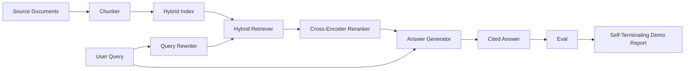

# Сквозная система RAG

> Шесть уроков компонентов. Один конвейер. Один цикл оценивания. Одна самозавершающаяся демонстрация. Это система, которую вы отправите в продакшен.

**Тип:** Build**Языки:** Python**Предварительные требования:** Фаза 11 уроки 06 (RAG), 10 (evaluation); Фаза 19 Track B foundations (уроки 20-29); Фаза 19 уроки 64, 65, 66, 67, 68**Время:** ~90 минут
## Цели обучения
- Собрать разбиватель (chunker), гибридный ретривер, переформулировщик запроса, реранкер на основе cross-encoder и генератор ответов в единый сквозной конвейер.
- Реализовать генератор ответов, который подтверждает свои утверждения якорем цитирования по фрагментам и использует запасной механизм отказа при низкой уверенности (refuse-on-low-confidence).
- Запустить оценивание из урока 68 на собранном конвейере и доказать, что поэтапно собранная система превосходит по каждой метрике те же компоненты по отдельности.
- Построить самозавершающуюся CLI-демонстрацию, которая загружает тестовый корпус, выполняет фиксированный набор запросов и завершается с кодом ноль, выводя сводный отчёт.

## Проблема

Шесть компонентов по отдельности ничего не доказывают. Разбиватель может выигрывать по recall@5 на корпусе и проигрывать по recall@5 всей системы, потому что ретривер не способен ранжировать то, что выдаёт разбиватель. Реранкер может повышать MRR на синтетическом пуле кандидатов и давать сбой на реальных кандидатах от bi-encoder, потому что полнота (recall) bi-encoder в пределах бюджета реранжирования слишком низка. Переформулировщик запроса может продвигать эталонный документ на одном запросе и ломаться на следующем, потому что имитация LLM возвращает вырожденный гипотетический документ.

Интеграционный тест — это прогон всего конвейера от начала до конца на тех же тестовых qrels, с той же метрикой, с одним файлом-оркестратором, который связывает всё воедино. Именно это строится в этом уроке. Если метрики интегрированного конвейера превосходят метрики изолированной демонстрации каждого этапа, система доказана.

## Концепция



### Связывание компонентов

Конвейер — это небольшой граф. Каждый этап — функция с чётко определённой сигнатурой.

| Этап | Вход | Выход |
|-------|-------|--------|
| Разбиватель | Текст документа | Список записей Chunk |
| Ретривер | Строка запроса | Топ-N записей Chunk |
| Переформулировщик (опционально) | Строка запроса | Список переформулировок + гипотетический документ |
| Реранкер | Запрос, кандидаты | Топ-K записей Chunk с cross-оценками |
| Генератор | Запрос, топ-K записей Chunk | Строка ответа с цитированием |

Композиция становится простой, когда каждая сигнатура стабильна. Класс `Pipeline` этого урока хранит пять этапов и метод `query`, который выполняет их по порядку. Каждый этап заменяем: передайте другой разбиватель, ретривер, переформулировщик, реранкер или генератор — и конвейер всё равно будет работать.

### Генератор ответов с цитированием

Генератор — последний этап, и его проще всего сломать. В уроке используется детерминированный имитационный генератор, который:

1. Берёт топ-K переранжированных фрагментов.
2. Выбирает до двух фрагментов, текст которых содержит наибольшее пересечение содержательных токенов с запросом.
3. Формирует ответ, представляющий собой объединение по одному предложению из каждого выбранного фрагмента, где после каждого предложения следует якорь `[doc_id:chunk_index]`.
4. Если ни у одного фрагмента пересечение не превышает порог отказа, выводит «Я не знаю» без цитирования.

В продакшене вы заменяете имитацию на настоящий вызов LLM с использованием следующего шаблона промпта:

```
You are answering a question using only the snippets below.
Cite every claim with the anchor in parentheses.
If the snippets do not answer the question, say "I do not know".

Question: {query}

Snippets:
{enumerated chunks with anchors}

Answer:
```

Путь отказа при низкой уверенности (refuse-on-low-confidence) — единственная причина, по которой логируется оценка cross-encoder для ранга 1. Если она оказывается ниже порога корпуса, генератор отказывается отвечать. Это предохранительный клапан против галлюцинированных ответов.

### Самозавершающаяся демонстрация

Демонстрация прогоняет всё от начала до конца. Она выводит детализацию по этапам для одного запроса, запускает оценивание по четырём тестовым qrels, выводит таблицу метрик и завершается со статусом ноль, если все метрики из урока 68 соответствуют порогам, заданным в демонстрации. Если какая-либо метрика ниже порога, демонстрация завершается с ненулевым статусом и сообщением с указанием метрики, которая не прошла проверку.

Именно так выглядит smoke-тест в CI. Конвейер работает офлайн, быстро и детерминированно. Пороги на тестовых данных намеренно заданы жёстко, чтобы регрессия в любом из шести уроков приводила к провалу демонстрации.

```figure
rag-pipeline-flow
```

## Реализация

`code/main.py` реализует:

- `Chunk` — запись, которая переносится через все этапы (расширяет структуру из урока 64, добавляя chunk_index и doc_id источника).
- `Chunker` — выбирает стратегию из урока 64 (по умолчанию — рекурсивное разбиение).
- `HybridIndex` — объединяет BM25 + dense + RRF из урока 65.
- `Rewriter` (опционально) — выбирает один из вариантов HyDE, multi-query или decomposition из урока 67 в зависимости от длины запроса и наличия союзов.
- `Reranker` — обученный cross-encoder из урока 66, с уменьшенным тестовым обучающим набором, чтобы обучение сходилось за секунды.
- `Generator` — детерминированный имитационный генератор с цитированием и отказом при низкой уверенности.
- `Pipeline` — объединяет пять этапов с помощью метода `query(question)`, который возвращает `Result(answer, top_k, latency_ms_per_stage)`.
- `run_demo()` — загружает корпус, выполняет три тестовых запроса, запускает оценивание, выводит результаты и устанавливает код выхода в зависимости от порога.

Запустите:

```bash
python3 code/main.py
```

На выходе — трассировка одного запроса, полная таблица оценивания и итоговый статус pass/fail. На тестовых данных возвращается код выхода 0.

## Режимы отказа, которые скрывает демонстрация

**Дрейф границ фрагментов.** Если поменять стратегию разбивателя между этапом разметки qrels для оценивания и демонстрацией, эталонные doc_id перестают совпадать. Зафиксируйте стратегию разбивателя в файле qrels. Демонстрация включает заголовок с указанием используемого разбивателя.

**Обучающий набор реранкера просачивается в оценивание.** 14 обучающих триплетов из урока 66 включают запросы, похожие на запросы оценивания. В продакшене строго исключайте запросы оценивания из обучения. Запросы оценивания в демонстрации намеренно не пересекаются с обучающим набором реранкера.

**Имитационный генератор скрывает риск галлюцинаций.** Имитация не может галлюцинировать, потому что выводит только текст из найденных фрагментов. Урок отмечает это и указывает путь замены на реальную модель в продакшене.

**Без потоковой передачи.** Конвейер возвращает полный ответ по завершении каждого этапа. Продакшен-система передавала бы вывод генератора потоково. Потоковая передача не входит в рамки урока; метрики качества ответа в любом случае работают с итоговой строкой.

**Задержка измеряется офлайн.** Вызовы имитации LLM занимают постоянное время. Реальные вызовы LLM доминируют по времени. Планируйте бюджет задержки в рамках запроса; поэтапный хронометраж урока измеряет только работу CPU.

## Применение

Паттерны для продакшена:

- Поставляйте файл конвейера в виде одного оркестратора с явными интерфейсами этапов. Не разбрасывайте связывание компонентов по репозиторию.
- Запускайте оценивание перед каждым слиянием, затрагивающим этап конвейера. Если метрики оценивания падают, слияние не выполняется.
- Сохраняйте трассировку метрик для каждого прогона CI, чтобы можно было привязать регрессии к замене конкретного этапа.
- Добавьте smoke-набор из 20 запросов (подмножество регрессионного набора), который выполняется менее чем за 30 секунд; полный регрессионный набор запускается ежедневно ночью.

## Поставка

Файл конвейера из этого урока задаёт форму, которую предполагают остальные уроки Track F Phase 19. Последующие уроки добавят автоматизацию загрузки данных, инкрементальное переиндексирование, телеметрию и слой обслуживания поверх этого. Половины, отвечающие за поиск, реранжирование, переформулирование и оценивание, здесь полностью реализованы.

## Упражнения

1. Добавьте в переформулировщик селектор стратегии для каждого запроса: эвристики из урока 67 (длина, союзы, доля жаргона) выбирают HyDE, multi-query или decomposition.
2. Добавьте реальный вызов LLM для генератора за флагом окружения. По умолчанию используйте имитацию. Измерьте разницу в задержке.
3. Расширьте демонстрацию флагом `--corpus path`, который загружает реальный корпус. Повторно запустите оценивание и проверку порогов.
4. Добавьте флаг `--strategy` для разбивателя. Измерьте вклад каждой стратегии в сквозную полноту (recall).
5. Добавьте потоковый интерфейс генератора и подключите его к оцениванию. Убедитесь, что достоверность (faithfulness) вычисляется по итоговой строке, а не по потоковому префиксу.

## Ключевые термины

| Термин | Что говорят люди | Что это означает на самом деле |
|------|-----------------|------------------------|
| Конвейер | «RAG-конвейер» | Совокупность этапов от загрузки данных до ответа с цитированием |
| Якорь цитирования | «Ссылка на источник» | Ссылка вида (doc_id, chunk_index), прикреплённая к каждому утверждению |
| Refuse-on-low-confidence | «Я не знаю» | Генератор не возвращает ответ, если оценка топ-1 реранкера ниже порога |
| Smoke-набор | «Оценивание в CI» | Минимальное подмножество qrels, которое выполняется при каждой проверке PR |
| Интерфейс этапа | «Сигнатура функции» | Устойчивый тип входа и выхода каждого этапа конвейера |

## Дополнительное чтение

- [Anthropic, Building search and retrieval](https://www.anthropic.com/news/contextual-retrieval)
- [Pinterest, MCP internal search](https://medium.com/pinterest-engineering) — эталонная архитектура для продакшена
- [Ragas: Automated Evaluation of RAG Pipelines](https://docs.ragas.io)
- Phase 11, урок 06 — основы RAG
- Phase 19, уроки 64–68 — компоненты, из которых здесь собрана система
