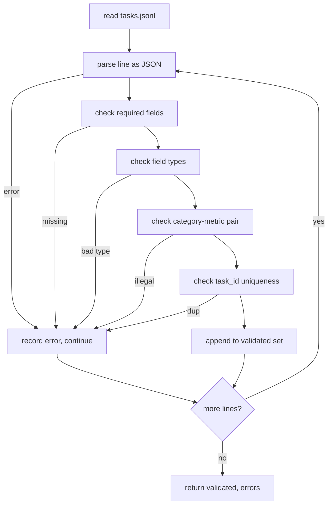

# Формат спецификации задачи

> Харнесс для оценивания хорош ровно настолько, насколько хорош контракт, который соблюдают его задачи. Зафиксируйте форму JSONL и словарь метрик, прежде чем написать хотя бы одну функцию подсчёта.

**Тип:** Build**Языки:** Python**Предварительные требования:** Фаза 19 Track B foundations**Время:** ~90 мин
## Цели обучения

- Определите схему записи задачи в формате JSONL, которая охватывает арифметику, множественный выбор, выполнение кода, классификацию и свободный текст (суммаризацию) в одной форме.
- Зафиксируйте закрытый словарь имён метрик, чтобы последующие уроки (71-73) могли выполнять диспетчеризацию по одному полю.
- Задавайте примеры few-shot и правила постобработки как часть задачи, а не раннера, чтобы один и тот же промпт давал одну и ту же целевую метку независимо от модели.
- Реализуйте строгий валидатор, который отклоняет некорректные записи прежде, чем они попадут в раннер.
- Поставьте набор фикстур из 10 задач, который задействует каждую ветвь спецификации, чтобы валидатору было с чем работать на практике.

```figure
ci-task-spec-gate
```

## Зачем фиксировать спецификацию

Исследовательская кодовая база накапливает скрипты для оценивания быстрее, чем тесты. Через полгода у каждого ноутбука своя форма JSON, каждая метрика реализована заново дважды, и ничего нельзя сравнить между прогонами. Решение скучное. Выберите схему. Напишите валидатор. Отклоняйте всё остальное. Именно это делает этот урок.

Форма заимствует идеи из харнессов в стиле BIG-bench, HELM и lm-eval, но имена полей — наши собственные. У каждого поля один владелец. Раннер читает задачу. Метрика читает targets. Этап постобработки нормализует генерацию. Ни одно поле не изменяется в середине конвейера.

## Форма записи

Задача — это JSON-объект на одной строке. Харнесс читает `tasks.jsonl` и проверяет каждую строку независимо. Ошибочная строка прерывает обработку этой записи, а не всего прогона.

```json
{
  "task_id": "arith_001",
  "category": "arithmetic",
  "prompt": "Compute the result. Question: 17 + 24\nAnswer:",
  "targets": ["41"],
  "metric_name": "exact_match",
  "few_shot_examples": [
    {"prompt": "Question: 2 + 2\nAnswer:", "completion": "4"}
  ],
  "post_process": "strip_whitespace",
  "metadata": {"difficulty": "easy"}
}
```

Обязательные поля — `task_id`, `category`, `prompt`, `targets`, `metric_name`, `post_process`. `few_shot_examples` и `metadata` необязательны. Неизвестные поля верхнего уровня не проходят валидацию.

## Правила полей

`task_id` — строка без пробельных символов. Валидатор обеспечивает уникальность по всему файлу.

`category` принимает одно из значений `arithmetic`, `mcq`, `code_exec`, `classification`, `summary`. Категория ограничивает, какая пара метрики и постобработки допустима. Задача `code_exec` должна использовать `metric_name = code_exec`, а задача `mcq` должна использовать `metric_name = exact_match` для цели, состоящей из одной буквы.

`prompt` — непустая строка. Валидатор запрещает завершающие пробелы и отклоняет записи, в которых в теле промпта уже присутствует блок few-shot. Рендеринг few-shot выполняется раннером, а не автором.

`targets` — непустой список строк. Для `exact_match` совпадение засчитывается по любому элементу. Для `f1` и `rouge_l` побеждает цель с наивысшей оценкой. Для `mcq` список содержит ровно один элемент.

`metric_name` принимает одно из значений `exact_match`, `f1`, `bleu_4`, `rouge_l`, `accuracy`, `code_exec`. Словарь закрыт. Новая метрика требует нового урока и новой записи здесь.

`few_shot_examples` — список пар `{prompt, completion}`. Валидатор ограничивает список восемью элементами, чтобы промпты оставались ограниченного размера.

`post_process` принимает одно из значений `none`, `strip_whitespace`, `lower`, `extract_letter`, `extract_code_block`, `extract_first_line`. У каждого правила единственное детерминированное поведение. Валидатор запрещает комбинировать правила.

## Поведение валидатора



Валидатор возвращает два списка: проверенные записи и записи с ошибками, включая проблемную строку, нарушенное правило и поле, в котором обнаружена ошибка. Раннер отказывается запускаться, если список ошибок непуст, если не установлен явный флаг `--allow-bad-tasks`.

## Рендеринг few-shot

Раннер объединяет примеры few-shot перед промптом, разделяя их пустой строкой. Для каждой модели выполняется один и тот же путь кода, поэтому единственный источник вариативности — сама модель. Авторы пишут примеры один раз, а не отдельно для каждого провайдера.

```python
def render(task):
    parts = []
    for ex in task.get("few_shot_examples", []):
        parts.append(ex["prompt"] + " " + ex["completion"])
    parts.append(task["prompt"])
    return "\n\n".join(parts)
```

## Правила постобработки

Этап постобработки выполняется после генерации, перед метрикой. Он детерминированный и не хранит состояние.

- `none` возвращает строку без изменений.
- `strip_whitespace` удаляет начальные и завершающие пробелы.
- `lower` приводит строку к нижнему регистру.
- `extract_letter` возвращает первый символ, соответствующий `[A-E]`, используется для MCQ.
- `extract_code_block` возвращает содержимое первого блока, ограниченного тройными обратными кавычками, используется для code-exec.
- `extract_first_line` возвращает первую непустую строку, используется для классификации сводок.

Задача, которой нужно правило вне этого списка, относится к новому уроку.

## Чего этот урок не делает

Он не выполняет подсчёт оценок. Он не вызывает модель. Он не выполняет код. Это будет в уроках 71, 72 и 75. Этот урок фиксирует контракт, который все они соблюдают.

Фикстура из 10 задач охватывает два арифметических элемента, два элемента MCQ, два элемента code-exec, два элемента классификации и два элемента с суммаризацией. Валидатор успешно проходит все 10. Отдельная фикстура (`tasks_bad.jsonl`) нарушает каждое правило, и валидатор возвращает ровно столько же ошибок.

## Как читать код

`main.py` определяет `TaskSpec`, `validate_task`, `validate_file` и точку входа CLI. Загрузчик фикстур — `load_fixtures`. Вспомогательные функции рендеринга и постобработки расположены рядом с валидацией, чтобы раннер в уроке 75 импортировал единственный модуль.

Прочитайте `main.py` от начала до конца. Затем прочитайте `code/tests/test_spec.py`. Тесты фиксируют каждое правило валидации и каждое поведение постобработки. Демонстрация в конце `main.py` проверяет встроенную фикстуру и выводит сводку.

## Что дальше

Реальные наборы для оценивания разрастаются категориями точно так же, как схемы разрастаются столбцами. Разумный подход — отказываться добавлять категорию, если вместе с ней не добавлены метрика, правило постобработки и хотя бы одна задача-фикстура. Относитесь к спецификации как к миграции базы данных. Каждое изменение проходит ревью, версионируется и сопровождается тестами. Валидатор в этом уроке — это и есть такой барьер.
