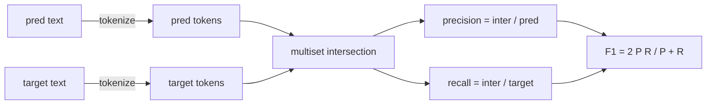
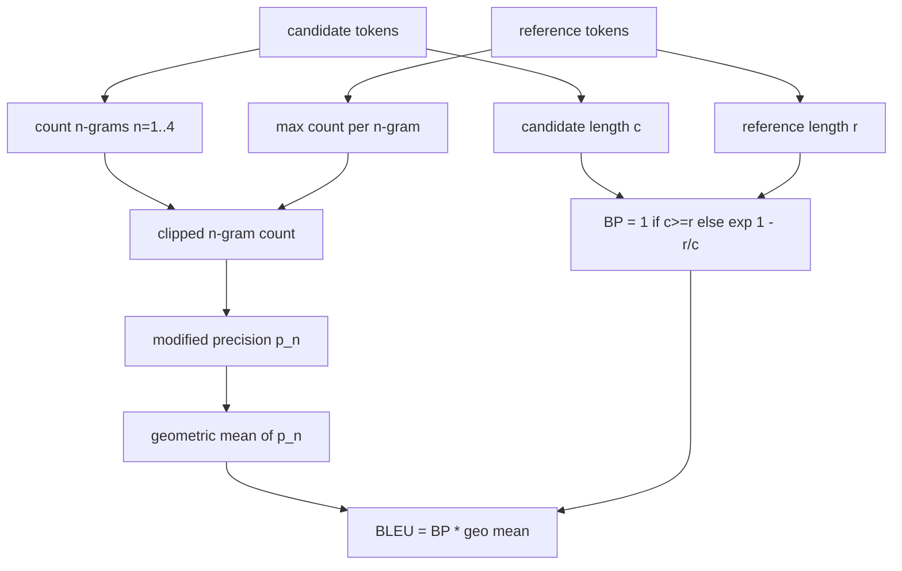

# Классические метрики

> BLEU, ROUGE-L, F1, exact-match, accuracy. Пять метрик, на которые до сих пор приходится большинство публикуемых показателей оценивания LLM. Реализуйте каждую с нуля, чтобы понимать, что означает это число.

**Тип:** Build**Языки:** Python**Предварительные требования:** Фаза 19 Track B foundations, урок 70**Время:** ~90 мин
## Цели обучения

- Реализуйте exact-match, F1 и accuracy на уровне токенов с явными правилами токенизации.
- Реализуйте BLEU-4 с нуля: модифицированная n-gram precision, среднее геометрическое по n от 1 до 4, brevity penalty.
- Реализуйте ROUGE-L с использованием longest common subsequence, с F-beta-комбинацией precision и recall.
- Диспетчеризуйте по полю metric_name из урока 70, чтобы раннер оставался metric-agnostic.
- Зафиксируйте поведение эталонными векторами, взятыми из разобранных примеров, а не из сторонней библиотеки.

```figure
cd-bleu-overlap
```

## Зачем реализовывать заново

Вам встретятся статьи, где BLEU равен 28.3, и другие, где BLEU равен 0.283. Вы найдёте оценки ROUGE-L, которые расходятся на десять пунктов между двумя библиотеками, потому что одна приводит текст к нижнему регистру, а другая — нет. Самый быстрый способ перестать путаться — написать метрики самостоятельно, а затем указать на строку, где выбирается токенизатор, и на строку, где применяется сглаживание. После этого сравнение чисел между статьями сводится к чтению настроек метрики, а не к спорам о библиотеках.

Достаточно stdlib и numpy. BLEU — это подсчёт и ограничение (clamp). ROUGE-L — это динамическое программирование. F1 — это пересечение множеств токенов. Самое сложное — выбрать токенизатор и придерживаться его.

## Токенизация

Токенизатор — это `re.findall(r"\w+", text.lower())`. Нижний регистр, буквенно-цифровые последовательности, пунктуация отбрасывается. Каждая метрика в этом уроке использует именно этот токенизатор. Раннер не может выбирать другой. Если вы поменяете токенизатор, вы будете запускать уже другой бенчмарк.

```python
TOKEN_RE = re.compile(r"\w+", re.UNICODE)
def tokenize(text):
    return TOKEN_RE.findall(text.lower())
```

Это намеренное упрощение. В продакшен-настройках важны CJK, сокращения и идентификаторы кода. Смысл урока в том, что токенизатор — это контракт, а не настраиваемый параметр.

## Exact match

```python
def exact_match(pred, targets):
    return float(any(pred.strip() == t.strip() for t in targets))
```

Она возвращает 1.0 или 0.0 для каждой задачи. Агрегат по набору данных — это среднее. Это рабочая лошадка для арифметических задач, MCQ и коротких задач классификации.

## F1 на уровне токенов

Постройте мультимножества токенов для предсказания и эталона. Precision — это пересечение мультимножеств, делённое на мультимножество предсказания. Recall — то же пересечение, делённое на мультимножество эталона. F1 — среднее гармоническое. Реализация обрабатывает крайние случаи пустого предсказания и пустого эталона.



Для задач с несколькими эталонами мы берём лучший F1 по списку эталонов. Это соответствует поведению в стиле SQuAD, широко описанному в литературе.

## BLEU-4

BLEU — каноническая метрика машинного перевода, которая до сих пор встречается в задачах суммаризации. Мы используем формулировку corpus-level BLEU-4 со стандартным brevity penalty и аддитивным сглаживанием (add-one) для модифицированных счётчиков n-грамм, чтобы отсутствие одной 4-граммы не обнуляло итоговую оценку.

Для каждой пары кандидат-эталон мы считаем modified n-gram precision для n от 1 до 4. Modified precision ограничивает количество n-грамм кандидата максимальным количеством этой n-граммы в любом эталоне, поэтому кандидат не может завысить оценку, повторяя одну фразу. Среднее геометрическое по четырём значениям precision оборачивается brevity penalty.



Правило сглаживания — то, что Lin and Och назвали method 1: к числителю и знаменателю каждой n-gram precision перед взятием логарифма добавляется единица. Это позволяет избежать `log 0`, когда в эталоне нет совпадающей 4-граммы, и держит результат близким к несглаженному значению на длинных кандидатах.

## ROUGE-L

ROUGE-L сравнивает longest common subsequence последовательностей токенов кандидата и эталона. LCS отражает порядок слов, не требуя непрерывности, поэтому это метрика суммаризации по умолчанию. Мы вычисляем длину LCS с помощью стандартной таблицы динамического программирования, затем выводим recall как `lcs / reference length`, precision как `lcs / candidate length`, и объединяем их через F-beta, где beta равно единице для симметричной формы F1.

```python
def lcs_length(a, b):
    n, m = len(a), len(b)
    dp = numpy.zeros((n + 1, m + 1), dtype=int)
    for i in range(n):
        for j in range(m):
            if a[i] == b[j]:
                dp[i+1, j+1] = dp[i, j] + 1
            else:
                dp[i+1, j+1] = max(dp[i+1, j], dp[i, j+1])
    return int(dp[n, m])
```

Таблица numpy делает реализацию наглядной; чистые списки Python тоже подошли бы. Задачи, которые используют ROUGE-L, платят стоимость O(n m) за каждую задачу. Для типичных длин резюме это остаётся меньше миллисекунды.

## Accuracy

Для задач классификации с несколькими эталонами accuracy сводится к exact-match с единственным нормализованным эталоном. Мы выносим её в отдельную функцию, чтобы диспетчер мог диспетчеризовать по `metric_name`, не прибегая к сравнению строк внутри раннера.

## Контракт диспетчеризации

Единственная точка входа — `score(metric_name, prediction, targets)`. Она возвращает float в `[0, 1]`. Раннер не ветвится по имени метрики. Он передаёт вызов дальше и записывает результат. Это тот интерфейс, к которому урок 75 подключит task spec из урока 70.

```python
def score(metric_name, pred, targets):
    if metric_name == "exact_match":
        return exact_match(pred, targets)
    if metric_name == "f1":
        return max(f1_score(pred, t) for t in targets)
    if metric_name == "bleu_4":
        return max(bleu4(pred, t) for t in targets)
    if metric_name == "rouge_l":
        return max(rouge_l(pred, t) for t in targets)
    if metric_name == "accuracy":
        return accuracy(pred, targets)
    raise ValueError(f"unknown metric_name: {metric_name}")
```

`code_exec` обрабатывается в уроке 72 и подключается там же в диспетчер.

## Чего этот урок не делает

Он не вызывает модель. Он не нормализует генерации сверх того, что уже сделали правила пост-обработки из урока 70. Он не вычисляет доверительные интервалы. Он не делает BLEURT или BERTScore (для них нужна модель, и они относятся к другому уроку). Смысл в базовом уровне: пять метрик, один токенизатор, одна таблица диспетчеризации.

## Как читать код

`main.py` определяет каждую метрику как отдельную функцию плюс диспетчер. Эталонные векторы находятся в блоке `_reference_examples` в конце файла. Демо запускает диспетчер на восьми примерах и печатает оценки по каждой метрике. Тесты в `code/tests/test_metrics.py` фиксируют эталонные векторы и проверяют каждый крайний случай (пустое предсказание, пустой эталон, отсутствие общих токенов, exact match, ограничение при повторяющейся фразе).

Читайте `main.py` сверху вниз. Функции упорядочены по сложности. exact_match и accuracy занимают по одной строке каждая. F1 — шесть строк. BLEU и ROUGE-L — самые тяжёлые части, и в них есть подробные комментарии о правиле сглаживания и рекуррентном соотношении LCS.

## Что дальше

Классические метрики необходимы, но недостаточны. Они вознаграждают поверхностное совпадение и упускают смысл. Решение — добавить поверх них метрики на основе моделей (BLEURT, BERTScore, GEval), когда вы уже доверяете классическому базовому уровню. Это тема одного из следующих уроков. Пока что: заставьте эти пять метрик работать, зафиксируйте их тестами — и у вас будет стек метрик, который поддаётся аудиту, быстрый и воспроизводимый.
