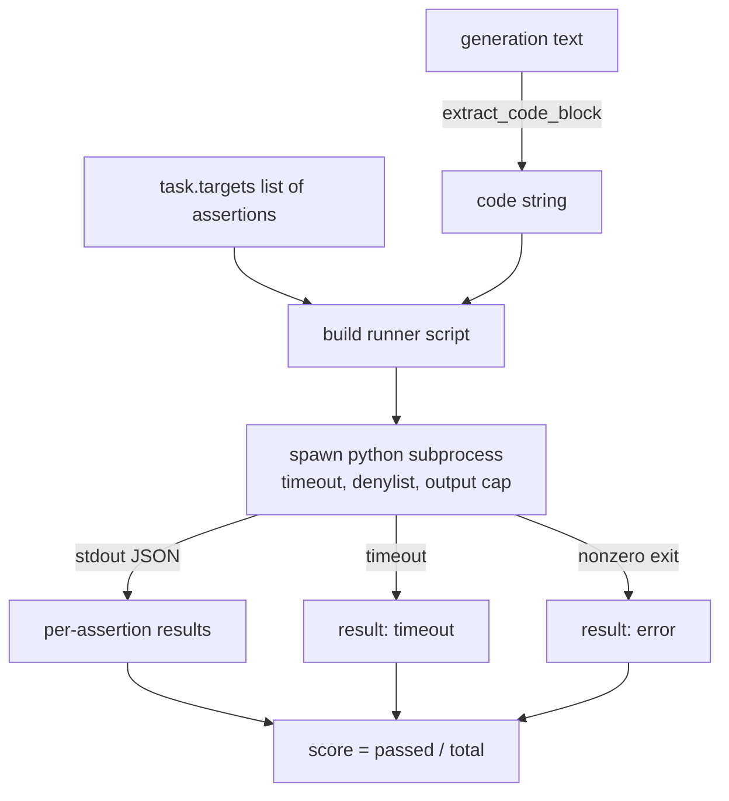
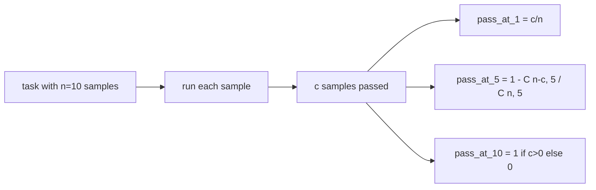

# Метрика выполнения кода

> Сгенерированный код правильный, когда он проходит тесты. Харнесс должен извлечь код, выполнить его, не уронив хост-процесс, и честно подсчитать долю прохождений. Этот урок строит эту поверхность.

**Тип:** Build**Языки:** Python**Предварительные требования:** Фаза 19 Track B foundations, уроки 70 and 71**Время:** ~90 мин
## Цели обучения

- Извлечь блок кода из свободной генерации так, чтобы это соответствовало правилу постобработки из урока 70.
- Выполнить код кандидата в изолированном subprocess с тайм-аутом по wall-clock, ограничением объёма вывода и чёрным списком импортов.
- Оценить задачу как долю переданных строк-утверждений (assertions), которые проходят для этого кандидата.
- Вычислить pass-at-k для задач, где из одной модели сэмплируется несколько генераций.
- Рассматривать сбои песочницы, синтаксические ошибки и тайм-ауты как полноценные режимы отказа с отдельными кодами выхода, которые раннер может логировать.

```figure
sandbox-runner
```

## Зачем нужен изолированный subprocess

Встроенный `exec` — это угроза безопасности и стабильности. Сгенерированный `while True: pass` заблокирует eval навсегда. Сгенерированный `import shutil; shutil.rmtree('/')` ровно так же катастрофичен, как звучит. Решение — порождать свежий интерпретатор Python для каждого кандидата, передавать код через stdin, записывать результаты утверждений в stdout и убивать процесс, если он превысил лимит времени. Хост-процесс eval при этом продолжает работать.

Реальные evals вроде HumanEval, MBPP, BigCodeBench и LiveCodeBench используют песочницу на базе subprocess. Некоторые добавляют поверх Docker. Мы останавливаемся на subprocess не просто так: это переносимо, это часть stdlib, и это перехватывает те режимы отказа, которые важны для учебного eval. В продакшн-развёртываниях добавляются seccomp, сетевая изоляция и файловая система только для чтения. Следующий урок про усиление защиты находится за пределами этого трека.

## Форма задачи code-exec

Задача `code_exec` несёт строки-утверждения в `targets`. Раннер извлекает из генерации блок кода в fenced-разметке, строит вокруг него тест-харнесс и выполняет результат.



Оценка — это дробь в `[0, 1]`. Задача с тремя утверждениями, из которых прошли два, получает 0.667. Раннер возвращает одну и ту же форму независимо от того, что именно сломалось: сбои subprocess отображаются в нормализованный код ошибки, а не всплывают в харнесс как трассировка Python.

## Чёрный список

Чёрный список (denylist) построен на импортах. Перед запуском кода кандидата скрипт-раннер переписывает импорты опасных модулей в заглушку, которая выбрасывает `ImportError("denied")`. Список намеренно консервативен: `os.system`, `subprocess`, `socket`, `requests`, `urllib`, `urllib.request`, `urllib.error`, `urllib.parse`, `ctypes`, `shutil`, `http.client`, `asyncio.subprocess`.

Мы не притворяемся, что это непробиваемо. Целенаправленно враждебный код может вырваться из любой песочницы внутри процесса Python. Чёрный список — это подстраховка. Несущие элементы защиты — это тайм-аут по wall-clock и ограничение объёма вывода.

```python
DENIED = {
    "os.system": True,
    "subprocess": True,
    "socket": True,
    "shutil": True,
    "requests": True,
    "urllib": True,
    "ctypes": True,
}
```

Мы оборачиваем кандидата, добавляя в начало `import sys` и защиту, которая через monkey-patch подменяет `os.system` так, чтобы он выбрасывал исключение. Полный шаблон — в `main.py`.

## Тайм-аут по wall-clock

Каждый subprocess получает бюджет по умолчанию в три секунды wall-clock. Раннер использует `subprocess.run(..., timeout=t)`. Если тайм-аут срабатывает, раннер перехватывает `TimeoutExpired`, убивает процесс и записывает для задачи причину выхода `timeout`. Оценка для этой задачи — ноль. Раннер идёт дальше.

Тайм-аут настраивается для каждой задачи через `task.metadata.timeout_s`. Долго выполняющиеся модульные тесты могут запросить больше времени; валидатор из урока 70 ограничивает значение тридцатью секундами, чтобы держать набор задач ограниченным по времени.

## Ограничение объёма вывода

Subprocess может затопить stdout, исчерпав память хоста. Раннер стримит stdout в буфер и убивает дочерний процесс, как только суммарный объём превышает 256 КБ. Результат записывается как `exit_code = error` со строкой детализации `"output overflow"`. На практике это проявляется, когда генерация случайно содержит бесконечный цикл с печатью.

## Pass-at-k

Pass-at-k — это несмещённая оценка (unbiased estimator), которую используют HumanEval и подобные. При `n` независимых сэмплах на задачу, из которых `c` проходят, вероятность того, что сэмпл размера `k` из этих `n` содержит хотя бы одно проходящее решение, равна:

```
pass_at_k(n, c, k) = 1 - C(n - c, k) / C(n, k)
```

Когда `n - c < k`, числитель не определён, и значение равно `1`. Реализация обрабатывает этот крайний случай напрямую. Мы предоставляем `pass_at_k(n, c, k)` для использования слоем таблицы лидеров в уроке 74.



## Коды выхода

Раннер возвращает один из пяти результатов для каждой задачи:

- `pass`, когда прошли все утверждения.
- `assertion_fail`, когда код выполнился, но хотя бы одно утверждение не прошло.
- `syntax_error`, когда код не импортировался или содержал SyntaxError.
- `timeout`, когда истекло время wall-clock.
- `error` для любого другого сбоя, включая срабатывания чёрного списка и переполнение вывода (переполнение проявляется с деталью `"output overflow"`).

Оценка по-прежнему остаётся дробью. Код выхода — это метаданные. Последующие уроки могут решать, считать ли тайм-аут нулём или отсутствующими данными.

## Чего этот урок не делает

Он не даёт вам настоящую песочницу. Он не запускает недоверенный код из открытого веба. Он не обрабатывает задачи с состоянием, такие как файловый ввод-вывод или сетевые вызовы. Для этого нужен контейнер или microVM. Смысл этого урока — в контракте: изолированный subprocess, чёрный список, тайм-аут, ограничение объёма вывода, чистый словарь кодов выхода и математика pass-at-k.

## Как читать код

`main.py` определяет `extract_code`, `run_candidate`, `score_code_exec` и `pass_at_k`. Скрипт-раннер subprocess строится как строка и передаётся как `-c` свежему интерпретатору Python. Тесты в `code/tests/test_exec.py` прогоняют четыре кода выхода плюс pass-at-k на разобранных примерах в стиле HumanEval.

Прочитайте `main.py` сверху вниз. Шаблон раннера — это несущая часть. Всматривайтесь в цикл проверки утверждений, пока не сможете предсказать JSON-конверт, который он записывает обратно в родительский процесс.

## Что дальше

Когда форма subprocess заработала, следующая проблема — переносимость. Разные версии Python по-разному обрабатывают SIGKILL в Windows. Самое чистое решение — поместить раннер в образ Docker. Следующий шаг после этого — заменить строки-утверждения на настоящие файлы модульных тестов, чтобы eval соответствовал тому, что делает продакшн CI. С этого момента строки-утверждения уже нельзя называть тестами; это игрушечные тесты с игрушечными режимами отказа.
