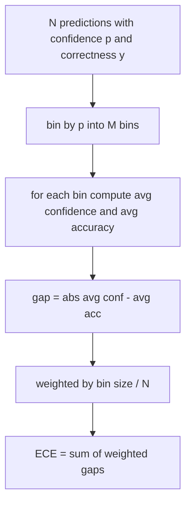
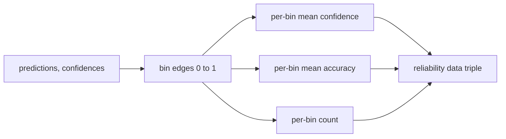

# Перплексия и калибровка

> Если модель заявляет 90-процентную уверенность на тысяче ответов и оказывается права в шестистах случаях, она плохо откалибрована. Калибровка — это половина надёжного оценивания. Другая половина — перплексия, которая показывает, считает ли модель отложенный текст вообще правдоподобным.

**Тип:** Build**Языки:** Python**Предварительные требования:** Фаза 19 Track B foundations, уроки 70 and 71**Время:** ~90 минут
## Цели обучения

- Вычислить перплексию на уровне токенов для отложенного корпуса на основе отрицательных логарифмических вероятностей токенов, предоставленных адаптером модели.
- Вычислить ожидаемую ошибку калибровки (expected calibration error, ECE) классификатора или eval с множественным выбором на основе разбитых по бинам предсказанных вероятностей.
- Вычислить оценку Брайера (среднеквадратичную ошибку относительно индикатора правильности) и объяснить, в каких случаях она делает то, что не делает ECE.
- Построить данные диаграммы надёжности, необходимые для отрисовки кривой «уверенность против точности».
- Подключить все три метрики к eval-харнессу, чтобы раннер мог добавлять значения `perplexity`, `ece` и `brier` в отчёт о модели.

```figure
cd-reliability-diagram
```

## Что говорит перплексия

Перплексия — это экспонента от средней отрицательной логарифмической правдоподобности на токен. Чем ниже, тем лучше. Перплексия, равная единице, означает, что модель присваивает вероятность единица каждому реальному токену. Перплексия, равная размеру словаря, означает, что модель равномерна и ничему не научилась. Реальные значения лежат между этими крайностями: сильная базовая модель 2026 года на WikiText-103 показывает результат примерно от восьми до двенадцати. Плохая модель на том же тексте показывает пятьдесят и выше.

Харнесс не вычисляет логарифмические вероятности сам. Они поступают от адаптера модели. Харнесс их агрегирует: он принимает список логарифмических вероятностей на токен, список количеств токенов на последовательность и возвращает перплексию корпуса.

```python
def perplexity(neg_log_probs, token_counts):
    total_nll = sum(neg_log_probs)
    total_tokens = sum(token_counts)
    return math.exp(total_nll / total_tokens)
```

Реализация обрабатывает граничные случаи с нулевым числом токенов и проверяет, что отрицательные логарифмические вероятности неотрицательны. Распространённая ошибка — забыть про знак минус: адаптер, который возвращает `log p` вместо `-log p`, даёт перплексию ниже единицы, что невозможно. Функция ловит это как нарушение контракта.

## Что измеряет ECE

Ожидаемая ошибка калибровки группирует предсказания по их уверенности в фиксированное число бинов, а затем измеряет средний разрыв между уверенностью и точностью по бинам, взвешенный по размеру бина.



Стандартная формулировка использует десять бинов равной ширины на `[0, 1]`. Реализация поддерживает любое положительное целое число бинов. Мы предоставляем параметр `bins`, чтобы раннер мог выбирать между принятой в публикациях конвенцией (10) и конвенцией для сравнения (15).

ECE смещена в зависимости от числа бинов и размера выборки. При десяти бинах и ста предсказаниях невозможно отличить ECE 0.02 от случайного шума. Реализация возвращает число заполненных бинов вместе с ECE, чтобы раннер мог отказаться сообщать единое число при слишком малой выборке.

## Что делает оценка Брайера, чего не делает ECE

ECE учитывает только средние разрывы. Модель, которая переоценивает свою уверенность в половине бинов и недооценивает в другой половине, может иметь низкую ECE, оставаясь при этом плохо откалиброванной локально. Оценка Брайера измеряет квадратичную ошибку относительно истинного исхода для каждого предсказания, поэтому она напрямую штрафует за разброс.

Для бинарных исходов оценка Брайера равна `mean((p_i - y_i)^2)`. Она раскладывается на надёжность, разрешающую способность и неопределённость. Мы вычисляем и саму оценку, и это разложение. Раннер сообщает скалярное значение, но логирует разложение для дашборда.

```python
def brier(p, y):
    return float(np.mean((p - y) ** 2))
```

## Данные диаграммы надёжности

Диаграмма надёжности отображает предсказанную уверенность против эмпирической точности в каждом бине. Диагональ соответствует идеальной калибровке. Функция возвращает три массива: среднюю уверенность по бину, среднюю точность по бину и количество наблюдений по бину. Код отрисовки находится ниже по конвейеру; этот урок останавливается на форме данных.



Возвращаемый кортеж — это то, что нужно вызывающему слою для отрисовки графика или вычисления собственного варианта ECE (adaptive ECE, sweep ECE и т. д.). Мы возвращаем массивы numpy, чтобы нижестоящему коду не приходилось выполнять преобразование.

## Источники уверенности

Харнесс не предполагает, что уверенность обязательно берётся из softmax. Он принимает любое число в диапазоне `[0, 1]` для каждого предсказания. Для задач с множественным выбором естественной уверенностью служит `softmax over option log-likelihoods`. Для свободного текста естественной уверенностью служит самостоятельно заявленная моделью вероятность или экспонента от средней логарифмической правдоподобности. Eval просто потребляет это число. Откуда оно берётся — задача адаптера.

## Граничные случаи

- Все предсказания неверны: ECE равна средней уверенности, оценка Брайера высокая, перплексия — какой бы её ни считала модель для данного текста.
- Все предсказания верны с высокой уверенностью: ECE близка к нулю, оценка Брайера близка к нулю.
- Полностью неопределённый предиктор при p=0.5: ECE равна 0.5 минус точность, оценка Брайера равна 0.25 минус поправочный член.
- Пустой ввод: ECE, оценка Брайера и данные надёжности возвращают `0.0` (или массивы, заполненные нулями). Перплексия возвращает `NaN` для случая с нулевым числом токенов. Ни один из этих путей не выдаёт предупреждения; раннер сам проверяет значения и решает, сообщать их или пропустить.

Эти случаи заложены в тесты. Реальная модель на реальном бенчмарке не столкнётся с ними, но неисправный адаптер или крошечная выборка — столкнутся, и раннер не должен из-за этого падать.

## Диспетчеризация

Калибровка — это не метрика по отдельной задаче, как F1. Это отчёт по модели в целом. Раннер накапливает пары `(confidence, correct)` по всему eval и вычисляет ECE, оценку Брайера и данные надёжности один раз. Перплексия вычисляется по отложенному текстовому корпусу отдельно от пооценочного скоринга по задачам.

Интерфейс выглядит так:

```python
report = CalibrationReport.from_predictions(confidences, correct)
report.ece          # float
report.brier        # float
report.reliability  # tuple of three numpy arrays
report.populated_bins  # int
```

`PerplexityResult.from_token_nll(neg_log_probs, token_counts)` возвращает перплексию и среднюю отрицательную логарифмическую правдоподобность на токен.

## Чего не делает этот урок

Он не вызывает модель. Он не реализует softmax. Он не оценивает уверенность по выходным токенам — это задача адаптера. Он не выполняет temperature scaling или Platt scaling — это постфактум-исправления, которые живут в другом уроке. Смысл этого урока — сделать три числа (перплексию, ECE, оценку Брайера) надёжными и воспроизводимыми.

## Как читать код

`main.py` определяет `perplexity`, `expected_calibration_error`, `brier_score`, `reliability_diagram` и дата-классы `CalibrationReport` / `PerplexityResult`. Демонстрация запускается на синтетических предсказаниях, для которых известна истинная разметка: хорошо откалиброванная модель, переоценивающая свою уверенность и недооценивающая её. Тесты в `code/tests/test_calibration.py` фиксируют каждый граничный случай, а также эталонные значения для синтетических предикторов.

Читайте `main.py` сверху вниз. Порядок функций идёт от скалярных величин к векторным и далее к отчёту. У каждой функции есть короткий docstring с математикой и контрактом.

## Что дальше

Калибровка — самая игнорируемая ось в опубликованных eval. Большинство лидербордов сообщают единственное число точности и считают дело сделанным. Модель, которая выигрывает по точности и проигрывает по оценке Брайера, оказывается худшим продакшен-развёртыванием, чем модель, которая набирает на несколько пунктов меньше по точности, но надёжно сообщает о своей неопределённости. Как только у вас появится инфраструктура калибровки, добавьте temperature scaling на отложенном валидационном срезе, пересчитайте ECE и понаблюдайте, как разрыв сокращается. Это отдельный урок, но основа для него закладывается здесь.
