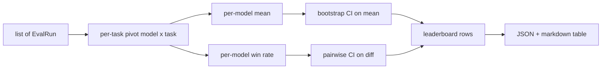
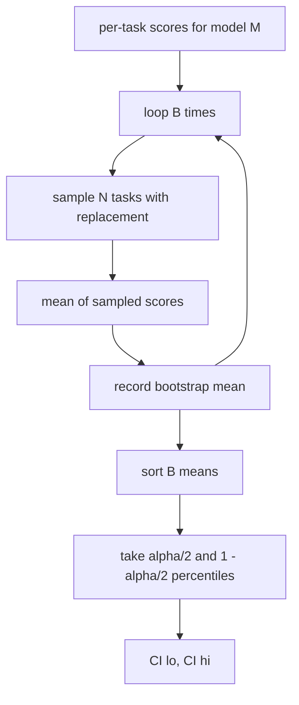

# Агрегация таблицы лидеров

> Оценки по отдельным задачам — это просто. Ранжирование моделей по разнородным задачам — сложнее. Статистическая значимость на таблице лидеров (leaderboard) с тысячей предсказаний — это та часть, которую все пропускают. Этот урок её не пропускает.

**Тип:** Build**Языки:** Python**Предварительные требования:** Фаза 19 Track B foundations, уроки 70, 71, 73**Время:** ~90 минут
## Цели обучения

- Объедините оценки по отдельным задачам для нескольких моделей и нескольких задач в аккуратную строку для каждой модели.
- Нормализуйте разнородные оценки, чтобы доля успешных прохождений (pass rate) и значения BLEU не оказывали избыточного влияния на агрегированный результат.
- Ранжируйте модели по среднему значению и по доле побед (win-rate) и объясните, в каком случае какая сводка уместна.
- Вычислите bootstrap-доверительные интервалы для среднего значения оценки по каждой модели и для попарных различий.
- Выведите таблицу лидеров в виде JSON-отчёта и markdown-таблицы, которую раннер (runner) из урока 75 сможет вставить в комментарий CI.

```figure
ci-leaderboard-ci
```

## Форма входных данных

Агрегатор принимает список записей `EvalRun`:

```python
@dataclass
class EvalRun:
    model_id: str
    task_id: str
    metric_name: str
    score: float          # in [0, 1]
    category: str
```

Раннер из урока 75 создаёт одну запись на каждую пару `(model, task)`. Агрегатору не важно, как была получена оценка. Он ожидает, что нормализация уже выполнена: каждая оценка находится в диапазоне `[0, 1]`.

## Результат

На выходе получаются три таблицы:



Строка таблицы лидеров содержит: `model_id`, `mean_score`, `mean_ci_lo`, `mean_ci_hi`, `win_rate`, `tasks_completed`, а также необязательную карту `categories` для среднего значения по категориям.

## Нормализация

Если одна задача оценивается в диапазоне `[0, 1]`, а другая — в `[0, 100]`, вторая незаметно доминирует над средним значением. Агрегатор проверяет, что каждая входная оценка находится в `[0, 1]`, и в противном случае отклоняет запуск. Исправление находится выше по конвейеру: метрика должна уже возвращать долю. Уроки с 71 по 73 обеспечивают соблюдение этого контракта.

## Среднее значение и доля побед

Эти две схемы ранжирования служат разным целям.

Среднее значение оценки — это среднее по оценкам за отдельные задачи для одной модели. Это основное число, которое показывают таблицы лидеров. Оно чувствительно к выбросам и к дисбалансу задач.

Доля побед показывает, как часто модель превосходит все остальные модели на одной и той же задаче. Для каждой задачи побеждает модель с наивысшей оценкой (при ничьей победа делится между ними). Доля побед равна количеству побед, делённому на количество задач, для которых у модели есть оценка. Она менее чувствительна к выбросам и различиям в масштабе, но теряет часть информации.

```python
def win_rate(model_id, runs_by_task, all_models):
    wins, total = 0, 0
    for task_id, runs in runs_by_task.items():
        scores = {r.model_id: r.score for r in runs if r.model_id in all_models}
        if model_id not in scores:
            continue
        total += 1
        best = max(scores.values())
        if scores[model_id] >= best:
            wins += 1
    return wins / total if total else 0.0
```

Харнесс (harness) сообщает оба значения. Раннер из урока 75 по умолчанию ранжирует по среднему значению; столбец markdown для доли побед всегда присутствует на случай, если пользователь предпочтёт его.

## Bootstrap-доверительные интервалы

Средние значения по каждой модели сопровождаются доверительным интервалом, оценённым методом bootstrap-передискретизации по задачам. Мы производим передискретизацию идентификаторов задач с возвращением, вычисляем среднее по полученному набору, повторяем `B` раз и берём процентильный интервал на уровне `alpha`.



Для попарных сравнений мы применяем bootstrap к разнице по задачам `score_A - score_B`, берём процентильный интервал и сообщаем его. Пользователь смотрит, исключает ли интервал ноль. Если да, различие значимо на уровне alpha. Если нет, таблица лидеров считает модели равными.

Низкоуровневые вспомогательные функции (`bootstrap_mean_ci`, `bootstrap_pairwise_diff`) по умолчанию используют `B=1000`; публичные агрегаторы (`aggregate`, `pairwise_diffs`) по умолчанию используют `b=500`, чтобы демонстрация и тесты оставались быстрыми. Значение alpha по умолчанию — 0.05. В этом уроке bootstrap реализован на чистом numpy, без scipy.

## Категории

Если задано `EvalRun.category`, агрегатор также сообщает среднее значение по каждой категории. Это тот столбец в любой таблице лидеров, где указано `math`, `reasoning`, `code`, `safety`. Он позволяет раннеру заметить, что модель хороша в целом, но слаба в коде — а эту информацию скрывает основное среднее значение.

## Рендеринг markdown

Таблица лидеров отображается в виде markdown-таблицы:

```text
| Rank | Model | Mean | 95% CI | Win rate | Tasks |
|------|-------|------|--------|----------|-------|
| 1    | gpt   | 0.78 | 0.74-0.82 | 0.62 | 50 |
| 2    | claude| 0.75 | 0.71-0.79 | 0.34 | 50 |
| 3    | random| 0.10 | 0.07-0.13 | 0.04 | 50 |
```

Таблица отсортирована по среднему значению оценки. CI отображается с двумя знаками после запятой. Длинные идентификаторы моделей обрезаются до двадцати символов.

## Чего этот урок не делает

Он не запускает модели. Он не вызывает уровень метрик. Он не реализует адаптивный ECE или другие варианты калибровки — это тема урока 73. Он не реализует взвешивание задач. Здесь каждая задача учитывается одинаково. Таблицы лидеров в продакшене взвешивают задачи; мы оставляем эту точку расширения открытой через поле `weight`, но агрегатор его игнорирует. Добавьте взвешивание в одном из последующих уроков, если оно вам нужно.

## Как читать код

`main.py` определяет `EvalRun`, `LeaderboardRow`, `aggregate`, `bootstrap_mean_ci`, `bootstrap_pairwise_diff` и `render_markdown`. Демонстрация строит синтетический набор из трёх моделей и двенадцати задач, агрегирует данные и выводит таблицу лидеров вместе с таблицей попарных различий. Тесты в `code/tests/test_leaderboard.py` фиксируют поведение bootstrap, рендеринга markdown, граничных случаев доли побед и поведения при пустых входных данных.

Читайте `main.py` сверху вниз. Сначала идёт форма данных (EvalRun, LeaderboardRow), затем агрегатор, затем bootstrap, и в конце — рендеринг. У каждой функции чёткий контракт.

## Что дальше

Естественный следующий шаг — парная значимость по задачам вместо непарного bootstrap. Если модели A и B обе выполнили одни и те же сто задач, подходящий тест — это парный bootstrap по разницам для каждой задачи, который мы реализуем. Помимо этого, нужен иерархический bootstrap, учитывающий семейства задач (математические задачи не независимы друг от друга; один и тот же паттерн арифметической ошибки может затронуть сразу десять из них). Это тема для следующего урока. Цель этого урока — заложить прочный фундамент, чтобы оценивание выдавало число, которое можно защитить.
