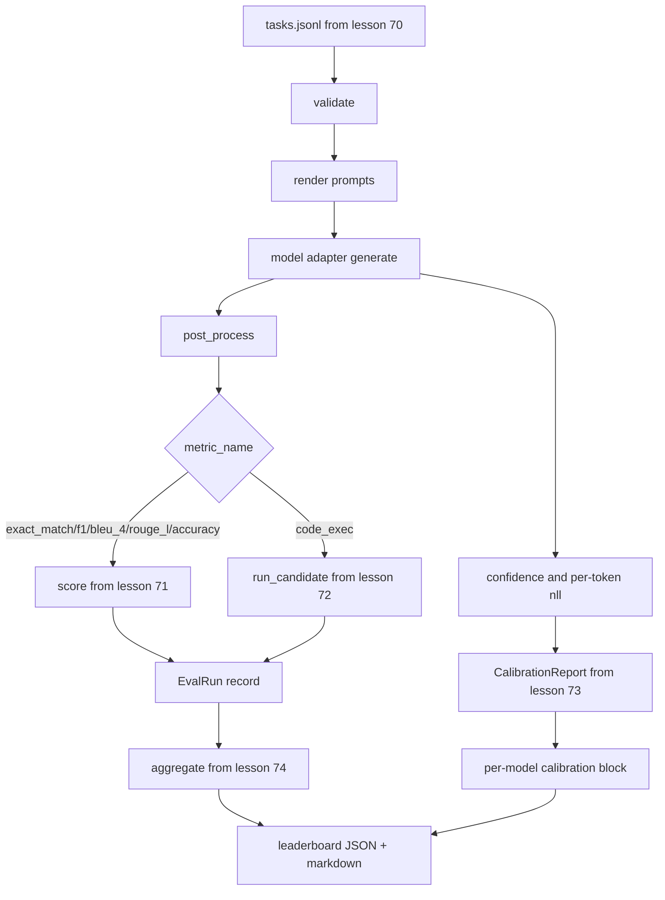

# Сквозной раннер оценивания

> Пять уроков обвязки, один урок, чтобы связать их воедино. Раннер считывает спецификацию задачи из урока 70, вызывает модель через адаптер, оценивает с помощью уроков 71 и 72, прикладывает отчёт о калибровке из урока 73 и выдаёт таблицу лидеров из урока 74. Демо завершается самостоятельно.

**Тип:** Build**Языки:** Python**Предварительные требования:** Фаза 19 Track B foundations, уроки 70 through 74**Время:** ~90 минут
## Цели обучения

- Определите интерфейс `ModelAdapter`, которому может соответствовать любая модель (mock, локальная, API) с небольшим набором методов.
- Запустите оценивание на фикстурном файле JSONL с параллельным выполнением задач в пуле воркеров.
- Объедините слой метрик (exact_match, F1, BLEU-4, ROUGE-L, code_exec) со слоем калибровки за один проход.
- Выдайте записи `EvalRun` для каждой модели и передайте их напрямую в агрегатор таблицы лидеров.
- Выведите как JSON-отчёт, так и markdown-таблицу; самостоятельно завершайтесь с нулевым кодом выхода при чистом прогоне и ненулевым — при ошибке валидации или выполнения.

```figure
eval-grid
```

## Конвейер



Раннер — это точка интеграции. За каждым уроком с 70 по 74 закреплён один модуль, который раннер объединяет. Раннер не дублирует логику этих модулей: он их импортирует.

## Интерфейс адаптера

Адаптер — это точка соединения между раннером и любой моделью. Интерфейс намеренно небольшой.

```python
class ModelAdapter:
    model_id: str

    def generate(self, prompt: str, task: TaskSpec) -> Generation: ...
```

`Generation` — это dataclass со следующими полями:

- `text` — произвольный текстовый вывод модели
- `confidence` — число с плавающей точкой в диапазоне `[0, 1]`, отражающее заявленную моделью вероятность правильности ответа
- `token_nll` — необязательная сумма отрицательных логарифмов правдоподобия по сгенерированным токенам
- `token_count` — необязательное количество сгенерированных токенов

Mock-адаптеры в раннере представлены в трёх разновидностях: `RuleBasedAdapter` (детерминированный, почти идеальный), `NoisyAdapter` (самоуверенный, часто ошибается) и `BiasedAdapter` (хорош в одной категории, ужасен в другой). Демо запускает все три на фикстуре из урока 70.

## Параллельное выполнение

Раннер использует `concurrent.futures.ThreadPoolExecutor` для параллельного выполнения задач в рамках каждой модели. Количество воркеров по умолчанию равно меньшему из восьми и общего числа задач. Потоков достаточно, потому что узкое место при реальных вызовах модели — это сетевой ввод-вывод. Путь code-exec порождает собственный подпроцесс внутри задачи, а исполнитель лишь планирует ожидание.

Для детерминированных тестов раннер предоставляет `run_eval(adapters, tasks, parallel=False)`, чтобы тесты могли зафиксировать порядок выполнения.

## Однопроходный цикл оценивания

Для каждой задачи:

1. Отрисуйте промпт (префикс с несколькими примерами (few-shot) плюс тело промпта).
2. Вызовите адаптер и замерьте время вызова.
3. Выполните постобработку генерации согласно правилу задачи.
4. Передайте результат в слой метрик.
5. Соберите запись `EvalRun` с оценкой и метаданными метрики.
6. Добавьте пару `(confidence, correct)` в буфер калибровки.

Сигнал `correct` равен `score >= 1.0` для метрик в стиле exact_match (`exact_match`, `accuracy`, `code_exec`) и `score >= 0.5` для градуированных метрик. Порог задан в `_correct_from_score`, и раннер не предоставляет публичного способа его переопределить.

## Агрегация

После того как каждая задача получила результат, раннер вызывает `aggregate` и `pairwise_diffs` из урока 74, а также `CalibrationReport.from_predictions` из урока 73. На выходе — единый JSON-конверт:

```json
{
  "leaderboard": [...],
  "pairwise": [...],
  "calibration": {
    "model_id_a": {"ece": 0.04, "brier": 0.10, "populated_bins": 8, ...},
    ...
  },
  "summary": {
    "tasks": 10,
    "models": 3,
    "wall_seconds": 1.2
  }
}
```

Раннер также выводит markdown-таблицу в stdout, чтобы пользователь мог вставить результат в ревью PR.

## Самозавершающееся демо

Демо запускает три mock-адаптера на десяти фикстурных задачах из урока 70. Время выполнения должно укладываться в менее чем десять секунд. Код выхода равен нулю при чистом прогоне.

Критерии чистого прогона:

- Каждая задача провалидирована согласно уроку 70.
- Каждая задача оценена согласно урокам 71 и 72.
- Отчёт о калибровке агрегирован согласно уроку 73 без ошибок.
- Таблица лидеров ранжировала адаптер на основе правил строго выше случайного адаптера.

Если что-то из этого нарушается, раннер завершается с ненулевым кодом и структурированной ошибкой в JSON-конверте.

## Чего этот урок не делает

Он не вызывает настоящую модель. Он не реализует работу с API-ключами или обработку ограничения частоты запросов. Он не реализует потоковую генерацию или частичную генерацию; адаптер возвращает одну генерацию за вызов. Он не выполняет повторные попытки и кеширование. Эти задачи относятся к слою адаптера; раннер не зависит ни от метрики, ни от провайдера.

## Как читать код

`main.py` — это точка интеграции. Он импортирует из пяти других модулей уроков через небольшой вспомогательный `_load_sibling`, который разрешает их по относительному пути. `Generation`, `EvalReport` и `ModelAdapter` — это dataclass, определённые локально. Mock-адаптеры находятся в конце файла.

Прочитайте `main.py` от начала до конца. Пробегитесь по импортам, затем посмотрите на `run_eval`, затем на `_score_one`, затем на адаптеры. Демо в конце файла — это точка входа.

Тесты в `code/tests/test_runner.py` фиксируют интерфейс адаптера, однопроходный цикл, эквивалентность параллельного и последовательного выполнения, буфер калибровки и форму JSON-конверта.

## Что дальше

Этот раннер — это минимум. Продакшен-система оценивания добавляет: кеш результатов с ключом `(task_id, model_id, model_version)`, реестр затрат, отслеживающий доллары и токены по каждому прогону, слой повторных попыток с задержкой с увеличением интервала (backoff) при ограничении частоты запросов, политику сэмплирования для задач pass-at-k и потоковый формат вывода для длинных наборов. Каждый из этих элементов — отдельная забота, которая оборачивает раннер, не меняя слои метрик или агрегации. Именно в этом разделении и заключается смысл контракта.

Добавьте адаптер для настоящего провайдера, когда mock-адаптеры уже работают. Выберите провайдера с бесплатным тарифом, напишите тридцать строк связующего кода, посмотрите, как загорается таблица лидеров. Затем добавьте второго провайдера и позвольте харнессу сделать всю работу.
