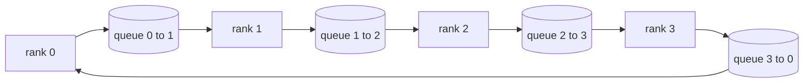

# Коллективные операции с нуля

> Четыре коллективные операции, на которых держится распределённое обучение, — это allreduce, broadcast, allgather и reduce_scatter. Любой другой примитив, который предлагает фреймворк обучения, — обёртка вокруг них. Постройте их один раз поверх сетки `multiprocessing.Queue`, сверьте с эталонной реализацией — и остальная часть трека сведётся к обвязке (plumbing).

**Тип:** Build**Языки:** Python**Предварительные требования:** Фаза 19 Track C уроки 42-49**Время:** ~90 минут
## Цели обучения

- Реализуйте ring allreduce в два прохода (reduce-scatter, затем allgather) и докажите, что объём передачи данных на ранг равен 2(N-1)/N байт на элемент.
- Постройте broadcast, allgather и reduce_scatter поверх точечных (point-to-point) отправок через `multiprocessing.Queue`.
- Сверьте каждый примитив с эталонной реализацией `torch.distributed` на бэкенде gloo для одного и того же входа.
- Обоснуйте выбор между ring и tree в зависимости от формы кластера, нижнего порога задержки и верхнего предела пропускной способности.

## Проблема

Наивный allreduce на N рангах N раз отправляет тензор на корневой узел и N раз рассылает его обратно. Пропускная способность на ранг растёт как O(N), корневой узел становится узким местом, а нижний порог по астрономическому времени равен времени самого медленного канала, умноженному на N. Ring allreduce превращает это в 2(N-1) фрагментов размером T/N, поэтому объём данных на ранг падает до 2T(N-1)/N независимо от размера кластера. Tree allreduce выигрывает при малых N и на каналах с высокой задержкой, потому что глубина составляет log2(N) шагов вместо 2(N-1). Если выбрать неверную топологию для формы кластера, время шага будет определяться самым медленным GPU.

Каждый фреймворк распределённого обучения, о котором вы прочитаете в этом треке, опирается на эти четыре примитива. PyTorch DDP синхронизирует градиенты одним allreduce на бакет параметров. ZeRO шардирует состояние оптимизатора через reduce_scatter и рассылает обновлённые параметры через allgather. FSDP превращает полный forward-проход в allgather плюс reduce_scatter. Pipeline parallel требует broadcast для активаций между группами стадий. Если вы не можете реализовать эти четыре коллективные операции, вы не сможете объяснить, почему обучение зависает, почему рассогласование градиентов проявляется на ранге 3 или почему пузырь конвейера (pipeline bubble) удваивается при смене топологии.

## Концепция



### Ring allreduce в два прохода

Разделите тензор на N равных фрагментов с индексами 0..N-1. Каждый ранг владеет фрагментом с индексом, равным его рангу. Проход 1, reduce-scatter, выполняется за N-1 шагов. На шаге s ранг r отправляет фрагмент (r - s) mod N рангу (r + 1) mod N и получает фрагмент (r - s - 1) mod N от ранга (r - 1) mod N, накапливая полученный фрагмент в своей локальной копии. После N-1 шагов ранг r владеет полной суммой для фрагмента r. Проход 2, allgather, выполняется ещё за N-1 шагов и прокручивает готовые фрагменты по кольцу, пока каждый ранг не будет владеть полной суммой для каждого фрагмента.

| Примитив | Байт на ранг | Шаги | Когда использовать |
|-----------|---------------|-------|-------------|
| Ring allreduce | 2T(N-1)/N | 2(N-1) | Большой T, однородный кластер с широким каналом (fat-pipe) |
| Tree allreduce | T log2(N) | 2 log2(N) | Малый T или каналы с высокой задержкой |
| Broadcast | T | дерево log2(N) | Инициализация параметров, скалярная конфигурация |
| Allgather | T(N-1)/N | N-1 | Шардированный forward-проход, unshard в ZeRO |
| Reduce_scatter | T(N-1)/N | N-1 | Шардирование градиентов в ZeRO |

### Сетка очередей (queue mesh) как замена NCCL

NCCL работает поверх PCIe и NVLink с редукциями, выгруженными на уровень оборудования. На CPU этого нет. `multiprocessing.Queue` на каждое ребро кольца даёт упорядоченную точечную доставку с одним производителем и одним потребителем. Редукция происходит в пользовательском пространстве, поэтому вы платите накладными расходами Python, но сетевой паттерн идентичен NCCL ring allreduce. Рассуждайте о корректности на версии с очередями — и поведение кластера последует из неё.

### Сверка с gloo

Каждый примитив сопровождается unit-тестом, который сравнивает его вывод с `torch.distributed`, инициализированным с бэкендом gloo, на том же тензоре и при том же размере группы (world size). Если ваш ring allreduce расходится с gloo больше чем на float32 epsilon, тест падает. Сверка с эталонной реализацией обязательна: без неё примитив выглядит корректным вплоть до шага 10000 реального запуска обучения.

```figure
ci-ring-allreduce
```

## Реализация

`code/main.py` реализует:

- класс `Mesh`, который соединяет N экземпляров `multiprocessing.Queue` в кольцо и предоставляет каждому рангу методы `send(dst, tensor)` и `recv(src)`.
- `ring_allreduce(mesh, rank, world_size, tensor)`, выполняющий алгоритм в два прохода.
- `broadcast(mesh, rank, world_size, tensor, src)` по логарифмическому дереву.
- `allgather(mesh, rank, world_size, tensor)`, использующий N-1 прокруток.
- `reduce_scatter(mesh, rank, world_size, tensor)` как первую половину allreduce.
- `_gloo_reference(op, world_size, tensor)`, который прогоняет тот же вход через `torch.distributed` с gloo для побайтового сравнения.

Запустите:

```bash
python3 code/main.py
```

Вывод: таблица сверки по каждому примитиву, сравнивающая результаты сетки очередей и gloo, за которой следует счётчик байт на ранг, доказывающий масштабирование 2T(N-1)/N.

## Практические паттерны из реального мира

Три паттерна закаляют примитивы достаточно, чтобы их можно было поставить в продакшен.

**Группируйте градиенты в бакеты перед allreduce.** У модели с 1 млрд параметров десятки тысяч тензоров градиентов. Один allreduce на тензор платит нижний порог задержки N раз. DDP группирует градиенты в бакеты по ~25 МБ и выполняет один allreduce на бакет; маленькие тензоры едут на закорке у больших. Без группировки в бакеты накладные расходы на задержку доминируют над шагом.

**Перекрывайте передачу данных с вычислениями.** Backward-проход вычисляет градиенты слой за слоем в обратном порядке. В момент готовности градиента последнего слоя запустите его allreduce, пока следующий слой продолжает вычисляться. PyTorch DDP реализует это через хуки готовности бакета (bucket-ready hooks). Перекрытие сокращает вдвое видимое время передачи данных, когда в сети есть запас.

**Выбирайте ring или tree по размеру сообщения, а не из принципа.** NCCL поставляется с детектором топологии, который выбирает ring для сообщений выше ~1 МБ и tree — ниже. Точка перехода определяется соотношением пропускной способности и задержки: выше 1 МБ доминирует слагаемое пропускной способности 2T(N-1)/N, и побеждает ring; ниже 1 МБ побеждает меньшее число шагов log2(N). Жёсткая привязка к одной топологии обходится потерей пропускной способности на сообщениях неподходящего размера.

## Применение

Паттерны для продакшена:

- **PyTorch DDP.** Вызывает `dist.all_reduce` для сгруппированных в бакеты градиентов после backward-прохода. Размер бакета настраивается; значение по умолчанию 25 МБ разумно для 100-гигабитного Ethernet.
- **DeepSpeed ZeRO.** Выполняет reduce_scatter для шардирования градиентов и allgather для восстановления полных параметров перед forward-проходом. Примитивы этого урока — это именно те вызовы, которые делает ZeRO.
- **FSDP.** Forward-проход начинается с allgather для unshard слоя, затем вычисляет и редуцирует через reduce_scatter, отбрасывая unshard. Те же примитивы, другое расписание.

## Поставка

Используйте примитивы сетки очередей в уроках 77-81. Урок 77 встраивает allreduce в DDP. Урок 78 встраивает reduce_scatter в ZeRO. Урок 79 встраивает broadcast в активации конвейера. Урок 81 объединяет все четыре в сквозную демонстрацию.

## Упражнения

1. Добавьте вариант tree allreduce и переключайтесь между ring и tree по размеру сообщения. Измерьте точку перехода.
2. Добавьте `recv_timeout_ms`, чтобы зависший ранг выдавал ошибку по истечении срока вместо бесконечного ожидания.
3. Замените `multiprocessing.Queue` на TCP-сокеты для всех четырёх примитивов. Те же тесты, реальная сеть.
4. Добавьте хук инструментирования пропускной способности, чтобы счётчик байт на ранг писал лог в JSONL.
5. Сравните астрономическое время выполнения ring и tree на 4 рангах для тензоров размером 1KB, 1MB, 16MB. Обоснуйте точку перехода эмпирически.

## Ключевые термины

| Термин | Что говорят люди | Что это на самом деле означает |
|------|----------------|------------------------|
| Allreduce | «Суммировать по рангам» | После вызова каждый ранг хранит один и тот же редуцированный тензор |
| Ring | «Быстрая топология» | N-1 фрагментов размером T/N дважды проходят по циклу |
| Tree | «Логарифмическая топология» | Редукция следует по бинарному дереву; глубина — log2(N) шагов |
| Allgather | «Конкатенировать шарды» | В итоге у каждого ранга оказываются шарды всех остальных рангов |
| Reduce_scatter | «Разделить сумму» | В итоге у каждого ранга — сумма только одного фрагмента |
| Бакет | «Слить мелкие тензоры воедино» | Объединение N мелких allreduce в один крупный |

## Дополнительное чтение

- [PyTorch Distributed: NCCL collectives](https://pytorch.org/docs/stable/distributed.html#collective-functions)
- [Horovod ring allreduce paper](https://arxiv.org/abs/1802.05799)
- [NCCL topology and algorithm selection](https://docs.nvidia.com/deeplearning/nccl/user-guide/docs/index.html)
- [Patarasuk and Yuan, Bandwidth optimal allreduce algorithms](https://www.cs.fsu.edu/~xyuan/paper/09jpdc.pdf)
- Phase 10 Lesson 05 — обзор распределённого обучения
- Phase 19 Lesson 77 — DDP, встроенный поверх этих примитивов
