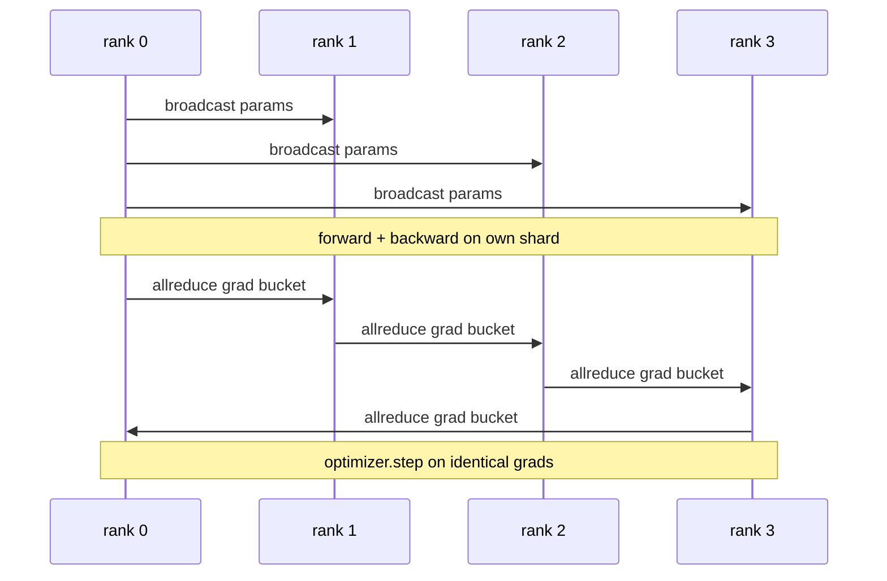

# Параллелизм данных DDP с нуля

> DistributedDataParallel — это хук поверх allreduce. Оберните модель, выполните broadcast начальных параметров с ранга 0, чтобы каждый ранг стартовал идентичным, установите хук обратного прохода на каждый параметр, который запускает allreduce градиента, — и всё остальное это градиентный спуск. Весь паттерн — 200 строк.

**Тип:** Build**Языки:** Python**Предварительные требования:** Фаза 19 Track C уроки 42-49**Время:** ~90 минут
## Цели обучения

- Соберите обёртку в форме `DistributedDataParallel`, которая выполняет broadcast начальных параметров и allreduce градиентов после обратного прохода.
- Породите N рангов CPU с помощью `torch.multiprocessing.spawn` через бэкенд gloo с файловой точкой встречи (rendezvous).
- Докажите корректность синхронизации градиентов, обучив ту же модель на тех же данных последовательно и показав эквивалентность параметров на каждом шаге.
- Обоснуйте использование бакетов (объединение градиентов) и перекрытия (коммуникация во время обратного прохода) как двух изменений, которые превращают рабочий DDP в промышленный DDP.

## Проблема

Модель с 1 миллиардом параметров и 12 ГБ активаций не помещается на одну потребительскую GPU. Даже когда помещается, обучение занимает недели. Параллелизм данных разбивает пакет по N рангам, каждый ранг вычисляет прямой и обратный проход на своём срезе, и на каждом шаге градиенты всех рангов суммируются, чтобы все N копий оставались идентичными. Именно по суммарному градиенту оптимизатор делает шаг.

Без синхронизации градиентов N реплик расходятся уже к шагу 2. Модель перестаёт быть «одной моделью, обученной на большем объёме данных» — это N отдельных моделей, которые просто разделяют начальные веса. Если синхронизация градиентов сделана плохо (один allreduce на параметр, без перекрытия, без группировки в бакеты), узким местом становится сеть, а GPU простаивают в ожидании канала связи. Мастерство DDP — сделать синхронизацию градиентов почти бесплатной по сравнению с вычислениями. Канонический DDP из PyTorch достигает этого, группируя градиенты в бакеты, перекрывая allreduce с обратным проходом следующего слоя и используя NCCL поверх NVLink. Мы можем сделать все три вещи на CPU с gloo и извлечь те же уроки.

## Концепция



### Три операции, которые нужны DDP

| Этап | Коллективная операция | Почему |
|-------|-----------|-----|
| Инициализация | broadcast от ранга 0 | Каждый ранг стартует с одинаковыми параметрами |
| После обратного прохода | allreduce каждого градиента | Оптимизатор делает шаг по среднему градиенту |
| Иногда | broadcast буферов | Скользящие статистики batchnorm остаются синхронизированными |

### Почему среднее, а не сумма

Allreduce-SUM, делённый на world_size, даёт средний градиент. Среднее инвариантно к world_size: скорость обучения, настроенная для одного ранга, работает и для четырёх рангов, потому что величина градиента на шаг не меняется. Allreduce-SUM без деления вынуждает каждый раз перенастраивать скорость обучения при изменении размера кластера. DDP оборачивает SUM и делит; сделайте то же самое в этом уроке.

### Зачем группировать градиенты в бакеты

У трансформера тысячи параметрических тензоров. Один allreduce на тензор тысячи раз платит нижний порог задержки gloo. DDP группирует градиенты в бакеты по ~25 МБ и выполняет один allreduce на бакет. По проводу передаётся то же общее количество байт, но задержка амортизируется по всему бакету. Для крошечной модели урока мы группируем всё в один бакет; на практике важна именно структура.

### Зачем закреплять seed

Каждый ранг должен вызывать `torch.manual_seed(seed + rank)` для перемешивания, но `torch.manual_seed(seed)` для инициализации параметров. Один общий seed на всех рангах означает, что каждый ранг видит один и тот же порядок пакетов (что сводит на нет параллелизм данных); seed, зависящий от ранга, для параметров означает, что начальные параметры расходятся на float epsilon, и синхронизация градиентов больше не делает реплики идентичными. Разберитесь с паттерном seed правильно, иначе тест на эквивалентность параметров провалится уже на первом шаге.

```figure
ci-ddp-grad-sync
```

## Реализация

`code/main.py` реализует:

- `MiniMLP` — трёхслойный MLP, достаточно маленький, чтобы сходиться за секунды, и достаточно большой, чтобы обнажить всю схему связей.
- `DistributedDataParallel(model, world_size)` — выполняет broadcast параметров в момент создания, возвращает обёртку, чей `sync_grads` делит накопленные просуммированные через allreduce градиенты на world_size.
- `worker(rank, world_size, ...)` — полный цикл обучения с инициализацией `torch.distributed` через gloo, прямым проходом, обратным проходом, синхронизацией, шагом оптимизатора.
- `_reference_single_process_loop(...)` — обучает ту же модель на тех же данных последовательно на одном ранге; используется тестом для побитовой эквивалентности параметров после каждого шага.

Запустите:

```bash
python3 code/main.py
```

Вывод: таблица обучения по шагам, сравнивающая потери и контрольную сумму параметров однопроцессного прогона с прогоном DDP на 4 рангах. Оба пути дают идентичные кривые потерь с точностью до float epsilon, что доказывает корректность синхронизации градиентов.

## Паттерны для продакшена на практике

Три паттерна делают DDP достаточно надёжным, чтобы отправить его в продакшен.

**Найдите неиспользуемые параметры.** Некоторые пути прямого прохода условно пропускают параметры (ранний выход, роутер mixture-of-experts). У пропущенных параметров нет градиента, но хук готовности бакета в DDP всё равно ждёт их, и allreduce зависает. `find_unused_parameters=True` указывает DDP проверять, какие параметры получили градиенты, перед редукцией. Цена — обход графа на каждом шаге, поэтому оставляйте флаг выключенным, если ваш прямой проход не ветвится.

**Оптимизация статического графа.** Когда прямой проход стабилен от шага к шагу, `static_graph=True` позволяет DDP заранее вычислить расписание бакетов. Эта оптимизация важна на масштабе: предварительное вычисление экономит несколько мс на шаг, что накапливается за 10000 шагов.

**Накопление градиента требует аккуратности.** Накопление градиентов по K микропакетам без синхронизации на каждом микропакете даёт 10-кратный выигрыш по пропускной способности. DDP предоставляет `no_sync()` как контекстный менеджер, приостанавливающий allreduce после обратного прохода. Забудьте про этот менеджер — и вы выполните allreduce K раз впустую; пропускная способность упадёт до минимума.

## Применение

Продакшн-паттерны:

- **PyTorch DDP.** Каноническая реализация. `torch.nn.parallel.DistributedDataParallel(model)` подключает группировку в бакеты, перекрытие и контекст no_sync.
- **HuggingFace Accelerate.** Добавляет лаунчер, который обрабатывает переменные окружения `torchrun` и оборачивание модели. Под капотом тот же DDP.
- **Megatron-LM data parallel.** Сочетает DDP с tensor parallel для больших моделей; часть с параллелизмом данных — тот же паттерн allreduce после обратного прохода.

## Поставка

Урок 78 (шардирование ZeRO) заменяет allreduce на уровне параметра на reduce_scatter, чтобы каждый ранг хранил только свой шард состояния оптимизатора. Урок 81 объединяет DDP с ZeRO в сквозную демонстрацию.

## Упражнения

1. Добавьте бакеты градиентов настраиваемого размера и измерьте ускорение по сравнению с одним allreduce на параметр на более глубокой модели.
2. Реализуйте `no_sync()` как контекстный менеджер и убедитесь, что накопление градиента совпадает с однопроцессным эталоном на протяжении K микропакетов.
3. Добавьте режим `find_unused_parameters`, в котором прямой проход иногда пропускает один из слоёв MLP; без этого флага прогон должен зависать.
4. Замените gloo на синхронизацию, использующую только `torch.distributed.barrier()`, чтобы почувствовать разницу между синхронизацией на основе allreduce и синхронизацией на основе barrier.
5. Измерьте накладные расходы на синхронизацию градиентов как долю времени шага для размеров пакета 1, 16, 256 и объясните масштабирование.

## Ключевые термины

| Термин | Что говорят люди | Что это на самом деле означает |
|------|----------------|------------------------|
| DDP | «Параллелизм данных» | Обёртка, которая выполняет broadcast параметров и allreduce градиентов на каждом шаге |
| Бакет | «Слить градиенты» | Объединяет N маленьких allreduce в один большой |
| Перекрытие | «Спрятать коммуникацию» | Запускает allreduce, пока более поздние слои ещё вычисляют обратный проход |
| no_sync | «Накопление» | Пропускает allreduce после обратного прохода для накопления градиента |
| find_unused | «Ветвистый forward» | Обнаруживает параметры без градиента перед редукцией |

## Дополнительное чтение

- [Документация PyTorch DistributedDataParallel](https://pytorch.org/docs/stable/generated/torch.nn.parallel.DistributedDataParallel.html)
- [Учебник по внутреннему устройству PyTorch DDP](https://pytorch.org/tutorials/intermediate/ddp_tutorial.html)
- [Li et al, PyTorch Distributed: Experiences on Accelerating Data Parallel Training](https://arxiv.org/abs/2006.15704)
- Phase 19, урок 76 — коллективные операции, на которых построен DDP
- Phase 19, урок 78 — шардирование ZeRO заменяет allreduce на уровне параметра на reduce_scatter
