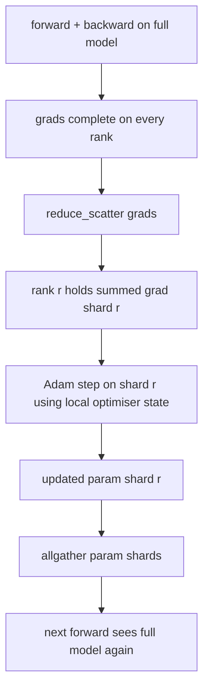

# Шардирование состояния оптимизатора ZeRO

> Adam хранит две оценки моментов на параметр, обе в float32. Модель с 7 млрд параметров несёт 56 ГБ состояния оптимизатора. ZeRO stage 1 шардирует это состояние между N рангами; каждый ранг владеет 1/N оптимизатора. После локального шага обновлённые шарды параметров рассылаются обратно широковещательно, каждый ранг восстанавливает полную модель, и начинается следующий шаг. Выигрыш — линейное падение памяти на крупнейшей единичной аллокации в стеке обучения.

**Тип:** Build**Языки:** Python**Предварительные требования:** Фаза 19 Track C уроки 42-49**Время:** ~90 минут
## Цели обучения

- Шардировать состояние оптимизатора (первый момент, второй момент, fp32-мастер-копию) между N рангами так, чтобы каждый ранг владел 1/N.
- Использовать reduce_scatter, чтобы доставить каждому рангу только сумму градиента его шарда, а затем allgather, чтобы разослать обновлённые шарды параметров обратно.
- Вычислить таблицу экономии памяти для stage 1, stage 2, stage 3 в сравнении с ванильным DDP.
- Обосновать выбор между stage 1, stage 2 и stage 3 исходя из размера модели и бюджета пропускной способности.

## Проблема

Ванильный DDP реплицирует всё: параметры, градиенты и состояние оптимизатора присутствуют в полном объёме на каждом ранге. Для модели с 7 млрд параметров в fp16 это означает 14 ГБ параметров, 14 ГБ градиентов и 28 ГБ состояния оптимизатора на ранг. Состояние оптимизатора — крупнейший член и проще всего поддаётся шардированию, потому что к нему обращаются только во время шага, а не во время forward или backward.

ZeRO stage 1 шардирует состояние оптимизатора. Каждый ранг хранит 1/N моментов Adam. После backward, вместо того чтобы делать allreduce полного градиента и шагать локально, ZeRO выполняет reduce_scatter, так что каждый ранг получает только суммированный градиент своего шарда. Ранг применяет шаг оптимизатора к своему шарду мастер-параметров. Обновлённые шарды параметров затем рассылаются через allgather обратно, так что у каждого ранга есть полная модель для следующего forward. Память под оптимизатор падает в N раз. Сетевой трафик за шаг такой же, как у DDP: один reduce_scatter плюс один allgather по пропускной способности равны одному allreduce. Память выигрывает, пропускная способность сохраняется.

## Концепция



### Стадии ZeRO

| Стадия | Что шардируется | Память на ранг | Коммуникация за шаг |
|-------|----------------|------------------|---------------|
| DDP | ничего | параметры + градиенты + оптимизатор | 1x allreduce |
| ZeRO-1 | состояние оптимизатора | параметры + градиенты + оптимизатор/N | 1x reduce_scatter + 1x allgather |
| ZeRO-2 | оптимизатор + градиенты | параметры + градиенты/N + оптимизатор/N | 1x reduce_scatter + 1x allgather |
| ZeRO-3 | оптимизатор + градиенты + параметры | параметры/N + градиенты/N + оптимизатор/N | 1x allgather на слой + 1x reduce_scatter на слой |

Stage 1 — самый дешёвый выигрыш, потому что состояние оптимизатора доминирует в бюджете. Stage 2 требует логики накопления шарда градиента, но пропускная способность та же. Stage 3 (FSDP) платит за коммуникацию на каждый слой при каждом forward и backward, получая взамен падение памяти на шард параметров. В этом уроке полностью реализован stage 1.

### Математика памяти, реальные числа

Для модели с P параметрами, обучаемой с Adam в смешанной точности:

| Член | Ванильный вариант | ZeRO-1 | Почему |
|------|---------|--------|-----|
| fp16-параметры | 2P байт | 2P байт | нужны для forward |
| fp16-градиенты | 2P байт | 2P байт | нужны для backward |
| fp32-мастер-копия | 4P байт | 4P/N байт | используется только оптимизатором |
| fp32 первый момент | 4P байт | 4P/N байт | используется только оптимизатором |
| fp32 второй момент | 4P байт | 4P/N байт | используется только оптимизатором |
| Итого | 16P байт | 4P + 12P/N байт |   |

При N=8: ванильный вариант 16P, ZeRO-1 5.5P, падение на 65%. При N=64: ванильный вариант 16P, ZeRO-1 4.19P, падение на 74%.

### Почему reduce_scatter лучше, чем allreduce-затем-шардирование

Allreduce отдаёт каждому рангу полный суммированный градиент. Если нужен только шард r, то (N-1)/N от редуцированного градиента расходуется впустую на ранге r. Reduce_scatter доставляет ровно тот шард, которым владеет каждый ранг; байтовый объём на ранг такой же, как у allreduce (поскольку allreduce — это reduce_scatter + allgather), но вторая половина позже заменяется allgather-ом шардов параметров. Итоговый сетевой трафик идентичен DDP, память делится.

```figure
cd-zero-shard
```

## Реализация

`code/main.py` реализует:

- `flatten_params(module)` и `unflatten_into(module, flat)`, которые упаковывают параметры модели в один непрерывный тензор и распаковывают их обратно. Плоская раскладка — это то, что делает шардирование по рангу простым срезом.
- `ZeroOptimizer(model, world_size, rank, lr)`, который владеет шардом ранга для мастер-копии и моментов Adam.
- `step()`, который выполняет reduce_scatter на плоском градиенте, применяет Adam к шарду ранга и рассылает обновлённые параметры обратно через allgather.
- Демонстрацию, которая обучает трёхслойный MLP на 20 шагах и печатает бюджет памяти на шаг рядом с базовой линией ванильного DDP.

Запустите:

```bash
python3 code/main.py
```

Вывод: потери на шаг и таблица памяти, показывающая, что ZeRO-1 хранит 1/N состояния оптимизатора на каждом ранге против полной копии у DDP.

## Практика в реальных проектах

Три паттерна закаляют ZeRO настолько, чтобы отправить его в продакшен.

**Сохранение шардированных контрольных точек важно.** Состояние оптимизатора ZeRO-1 разбито между рангами; контрольная точка обязана фиксировать, какой ранг чем владеет. Урок 80 строит манифест шардированной контрольной точки, который возобновляет запуск ZeRO при том же размере world size. Без него сохранённое состояние нечитаемо при перезапуске.

**Смешанная точность — это и есть суть.** ZeRO — техника со смешанной точностью; именно fp32-мастер-копия подвергается шардированию. Запуск ZeRO без смешанной точности платит налог на память за fp32-мастер-копию без соответствующего выигрыша от fp16 forward. Продакшен-запуски всегда сочетают ZeRO с autocast или весами bf16.

**Stage 1 — почти бесплатный выигрыш.** Коммуникация идентична DDP по пропускной способности. Экономия памяти линейна по N. Единственная цена — учёт шарда оптимизатора. Продакшен-стеки по умолчанию используют stage 1, если только память под шард параметров тоже не является проблемой; тогда stage 2 или 3 обменивают коммуникацию на память.

## Применение

Продакшен-паттерны:

- **DeepSpeed ZeRO.** Эталонная реализация. `deepspeed_config.json` выбирает stage 1/2/3 и размеры партиций.
- **PyTorch FSDP.** PyTorch-нативный эквивалент. `ShardingStrategy.SHARD_GRAD_OP` — это ZeRO-2; `FULL_SHARD` — это ZeRO-3.
- **HuggingFace Accelerate.** Оборачивает и DeepSpeed, и FSDP в единый конфиг.

## Поставка

Урок 79 (pipeline parallel) — ортогональная ось шардирования: вместо шардирования состояния оптимизатора при неизменной модели, pipeline шардирует слои между рангами. Урок 81 объединяет DDP + ZeRO в сквозной демонстрации.

## Упражнения

1. Расширьте до ZeRO-2, шардируя градиенты: каждый ранг хранит только градиент своего шарда, что достигается обнулением нешардированной части после backward.
2. Добавьте профилировщик памяти, который печатает фактическое использование fp32-байтов на ранге 0 против предсказания по формуле.
3. Измерьте время работы одного шага (wall-clock) ванильного DDP против ZeRO-1 и разложите его на forward, backward, коммуникацию.
4. Реализуйте клиппинг градиента под ZeRO-1: L2-норма должна вычисляться по всем шардам через allreduce локальной нормы в квадрате.
5. Реализуйте «наивный ZeRO» с allreduce вместо reduce_scatter, измерьте разницу во времени передачи по сети. Обоснуйте выбор reduce_scatter числами.

## Ключевые термины

| Термин | Что говорят люди | Что это на самом деле значит |
|------|----------------|------------------------|
| ZeRO-1 | «Шардировать оптимизатор» | Каждый ранг хранит 1/N fp32-мастер-копии + моментов Adam |
| ZeRO-2 | «Шардировать и градиенты тоже» | Каждый ранг также отбрасывает нешардированные градиенты после reduce_scatter |
| ZeRO-3 | «Шардировать параметры» | Каждый ранг хранит 1/N fp16-параметров; allgather на слой при forward |
| Мастер-копия | «fp32-веса» | Копия параметров высокой точности, которую обновляет оптимизатор |
| Reduce_scatter | «Разделить сумму» | Доставить каждому рангу только суммированный градиент его шарда |

## Дополнительное чтение

- [Rajbhandari et al, ZeRO: Memory Optimizations Toward Training Trillion Parameter Models](https://arxiv.org/abs/1910.02054)
- [DeepSpeed ZeRO documentation](https://www.deepspeed.ai/tutorials/zero/)
- [PyTorch FSDP documentation](https://pytorch.org/docs/stable/fsdp.html)
- Phase 19 Lesson 76 - reduce_scatter и allgather, на которые опирается этот урок
- Phase 19 Lesson 80 - сохранение шардированных контрольных точек, которое должно использовать состояние ZeRO
