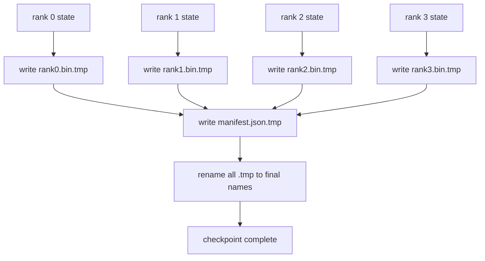

# Шардированная контрольная точка и атомарное возобновление

> Задача обучения с 70 миллиардами параметров каждые несколько часов останавливается из-за отказа узла. Формат контрольной точки решает, потеряете вы 30 минут или 30 часов. Шардированная контрольная точка параллельно записывает шард каждого ранга и фиксирует владение в манифесте. Возобновление загружает шард каждого ранга из его собственного файла, восстанавливает состояние при том же world size, и оптимизатор делает шаг, как будто ничего не произошло. Атомарная запись не даёт недописанной контрольной точке отравить следующее возобновление.

**Тип:** Build**Языки:** Python**Предварительные требования:** Фаза 19 Track C уроки 42-49**Время:** ~90 минут
## Цели обучения

- Сохраните многоранговую контрольную точку в виде файла-шарда для каждого ранга плюс манифест, фиксирующий, какой ранг чем владеет.
- Используйте паттерн атомарной записи (запись во временный путь с последующим переименованием), чтобы сбой посреди записи никогда не приводил к недописанной контрольной точке.
- Возобновляйте работу по манифесту, проверяя побайтовое совпадение состояния как для параметров fp16, так и для состояния оптимизатора ZeRO на каждом ранге.
- Защитите схему манифеста от трёх сценариев сбоя: изменения world size, несовпадения количества шардов и частичной записи.

## Проблема

Обычная контрольная точка считывает все параметры и состояние оптимизатора в ранг 0, собирает их (gather) и записывает единый файл. Для модели с 70 миллиардами параметров это 1.1 ТБ состояния через сетевой порт одного ранга. Запись блокирует все остальные ранги, потому что они простаивают в ожидании сбора. Пропускная способность IO равна сетевому каналу самого медленного отдельного GPU, а не совокупной пропускной способности. На реальном кластере шаг «сбор, затем запись» может занять больше времени, чем предыдущий час обучения, а значит задача выпускает меньше одной контрольной точки за день обучения.

Шардированные контрольные точки переворачивают этот паттерн: каждый ранг параллельно записывает свой шард в свой собственный файл. Манифест фиксирует, какой ранг владел каким шардом, чтобы при возобновлении каждый шард вернулся туда, откуда он взялся. Совокупная пропускная способность записи масштабируется вместе с кластером. Контрольная точка на 1 ТБ, которая занимала 4 часа через один ранг, занимает 4 минуты через 64 ранга. Кроме того, манифест даёт контракт для несовместимых возобновлений: изменение world size обнаруживается, частичные записи обнаруживаются, а путь загрузки может громко завершиться ошибкой вместо того, чтобы молча использовать устаревшие данные.

## Концепция



### Схема манифеста

```json
{
  "world_size": 4,
  "step": 1234,
  "wall_clock_seconds": 4521,
  "shards": [
    {"rank": 0, "path": "rank0.bin", "sha256": "...", "param_shard_offset": 0, "param_shard_numel": 65536},
    {"rank": 1, "path": "rank1.bin", "sha256": "...", "param_shard_offset": 65536, "param_shard_numel": 65536}
  ],
  "schema_version": 1
}
```

Три поля здесь критически важны. `world_size` заставляет возобновление при другом размере громко завершиться ошибкой вместо того, чтобы незаметно повредить данные. `sha256` для каждого шарда ловит частичные или повреждённые записи. `param_shard_offset` и `param_shard_numel` для каждого шарда позволяют загрузчику восстановить плоский тензор параметров в нужной позиции.

### Атомарная запись

Стандартный паттерн: записать каждый шард в `<name>.tmp`, записать манифест в `manifest.json.tmp`, выполнить fsync для каждого, затем переименовать. POSIX rename в пределах одной файловой системы атомарен: либо новый файл присутствует полностью, либо остаётся старый. Сбой до финального переименования оставляет активной предыдущую контрольную точку. Без атомарной записи сбой может оставить частичный шард с манифестом, который на него указывает, и загрузка повредит состояние оптимизатора при возобновлении.

### Три сценария сбоя, от которых должна защищать схема

| Сбой | Симптом | Защита |
|---------|---------|---------|
| Изменение world size | возобновление на N=8 с манифестом от N=4 | несовпадение world_size в манифесте, явный сбой |
| Несовпадение числа шардов | при возобновлении файлов rank*.bin меньше, чем шардов в манифесте | перечислить шарды, проверить, что каждый существует |
| Частичная запись | файл шарда обрезан посреди flush | проверка sha256 при загрузке |

Каждая защита отклоняет плохую загрузку на раннем этапе; альтернатива — незаметное повреждение данных, которое всплывает через 100 шагов, когда потери становятся NaN.

### Почему файлы на ранг, а не один большой файл

Параллельная запись в один файл через `O_APPEND` работает в POSIX для выровненных по байтам записей, но на практике смещения внутри одного шарда охватывают области размером в мегабайты, и блокировки начинают доминировать. Файлы на ранг не создают конкуренции за ресурс и выигрывают от чередования (striping), когда нижележащая файловая система параллельна (Lustre, GPFS). Продакшен-стеки (DeepSpeed, FSDP, NeMo) по этой причине используют файлы на ранг.

```figure
ci-sharded-checkpoint
```

## Реализация

`code/main.py` реализует:

- Dataclass `ShardManifest` со схемой, приведённой выше, плюс `to_json`/`from_json`.
- `save_sharded(state_dict_per_rank, dir, step)`, которая записывает бинарное состояние каждого ранга в свой файл, используя атомарный паттерн «временный файл, затем переименование», а затем записывает манифест.
- `load_sharded(dir, expected_world_size)`, которая читает манифест, проверяет sha256 каждого шарда и возвращает словари состояния для каждого ранга.
- Round-trip тест: построить состояние для каждого ранга, сохранить, загрузить, проверить побайтовое совпадение.

Запустите:

```bash
python3 code/main.py
```

Вывод: записаны 4 файла шардов плюс манифест, затем перезагружены с проверкой на побайтовое совпадение.

## Практика в реальных проектах

Три паттерна закаляют контрольную точку настолько, чтобы отправить её в продакшен.

**Асинхронная запись.** Продакшен-стеки запускают запись контрольной точки в отдельном потоке или процессе, чтобы обучение продолжалось. Барьер стоит на следующей контрольной точке: нельзя начинать следующее сохранение, пока не завершено предыдущее. Флаг `async_io` в DeepSpeed делает именно это. В этом уроке запись остаётся синхронной, чтобы шаги были видны.

**Сначала локальный быстрый диск, затем асинхронная выгрузка.** Записывайте на локальный NVMe (быстро), затем асинхронно выгружайте в S3 или GCS. Двухуровневый паттерн сохраняет внутрикластерную контрольную точку быстрой для возобновления, одновременно отправляя надёжную копию за пределы кластера для архива. Манифест хранит локальный путь; манифест выгрузки хранит удалённый путь.

**Ротация имеет значение.** Продакшен-запуски хранят последние K контрольных точек (обычно 3-5) и ротируют самую старую. Без ротации диск заполняется посреди запуска, и следующая контрольная точка не сохраняется. С ротацией следующее сохранение сначала удаляет самую старую, освобождая бюджет.

## Применение

Продакшен-паттерны:

- **Сохранение контрольных точек в DeepSpeed.** `deepspeed.save_checkpoint(tag=step)` записывает файлы на ранг и файл `latest`, указывающий на активный тег.
- **Сохранение контрольных точек в PyTorch FSDP.** `torch.distributed.checkpoint` сохраняет шардированное состояние с помощью `Planner`, который определяет раскладку по рангам.
- **NeMo.** Оборачивает DeepSpeed и FSDP единым API `save_to_checkpoint`, который добавляет метаданные.

## Поставка

Урок 81 сохраняет шардированную контрольную точку сквозного запуска DDP+ZeRO и перезагружает её при том же world size, чтобы доказать, что контракт возобновления соблюдается.

## Упражнения

1. Добавьте асинхронную запись: запустите сохранение в потоке и дайте обучению продолжиться. Блокируйте следующее сохранение до завершения предыдущего.
2. Добавьте ротацию `last_5_steps`: храните 5 последних контрольных точек, удаляйте самую старую перед сохранением новой.
3. Добавьте быстрый путь проверки только по CRC для перезагрузки во внутреннем цикле (ротация превращает контрольную точку в новую активную без полной проверки sha256).
4. Добавьте загрузку между разными world size: перебалансировку шардов от N=4 к N=8 путём чтения манифеста, конкатенации и повторного шардирования.
5. Добавьте выгрузку в фиктивный S3 (второй каталог) и запишите манифест выгрузки. Обоснуйте политику двухуровневого хранения.

## Ключевые термины

| Термин | Что говорят люди | Что это на самом деле значит |
|------|----------------|------------------------|
| Шардированная контрольная точка | «Сохранение по рангам» | Каждый ранг параллельно записывает свой файл шарда |
| Манифест | «Индекс» | JSON-файл, фиксирующий пути шардов, смещения и sha256 |
| Атомарная запись | «tmp, затем rename» | Запись в .tmp с последующим POSIX rename, чтобы сбой оставлял активным предыдущий файл |
| Частичная запись | «Обрезанный шард» | Сбой во время записи создаёт повреждённый шард; sha256 его ловит |
| Ротация | «Хранить последние K» | Удаление самой старой контрольной точки перед записью новой, чтобы ограничить использование диска |

## Дополнительное чтение

- [DeepSpeed checkpointing](https://deepspeed.readthedocs.io/en/latest/model-checkpointing.html)
- [PyTorch torch.distributed.checkpoint](https://pytorch.org/docs/stable/distributed.checkpoint.html)
- [POSIX rename atomicity](https://pubs.opengroup.org/onlinepubs/9699919799/functions/rename.html)
- Phase 19 Lesson 78 - состояние ZeRO, под сохранение которого сформирована эта контрольная точка
- Phase 19 Lesson 81 - сквозная демонстрация выполняет round-trip сохранённого состояния
