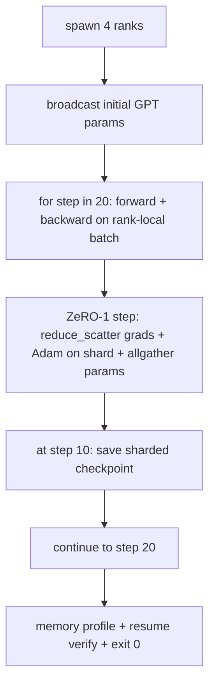

# Сквозное распределённое обучение

> Каждый из уроков 76–80 построил один элемент. Это — сборка: крошечная GPT, обучаемая на 4 симулированных рангах с DDP для синхронизации градиентов, ZeRO-1 для шардинга состояния оптимизатора и шардированной контрольной точкой на середине пути. Демонстрация выполняет 20 шагов, самозавершается, выводит кривую потерь и профиль памяти, а также записывает возобновляемую контрольную точку.

**Тип:** Build**Языки:** Python**Предварительные требования:** Фаза 19 Track C уроки 42-49**Время:** ~90 минут
## Цели обучения

- Скомпоновать DDP (урок 77), ZeRO-1 (урок 78) и шардированные контрольные точки (урок 80) в единый цикл обучения.
- Обучить 2-слойную языковую модель на основе трансформера на небольшом синтетическом корпусе в течение 20 шагов на 4 симулированных рангах.
- Вывести таблицу потерь по шагам, профиль памяти по рангам и манифест контрольной точки, который возобновляется побайтово идентичным при том же world size.
- Обосновать композицию: каждый элемент независимо тестируется в предыдущих уроках, а этот урок доказывает, что они компонуются друг с другом.

## Проблема

Итоговый проект — это доказательство того, что все элементы работают вместе. Урок 76 реализовал коллективные операции. Урок 77 обернул их в DDP. Урок 78 шардировал состояние оптимизатора с помощью reduce_scatter. Урок 79 разобрал pipeline. Урок 80 сохранил шардированную контрольную точку. Каждый урок существовал отдельно, со своим собственным тестом. Реальный тренировочный запуск использует все примитивы одновременно; если композиция неверна, потери расходятся, контрольная точка отказывается возобновляться, либо память на ранг растёт вместо того, чтобы уменьшаться.

Этот урок запускает сквозную демонстрацию и проверяет четыре инварианта: (a) потери монотонно убывают на протяжении 20 шагов в пределах шума плавающей точки, (b) каждый ранг хранит одинаковую норму параметров на каждом шаге, (c) память оптимизатора на ранг равна формуле ZeRO-1 12P/N байт, и (d) контрольная точка на шаге 10 при перезапуске загружается побайтово идентичной. Демонстрация самозавершается: 20 шагов, одна команда, exit 0.

## Концепция



### Мини-GPT

Модель специально сделана маленькой: 2 блока трансформера, размерность эмбеддинга 32, 4 головы внимания, словарь 64, длина последовательности 16, пакет 4. Всего несколько тысяч параметров. Достаточно большая, чтобы задействовать каждое решение по связке компонентов (multi-head attention работает по стандартному маскированному пути; у LayerNorm есть веса, которые нужно синхронизировать; LM head — это отдельная линейная проекция обратно в словарь). Достаточно маленькая, чтобы 20 шагов на 4 CPU-рангах завершались за секунды.

### Правила композиции

| Элемент урока | Что он делает | Что оставляет циклу |
|--------------|--------------|----------------------------|
| DDP broadcast | Начальная синхронизация параметров | Один вызов при конструировании |
| ZeRO-1 step | Синхронизация градиентов, обновление мастер-копии, broadcast параметров | Один вызов на шаг, заменяющий optimiser.step |
| Шардированная контрольная точка | Сохранение состояния по рангам, манифест с sha256 | Вызывается на ранге 0, состояние собирается через allgather |
| Цикл обучения | Forward, backward, логирование потерь | Вызывает три предыдущих элемента по порядку |

Цикл ничего не знает про reduce_scatter или файлы rendezvous. Модули ZeRO и контрольных точек предоставляют узкие интерфейсы, которые цикл компонует.

### Почему крошечная GPT, а не просто MLP

MLP из урока 77 было достаточно, чтобы проверить синхронизацию градиентов. Крошечная GPT добавляет три вещи: отдельную LM head над словарём (в этом уроке она не связана с эмбеддингом для ясности; полноценная GPT обычно связывает head с эмбеддингом токенов), softmax+cross-entropy в качестве функции потерь (больше численных краевых случаев, чем у MSE), и асимметричный forward (сначала эмбеддинги, затем attention, затем MLP на каждом слое). Если бы для итогового проекта использовался только MLP, это скрыло бы, корректно ли композиция обрабатывает LayerNorm или форму градиента слоя эмбеддингов.

### Самозавершение означает exit 0

Цикл выполняет фиксированные 20 шагов и завершается. Никакого `while True`, никакого вмешательства человека, никакого возобновления из внешнего состояния. Итоговый проект, который можно оставить работать без присмотра и получить полный лог по завершении, — это итоговый проект, который доказывает, что система собрана правильно. Если какой-то элемент подвисает в deadlock, демонстрация никогда не возвращается, и тестовый стенд это фиксирует.

```figure
ci-distributed-assembly
```

## Реализация

`code/main.py` реализует:

- `MiniGPT`: 2-слойный трансформер с masked self-attention и отдельной LM head.
- `make_corpus(seed, total_tokens)`: детерминированные данные для предсказания следующего токена.
- `_train_worker`: запускается на каждом ранге; рассылает начальные параметры (broadcast), выполняет цикл, вызывает шаг ZeRO, записывает шардированную контрольную точку на шаге 10.
- `verify_resume`: после основного запуска перезагружает контрольную точку шага 10 в том же процессе и проверяет, что сохранённые мастер-шарды побайтово совпадают со снимком в памяти.
- `main`: оркестрирует всю демонстрацию, выводит таблицу потерь, профиль памяти и результат проверки.

Запустите:

```bash
python3 code/main.py
```

Вывод: таблица потерь на 20 строк, профиль памяти по рангам на 4 строки, манифест контрольной точки и строка "RESUME VERIFIED" при успешном завершении.

## Практика в реальных проектах

Три паттерна завершают композицию для реальных запусков.

**Сохраняйте контрольную точку каждые K минут, а не каждые K шагов.** Время шага зависит от длины последовательности и количества микропакетов. Периодичность сохранения раз в 10 минут захватывает одинаковый объём вычислений независимо от размера модели. В уроке для простоты используется подход на основе числа шагов; в продакшене используется подход на основе времени по настенным часам.

**Обнаруживайте расхождение на раннем этапе.** В продакшен-запусках добавляют защиту от NaN после backward и детектор всплесков потерь; если потери подскакивают более чем в 2 раза за один шаг, происходит откат к предыдущей контрольной точке вместо того, чтобы позволить оптимизатору уйти в вырожденное состояние. Кривая потерь в этом уроке гладкая, поэтому защита не срабатывает, но хук остаётся.

**Агрегируйте профиль памяти по рангам.** В реальных запусках память на ранг отличается от ранга к рангу (ранг с самым большим этапом pipeline хранит больше активаций). Продакшен логирует максимум по рангам плюс среднее; в уроке выводится память по каждому рангу отдельно, чтобы показать, что формула совпадает.

## Применение

Продакшен-паттерны:

- **DeepSpeed.** Объединяет DDP + ZeRO + pipeline + activation checkpointing в одной конфигурации. Композиция этого урока — это форма DeepSpeed в миниатюре.
- **PyTorch FSDP.** Нативный эквивалент. `FullyShardedDataParallel` с `ShardingStrategy.SHARD_GRAD_OP` — это ZeRO-2.
- **NeMo и Megatron-LM.** Добавляют tensor parallel для самых крупных моделей; в остальном композиция имеет ту же форму.

## Поставка

На этом полный трек завершается. Вместе эти 6 уроков образуют подсистему распределённого обучения, которую реальная команда построила бы перед переходом на DeepSpeed; абстракция проверена на gloo, а режимы отказа отработаны. Phase 17 (инфраструктура и продакшен) — это место, где стоит перенести это на реальный кластер.

## Упражнения

1. Добавьте tensor-parallel разбиение головы внимания и проверьте, что потери совпадают с базовой линией на одном ранге. Два ранга: половина голов на каждый ранг, allreduce выхода attention.
2. Добавьте накопление градиента по 4 микропакетам и докажите, что градиент равен градиенту одного большого пакета.
3. Добавьте путь возобновления с шага 10, который действительно продолжает обучение до шага 20 и даёт те же итоговые потери, что и исходный запуск.
4. Добавьте экспорт метрик (потери, норма градиента, время шага) в JSONL, чтобы запуск можно было визуализировать постфактум.
5. Добавьте защиту от NaN, которая откатывается к предыдущей контрольной точке при всплеске потерь, и вызовите всплеск с помощью одношагового множителя LR, чтобы проверить откат.

## Ключевые термины

| Термин | Что говорят люди | Что это на самом деле значит |
|------|----------------|------------------------|
| Сквозной (end-to-end) | «Собрать всё вместе» | Один запуск компонует все элементы, а не юнит-тест на каждый элемент |
| Профиль памяти | «ГБ на ранг» | Байты, которые каждый ранг хранит под параметры, градиенты, состояние оптимизатора |
| Контракт возобновления | «Сохранить и загрузить» | Состояние на ранг побайтово идентично после цикла сохранения-загрузки контрольной точки |
| Самозавершение | «Ограниченный запуск» | Фиксированное число шагов, exit 0 по завершении, без участия человека |

## Дополнительное чтение

- [DeepSpeed end-to-end training tutorial](https://www.deepspeed.ai/getting-started/)
- [PyTorch FSDP advanced tutorial](https://pytorch.org/tutorials/intermediate/FSDP_advanced_tutorial.html)
- [Megatron-LM training script reference](https://github.com/NVIDIA/Megatron-LM)
- Phase 19 Lessons 76-80 - каждый элемент, который компонует этот урок
- Phase 17 - перенос композиции на реальный кластер
